# 第3节. 算术逻辑运算和条件测试


## 退出状态

# 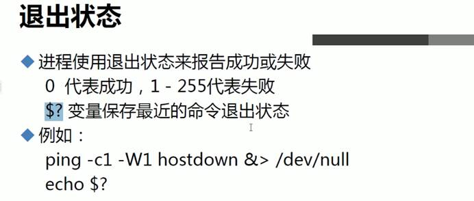


```
[00:16:02 root@host1 ~]#grep aaa /etc/passwd   #找到找不到结果自然不同
[03:44:30 root@host1 ~]#echo $?
1
[03:44:35 root@host1 ~]#grep -q root /etc/passwd
[03:44:59 root@host1 ~]#echo $?
0
[03:45:02 root@host1 ~]#

```

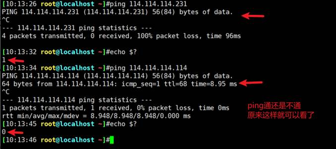

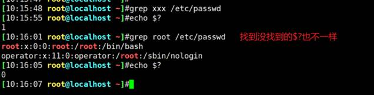


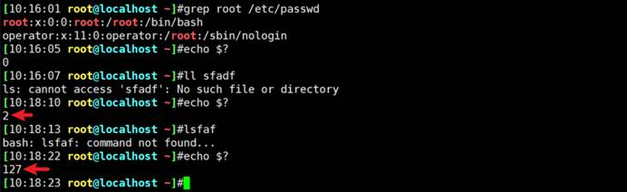

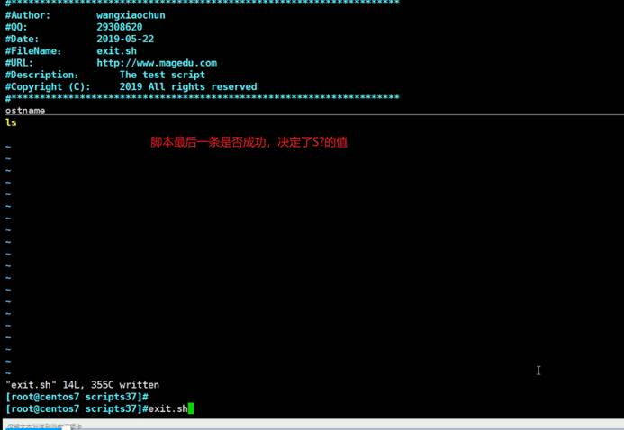

一个脚本里2条命令，最后一条执行成功了，返回的$0就是0

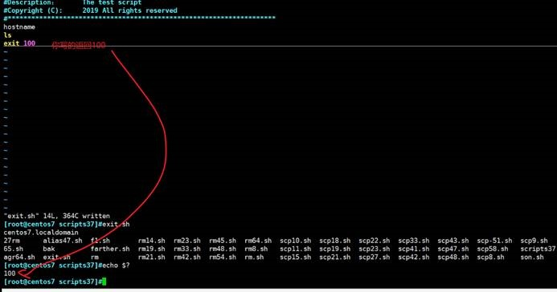

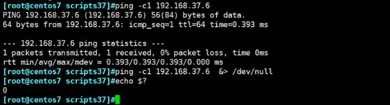

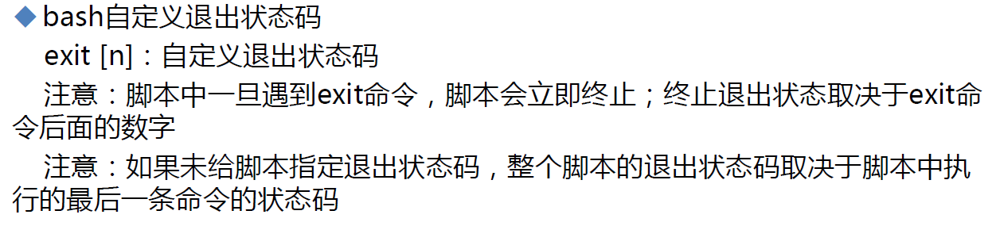

 

## 算术运算

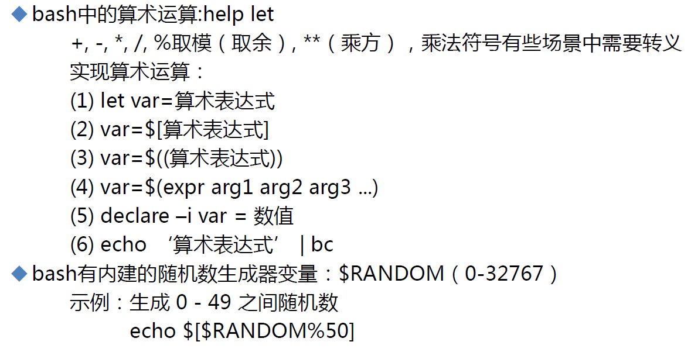

图中的echo $[$RANDOM%50]里面的$可以去掉的，因为$[]里面会认为RANDOM就是变量

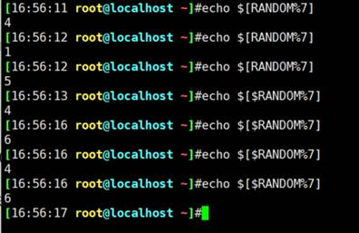

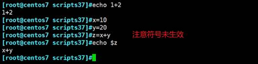

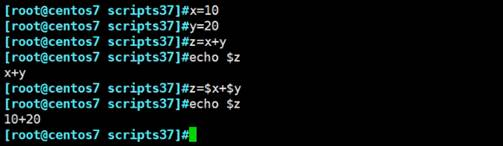

## 方法一：let

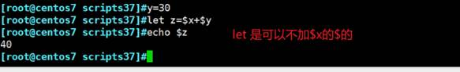

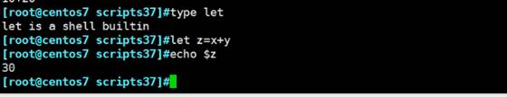

## 方法二：中括号

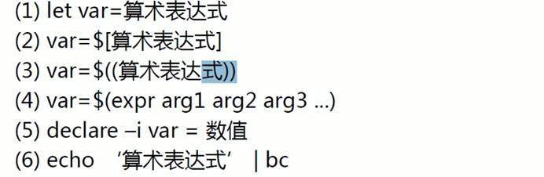

 

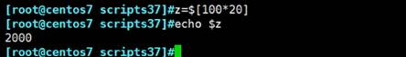

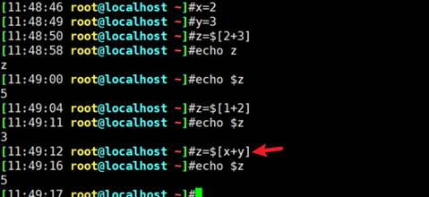

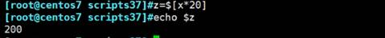

## 方法三：2个小括号

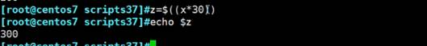

##  方法四：expr

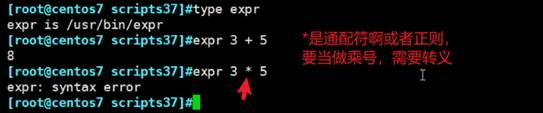

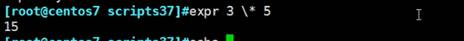

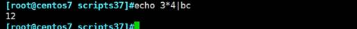

##  方法五：declare申明强制运算

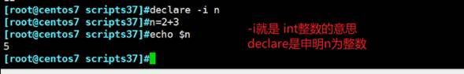

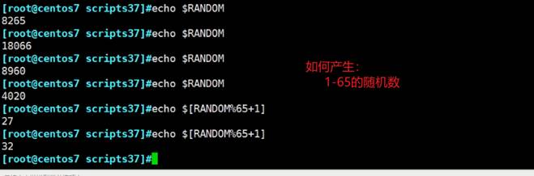

## 65取模是0-64

如果是0-65的随机数呢？哈哈，不好弄了吧。

/66啊，不就行了哦，笨哦。


颜色的取值范围是31-37，可以用RANDOM随机数产生，用7取模范围就是0-6，+31就可以了。

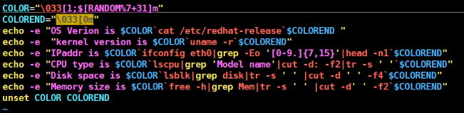 

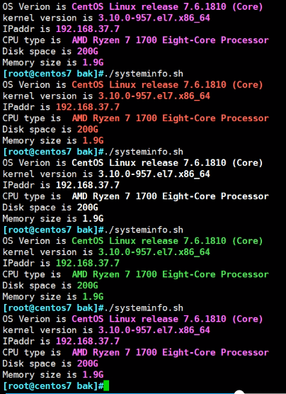 


 

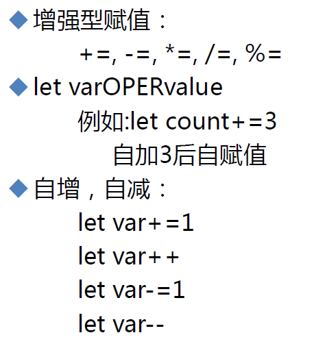 

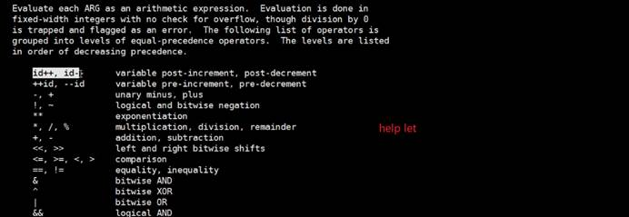

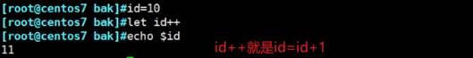

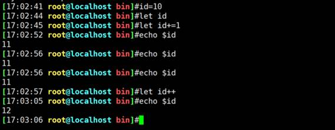

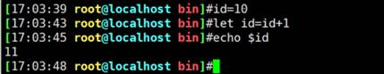

## ++i和i++

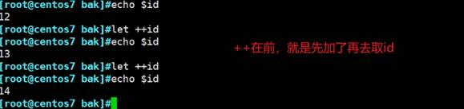

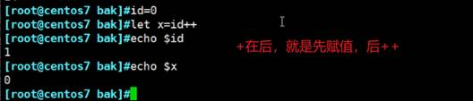

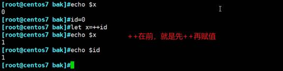

**let id+=5 就是 id=id+5**

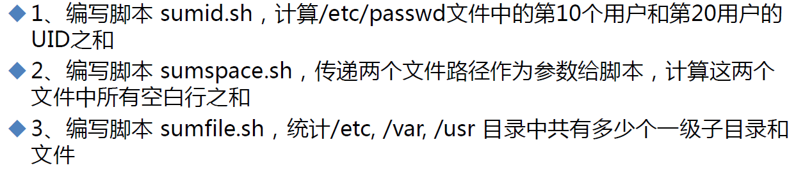


##  逻辑运算与或非

 

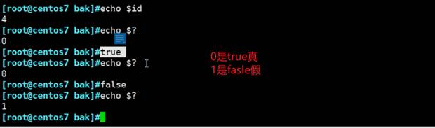

 python里也学过与或非，来了解一下，哈哈哈

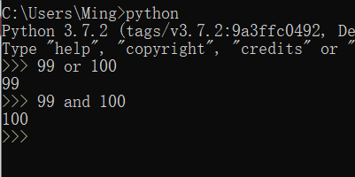 

and是与，&也是与，两者截然不同，貌似相同又。举例

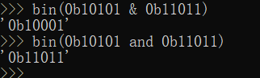 

再来

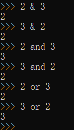 

再看

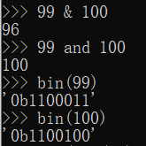 

懂了吧~

1、and和or是基于运算符两边的整体值来算的；而&又叫做位与是将运算符两边化作0101后再进行位与的哈哈，我在用名称解释名称咯，额。

2、然后and和or里的99 or 100 和99 and 100也挺有意思的。一句话做人呐or就行了，做研究呐可能需要and。

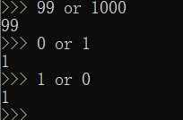 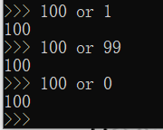

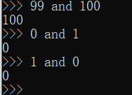 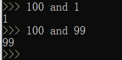 

or就是已经是true的情况下就不会再继续比了。反正或的话，结果都是true。

and就是当前如果是真，就一定要看到最后一个元素，万一他是假，就全盘就是假了，所以要那最后一个元素。A(true) and B(true)也就取B了。

3、一句话，or和and是真假运算--基于表达式两边的整体，而&和|是二进制的与或运算--基于表达式两边的数值的二进制单个位来算的。

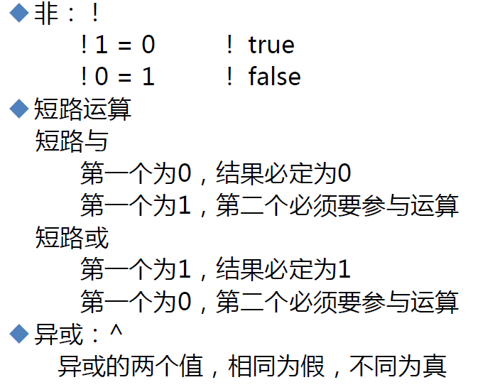     

这里的短路与的真假，不要简单按上图0和1，去理解，0啊他这个图是假的意思。但是linux，true你去echo $?会发现是0，所以0代表的是真。所以这种运算是真假运算，不要用0和1区理解，除非你定死了01和真假的一一对应。

当然也可以不要理解短路与，而直接理解第一个cmd1执行ok了再执行cmd2：cmd1 && cmd2

 

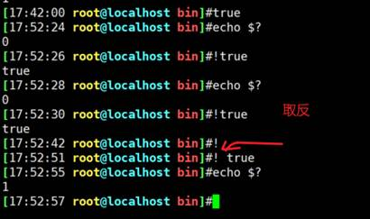

 

true和false就是命令，专门产生真假的

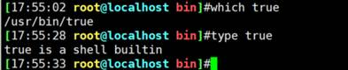

还有yes就是专门产生y，不停的

 

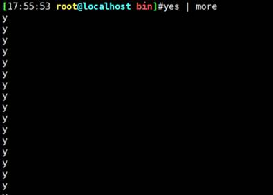

其实不是y，而是yes后面的参数

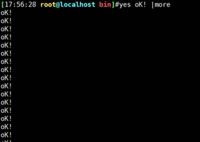

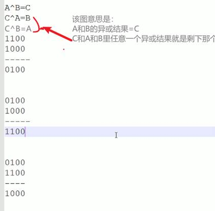

 

## 两个变量值互换


方法二就是上图的A^B=C，C^A=B，C^B=A

x=$[x^y]就是得出了中间值C赋值给了x，x此时就是中间值。然后拿中间值x去和y异或得到的就是原来的x，将x赋值给y。此时y里的值就变成了x。再拿中间值x去和现在的y--其实是原来的x异或就得到原来的y将此值赋给x，这样x里的值就变成了原来的y。

## 短路与


 


##  短路或


true是真，echo true本身也是真，同时打印出true，此时两个都是真，结果就是真，后面的就不执行了。


false是假，只要是假都是假，所以就不会执行后面的 echo true。

然后不会执行&&后面的内容，但是&&的结果还是假，所以就会执行||后面的内容，于是打印出false了就。

## test比较表达式


这个和if else还不是一样的，因为A && B || C，不是if A成立就执行B，A不成立就执行C这么简单，还多一个A成立执行B，B执行失败，那么||前面的整体就是假，于是还是会执行C的。

 

### 除了字符串的比较，还有数字比较


 


printf是是格式化字符串的。类似python里的format


###  中括号代替test

test $x -gt $y


 
