# 第4节. 条件判断


## 判断是否为空

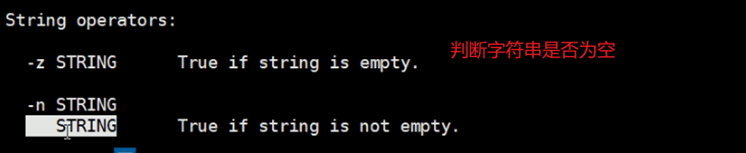

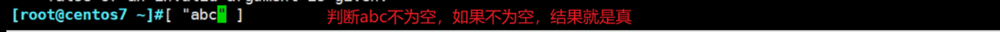

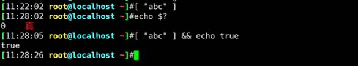

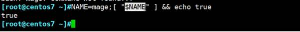

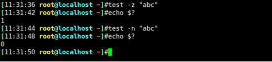

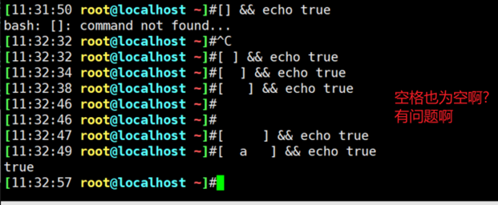

不是[  ]综括号的写法里面空格再多就是不算的。你引号来表示空格试试

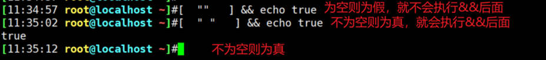

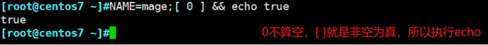

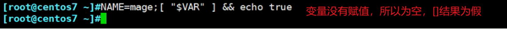

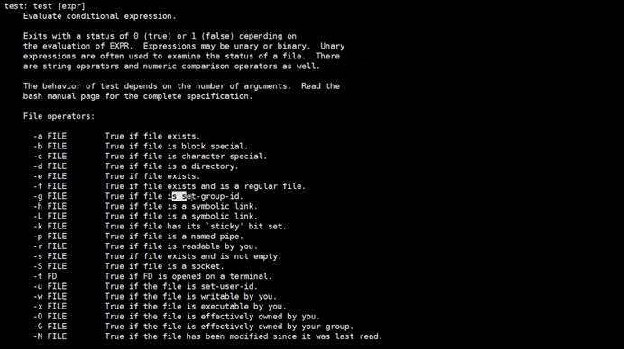

上图是help test出来的，内部命令的帮助用法help xx


所以关于 空 的判断，在python里空格是不为空的，就是有东西在的，在linux的shell里通常是判断为空的，比如[ -z "$?"] 比如./xx.sh    <---这里有很多空格，但是都判定为空的。上面截图也说明了这些。


##  文件夹存在就不创建的方法

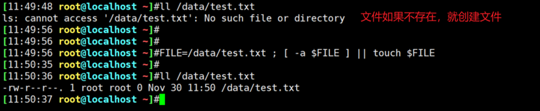

存在就不会创建了。

本身touch就是这样的效果了，不过touch一个存在的文件，虽然内容不会清掉，但是3个时间统统刷新。如下

```
[03:22:10 root@host1 ~]#stat f1
  File: ‘f1’
  Size: 9         	Blocks: 8          IO Block: 4096   regular file
Device: fd00h/64768d	Inode: 71287069    Links: 1
Access: (0644/-rw-r--r--)  Uid: (    0/    root)   Gid: (    0/    root)
Context: unconfined_u:object_r:admin_home_t:s0
Access: 2022-02-02 18:49:12.966012106 +0800
Modify: 2022-02-02 18:49:11.773012078 +0800
Change: 2022-02-02 18:49:11.777012078 +0800
 Birth: -
[03:22:14 root@host1 ~]#cat f1


dd
 

[03:22:17 root@host1 ~]#touch f1
[03:22:21 root@host1 ~]#ll f1
-rw-r--r--. 1 root root 9 Feb  6 03:22 f1
[03:22:24 root@host1 ~]#stat f1
  File: ‘f1’
  Size: 9         	Blocks: 8          IO Block: 4096   regular file
Device: fd00h/64768d	Inode: 71287069    Links: 1
Access: (0644/-rw-r--r--)  Uid: (    0/    root)   Gid: (    0/    root)
Context: unconfined_u:object_r:admin_home_t:s0
Access: 2022-02-06 03:22:21.871014487 +0800
Modify: 2022-02-06 03:22:21.871014487 +0800
Change: 2022-02-06 03:22:21.871014487 +0800
 Birth: -
[03:22:26 root@host1 ~]#cat f1


dd
 


```

 

 

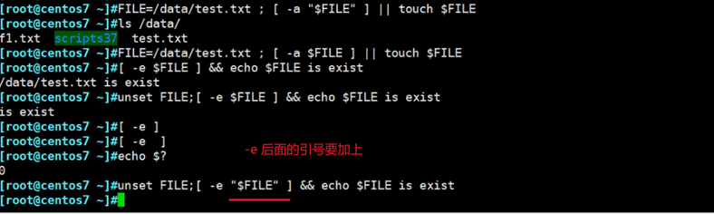

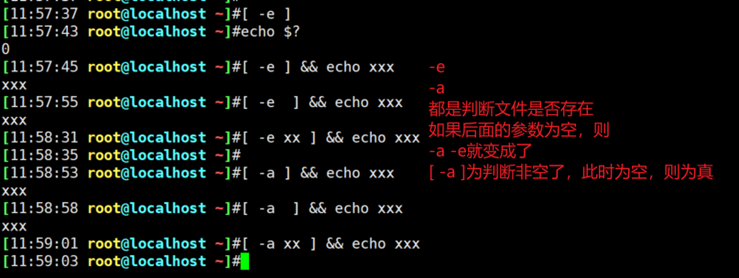

-e -a后面不跟文件，单单一个-e或者-a就不认为是选项了，而是当作字符了，有字符就是非空了👆👇所以使用-e这种一定要后面用双引号引起来。

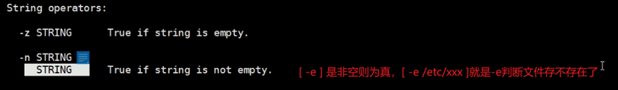

 所以加上 双引号 可以避免严重逻辑错误，

判断是否位数字，可以用正则表达式👇

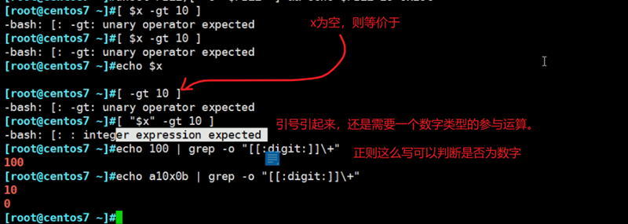

```
[03:41:04 root@host1 ~]#[ "11" -gt 10 ] && echo true
true
[03:41:09 root@host1 ~]#[ '11' -gt 10 ] && echo true
true
[03:41:16 root@host1 ~]#[ 'xx' -gt 10 ] && echo true
-bash: [: xx: integer expression expected
[03:41:22 root@host1 ~]#
说明linux里的引号，并不会改变里面值的类型，这里11引起来还是数字，不会变成字符串。
```

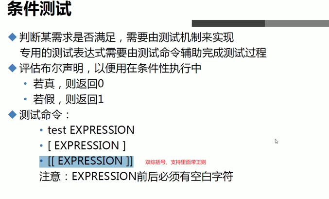

## 双综括号里面支持正则，需要这么写：

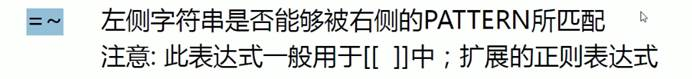

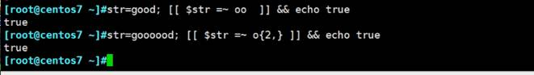

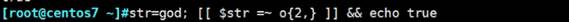

 

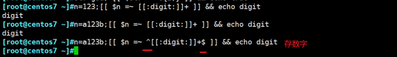

### 纯数字的判断👆

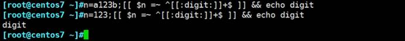

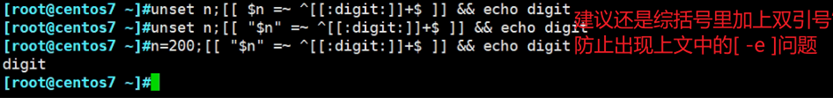

###  还是需要补上双引号👆，虽然不影响结果，一般在[]里变量都是推荐加上双引号。

###  判断是否位.sh后缀

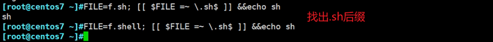

### 判断合法IP

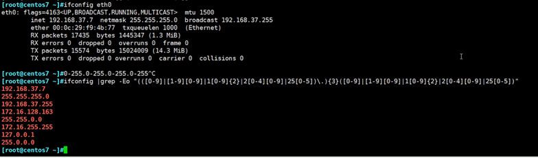

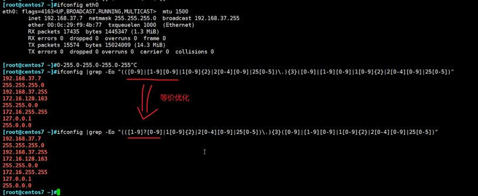

判断是否是一个合法IP的办法：其实还可以进一步到A B C 类地址以及私网地址。

下图第三行才是正解，没有^和$就是包含了。

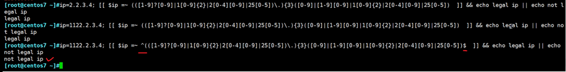

注意上图命令是转行了

reg嵌入到字符串表达式里shell的写法。

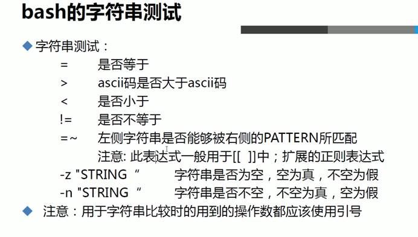

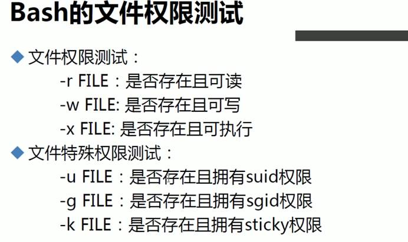

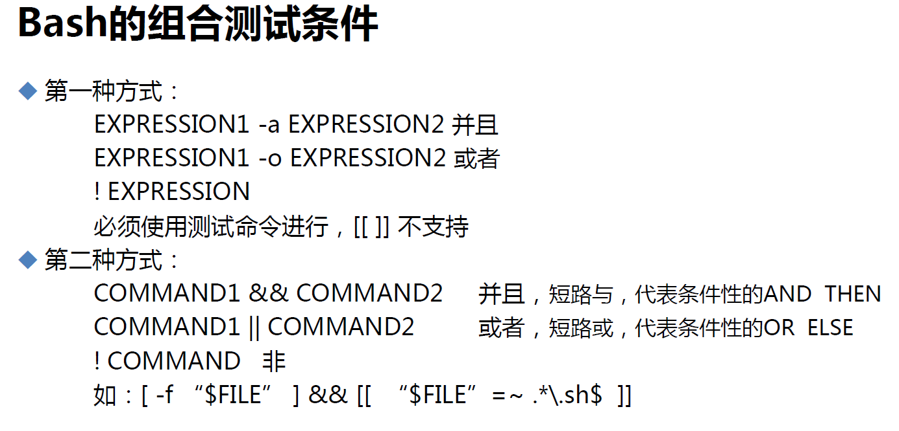

## 并且的关系-方法1

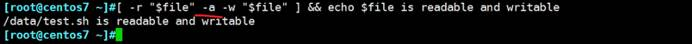

[ xxx -a yyy] 并且的写法，不过它这里不支持正则了，正则得用短路与，不过不是普遍适用的，可能还需要第二种方式：

## 并且的关系-方法2

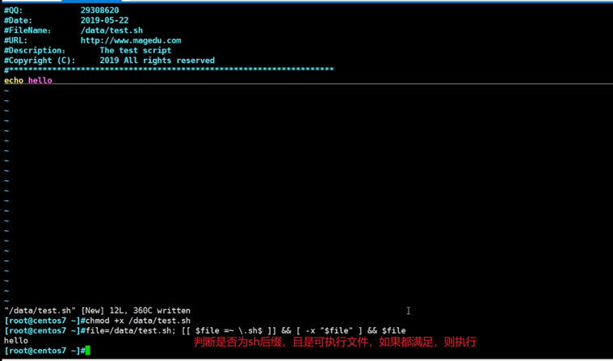

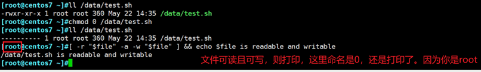

### 判断的是实际上的权限，不是表面上的文件权限。上图是root执行的命令，所以就是可读可写的。

但是执行权限不同，root也是需要文件的执行权限的。

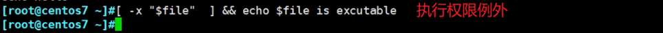

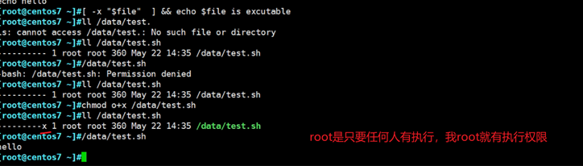

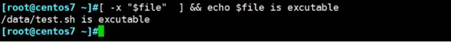

 补充个点，f1.sh要执行，用户要有f1.sh的r读权限，然后再/bin/bash f1.sh就能执行了，如果连f1.sh的读权限都没有，必然无法执行的。

```
[04:52:19 root@host1 ~]#su user1
[04:52:23 user1@host1 root]$bash /data/f1
bash: /data/f1: Permission denied
[04:52:27 user1@host1 root]$ll /data/f1
----------. 1 root root 23 Feb  6 04:49 /data/f1
[04:52:30 user1@host1 root]$exit
exit
[04:52:58 root@host1 ~]#chmod 444 /data/f1
[04:53:09 root@host1 ~]#ll /data/f1
-r--r--r--. 1 root root 23 Feb  6 04:49 /data/f1
[04:53:11 root@host1 ~]#su user1
[04:53:15 user1@host1 root]$bash /data/f1
xxx

```

需求：

写个脚本user10.sh创建用户，考虑用户存在以及user10.sh后没有跟参数的问题。

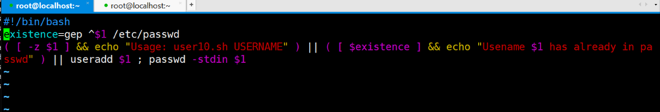

上图是第一版有问题啊不少

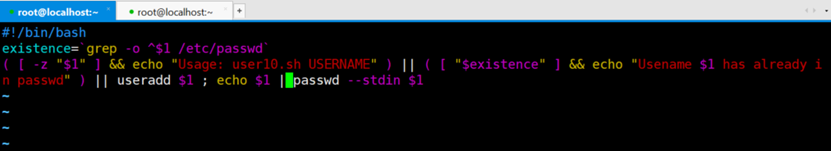

这版是OK了

这是对应的结果

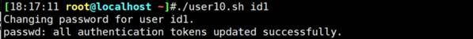

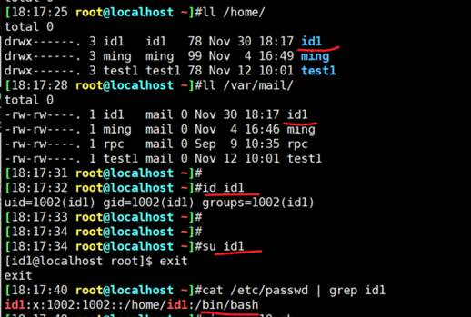

可能$1为空要改一下，改成S# 好理解一下，一个参数都没有不就是$1为空嘛。对不对，所以上面无需修改。

但是还是有问题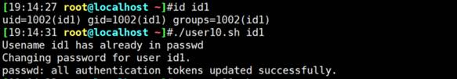

添加花括号：

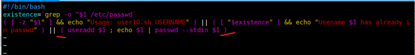

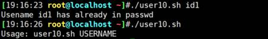

现在应该OK了

 

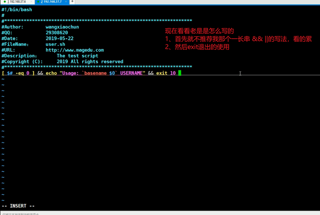

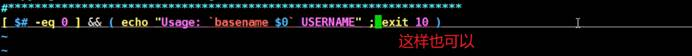

可以个屁，（ ）小括号是子shell，exit10是退出的子shell。

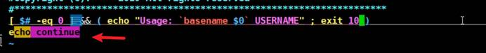

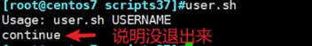

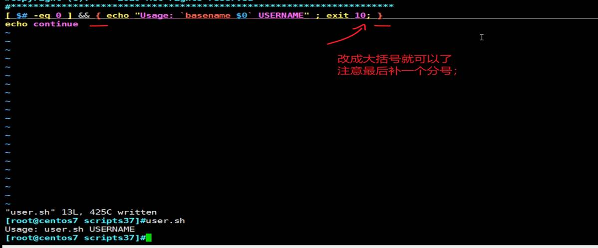


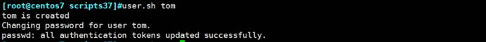

优化一下将Changing passowd for user tom和passwd：xxx隐藏。

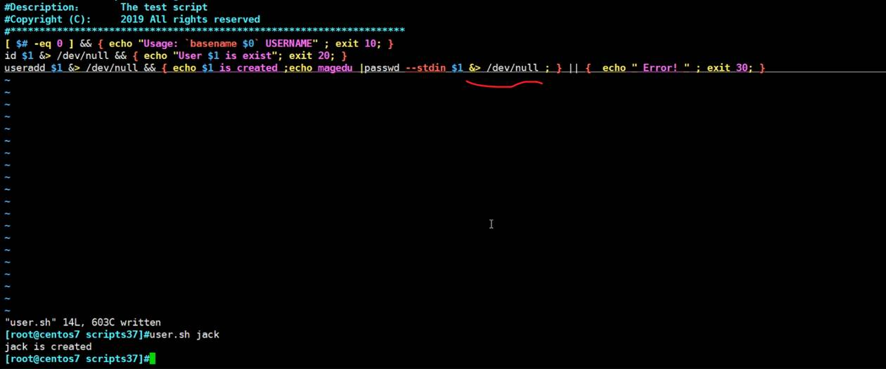

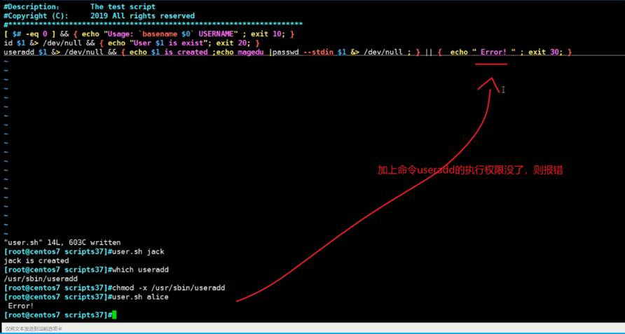

 

## 如果你干了这事：将chmod的执行权限弄没了


### 利用facl修复权限


 
