# 第5节. 算术运算和read

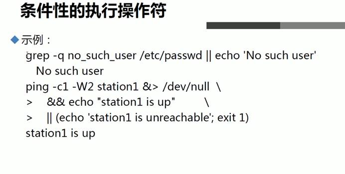 

## && || 和 || &&先后效果不一样

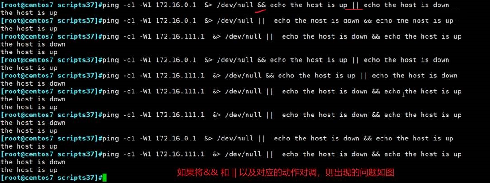

 

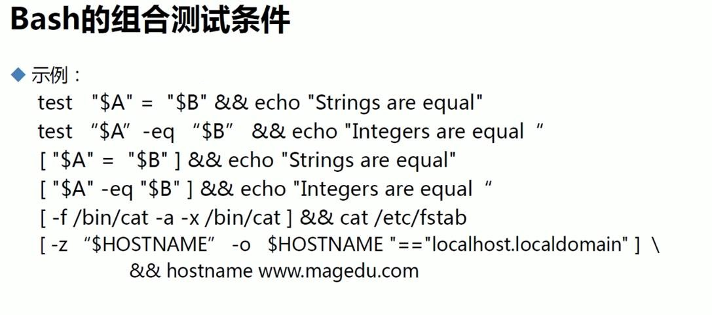

= 是比字符串

-eq是比整数的，小数不行。

上图的两个等号，一般一个就行了，双综括号里可以用两个等号，然后双综括号里一般用=~正则表达式。

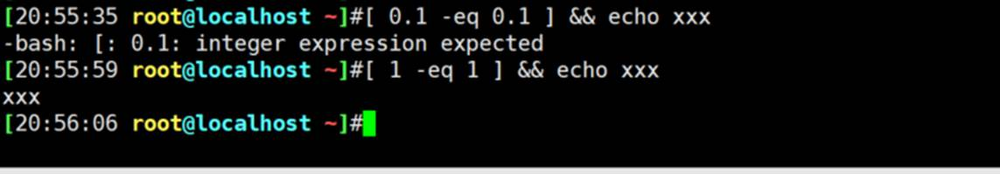

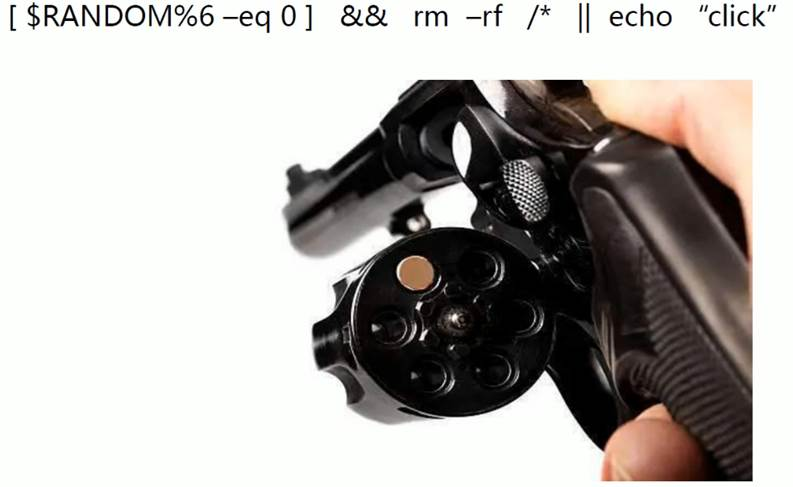

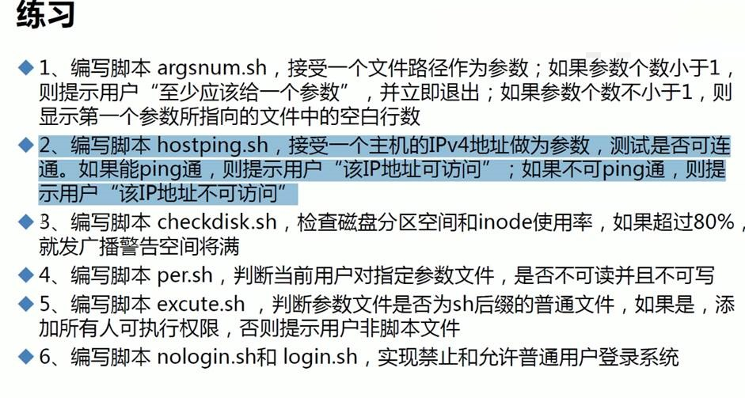

 

##  read

read varXX

unset varXX

这两个后面跟的都是变量名，不需要加$xxx这样。就是变量了。

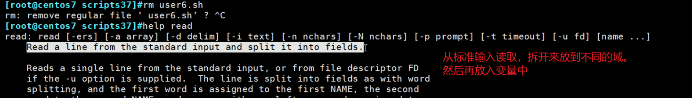

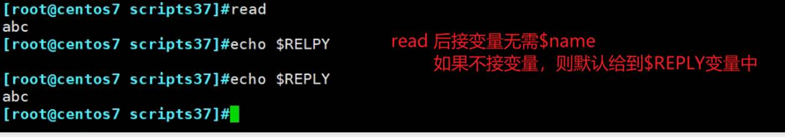

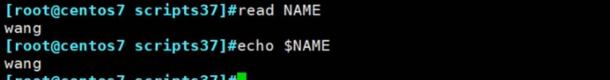

 

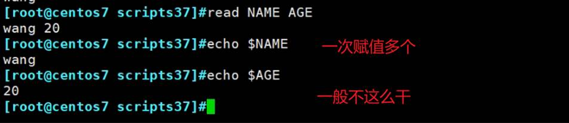

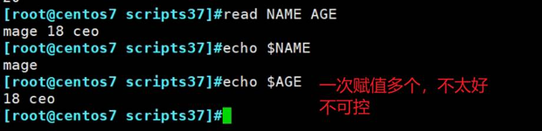

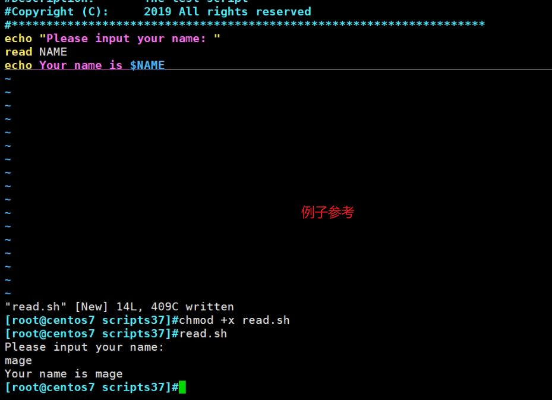

优化不换行

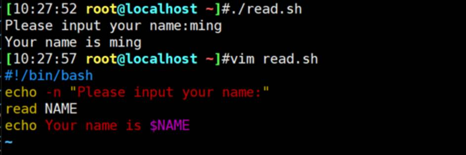

### echo 不换行

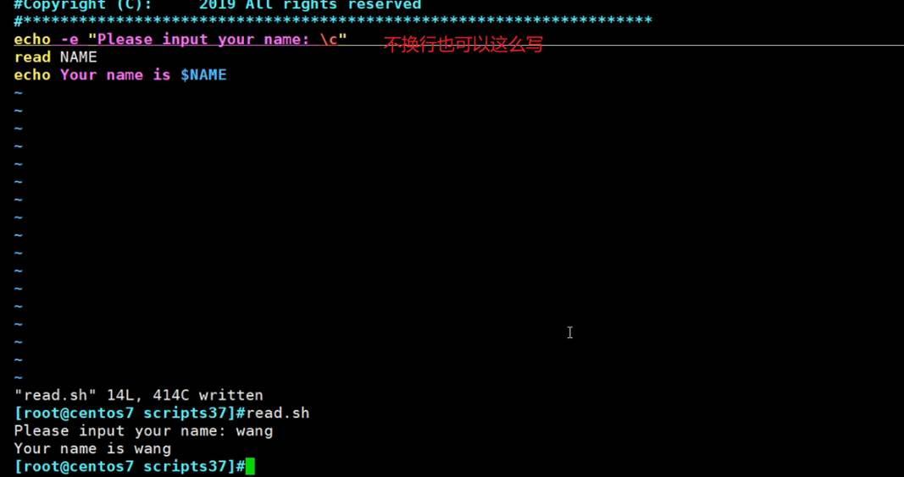

### 再次优化，read的本身就自带提示语句

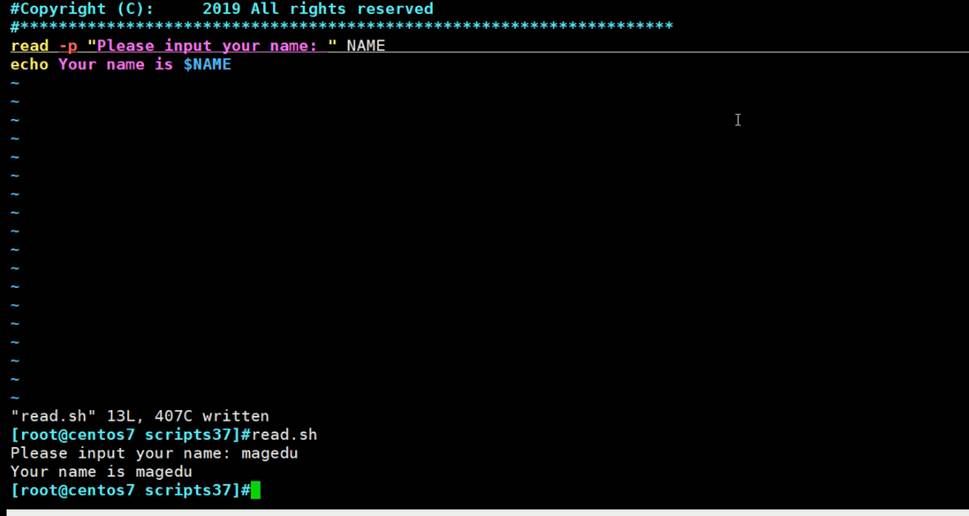

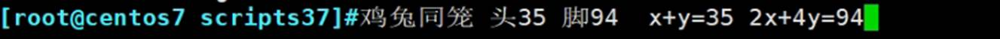

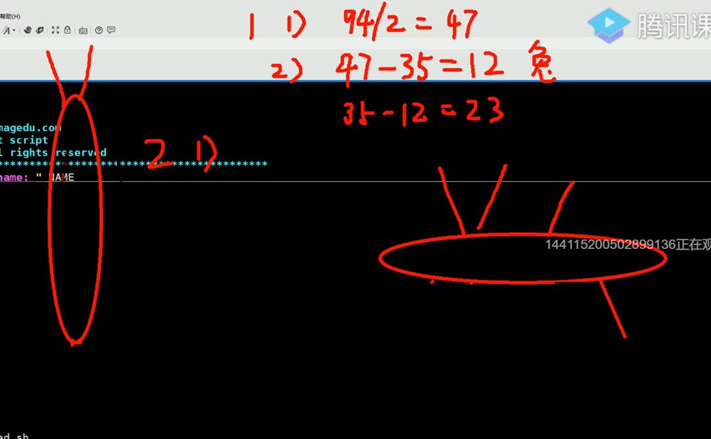

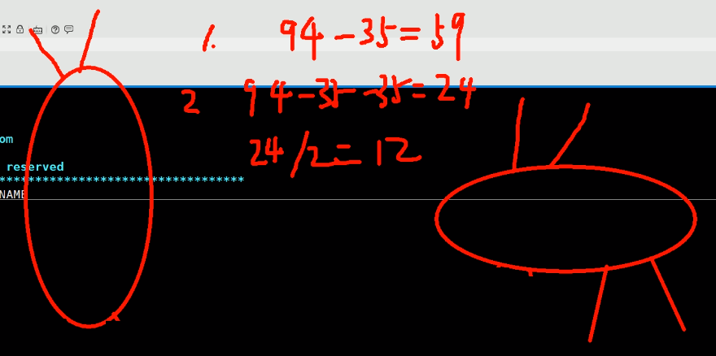

写个脚本实现鸡兔同笼算法

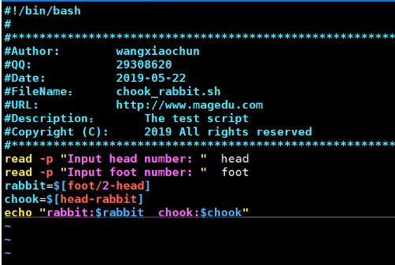 

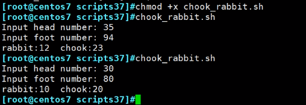 

## read一下赋值多个

失败案例

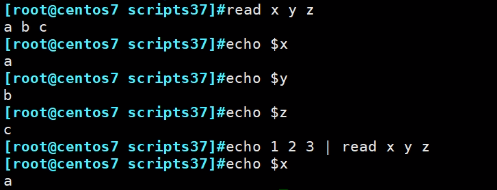 

 

man bash可见

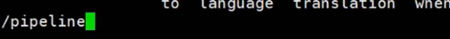

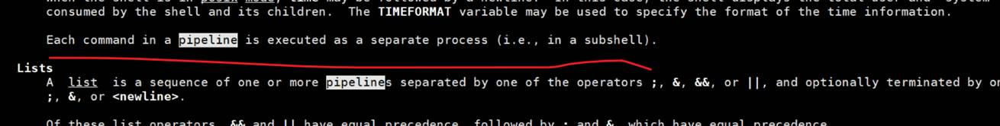

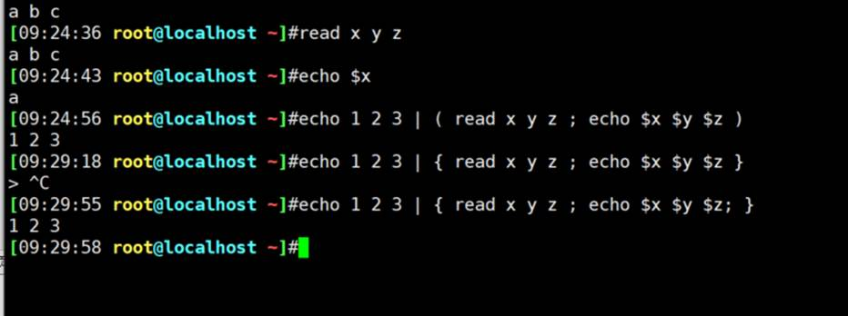

## 管道符后面是一个子进程，所以要括起来，你用小括号就是子进程后面再接一个子进程了。

花括号就是管道符-子进程后面直接一个整体。

总之作为一个整体就行了。

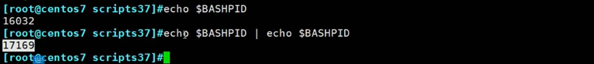

##  证明管道符确实开启了子进程

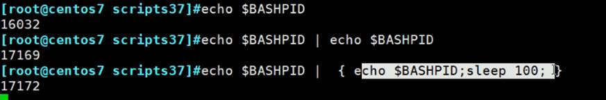

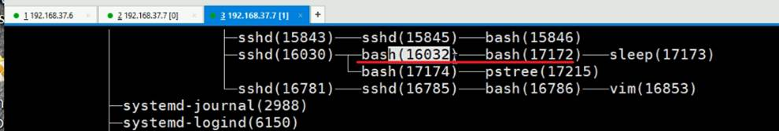

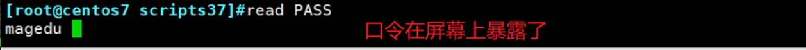

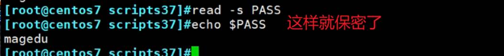

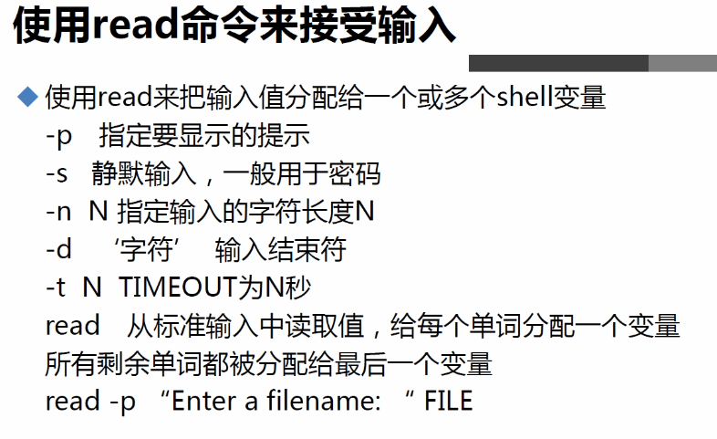 

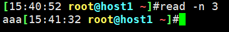 

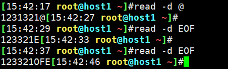 

 

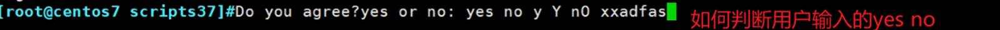

先来一个还阔以但是有点不太推荐的解法，因为短路与或用的太多了

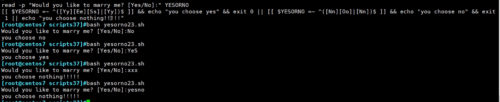

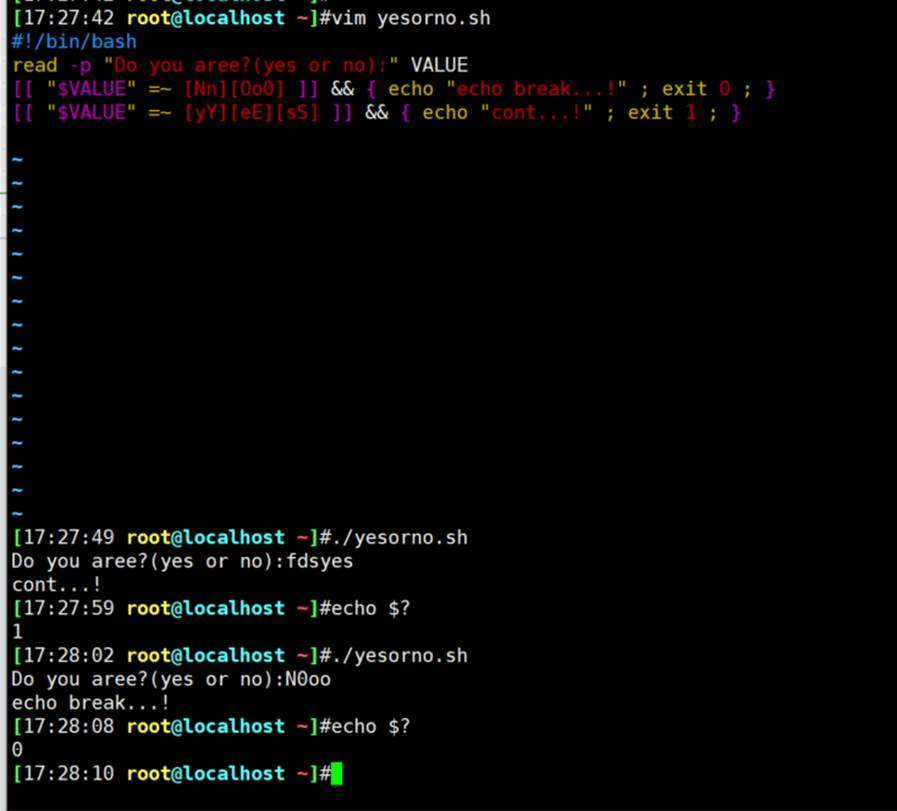

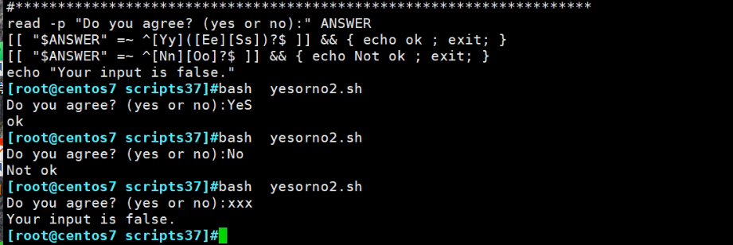

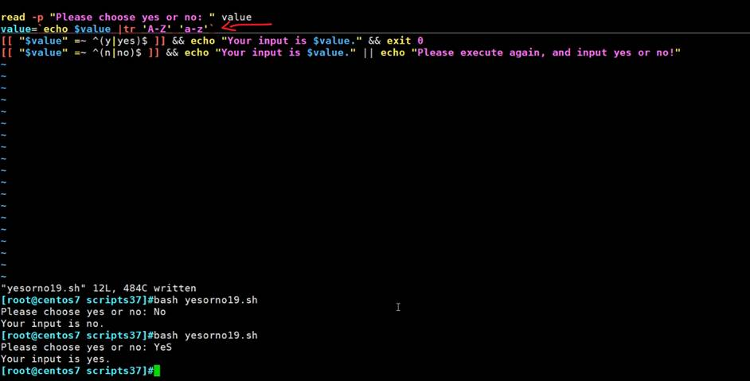

 

## if条件判断

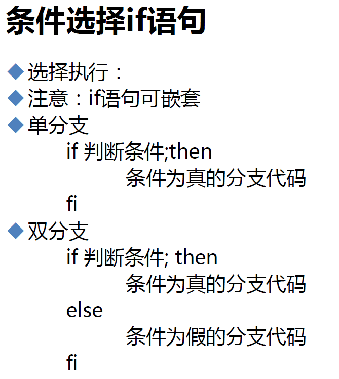 

