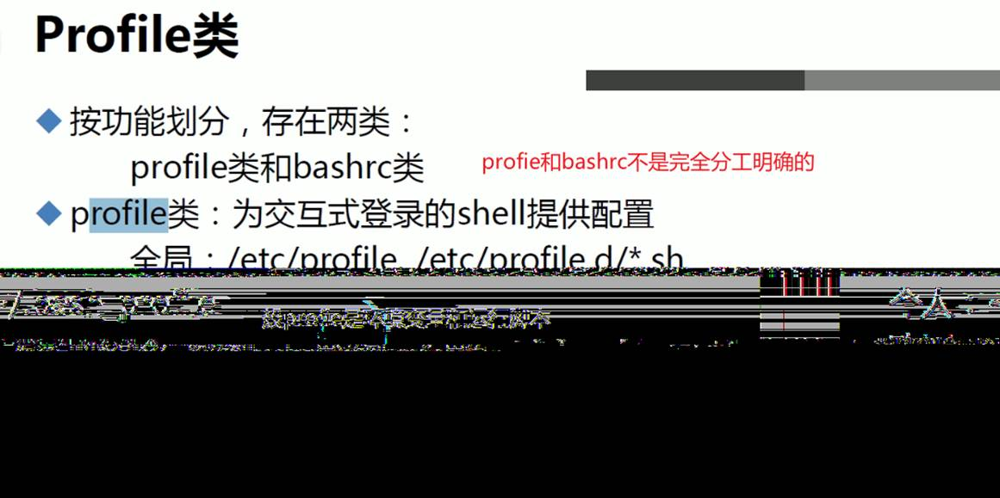

# 第6节. 脚本条件分支和安全

 

type xxx一般可见就是build in 这种内部命令或者外部命令或者alias，现在忽然发现type if不一样的显示

```
[17:19:51 root@host1 ~]#type echo
echo is a shell builtin
[17:19:59 root@host1 ~]#type help
help is a shell builtin
[17:20:07 root@host1 ~]#type ls
ls is aliased to `ls --color=auto'
[17:20:09 root@host1 ~]#type cp
cp is aliased to `cp -i'
[17:20:10 root@host1 ~]#type date
date is /usr/bin/date
[17:20:13 root@host1 ~]#type if
if is a shell keyword    👈不能独立作为命令，是shell的关键字
[17:20:15 root@host1 ~]#

```

 

老王说得好，世界上最远的距离就是，一个在if下，另一个在else里。

## if的shell格式

 

 


有个问题啊，上面的exit没有意义。下面的都是一样效果

 


 

例子：ping一个主机通就算了，不通看下是否处于维护状态(维护的机器一般规范的话是放到一个文件里记着的)，如果不在维护 则认为机器是down的。


## if不适合的情况


此时就需要case


👆上图注意关键字：变量引用。变量引用和变量是两码事，变量引用是要加$的，就是说case 和read 不同，read后面是直接写NAME就表示变量了，而case得写$NAME，引用一下。

### 注意：PAT1)是通配符，不是正则！


变量引用和变量是两码事


if开头，fi结尾，case开头esac结尾。


## 下面是一些补充


上图的小括号是什么鬼？！，上图还差一个小括号没讲，小括号的优先级最高。

 各种符号的优先级见👆上图：

1、命令行里先拆成单词，

2、然后看单词里有没有别名


 


profile是配置文件的意思

bashrc是bash和rc，bash是shell类型，rc是run config，run bash运行的时候的对应的配置文件。run command

 




1、加执行权限

2、bash xxx

3、cat xxx | bash   这种有点问题

4、source xxx


 

sleep观察source和bash的区别


而bash


bash会开启子进程，一般运行脚本都会开启子进程。否则可能会影响当前变量的值。

 

 


**所以一般脚本不用source。而一般配置config文件就是要用source，因为配置文件就是希望改变当前环境的。**

 

 


 


 


 


 


插入题外话

**关闭****VIM后，屏幕唉显示之前的VIM里的内容：**

在.vimrc文件里加上配置语句：

在.vimrc中设置set t_ti= t_te=

方法二


回到原题


其他补充


同理


问题来了，如果上面的脚本写成如下错误


变量写错，$DIR为空，直接就灾难性的把根删了。

如何避免


 

 

还有一个


说明脚本也是在子进程里跑的。


虽然出错了，但是还是继续执行了


处理方法如下


 

 

 

 


整一个这个还是不错的。


 
