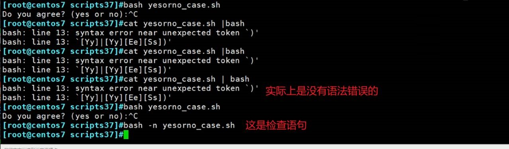
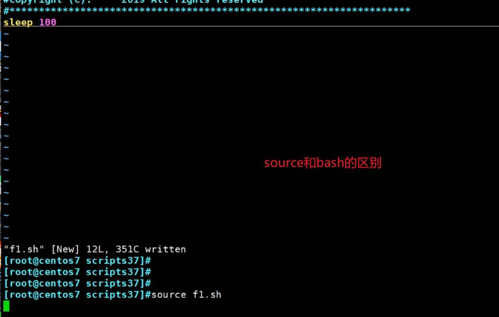
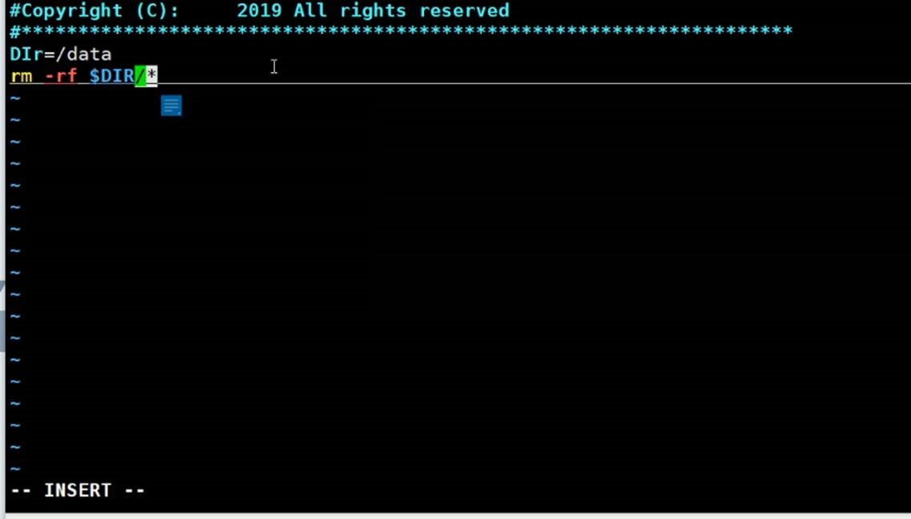

# 第6节. 脚本条件分支和安全

 

type xxx一般可见就是build in 这种内部命令或者外部命令或者alias，现在忽然发现type if不一样的显示

```
[17:19:51 root@host1 ~]#type echo
echo is a shell builtin
[17:19:59 root@host1 ~]#type help
help is a shell builtin
[17:20:07 root@host1 ~]#type ls
ls is aliased to `ls --color=auto'
[17:20:09 root@host1 ~]#type cp
cp is aliased to `cp -i'
[17:20:10 root@host1 ~]#type date
date is /usr/bin/date
[17:20:13 root@host1 ~]#type if
if is a shell keyword    👈不能独立作为命令，是shell的关键字
[17:20:15 root@host1 ~]#

```

 

老王说得好，世界上最远的距离就是，一个在if下，另一个在else里。

## if的shell格式

 

 


有个问题啊，上面的exit没有意义。下面的都是一样效果

 


 

例子：ping一个主机通就算了，不通看下是否处于维护状态(维护的机器一般规范的话是放到一个文件里记着的)，如果不在维护 则认为机器是down的。


## if不适合的情况


此时就需要case


👆上图注意关键字：变量引用。变量引用和变量是两码事，变量引用是要加$的，就是说case 和read 不同，read后面是直接写NAME就表示变量了，而case得写$NAME，引用一下。

### 注意：PAT1)是通配符，不是正则！


变量引用和变量是两码事


if开头，fi结尾，case开头esac结尾。


## 下面是一些补充


上图的小括号是什么鬼？！，上图还差一个小括号没讲，小括号的优先级最高。

 各种符号的优先级见👆上图：

```
小括号的分组优先级最高

1、命令行里先拆成单词，

2、然后看单词里有没有别名，别名要展开

3、然后看花括号，也要展开，{1..10}这种

4、如果有~表示家目录

5、然后再看$()和``表示里面放的命令

6、因为5所以再次将命令行拆成单词

7、展开通配符命令的文件名

8、接着再重定向

9、最后再运行命令
```

## 转义

 

```
[11:18:16 root@localhost ~]#echo "ls"   👈双引号防止扩展，就是转义的意思
ls
上图就是说双引号也可以转义，但是以下几个情况转不了。
[11:23:13 root@localhost ~]#echo "$PATH"
/usr/local/sbin:/usr/local/bin:/usr/sbin:/usr/bin:/root/bin
[11:23:20 root@localhost ~]#
[11:23:24 root@localhost ~]#echo "`ls`"
1
anaconda-ks.cfg
data
f1
f2
hello.txt
[11:23:50 root@localhost ~]#"!1020"
"ls"
1  anaconda-ks.cfg  data  f1  f2  hello.txt
[11:29:23 root@localhost ~]#echo "\\n"
\n
[11:29:25 root@localhost ~]#echo '\\n'
\\n
[11:29:28 root@localhost ~]#

```

## 环境配置文件等到底放哪里

 

个人只影响家目录的这个用户，全局所有用户生效。


 

 

```
交互登入就是：xshell或者直接终端登入，su - 完全切换是交互式登入。
非交互登入：su 这种不完全切换就是非交互式登入；图新界面的-打开终端也是非交互登入；脚本登入；
👉非交互方式，看的配置文件就少了两个，所以推荐放到/etc/profile.d/*.sh这样，你脚本上来也是OK的。不过一般脚本上来也不太需要这些环境配置吧，比如vim 空格 退出不清屏 PS1颜色等脚本上来也不需要的啊。
```

### 演示1：

```
[11:45:23 root@localhost ~]#vim /etc/profile	👈最后一行添加echo xxxxyyyy
[11:46:01 root@localhost ~]#
[11:46:02 root@localhost ~]#
[11:46:02 root@localhost ~]#su - user1		👈完全切换的交互登入
Last login: Mon Feb  7 11:45:20 CST 2022 on pts/0
xxxxyyyy
[11:46:09 user1@localhost ~]$exit
logout
[11:46:12 root@localhost ~]#su user1		👈不完全切换的非交互登入
[11:46:14 user1@localhost root]$exit
exit
[11:46:15 root@localhost ~]#

```

### 演示2：


 


profile是配置文件的意思

### bashrc是bash和rc，bash是shell类型，rc是run config，run bash运行的时候的对应的配置文件。run command

 

### profile和bashrc分工不是很明确

 

**一般认为profile用来定义环境变量和运行命令或脚本**

**bashrc用来定义别名和函数还有本地变量**

 

profile和bashrc修改后生效的方法

 

其实就是把profie当作脚本执行一下

```
1、加执行权限

2、bash xxx

3、cat xxx | bash   这种有点问题

4、source xxx或. xxx
```



 

 

### sleep观察source和bash的区别

在文件里跑个slepp 100看看当前的bash，source和bash不同👇




而bash


### bash会开启子进程，一般运行脚本都会开启子进程。否则可能会影响当前变量的值。

 

###  source(.)运行脚本不推荐哈，否则👇；配置文件恰恰建议用source(.)


**所以一般脚本不用source。而一般配置config文件就是要用source，因为配置文件就是希望改变当前环境的。**

 

###  退出的时候执行点东西


## set命令相关

### $_是上条命令最后一个参数


###  $-又是啥


 


 


**插入题外话**

**关闭****VIM后，屏幕唉显示之前的VIM里的内容：**

在.vimrc文件里加上配置语句：

在.vimrc中设置set t_ti= t_te=

方法二


 

**回到原题**

 


```
[13:56:43 root@localhost ~]#echo ${-#*i}		👈好神奇的表达式
mBHs
[13:56:46 root@localhost ~]#
```

其他补充

### 解释下unmask为什么root式022，普通账户时002


uid小于199，并且 gid=uid，则umask=002，否则umask=022

同理


## 脚本安全

 

当使用一个没有定义的变量的时候，直接报错。 


问题来了，如果上面的脚本写成如下错误



变量写错，$DIR为空，直接就灾难性的把根删了。

将上图略微修改一下（rm -rf $DIR/*.txt），然后👇测试结果如下：


如何避免


###  上图👆问题大了-如果没有set -u的话就是$DIR不存在直接把/根下面都删了，删库的100种方法你又学废了一种，恭喜恭喜。

 

还有一个


说明脚本也是在子进程里跑的。


### 脚本错误就不执行了的方法，因为不是语法错误时会继续执行的。


虽然出错了，但是还是继续执行了


处理方法如下


 

 

 

 


整一个这个还是不错的。


 
