# 第1节. 文件查找

## 章节目录


grep是过滤文本的行

cut是过滤文本的列

这里是磁盘上搜索文件

##  locate找文件非常快，依赖于mlocate.db


用updatedb创建/var/lib/mlocate/mlocate.db文件。如果工作中磁盘文件很多，就会占用磁盘IO，瞬间飙高，<font color=red>导致业务被波及</font>。所以需要操作窗口。

 默认模糊搜索


 


👇要updatedb(不能随便用，生产小心)更新一下数据库，就能利用locate查找了


### locate支持基本正则


👆基本正则写起来还是比较麻烦，上图。

```
[15:27:53 root@localhost ~]#find / -name passwd |grep -Ei "^/[a-z]+/passwd$"
/etc/passwd
/Etc/passwd
/a/passwd
/A/passwd
/Z/passwd
/z/passwd
[15:28:17 root@localhost ~]#find / -name passwd |grep -Ei "^/[A-Z]+/passwd$"
/etc/passwd
/Etc/passwd
/a/passwd
/A/passwd
/Z/passwd
/z/passwd
[15:28:51 root@localhost ~]#find / -name passwd |grep -E "^/[A-Z]+/passwd$"
/A/passwd
/Z/passwd
[15:28:57 root@localhost ~]#find / -name passwd |grep -E "^/[a-z]+/passwd$"
/etc/passwd
/a/passwd
/z/passwd
[15:29:03 root@localhost ~]#find / -name passwd |grep -E "^/[a-Z]+/passwd$"
/etc/passwd
/Etc/passwd
/a/passwd
/A/passwd
/Z/passwd
/z/passwd
[15:29:09 root@localhost ~]#find / -name passwd |grep -E "^/[A-z]+/passwd$"
grep: Invalid range end
[15:29:17 root@localhost ~]#find / -name passwd |grep -E "^/[A-z]+/passwd$"
grep: Invalid range end
[15:29:22 root@localhost ~]#
👆通过上面的实验发现find后面的[A-Z][a-z][a-Z]这样写都有其特定的意义，但是没有[A-z]的写法。这点和通配符不同


[15:37:01 root@localhost ~]#locate -r "^/[a-z]+/passwd$"
[15:37:06 root@localhost ~]#locate -r "^/[A-Z]+/passwd$"
[15:37:10 root@localhost ~]#find / -name passwd |grep -E "^/[a-z]+/passwd$"
/etc/passwd
/a/passwd
/z/passwd
👆可见locate -r只支持正则，所以+这种扩展正则表达式 是不支持的。

[15:38:24 root@localhost ~]#locate -r "^/[A-Z]*/passwd$"
/A/passwd
/Z/passwd
[15:39:57 root@localhost ~]#locate -r "^/[a-Z]*/passwd$"
/A/passwd
/Etc/passwd
/Z/passwd
/a/passwd
/etc/passwd
/z/passwd
[15:40:01 root@localhost ~]#locate -r "^/[[:alnum:]]*/passwd$"
/A/passwd
/Etc/passwd
/Z/passwd
/a/passwd
/etc/passwd
/z/passwd
[15:40:45 root@localhost ~]#find / -name passwd |grep -E "^/[[:alnum:]]+/passwd$"
/etc/passwd
/Etc/passwd
/a/passwd
/A/passwd
/Z/passwd
/z/passwd

```

## find 实时查找，其实也可以利用xargs变得快些，同样占CPU，locate就是在机器上APP服务维护阶段执行updatedb会占CPU

```
[15:36:15 root@pyConsole /]#time `ls --hide=proc | xargs -i -P 0 find /{} -name "*i*"`
-bash: /bin: Is a directory

real    0m1.101s
user    0m1.206s
sys     0m0.336s
[15:36:17 root@pyConsole /]#time `ls --hide=proc | xargs -i -P 0 find /{} -name "*i*"`
-bash: /bin: Is a directory

real    0m1.391s
user    0m1.496s
sys     0m0.356s
[15:36:22 root@pyConsole /]#time `ls --hide=proc | xargs -i -P 0 find /{} -name "*i*"`
-bash: /bin: Is a directory

real    0m1.123s
user    0m1.186s
sys     0m0.363s
[15:36:24 root@pyConsole /]#time `find / -name "*i*"`
find: ‘/proc/4065730’: No such file or directory
find: ‘/proc/4065733’: No such file or directory
-bash: /boot/efi: Is a directory

real    0m1.677s
user    0m1.380s
sys     0m0.396s
[15:36:28 root@pyConsole /]#time `find / -name "*i*"`
-bash: /boot/efi: Is a directory

real    0m1.721s
user    0m1.400s
sys     0m0.399s
[15:36:31 root@pyConsole /]#time `find / -name "*i*"`
-bash: /boot/efi: Is a directory

real    0m1.739s
user    0m1.407s
sys     0m0.404s
[15:36:34 root@pyConsole /]#

```

### locate和find一样存在一些普通用户没有某些文件夹权限，也会搜不到。


find默认就是递归查找，也就是会进到子目录里继续查找。

[处理动作]比较实用，搜出来删除之类。


### find 指定搜索深度


```
[16:08:08 root@pyConsole /]#find / -name "*i*" -maxdepth 1
find: warning: you have specified the -maxdepth option after a non-option argument -name, but options are not positional (-maxdepth affects tests specified before it as well as those specified after it).  Please specify options before other arguments.

/bin
/sbin
/lib
/lib64
/media
/.bash_history
/switch

```

```
更精准一些的搜索方法
[16:10:06 root@pyConsole /]#find / -name "passwd"
/etc/pam.d/passwd
/etc/passwd
/var/lib/sss/mc/passwd
/usr/bin/passwd
/usr/share/licenses/passwd
/usr/share/doc/passwd
/usr/share/bash-completion/completions/passwd
[16:10:11 root@pyConsole /]#
[16:10:13 root@pyConsole /]#
[16:10:13 root@pyConsole /]#find / -name "passwd" -maxdepth 2
find: warning: you have specified the -maxdepth option after a non-option argument -name, but options are not positional (-maxdepth affects tests specified before it as well as those specified after it).  Please specify options before other arguments.

/etc/passwd
[16:10:18 root@pyConsole /]#find -maxdepth 2 / -name passwd
find: paths must precede expression: /
Usage: find [-H] [-L] [-P] [-Olevel] [-D help|tree|search|stat|rates|opt|exec] [path...] [expression]
[16:10:59 root@pyConsole /]#find / -maxdepth 2 -name passwd
/etc/passwd
[16:11:11 root@pyConsole /]#find / -maxdepth 2 -mindepth 2 -name passwd
/etc/passwd
[16:11:22 root@pyConsole /]#find /  -name passwd
/etc/pam.d/passwd
/etc/passwd
/var/lib/sss/mc/passwd
/usr/bin/passwd
/usr/share/licenses/passwd
/usr/share/doc/passwd
/usr/share/bash-completion/completions/passwd
[16:11:29 root@pyConsole /]#
[16:11:32 root@pyConsole /]#find / -maxdepth 3 -mindepth 3 -name passwd
/etc/pam.d/passwd
/usr/bin/passwd
[16:11:36 root@pyConsole /]#

```

### find -depth选项,这个有什么应用场景？想不出来


默认是先搜索目录本身，再进到每个目录再去搜索。


现在就是先处理文件，再处理文件夹。应用场景呢？


### find自带的是通配符不是正则

 


###  find -iname 不分大小写 

 


```
[16:32:18 root@localhost ~]#find / -name etc
/run/initramfs/state/etc
/etc
/usr/share/factory/etc
/usr/local/etc
[16:32:25 root@localhost ~]#find / -iname etc   👈忽略大小写的方法，这也是个总结点，以后用▲来表示总结线索吧，▲忽略大小写2
/run/initramfs/state/etc
/etc
/root/ETc
/usr/share/zoneinfo/Etc
/usr/share/zoneinfo/posix/Etc
/usr/share/zoneinfo/right/Etc
/usr/share/factory/etc
/usr/local/etc
/Etc
[16:32:32 root@localhost ~]#

```

###  find -inum 根据inode编号来搜


 

```
[16:54:36 root@localhost ~]#find / -inum 70
/sys/kernel/tracing/events/raw_syscalls/sys_exit/filter
/sys/kernel/debug/tracing/events/raw_syscalls/sys_exit/filter
/sys/fs/cgroup/devices/system.slice/sys-kernel-tracing.mount/tasks
/sys/fs/cgroup/memory/system.slice/system-systemd\x2dhibernate\x2dresume.slice/tasks
/sys/fs/cgroup/pids/system.slice/systemd-journald-dev-log.socket/pids.current
/sys/bus/memory/drivers_autoprobe
[16:54:39 root@localhost ~]#
[16:54:41 root@localhost ~]#
[16:54:41 root@localhost ~]#find / -inum 70 -exec  ls -il {} +   👈提前用一下exec看下效果呵呵
70 -rw-r--r--. 1 root root 4096 Feb  7 16:54  /sys/bus/memory/drivers_autoprobe
70 -rw-r--r--. 1 root root    0 Feb  7 16:54  /sys/fs/cgroup/devices/system.slice/sys-kernel-tracing.mount/tasks
70 -rw-r--r--. 1 root root    0 Feb  7 16:54 '/sys/fs/cgroup/memory/system.slice/system-systemd\x2dhibernate\x2dresume.slice/tasks'
70 -r--r--r--. 1 root root    0 Feb  7 16:54  /sys/fs/cgroup/pids/system.slice/systemd-journald-dev-log.socket/pids.current
70 -rw-r--r--. 1 root root    0 Jan 29 09:57  /sys/kernel/debug/tracing/events/raw_syscalls/sys_exit/filter
70 -rw-r--r--. 1 root root    0 Jan 29 09:57  /sys/kernel/tracing/events/raw_syscalls/sys_exit/filter
[16:54:43 root@localhost ~]#
👆节点编号相同也不是同一个文件哈哈。
```

### 搜索inode节点编号，以及搜索inode相同的文件(硬的)


  


### find 的regex要匹配的是全路径，locate不需要


```
对比实验
17:07:14 root@localhost ~]#ll /usr/share/pixmaps/
total 92
-rw-r--r--. 1 root root  5459 Sep  9 13:25 cockpit.png
-rw-r--r--. 1 root root 13071 Jun 28  2021 fedora-gdm-logo.png
-rw-r--r--. 1 root root 21820 Jun 28  2021 fedora-logo.png
-rw-r--r--. 1 root root 12760 Jun 28  2021 fedora-logo-small.png
-rw-r--r--. 1 root root  6620 Jun 28  2021 fedora-logo-sprite.png
-rw-r--r--. 1 root root  1442 Jun 28  2021 fedora-logo-sprite.svg
-rw-r--r--. 1 root root 14493 Jun 28  2021 system-logo-white.png

👇这是  -name后跟通配符
[17:07:37 root@localhost ~]#find /usr/share/pixmaps -name *png
/usr/share/pixmaps/fedora-gdm-logo.png
/usr/share/pixmaps/fedora-logo-small.png
/usr/share/pixmaps/fedora-logo-sprite.png
/usr/share/pixmaps/fedora-logo.png
/usr/share/pixmaps/system-logo-white.png
/usr/share/pixmaps/cockpit.png


👇这是  -regex后跟正则(扩展正则，因为不用\[xx\]这样写，也支持+)，注意这里的正则匹配的是全路径
[17:08:21 root@localhost ~]#find /usr/share/pixmaps -regex ".*\.png$"
/usr/share/pixmaps/fedora-gdm-logo.png
/usr/share/pixmaps/fedora-logo-small.png
/usr/share/pixmaps/fedora-logo-sprite.png
/usr/share/pixmaps/fedora-logo.png
/usr/share/pixmaps/system-logo-white.png
/usr/share/pixmaps/cockpit.png
[17:08:30 root@localhost ~]#find /usr/share/pixmaps -regex "\.png$"
[17:08:33 root@localhost ~]#
[17:08:34 root@localhost ~]#

👇这是locate -r 后跟 正则
[17:09:12 root@localhost ~]#locate -r "/usr/share/pixmaps/.*\.png$"
/usr/share/pixmaps/cockpit.png
/usr/share/pixmaps/fedora-gdm-logo.png
/usr/share/pixmaps/fedora-logo-small.png
/usr/share/pixmaps/fedora-logo-sprite.png
/usr/share/pixmaps/fedora-logo.png
/usr/share/pixmaps/system-logo-white.png
👇当然locate无需全路径
```

 

### find 选项的PPT总结图


###  还有一个补充，要注意-name 后面要带上双引号的

```
[18:32:04 root@localhost ~]#find -name "f*"
./f2
./data/f2
./data/f1
./f1~
./fz~
./f3
./f1
./f1.link
[18:32:05 root@localhost ~]#find -name f*
find: paths must precede expression: f1~
Usage: find [-H] [-L] [-P] [-Olevel] [-D help|tree|search|stat|rates|opt|exec] [path...] [expression]
[18:32:11 root@localhost ~]#
[18:32:12 root@localhost ~]#
[18:32:12 root@localhost ~]#

```


## 按属主和属组查找

 


### 默认是print，这里换了个动作-ls

所以其实不用上面的-exec "ls" {} + 这么麻烦，简单的ls直接加就行了。 


### 这样-nouser就体现出来了👆

##  根据文件类型查找

 

###  搜索所有文件夹


###  搜索所有块


###  搜索空文件或空文件夹


 

 

##  组合条件与或非

 

###  非空文件和文件夹


###  并且关系


###  或者关系


 

 


-a与的运算优先级要比-o或运算高，所以-type f -a -ls先进行运算了。


 

关键点来了，为什么-name "f*" -o -type f -a -ls   后面先算，结果就是t.txt了呢

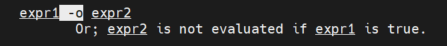 

```
[17:28:06 root@localhost data]#ll
total 16
-rw-r--r--+ 1 root root 10 Jan 29 17:49 f1
-rw-r--r--+ 2 root root  4 Jan 29 17:49 f2
-rw-r--r--+ 2 root root  4 Jan 29 17:49 f2.link
drwxr-xr-x. 2 root root  6 Feb  8 10:39 fdir
-rw-r--r--. 1 root root 65 Jan 29 10:59 t.txt
[17:28:08 root@localhost data]#
[17:28:10 root@localhost data]#find ./ -name "f*" -o -type f -ls  👈不太好解释为什么变成了1行
 33577450      4 -rw-r--r--   1  root     root           65 Jan 29 10:59 ./t.txt
👆上面的命令等价于下面两个的结果做了-o，但是-o显然不能用man里的用法来解释这个结果。
[17:28:12 root@localhost data]#find ./ -name "f*"
./f1
./f2
./fdir
./f2.link
[17:28:16 root@localhost data]#find ./ -type f -ls
 33577448      4 -rw-r--r--   1  root     root           10 Jan 29 17:49 ./f1
 33577447      4 -rw-r--r--   2  root     root            4 Jan 29 17:49 ./f2
 33577450      4 -rw-r--r--   1  root     root           65 Jan 29 10:59 ./t.txt
 33577447      4 -rw-r--r--   2  root     root            4 Jan 29 17:49 ./f2.link
[17:28:21 root@localhost data]#

👇倒是如果大家都是一个格式都是ls -l长格式就可以-o了
[17:32:00 root@localhost data]#find ./ -name "f*" -ls
 33577448      4 -rw-r--r--   1  root     root           10 Jan 29 17:49 ./f1
 33577447      4 -rw-r--r--   2  root     root            4 Jan 29 17:49 ./f2
 51325760      0 drwxr-xr-x   2  root     root            6 Feb  8 10:39 ./fdir  👈
 33577447      4 -rw-r--r--   2  root     root            4 Jan 29 17:49 ./f2.link
[17:32:02 root@localhost data]#find ./ -type f -ls
 33577448      4 -rw-r--r--   1  root     root           10 Jan 29 17:49 ./f1
 33577447      4 -rw-r--r--   2  root     root            4 Jan 29 17:49 ./f2
 33577450      4 -rw-r--r--   1  root     root           65 Jan 29 10:59 ./t.txt 👈
 33577447      4 -rw-r--r--   2  root     root            4 Jan 29 17:49 ./f2.link
[17:32:08 root@localhost data]#find ./ -name "f*" -ls -o -type f -ls
 33577448      4 -rw-r--r--   1  root     root           10 Jan 29 17:49 ./f1
 33577447      4 -rw-r--r--   2  root     root            4 Jan 29 17:49 ./f2
 33577450      4 -rw-r--r--   1  root     root           65 Jan 29 10:59 ./t.txt 👈
 51325760      0 drwxr-xr-x   2  root     root            6 Feb  8 10:39 ./fdir	 👈
 33577447      4 -rw-r--r--   2  root     root            4 Jan 29 17:49 ./f2.link


------------👇这段是符合-o的本来逻辑的，就是前面true就不算后面了----------
[17:33:24 root@localhost data]#find ./ -name "f*" -ls -o -type f
 33577448      4 -rw-r--r--   1  root     root           10 Jan 29 17:49 ./f1
 33577447      4 -rw-r--r--   2  root     root            4 Jan 29 17:49 ./f2
 51325760      0 drwxr-xr-x   2  root     root            6 Feb  8 10:39 ./fdir
 33577447      4 -rw-r--r--   2  root     root            4 Jan 29 17:49 ./f2.link
[17:33:28 root@localhost data]#
[17:33:44 root@localhost data]#find ./ -name "f*" -ls
 33577448      4 -rw-r--r--   1  root     root           10 Jan 29 17:49 ./f1
 33577447      4 -rw-r--r--   2  root     root            4 Jan 29 17:49 ./f2
 51325760      0 drwxr-xr-x   2  root     root            6 Feb  8 10:39 ./fdir
 33577447      4 -rw-r--r--   2  root     root            4 Jan 29 17:49 ./f2.link
[17:33:59 root@localhost data]#
[17:34:01 root@localhost data]#find ./ -type f
./f1
./f2
./t.txt
./f2.link

------------👇这段是不符合-o的本来"表面"逻辑的，看起来像是短格式在前(左)，长格式在(右),会变成左边的文件名去掩码右边的文件名，掩出来就剩下一个t.txt在用find里的ls(其实就是ls -dils)显示出来----------可能这里的-o就是异或运算了，相同出0就消掉了，不同也就是t.txt不同就出1也就保留了-----但显然上面的例子是逻辑或--▲linux逻辑混乱案例1--
[17:34:22 root@localhost data]#find ./ -name "f*"
./f1
./f2
./fdir
./f2.link
[17:34:34 root@localhost data]#find ./ -type f -ls
 33577448      4 -rw-r--r--   1  root     root           10 Jan 29 17:49 ./f1
 33577447      4 -rw-r--r--   2  root     root            4 Jan 29 17:49 ./f2
 33577450      4 -rw-r--r--   1  root     root           65 Jan 29 10:59 ./t.txt
 33577447      4 -rw-r--r--   2  root     root            4 Jan 29 17:49 ./f2.link
[17:34:48 root@localhost data]#
[17:34:56 root@localhost data]#find ./ -name "f*" -o -type f -ls
 33577450      4 -rw-r--r--   1  root     root           65 Jan 29 10:59 ./t.txt
[17:35:04 root@localhost data]#

总之，这东西要规范了用就是-a是默认存在的 优于 -o，然后要规范使用小阔话来实现正确的逻辑，否则结果很难解释。
```

## 德·摩根定律

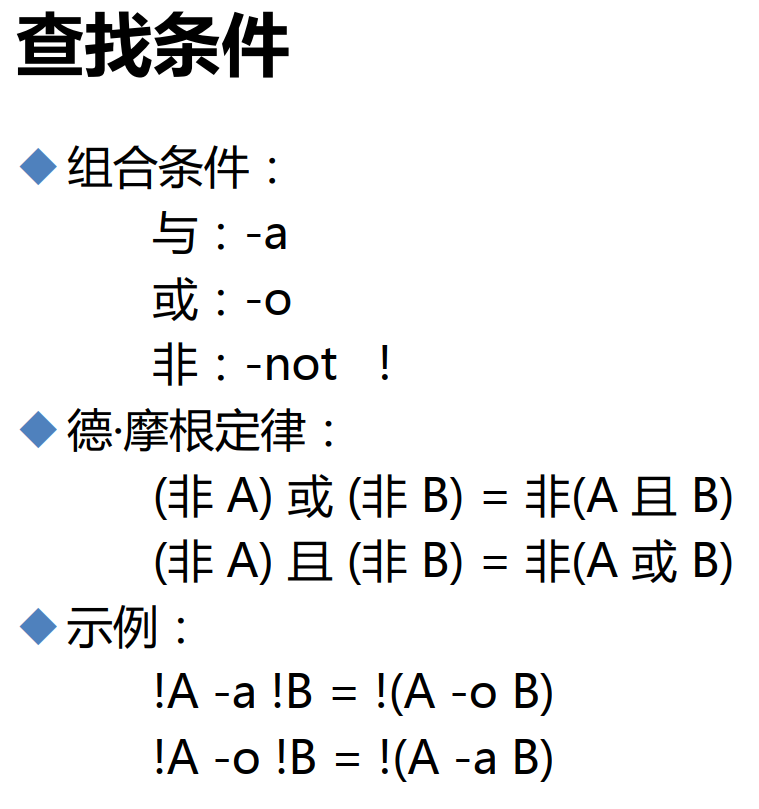 

 


locate -r xx是正则，find -name xx是通配，locate xx是包含就算，find -regex 是扩展正则，本章上文有总结过了。

如果find 后接 regex就需要是全路径匹配。


 


 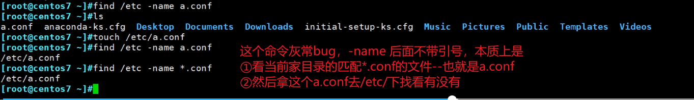

```
[18:04:14 root@localhost ~]#find /etc -name *.conf | head -10
/etc/dnf/dnf.conf
/etc/dnf/plugins/kpatch.conf
/etc/dnf/plugins/copr.conf
/etc/dnf/plugins/debuginfo-install.conf
/etc/dnf/protected.d/dnf.conf
/etc/dnf/protected.d/setup.conf
/etc/dnf/protected.d/systemd.conf
/etc/dnf/protected.d/sudo.conf
/etc/dnf/protected.d/yum.conf
/etc/libreport/events.d/collect_dnf.conf
[18:04:18 root@localhost ~]#touch x.conf
[18:04:33 root@localhost ~]#find /etc -name *.conf | head -10
[18:04:36 root@localhost ~]#find /etc -name *.conf
[18:04:39 root@localhost ~]#👇-name后面一定要加上引号，否则你看家目录里的文件竟然会影响/etc/下面的文件匹配，这个似乎很不合理，但是让我联想到了pycharm的init文件也是，你只要跑一个普通的xx.py文件，就会先跑一个init文件，但是也不至于像linux这种奇奇怪怪的问题。
都说linux稳定，今儿给大家看看逻辑不通的两个案例~▲linux逻辑混乱案例2
[18:04:39 root@localhost ~]#find /etc -name "*.conf" | head -10
/etc/dnf/dnf.conf
/etc/dnf/plugins/kpatch.conf
/etc/dnf/plugins/copr.conf
/etc/dnf/plugins/debuginfo-install.conf
/etc/dnf/protected.d/dnf.conf
/etc/dnf/protected.d/setup.conf
/etc/dnf/protected.d/systemd.conf
/etc/dnf/protected.d/sudo.conf
/etc/dnf/protected.d/yum.conf
/etc/libreport/events.d/collect_dnf.conf

```

### ▲linux逻辑混乱案例2

```
[18:13:15 root@localhost ~]#cd /data/		
---进到/data下find -name 不带*看看，果然是当前目录会干掉实际搜索的目录文件，具体往下看👇---
[18:13:25 root@localhost data]#
[18:13:25 root@localhost data]#
[18:13:25 root@localhost data]#
[18:13:25 root@localhost data]#find /etc -name *.conf | head -10   👈现在不带引号可以搜到
/etc/dnf/dnf.conf
/etc/dnf/plugins/kpatch.conf
/etc/dnf/plugins/copr.conf
/etc/dnf/plugins/debuginfo-install.conf
/etc/dnf/protected.d/dnf.conf
/etc/dnf/protected.d/setup.conf
/etc/dnf/protected.d/systemd.conf
/etc/dnf/protected.d/sudo.conf
/etc/dnf/protected.d/yum.conf
/etc/libreport/events.d/collect_dnf.conf
[18:13:28 root@localhost data]#ll
total 16
-rw-r--r--+ 1 root root 10 Jan 29 17:49 f1
-rw-r--r--+ 2 root root  4 Jan 29 17:49 f2
-rw-r--r--+ 2 root root  4 Jan 29 17:49 f2.link
drwxr-xr-x. 2 root root  6 Feb  8 10:39 fdir
-rw-r--r--. 1 root root 65 Jan 29 10:59 t.txt
[18:13:31 root@localhost data]#touch a.conf   👈只要在find的命令键入的当前目录下创建a.conf
[18:13:48 root@localhost data]#find /etc -name *.conf | head -10  👈就搜不到了
[18:13:51 root@localhost data]#
[18:13:53 root@localhost data]#touch /etc/b.conf 
[18:14:02 root@localhost data]#touch /etc/a.conf  👈然后在/etc/下面创建a.conf就搜索到了
[18:14:05 root@localhost data]#
[18:14:05 root@localhost data]#find /etc -name *.conf | head -10
/etc/a.conf
[18:14:07 root@localhost data]#
[18:14:07 root@localhost data]#touch b.conf  👈再在/data下创建b.conf，就报错了哈哈。
[18:16:14 root@localhost data]#find /etc -name *.conf | head -10
find: paths must precede expression: b.conf
Usage: find [-H] [-L] [-P] [-Olevel] [-D help|tree|search|stat|rates|opt|exec] [path...] [expression]
[18:16:40 root@localhost data]#rm -rf b.conf
[18:17:32 root@localhost data]#find /etc -name *.conf | head -10
/etc/a.conf
[18:17:34 root@localhost data]#

```

## find的裁剪，让我想到了vtp的裁剪

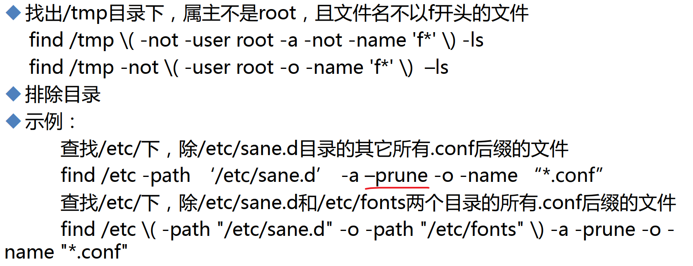

用裁剪prune，它的裁剪语法是组合逻辑的，不是很简洁


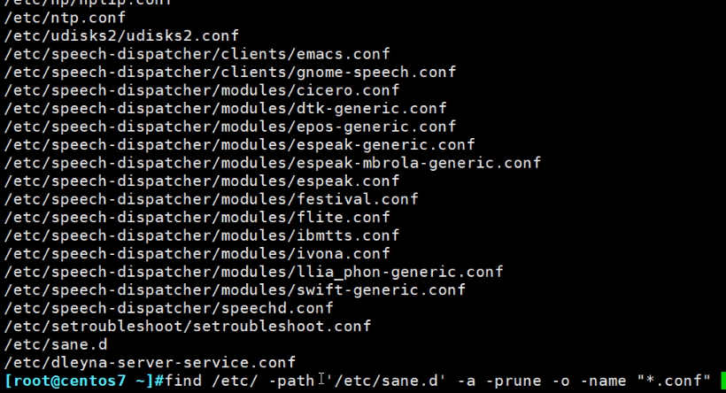 


题外话

### 搜arp协议文件


 

## 搜文件大小区间(] -size


 

写10K，实际上是(9k-10k]


👆既然是(9k-10k]之间，那么8192就不在里面了，自然就搜不到了。


 


##  

## 搜文件时间区间[) -size


 👆这个线索可以拎出来，▲判断某个动作或者事件 带来了哪些影响，①比如yum history是可以回滚yum的动作(包括依赖，这是remove做不到的)；②就是这里的时间，我这一分钟内完成了用户的创建，于是我查看1分钟来产生的新文件-mmin -1就这些，所以八九不离十的 就是useradd 产生的。


## 权限搜索-perm xxx 


 


1. -perm /222的意思是三个人(所有者、所属组、other)只要有一个角色有写权限就匹配出来，本质是222    和   /   的组合，010 或 010 或  010   ，0是不关心，1是固定住，/是或的关系。
2. -perm 222的意思是只找出 权限为222的文件或文件夹
3. -perm -222的意思是010 且 010 且 010，三者都必须有写权限就行。
4. 助记：  -少就是且  /多就是或  要知道/以前等价于+ ，就是说+222等价于/222，只不过+不推荐了。


下面👇的理解过程是不是有问题，是的~！

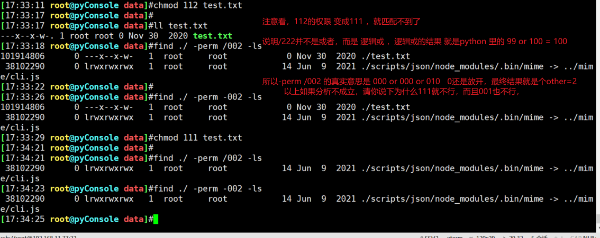

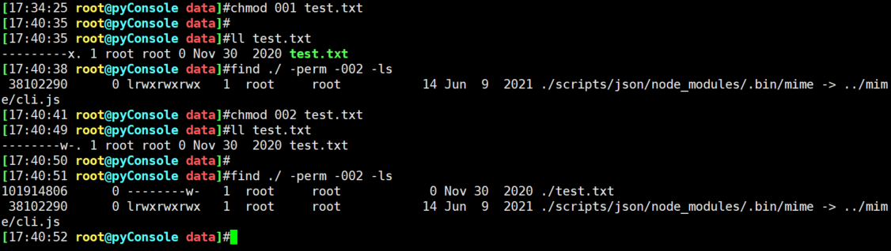

### 总结下

当/XXX都不为0的时候好理解：就是xx or xx or xx或者的关系，比如/222就是只要三者一个有写

当/XXX为101 001 010 反正只要有0出现，就意味着0不看，比如/202就是u和o两个中的有一人有写

注意/333表示u,g,o三者一人有写和执行？请看下例👇  ★是拆成二进制然后**bit位之间或**的关系

```
[18:06:26 root@pyConsole test]#find -perm /333  👈表示111111111都是或
.
./f1
./f2
./f3
./f4
./f5
[18:06:32 root@pyConsole test]#find -perm /303  👈表示011nulnulnul011都是或，不看g，只看u和o
.
./f1
./f2
./f3
./f5
[18:06:34 root@pyConsole test]#ll
total 0
---x--x-w- 1 root root 0 Feb  9 17:45 f1
-rw-rw--w- 1 root root 0 Feb  9 17:45 f2
-r--r---wx 1 root root 0 Feb  9 17:48 f3
------x--- 1 root root 0 Feb  9 17:56 f4
---x------ 1 root root 0 Feb  9 17:59 f5
[18:06:35 root@pyConsole test]#

```

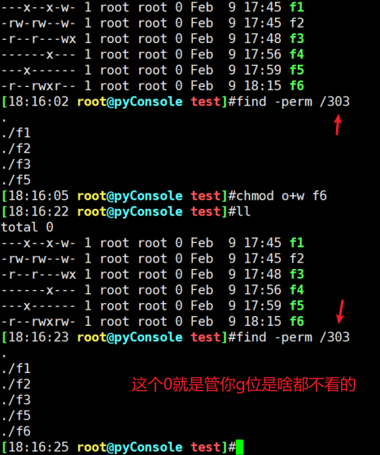 

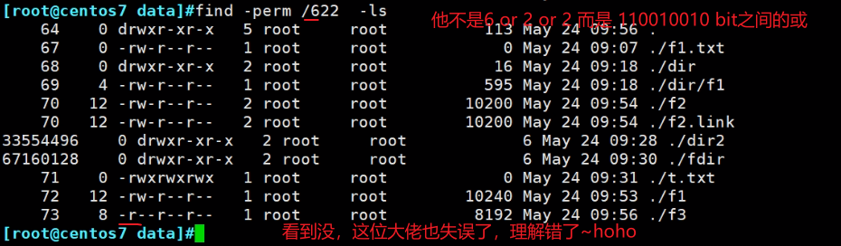

----------------------上面这段其实是后写的，下面的是梳理过程中的截图，保留供参考---上面的结论OK的----------

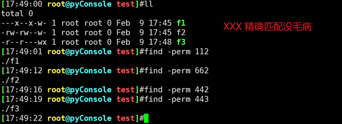

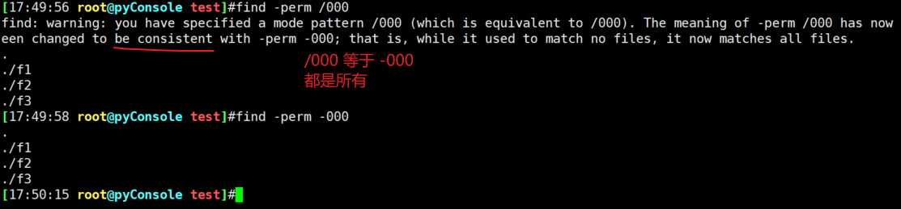

```
[18:00:21 root@pyConsole test]#ll 
total 0
---x--x-w- 1 root root 0 Feb  9 17:45 f1
-rw-rw--w- 1 root root 0 Feb  9 17:45 f2
-r--r---wx 1 root root 0 Feb  9 17:48 f3
------x--- 1 root root 0 Feb  9 17:56 f4
---x------ 1 root root 0 Feb  9 17:59 f5
[18:00:22 root@pyConsole test]#find -perm /100
.
./f1
./f5
[18:00:25 root@pyConsole test]#find -perm -100
.
./f1
./f5
[18:00:27 root@pyConsole test]#find -perm /101
.
./f1
./f3
./f5
[18:00:29 root@pyConsole test]#find -perm /111
.
./f1
./f3
./f4
./f5
[18:00:31 root@pyConsole test]#

```

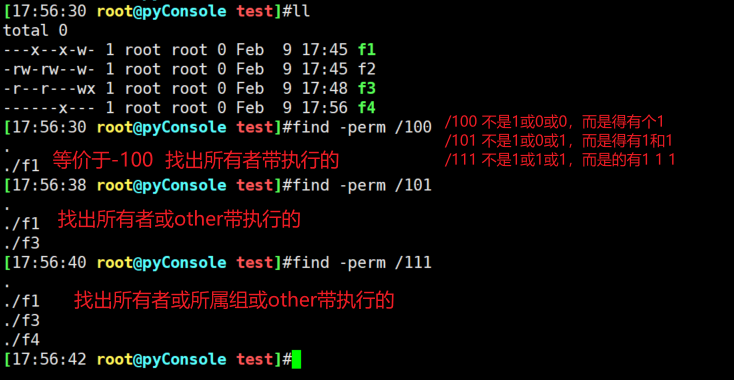


### 分析 find -perm /622 的意思👇


上图错了，/622，不是必须6，而是110里面有一个就行了


哈哈，上图是最最开始的笔记，那会我就发现啦，哈哈，给自己点个赞👍。不过没有这一次梳理的完整。

-------------------------------------------------------------------------------------------------------------------------------------------------------

### 所以回到一开始的PPT

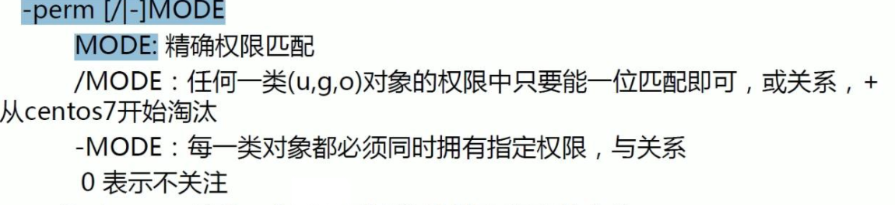 

①  xxx就是精确匹配，000就是u,g,r三者权限都是---的文件，精确匹配不存在什么或，不存在0表示不关注的说法；倒是存在bit位的并且哦，哈哈~

②  然后接下来：

2.1     /表示或，人家说了一位就是bit位，看到没，哈哈

2.2     0表示不关注，这个0说的是/303，里的这个0是十位数的0，哈哈(<font color=red>不对，这个0依然是二进制的0</font>)，好家伙，PPT果然言简意赅，结果大佬就讲错了。

2.3     **同样-xxx  人家也说了0表示不关注，然后是bit位之间的且。**

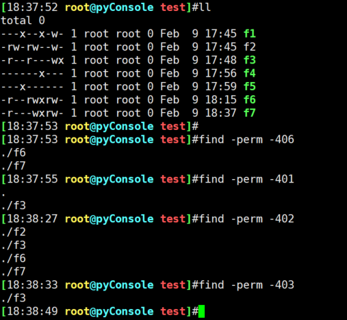

2.5      **一句话总结：/ 和 - 都是展开bit二进制后，0不关注，然后/就是或，-就是与。**

③  我牛逼的地方来了哦，以上总结OK了到位了，问题来了，如果我要find 权限是rw?---rw?也就是707,606,607,706的文件捏，哦你要输入 find -perm -606  没办法了吧，哈哈，还不如这样

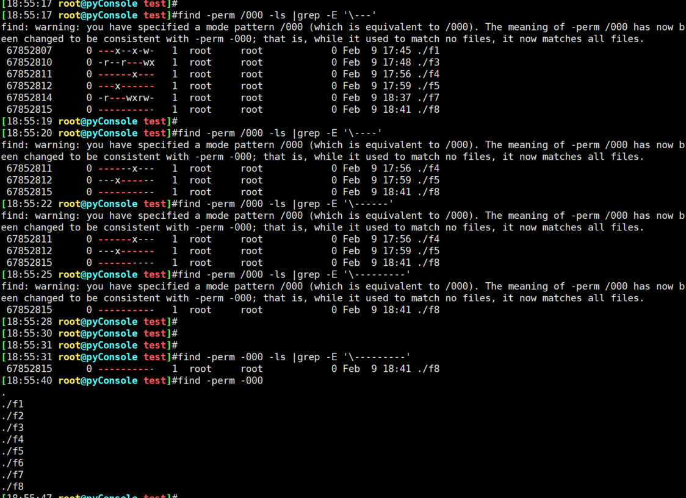


 

## find 后的处理


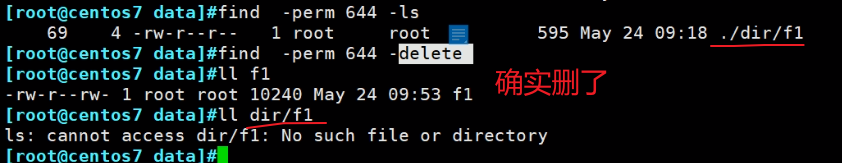 

👆上面的用法很危险。

### 重定向的>等于-fls


###  -ok 的交互


但是是交互式的。

### -exec的非交互


 

### 案例，日志处理


找到大于10M的，移动到tmp/下。


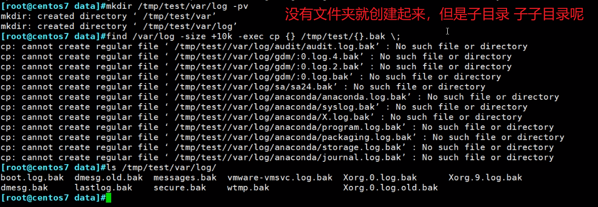

还是不行，因为还有子文件夹，//没关系的，不影响效果。


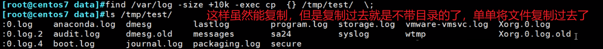

👆上图存在同名冲突的问题的。那样怎么做呢？遗留问题用⚪这个吧哈哈。

文章标识有▲、⚪、了★预留。⚪是微软输入法yuan第5个。


 


 

 
