# 第3节. 文件打包和解包


## 传统公司还有用磁带保存数据的tap

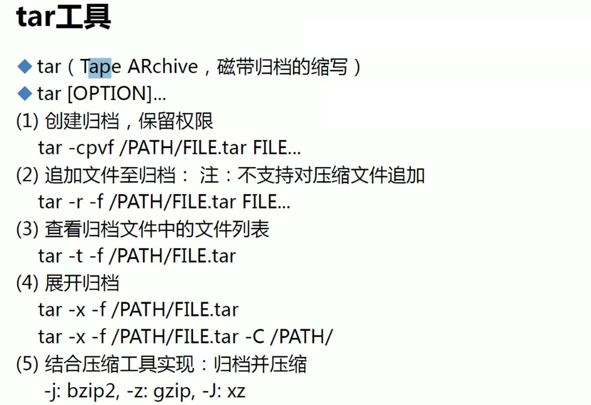

```
-cpvf

这个只是打包，没有压缩

c就是创建

v详情显示

f指定创建的文件名

p是保留权限，但是保留不住acl

 		(联想到cp -p，不过tar的-p保留不住facl)

之前讲过备份acl的方法，，，恩，cp也能备份facl的--“第5节. FACL实现权限的灵活控制--文末”。
```

 

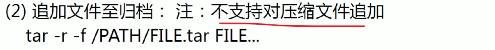

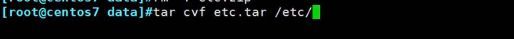

### tar -cvf 的-可有可无，bsd unix风格

### 打包不会压缩什么的

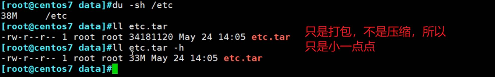

### t是预览

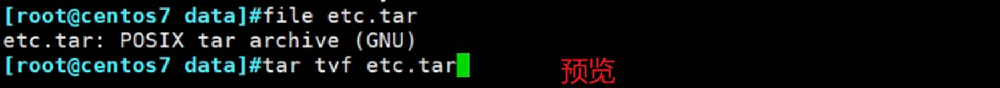

### x是解包

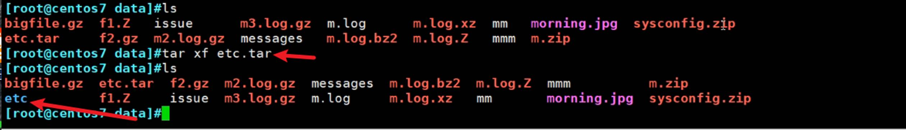

### 也可以解压到指定文件夹


###  r是追加

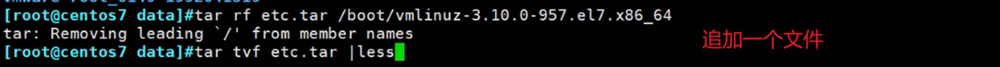

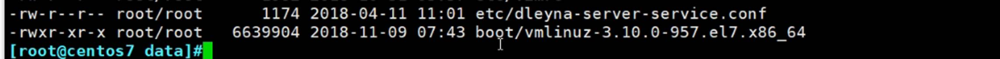

 

##  打包且压缩

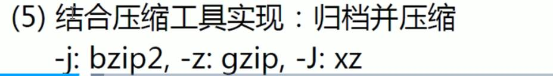

传统打包压缩

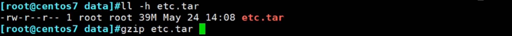


也可以合并起来


 

##  解压和解包


###  压缩格式是自动识别，J不用加

 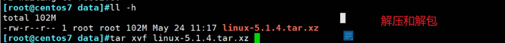

 102M ---解开后大小--->930M

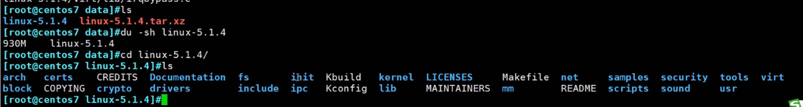

 

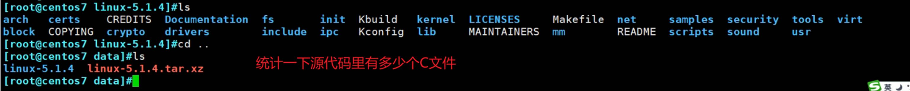

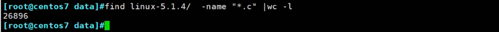

查看C代码一共多少行

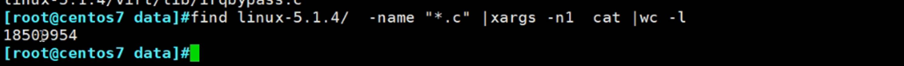

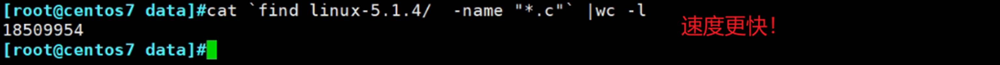

 

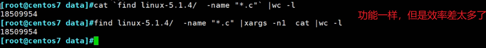

到底花了多久呢

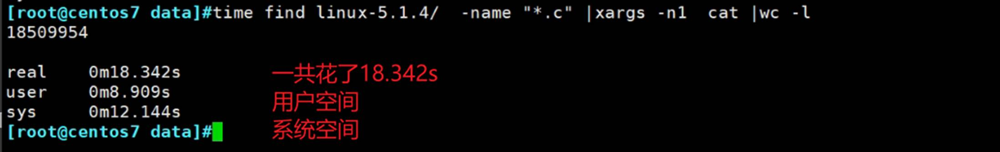

如此大的差距啊

sys不是系统空间是内核空间。

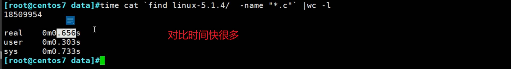

 一些常见后缀比如tgz


**.****tar.gz** 就等于 **.tgz**

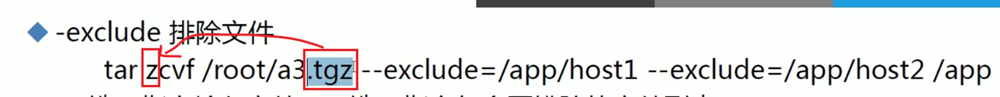

## 排除以及filelist

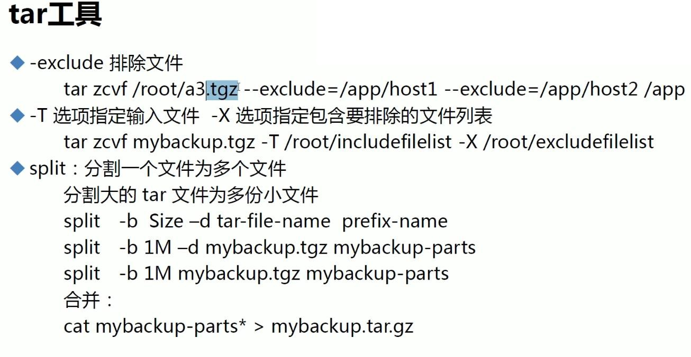

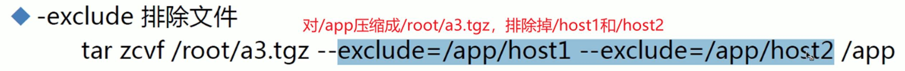

 


要打包的文件名统一放到一个文件里，↑

##  split切割文件

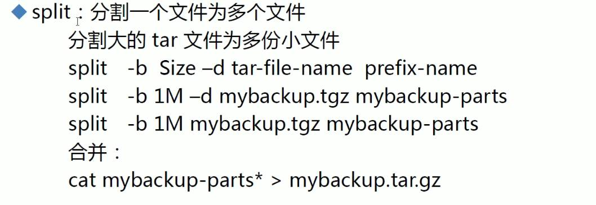

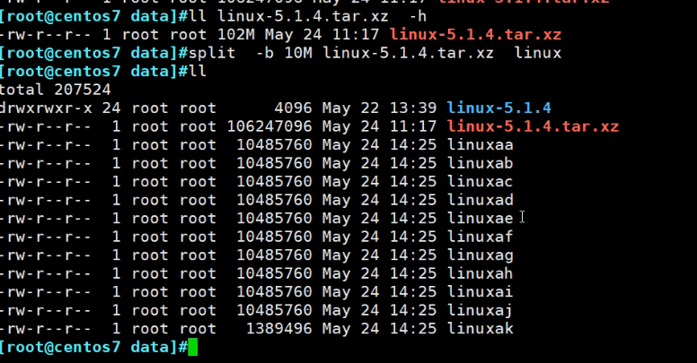

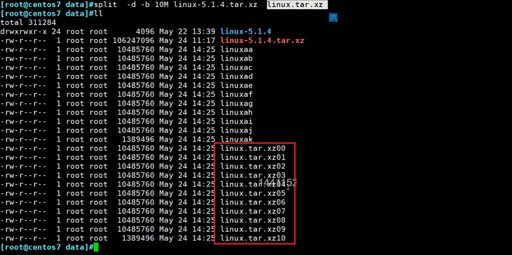

### 合并的方法

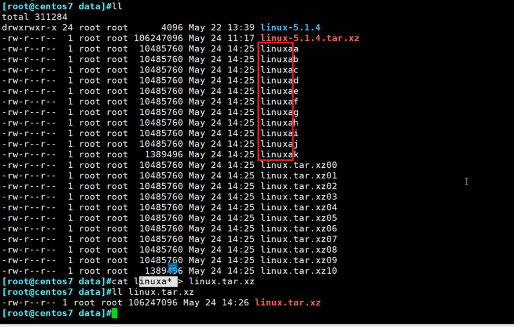

 

##  cpio不常用，老文件可能采用该格式

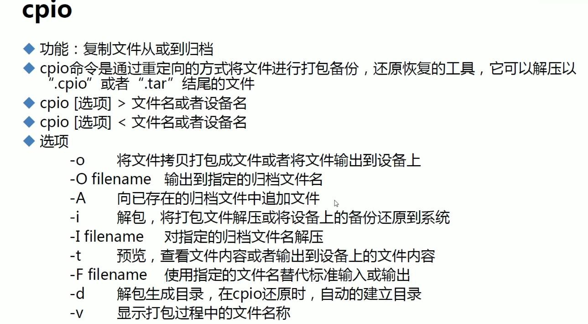

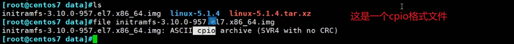

cpio也是个打包的，类似tar


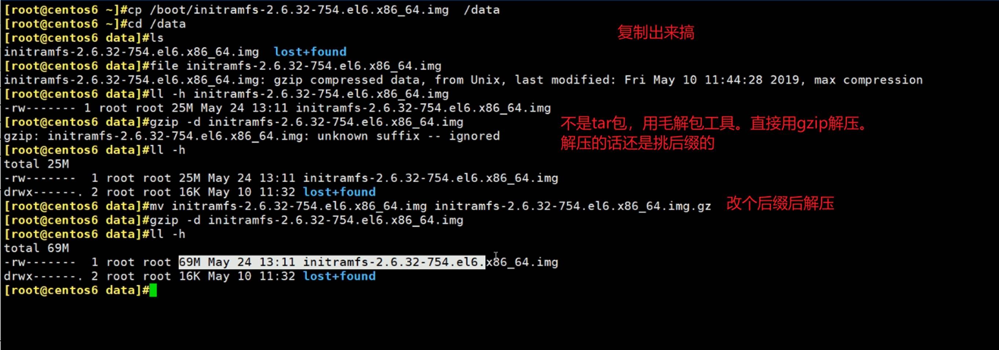

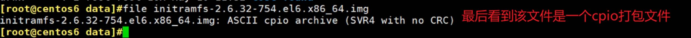


预览可见，这其实就是一个小linux系统-虚拟的小文件系统。

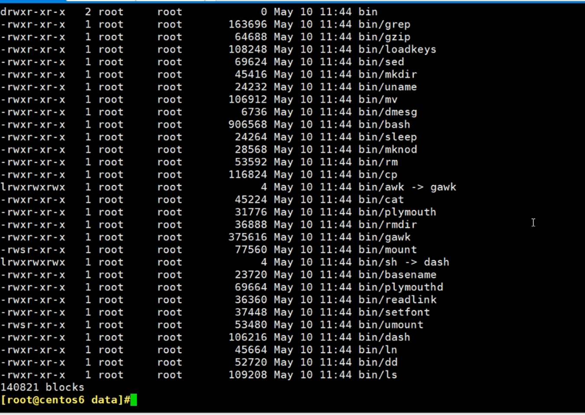

 


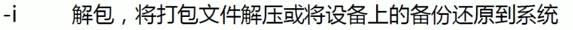


i就是解包，d就是自动创建文件夹，解开后就是一个完整的操作系统

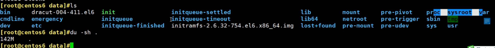


 

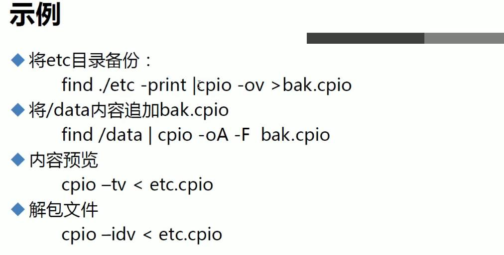

 


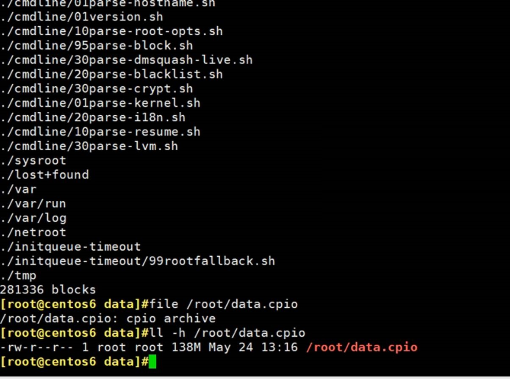


 

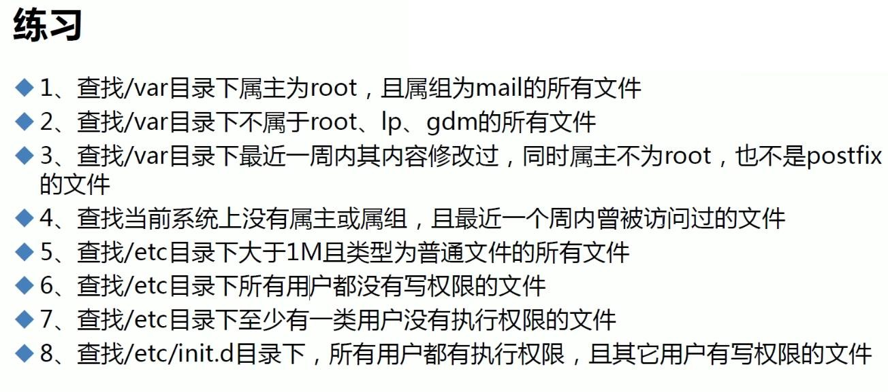

 


 

 

 
