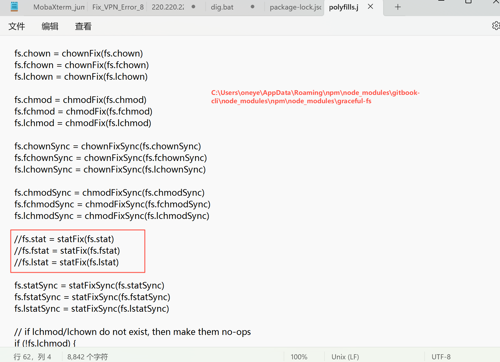

# Introduction


## 概述


**文章涉及内容**：本文是我学习linux的笔记和梳理，还有工作中的案例分析。

**本文编写宗旨**：会使用大量举例截图和详尽的过程演示，所以复习起来效果会更好。

**QQ群交流**：977072959


## 项目维护备忘


### 目录生成的方法：

* 打开pycharm里的windows/summary/list/directory_generate.py，运行
* 将运行结果去头掐尾后，复制到nodepad过滤一遍格式，然后再复制到SUMMARY.md中即可。
* 然后再gitbook init初始化目录结构。


### github 创建项目：

**…or create a new repository on the command line**

```
git init
git add README.md
git commit -m "first commit"
git branch -M main
git remote add origin https://github.com/oneyearice/oneyearice.github.io.git
git push -u origin main
```

**…or push an existing repository from the command line**

```
git remote add origin https://github.com/oneyearice/oneyearice.github.io.git
git branch -M main
git push -u origin main
```

**…or import code from another repository**

You can initialize this repository with code from a Subversion, Mercurial, or TFS project.


### 多终端pull和push注意点：

```
1、首先pull下来，得到最新的版本，如果是第一次git clone即可
2、复制oneyearice.github.io并重命名为gitbook；如果是git clone的就复制文件夹里的内容到gitbook下，选择替换原文件，得到最新的版本。  注意gitbook是本地编辑目录，oneyearice.gitbhu.io是pull和push目录
3、进入gitbook下运行gitbook install安装插件
3、在gitbook里编辑md文件，也就是主要工作内容
4、运行脚本自动上传
```

```
1、进入D盘
git clone https://github.com/oneyearice/oneyearice.github.io.git
如果有Oneyearice.github.io文件夹，进去后git pull

2、将oneyearice.github.io文件夹复制，并改名为gitbook

3、进入gitbook，删除node_module文件夹，cmd在gitbook文件夹下运行gitbook install
---开始编写md文章---完了就👇---
4、我的笔记本电脑需要注释掉book.json里的"-anchor-navigation-ex"👈这样注释，运行脚本自动push--如果push失败，看报错，一般就是需要先git pull一下然后再运行脚本，因为可能最近的一次push是别的终端push的。这是合理的机制。
```

若优化，pull就上面的1 2 3，push就是4


```shell
使用nvm来管理nodejs两个版本
1、我要用gitbook，所以要用nodejs v12
2、我要用ES6 Module 好像nodejs v12 也行的。。。哈哈
```


玩gitbook要注意两个点一个就是js的修改

C:\Users\oneye\AppData\Roaming\npm\node_modules\gitbook-cli\node_modules\npm\node_modules\graceful-fs



还有一个就是nodes 的版本要低的，所以采用nvm来管理。


参考

https://www.cnblogs.com/eternalnight/p/15192585.html

https://www.cnblogs.com/hacv/p/14311409.html

