# 第2节 Docker组成和容器运行规范

# docker组成

1、Docker主机**host**，就是宿主，宿主可以是物理机也可以是虚拟机。你是node节点哦

2、docker是C/S结构的，所以还需要一个Docker 服务端 **server**：就是一个守护进程。

docker属于容器技术类里的一种，docker自己的工作机制就是C/S，而其他容器的工作机制可能就没有什么客户端服务端的情况。

3、docker是C/S架构，就需要**client**使用cli去调用docker API，docker api就是cli咯，这个就好比mysql-client去操作mysql-server一样的。就是Docker-client通过cli连接docker-server，连接上去再通过docker-server管理容器资源。我们操作docker命令cli的时候其实就是这么一个通过docker-server去连接执行的过程。

4、docker除了上面的c/s和API外还引入了模板思想。这就是Docker 镜像 **images**

模板：镜像，表现形式就是 文件 ；       静态文件 	  不运行知识占用一定的磁盘空间而已。

容器：镜像副本，实例，表现为 进程 多实例。    	  运行了就会还会占用内存空间了。占不占磁盘空间呢，占！因为容器运行起来，基于同一个镜像创建的多个容器的话，那么这些容器各有各的log，可能配置文件也不同，所以磁盘空间也是占用的。

5、docker容器**container**就是从镜像复制出来的一份运行起来而已。镜像复制很多份(你创建容器的时候就会复制的)，每一份就是一个容器。

6、docker镜像放哪呢，放在仓库里Docker 仓库 **registry**，方便重复使用。类似yum仓库。harbor是私有内部仓库。

容器的生命周期很短，生产中平均下来也就是1 2天，这个说法对吗？肯定不对啊，我docker跑gitlab，你觉的会是1 2天，1 2年还差不多。

容器的IP不想虚拟机是固定的，所以需要一个服务**注册**，自动**发现**的机制，可以实现如何访问容器。不然容器的IP老变，我怎么找你呢   # NFS那里也有注册和发现的机制。

因为你要追求容器的灵活性动态性，所以一整套的方案就要考虑清楚。

​		在企业里一般先搭建一个registry，里面事先把需要生成中用到的各种镜像全都放里面，当然这是一个持续的过程，事先不一定的哈哈。

​		这些镜像比如有nginx官方做的，ubuntu官方、mysql官方做的各个自家的镜像。都传到互联网公共仓库上了。但官方镜像不一定满足你的需求，可能还需要自己定制。

​		读图，client运行命令，就会连接docker守护进程，docker守护进程收到这个cli后帮你去执行这个操作，一般docker守护进程也client运行的机器都是一台了。

​		docker pull就是从仓库拉取镜像，这里也会涉及本地docker私有仓库以及做代理的事项；

​		docker run就是在pull拉下来镜像了基础上，将其run起来，表现为容器。自然可以基于同一个镜像run出来多个容器。镜像就是静态文件，而容器就是进程了。

​		docker build就是自己只做镜像，自然就会在本地磁盘上表现为文件咯，然后再执行docker push将自定义的镜像推到仓库里去，便于共用。

​		以前我们启服务都是sytemctl start xx了，现在都是docker run咯。不需要再去写什么systemctl的service文件了。

# 容器怎么隔离的-namespace

namespace是内核里的一个特性，自然也是靠内核层实现的。

有很多namespace，不同的namespace隔离不同的资源，比如网络的namespace，PID的namespace等。

MNT Namespace(mount)  不同容器的根/其实是隔离的

IPC Namespace(inter-process communication) 共享内存，消息队列都是隔离的

UTSNamespace(Unix Timesharing System) 主机名和域名的隔离

PID Namespace(process identification) 进程编号隔离，大家都是1号进程，但是互不干扰就是隔离。整个进程树的隔离

Net Namespace(network)  典型代表就是ip地址可以一样的，正因为隔离了才能一样哦

User Namespace(user) 用户账号的隔离，就是这个容器上的root和root组和那个容器上的root和root组不搭嘎。

以上就是利用了内核里的namespace隔离机制实现了类似虚拟机的隔离，只不过虚拟机的隔离是OS级别的，而容器时内核级别的。所以比如一台物理机作为宿主，就直接用linux内核namespace实现了隔离，而不是再在其上安装虚拟机了。

namespace时linux的内核，windows里有吗？有也不一样啊，容器又是如何实现的linux的容器在windows也能跑的呢？

windows上跑容器，其实时先安装了一个linux内核的，所以才能通用。

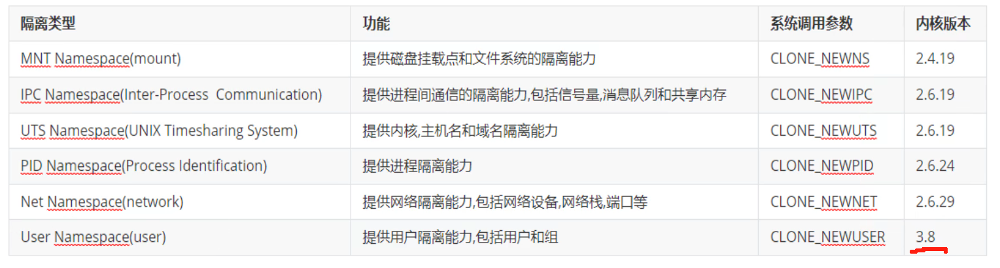

这些namespace也不是一下子一起出现的，有些时后期开发的，比如linux内核3.8才支持user namespace，不过现在内核都还挺高的。

​		容器依赖的用户空间--UserNamespace必须是linux内核3.8才支持的，所以3.8以下的内核就无法跑容器，centos6是2.6的内核不支持是容器的，但是可以升级内核来跑容器。

​		用ubuntu的好处就是内核升级快，一些容器的新特性就用起来，其实不仅仅是容器，很多基于高版本内核的特性都是如此。

既然内核的namespace是容器之前就存在的，那么其管理工具也是自然有的

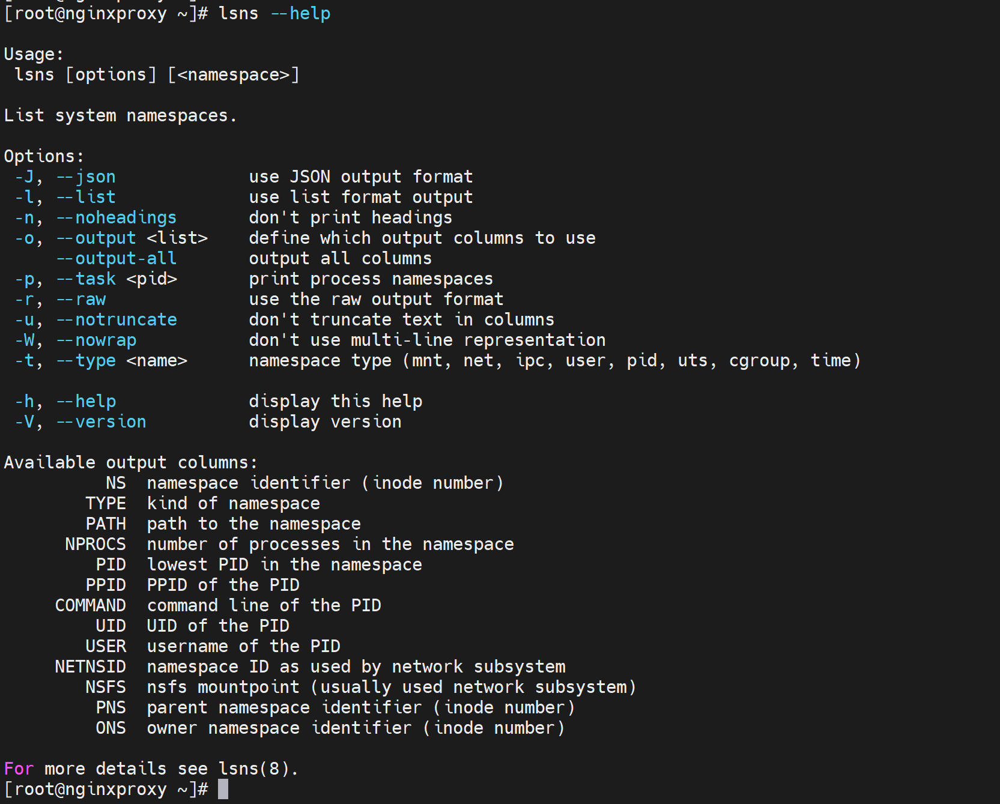

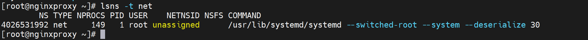

ns enter是进入到namespace里👇

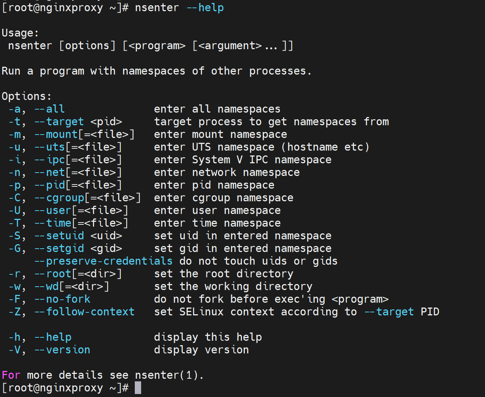

如图👇只是654的PID进程，里面可以看到是划分了多个namespace的。

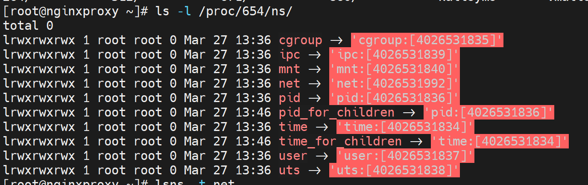

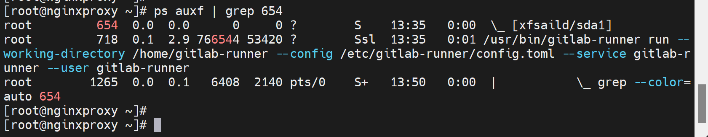

同样pid为1的进程

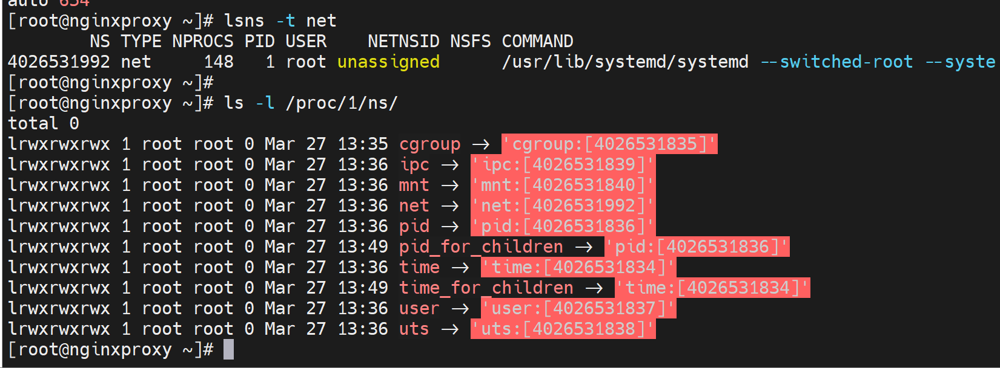

普遍发现多了以下namespace，比如time 、time_for_children、pid_for_children、cgroup这些上面都没提到，说明是一些的内核namespace了。

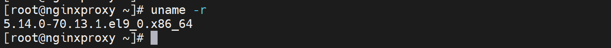

这些新增的namespace可能是较新的技术的依赖，不一定是必须的可能。

下图👇-n是进入了654 PID进程里的network namespace里了。

上图还不是演示的很好，应该用docker来演示，就能看到进入到每个容器里的ip地址都是不一样的。

# 除了隔离还要限制资源的使用-Cgroup

一个宿主上的若干个容器资源的使用肯定要分配好的，否则容易出现争抢的情况。所以这就需要资源的分配和限制。

Control group就是内核中的另一个重要技术，联系，上面讲了内核里的一个技术namepsace

上面的截图里其实已经看看到了cgroup了，就是干这事的。

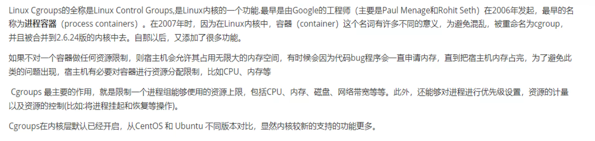

通过过滤内核文件就可以知道确实是集成了CGROUP的。

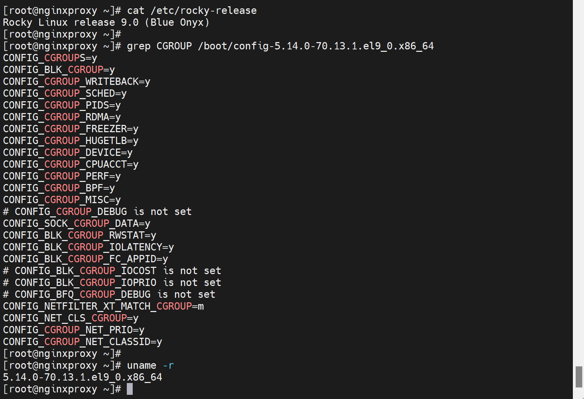

 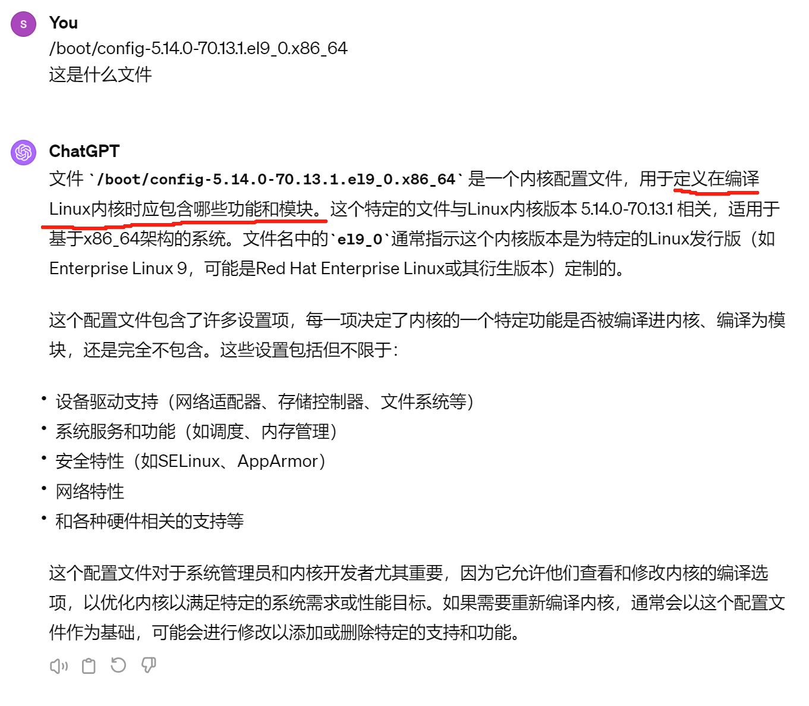

总之一句话：docker运行之所以能够做到  "隔离" + "限制"  就是依靠内核的namespace和cgroup两技术来实现运行空间的隔离和资源使用的分配和限制。

### **docker里的namespace和k8s的namespace不是一回事**

还有一个 docker的namespace其实就是linux内核的namespace，内核什么版本里有什么名称空间，可能高版本的内核会多几个，但关键的就是上文所讲的那几个。

而k8s的namespace是用户空间里的东西，是用户人为创建自定义的，今天创建明天删除都是可以操作的。

# 容器管理工具-目前就是docker为主

docker提供了完整的管理工具集

一般就是先制作镜像(把业务的各种服务做成镜像)，然后这些镜像复制出来到该落在的地方，然后跑起来自然就变成了容器。

​		镜像里存放的东西就是👇App B和Bins/Libs 依赖的这些环境包括：配置文件、库等。

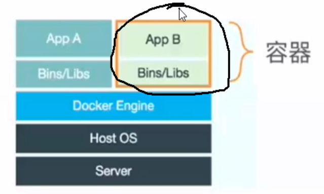

👇下图理解注意下，严谨点不要理解错了：容器是利用了OS本身的内核，所以下图不是容器的分层，容器里是没有内核的，容器是用的宿主机的内核。kernel层画在这里也是表示一个完整的操作整体示意一下的。

容器是有标准规范的，容器以及生成容器的镜像 ，是表现为一些文件，而这些文件是有格式的，是由国际规范的，简称由国际范的~

只要遵守 镜像 的国际标准，容器的国际标准，理论上用什么容器工具都而已，不仅仅是docker

### **阿里巴巴的pouch**

https://github.com/AliyunContainerService/pouch

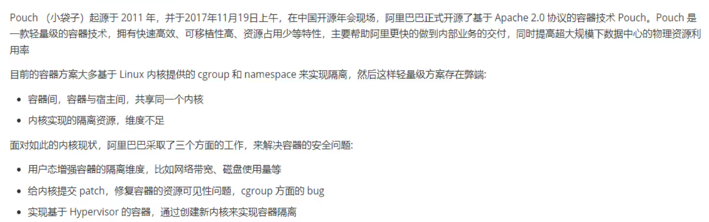

### 红帽的Podman

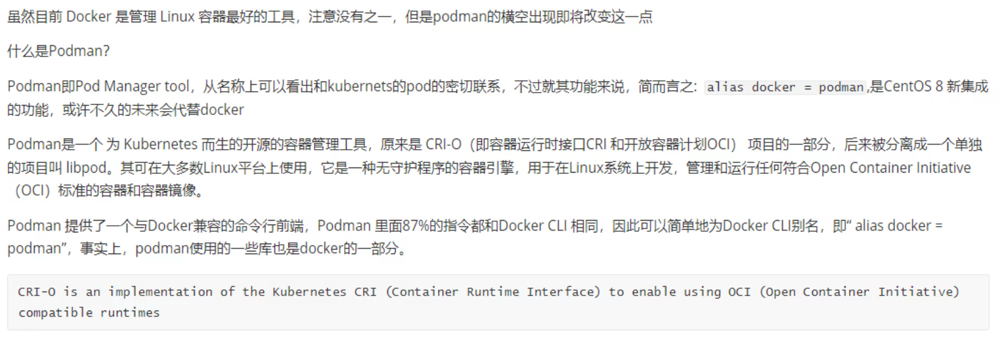

官网地址：https://podman.io/

项目地址：https://github.com/containers/podman

docker 命令和 podman 命令 的操作是无缝迁移的，就是一样的。不过podman是没有C/S结构的。

但是我发现github里podman的版本更新明显要勤快的多的多，

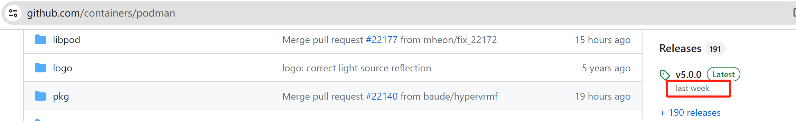

​	

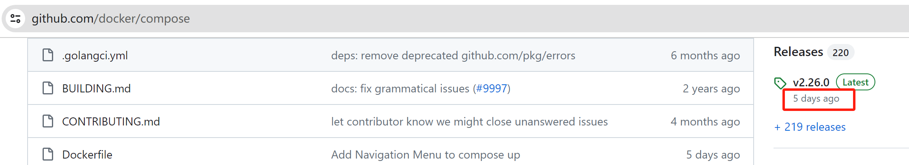

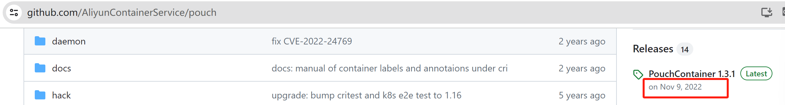

将来会遇到的问题，容器里的网络排错，连ping都没有，该如何排错呢，以此为例的意思大概就是；容器本质上会极其精简的(除非你自己构建的时候把这些检测工具打进去)，在这个精简的容器里很多常规VM里的操作都是无法进行的，于是排错检查的很多常规手段就失效了。不过ping命令总归要打进去吧，还有ss，ps 都可以打进去的。

### 规范的事情

docker毕竟是一家公司，如果该公司GG，那么容器管理工具是否就缺失了很重要的一个工具了。

所以OCI指定了规范runtime spec和image format spec只要满足规范，就能够保证容器的可用性(移植性、相互可操作性)。  也许吧

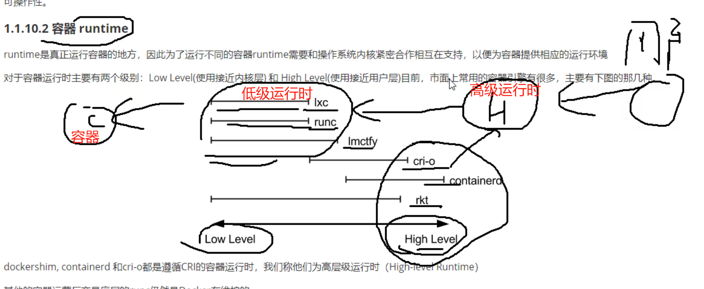

用户都是和高级运行时打交道，然后通过高级运行时去调用低级运行时里面的环境，最终来运行容器。

用户一般就关心高级的，底层的不关心。

目前来说低级运行时，主流的就是runc，docker和其他的都是用的runc(运行时)

runc其实是个应用程序，通过runc代码程序来运行容器并管理起来。

runc也是docker公司开发的，后来开源了，大家都在用。

containerd也是docker公司开发的，后来跑到社区里了，

K8S从1.24开始抛弃docker，其实是不绕走docker引擎调用containerd了，而是直接调用containerd。

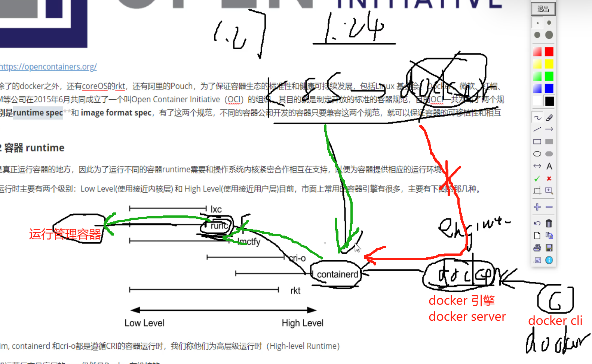

docker 命令去连接docker引擎然后调用containerd，再经过垫片的解耦，调用runc，最终运行容器。

shim的作用好比垫片，解耦了containerd和runc，将来这两个开发是独立的项目，各开发各的，只要能对接shim垫片就行了(就是都遵守shim垫片的api接口)，好比螺丝螺栓之间的垫片。

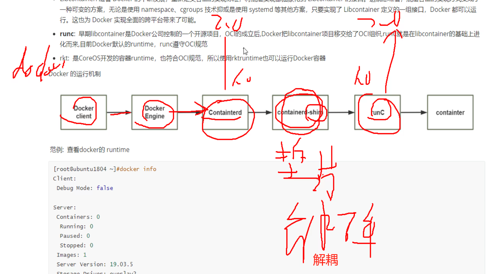

上面一段文字其实就很不错，就是一些开发思路，不过也会增加工作量。应该是随着项目增大才需要这种垫片的存在。

​		安装docker的时候，上图的一套都装上了。

docker info查看可见默认运行时是runc，实际的runtimes是io.containerd.runc.v2

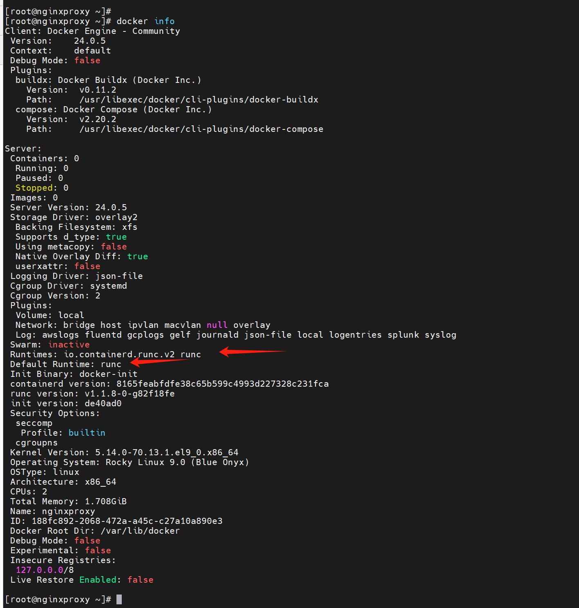

据说有些公司就是作，docker不用非要用其他的工具👇，不过K8S里不是有个什么工具嘛，不用docker这个cli不是正常的嘛

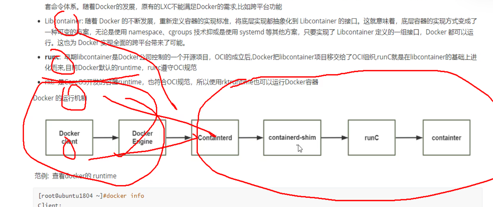

什么意思呢，就是说只安装containerd后面的这些，前面的管理工具也就是cli这方面用其他的。

# 镜像仓库

1、官方的需要本地作缓存代理，也就是nexus之类的统一管理私有仓库，或者verdaccio这种NPM代理缓存库也OK

2、国内的镜像站点，比如阿里的仓库

3、Harbor：vmware提供的自带web界面，自带认证功能的镜像私有仓库，很多公司在用。

4、image registry：docker官方提供的私有仓库部署工具，无web界面，目前用的少。

# 容器编排工具

docker是单机的

举例，wordpress要跑在容器上，一般就是拆成多个容器：

1、nginx/apache ： 容器1

2、php ： 容器2

3、mysql ： 容器3

三个容器，启动，之间还有一定的依赖关系，apache依赖于php，php又要连数据库，所以启动的时候，1、先启动mysql，2、在启动php、3、再启动nginx/apache。

如果docker cli来实现，就是从上往下先后敲入👇

docker run mysql

docker run php

docker run nginx

于是就存在单机编排工具docker compose这是官方实现单机的容器的编排工具。该工具类似ansible

ansible的玩法是：简单的就ansible命令临时执行下，一些复杂任务就要写playbook了(ansible-playbook playbook.yml)剧本里都写好了谁先执行，谁后执行了。

docker cli    好比 ansible  cli

docker compose 好比 ansible-playbook xxx.yml

多个容器用docker-compose跑起来就简单些，而且单个容器用compose跑可能也是不错的选择，因为又类似配置文件的一个存在，不是依靠临时的cli去搞。compose可以理解成脚本化的docker cli。

不过单机上的编排也是不够的，要跨主机进行管理就需要跨主机的容器编排工具

docker swarm 这是官方的，也淘汰了，

Mesos+Marathon 也GG了

现在就是Kubernets google领导开发的，内部项目为Borg，且其同时支持docker和CoreOS，当前已成为容器编排工具事实上的标准。

