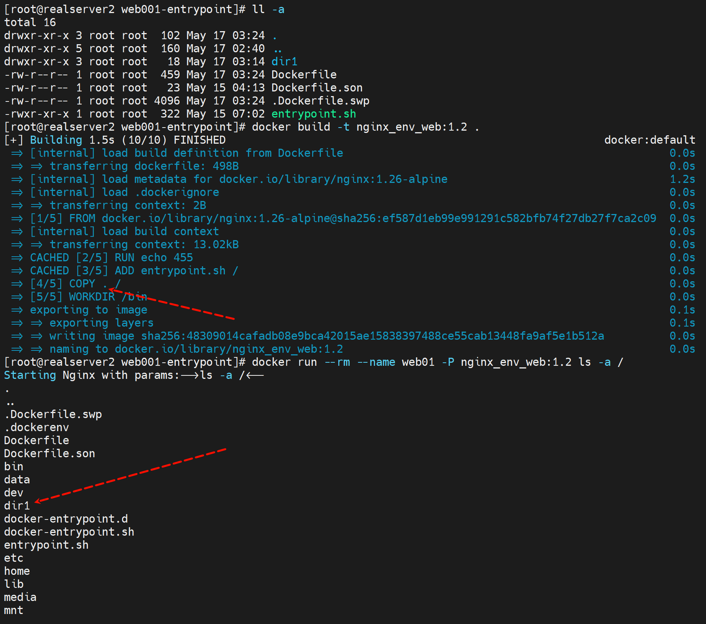
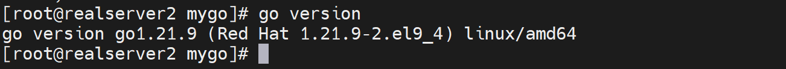
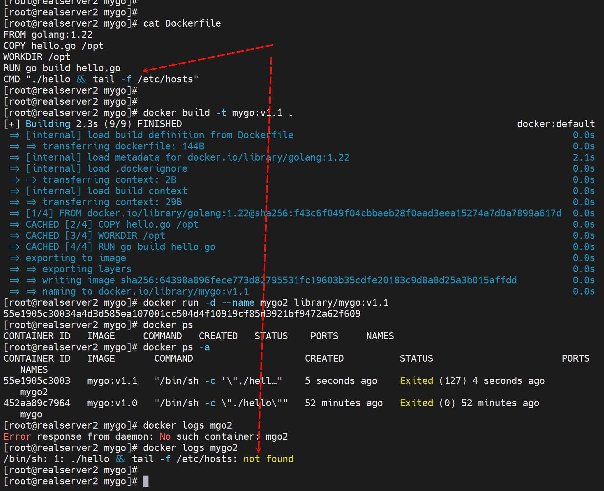
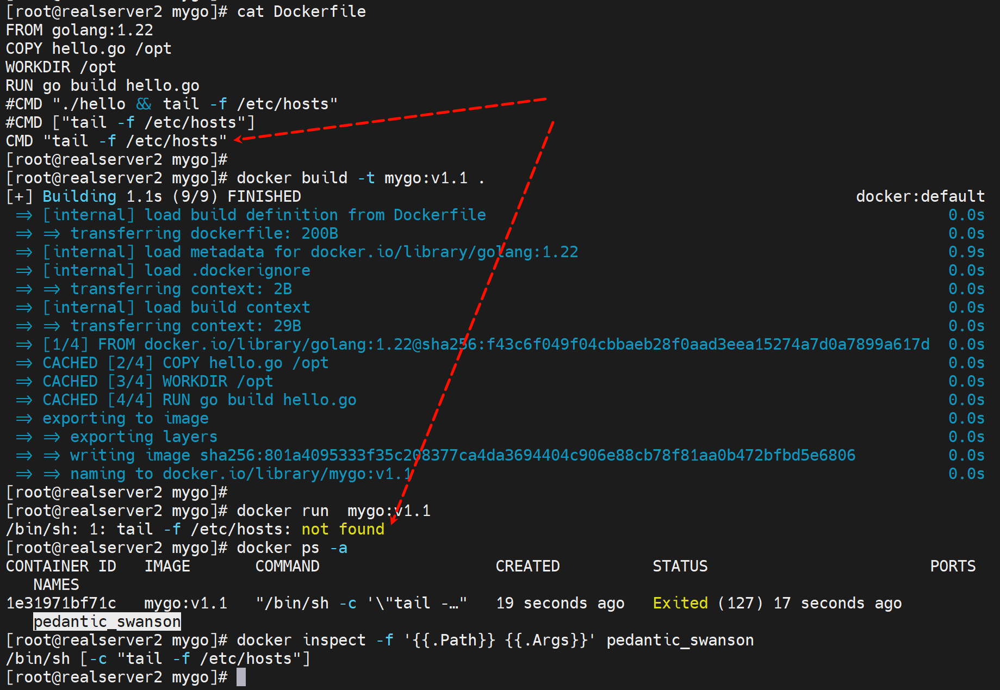
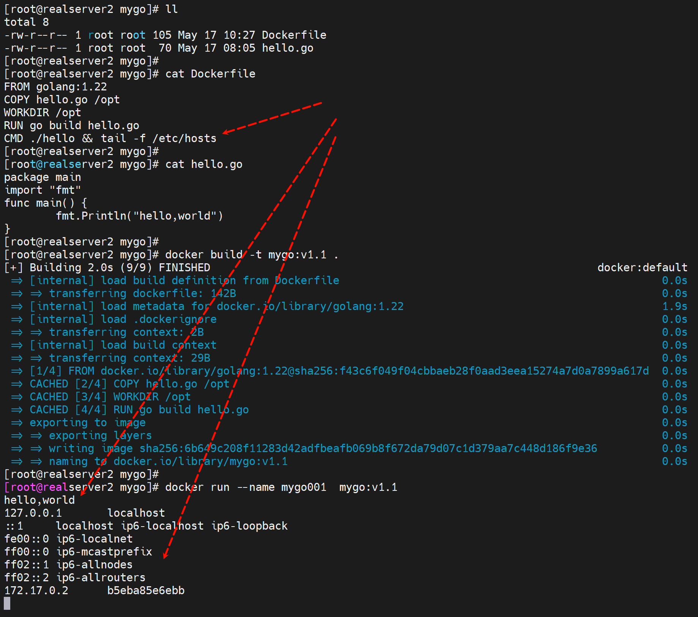

# 第5节 Docker镜像制作优化和多阶段构建


镜像精简，便于迁移，因为后面都是K8S上跑容器，这些容器是可能在不同的宿主机之间迁移的。


写Dockerfile的时候应该尽可能合并层，就是合并行。


但是很多命令都看不全，可以加个选项查看,但是效果依然不行


# 优化1：变化的写在后面

**Dockerfile里有变化的内容就是会频繁修改的，写到文件内容的后面**


**说明：**

1、如果在Dockerfile内容的前面新增一个指令，也就是之前没有build过的分层指令，那么下面所有的分层都会重新build，不会利用CACHE的

重复build，也不是说重复build


然后这些CACHED就利用不起来了，感觉下面所有的分层就统统重做了，也不会说之前有过就能利用的。


这里面很难讲，但是也是逻辑清晰的，就是分几种情况

1、在Dockerfile的前面，新增一条RUN echo 123，那么下面什么ADD WORKDIR COPY这些就要重新执行，利用不到之前的CACHED了。

2、在Dockerfile的前面，删除RUN echo 123，那么下面的ADD WORKDIR COPY可以利用CACHED

3、在Dockerfile的前面，重新写上RUN echo 123，那么下面的ADD WORKID COPY可以利用CACHED

4、在Dockerfile的前面，将RUN echo 123改成RUN echo 122，那么下面的ADD WORKDIR COPY重新执行，利用不了CACHED。


**所i有发生变化的内容，要写到Dockerfile的后面，否则就会导致build的时候很多之前的缓存无法利用。**


# 优化2：COPY太多和遗漏


**COPY * 和COPY .的区别**

1、隐藏文件不管是*还是.都会复制进去

2、COPY * 的时候，文件夹，外层会剥离掉，   # 无法理解的骚bug~

​		如果docker build目录里只有一个空dir1，那么就不会被COPY * / 复制进去；

​		如果是dir1/f1，那么COPY * /就只会复制f1进去；

​		如果dir1/f1,dir1/dir2/f2，那么就是COPY * /就会复制f1和dir2/f2到容器里的/里，说白了就是进去的*，而且是包含隐藏文件夹的。





### 针对COPY复制的文件太多了的问题

需要引入.dockerignore文件


# .dockerignore忽略文件


.dockerignore里写的就是忽略的文件名，a.conf就是忽略，而!b.conf就是排除掉 不忽略的意思，也就是脱裤子放屁，其实就是强调一下咯。所以a.conf和b.conf就会被复制进去。


# FROM补充


别名AS的作用，一般FROM写好就用一次就没了，就是build的时候，用别名无非是以后方便使用。


所以AS别名一定是有重复使用的场景，这个就是多阶段构建。


## 案例：多阶段构建

```shell
vim hello.go
package main
import "fmt"
func main() {
	fmt.Println("hello,world")
}

vim build.sh
#!/bin/sh
docker build -t go-hello:$1 .


---------
vim Dockerfile
FROM golang:1.xx-alpine
COPY hello.go /opt
WORKDIR /opt
RUN go build hello.go
CMD "./hello"

--------------
bash build.sh v1.0

docker run --name hello go-hello:v1.0
```


### 现在宿主机上编译一遍看看

1、准备go语言的代码，呵


2、编译的工具有：

​		go是golang

​		c是gcc

​		java是javac

我是RockyLinux，就yum -y install golang就行了



编译后运行


然后制作image

找一个golang基础镜像，去hub.docker.com找到：golang:1.22.3


### 写Dockerfile来创建go的项目

1、原材料准备


👆注意：上图CMD没有用列表形式来写，实际上就是有一个默认的/bin/sh -c 在里面，而./hello此时是go语言不是shell，所以应该是执行不了的。需要改写为CMD ["./hello"]这样就没有/bin/sh的干扰了。不过后面测试发现/bin/sh -c 也行的...


2、build


run


发现用的/bin/sh -c "./hello" 实际上是错误的cli，但是这种方式也可以，有点奇怪，为什么说它是错的，因为①理论上go就不能用/bin/sh去执行，②实际上下图所测就是不行


错误1




报错2


正确的


错误




错误


好像CMD里只能写一条CLI，多了就要用/bin/sh -c 'cli1;cli2;cl3'这种方式包装成一个来执行了。


ok了




ok了


ok了


## 多阶段构建正式开始-适合静态编译go

不适合java和python咯。


一个hello的go代码也就是1.9M，但是镜像就822MB大小，太夸张了。


所以如何进一步缩减镜像大小呢

```shell
FROM golang:1.22-alpine as builder
COPY hello.go /opt/
WORKDIR /opt/
RUN go build hello.go

FROM alpine:3.19.1
COPY --from=builder /opt/hello /opt/hello
CMD ["/opt/hello"]

```

首先go是静态编译的，编译完了以后，就不依赖go编译环境了。就是RUN go build hello.go的go环境其实用完就不需要了。


**所以就可以把基础镜像换一个更小的alpine或者busybox，加上之前编译的hello就可以运行了。**


build一下


此时image就从851M缩小到9.27MB了~~


run一下ok


**同样改成busybox来做二次构建**


然后ok了


busybox的镜像会比alpine再少3MB左右，其实说白了就是go是静态编译的，哪个image小就用哪个就行了。


所以go的优势还是比较明显的

1、并发的优势，写出来就是并发的；

2、docker构建的优势，可以二次构建改成小的基础镜像，大大节省空间。

3、java、python、c都不行，这些都有大量的依赖库共享的动态的。


**然后将上面的alpine或者busybox进一步优化，用scratch这个祖先镜像就是空镜像，因为go是静态编译，所有东西自带了**


一个hello world的go编译后


用scrapt打包后也就是1.89MB，相当给力👇


补充docker images 查看的SIZE单位是MB，如何看到KB的精确值呢，用inspect


为什么go程序能够在scratch空镜像上跑，其原因有2：、

1、**Go 是静态编译的**：Go 编译器默认会将所有依赖项静态链接到可执行文件中，这意味着生成的二进制文件包含了运行所需的所有库。这样做的好处是可以确保可执行文件在任何环境中都能运行，而不需要依赖系统上预安装的库。

2、**文件系统方面**：

2.1、**内核提供的文件系统支持**：

​		当容器启动时，它与宿主机的 Linux 内核共享同一个内核实例。Linux 内核本身提供了文件系统的支持，包括对文件操作、文件描述符管理等基本功能的支持。

​		容器的文件系统视图是通过 Linux 内核的 `chroot` 和 `mount` 等机制实现的，使得每个容器看起来像是有自己独立的文件系统。

2.2、**容器镜像层**：

​		虽然 `scratch` 镜像是一个空镜像，但容器在运行时仍然有一个最基本的文件系统布局。这些文件系统布局由 Docker 容器运行时环境提供。

​		当你使用 `COPY` 指令将文件从构建阶段复制到 `scratch` 镜像时，这些文件被放置在容器的文件系统中，容器运行时将这些文件系统布局合并起来，使它们在容器内部可见。

2.3、**构建阶段包含必要的文件**：

​		在你的 `Dockerfile` 中，你使用了 `COPY --from=builder /opt/hello /opt/hello` 将编译好的 Go 应用程序从构建阶段复制到最终的 `scratch` 镜像中。虽然 `scratch` 镜像本身是空的，但你复制进去的文件会成为容器文件系统的一部分。

​		因为 Go 应用程序是静态编译的，所以它不需要依赖额外的共享库或运行时环境，这使得它可以在 `scratch` 镜像中运行。

2.4、**简而言之**，`scratch` 镜像通过 Docker 提供的基础文件系统布局和内核支持，结合在构建阶段复制进去的必要文件，能够满足应用程序的文件系统需求。以下是简要的示意图：


### images如何查看当初FROM哪里的

docker inspect查看就行，不过要递归到最初的那个


docker history也行，不过同样从要找到最初的那个


### scratch打出来的镜像ls没有如何查看文件

因为连ls这个命令都没有，如何查看呢


现在看不到了👆，以前可以看


### 然后一些案例可以补充到这里


**1、基于Alpine的微服务Apollo配置中心**

https://github.com/apolloconfig/apollo?tab=readme-ov-file


git clone项目拉下来


编写Dockerfile

```shell
FROM openjdk:8-jre-alpine3.9
RUN \
	echo "http://mirrors.aliyun.com/alpine/v3.8/main" > /etc/apk/repositories && \
	echo "http://mirrors.aliyun.com/alpine/v3.8/community" >> /etc/apk/repositories && \
    apk update upgrade && \
    apk add --no-cache procps curl bash tzdata && \
 	ln -sf /usr/share/zoneinfo/Asia/Shanghai /etc/localtime && \
	echo "Asia/Shanghai" > /etc/timezone && \
 	mkdir -p /apollo-config-server
 
ADD apollo/ /apollo-config-server/       # apollo/.也行，apollo/*不行
ENV APOLLO_CONFIG_SERVICE_NAME="service-apollo-config-server.sre"
EXPOSE 8080
CMD ["/apollo-config-server/scripts/build.sh"]
```


**过程排错：1**


处理：

是宿主的句柄小于容器里的句柄了


这样就能跑下去了，时间比较长，明天继续

把宿主的ulimit的值改一下就继续run就行了，不过还得修改Dockerfile 安装openjdk8


