# 第5节 Docker私有仓库Harbor的部署和上传下载镜像


# 简述

官方的hub.docker.com的上传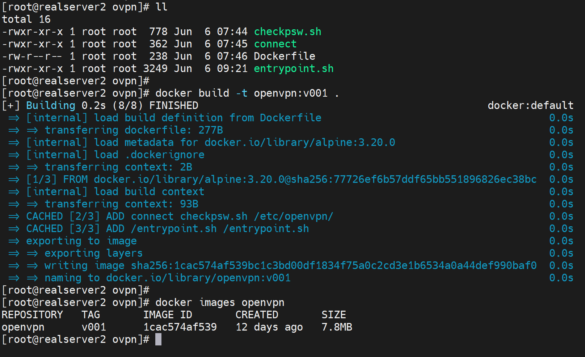

比如自己的一个image推上去

```shell
docker tag openvpn:v001 oneyearice/openvpn:v001  # 打标签就是hub.docker.com的账号/镜像+tag

```


1、注册账号


2、打标签，打的是仓库的ID和镜像信息，待会登入哪个仓库就用哪个仓库的ID。

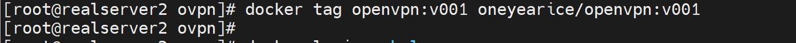


3、登入指定仓库，不指定就是官方hub.docker.com


密码本地是存起来了，而且是文明的👇，就是base64格式的而已，可以转

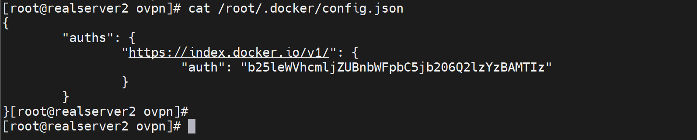

果然echo xxx |base64 -d就转回来了

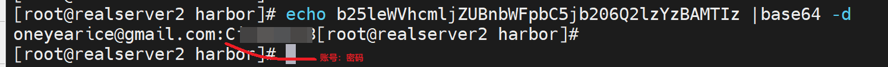


4、push

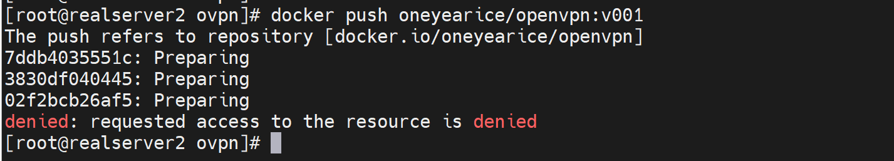

报错了，好像是两个账号冲突了，就是，oneyearice/这个路径，的用oneyearice这个账号来登入，结果上面用的是oneyearice@gmail.com登入的，这个账号的主目录是oneyeariceXXX是今天刚刚注册的，deactive这个账号就行了。


其实可以不必用hub.docker.com的账号密码，可以用专门的access token


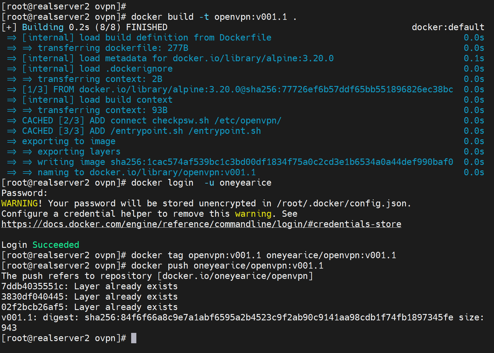


# Harbor

Vmware公司做的

https://goharbor.io/

https://goharbor.io/docs/2.11.0/

https://github.com/vmware/

https://github.com/vmware/harbor


组成：

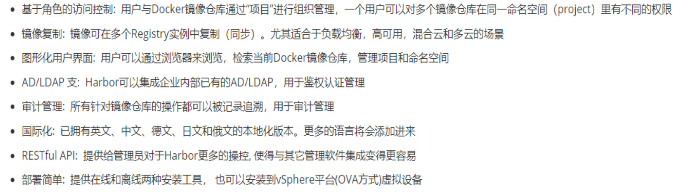


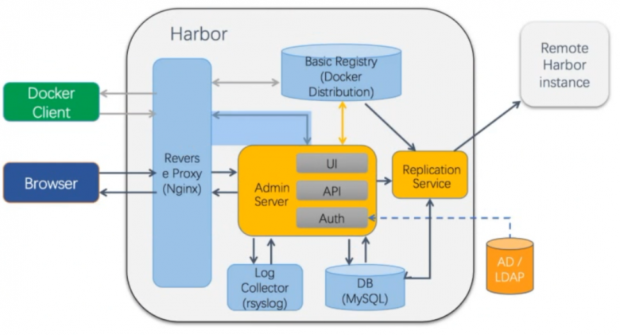


harbor是十几个容器组成的：

1、nginx：nginx做反代，这是一个容器；给后端各种服务提供反代

2、AdminServer：对应启动组件harbor-admin server，是系统的配置管理中心附带检查存储用量，ui和jobserver启动时需要加载adminserver配置。

3、UI：以UI为前端的core service：涉及UI、API、Auth，而Auth

4、API：

5、Auth：对接AD/LDAP

6、AD/LDAP

7、LogCollector

8、DB

9、ReplicationService

10、Basic Registry


官方提供了这些容器组件启动的配置文件，也就是docker-compolse的yml文件。

# 安装Harbor

1、安装docker

2、安装docker-comose

然后docker-compose又是依赖docker服务的，所以harbor的启动就需要docker+docker-compose

3、下载harbor离线包

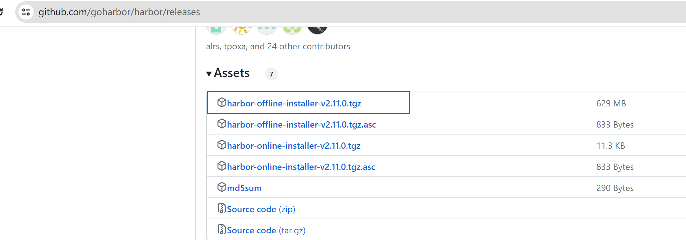


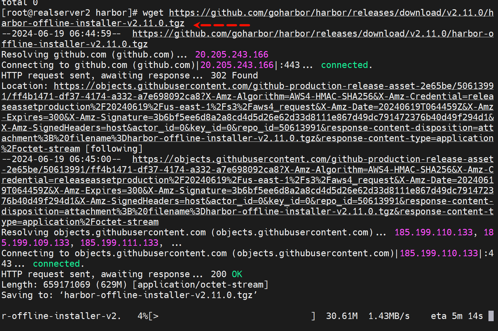


4、解压

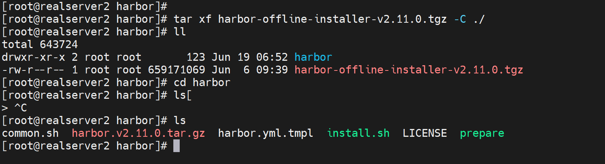

harbor内部所有功能组件都是用容器提供的，而容器的镜像都在harbor.v2.11.0.tar.gz这个包里了，这就是所有images的打包文件。相当于docker save

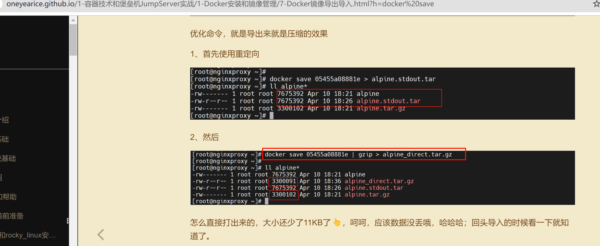

tar tvf预览一下，可见都是分层镜像文件👇

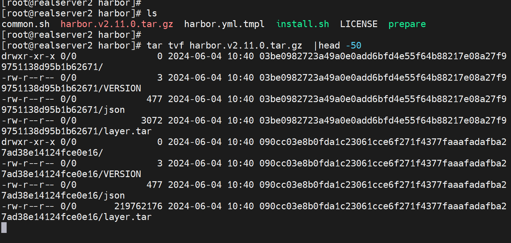

然后理论上就是docker load导出images，但是人家提供了脚本给你了👇，脚本里面就有docker load 命令


这个还不是docker-compose.yml文件哦，后缀名也要改成yml👇，这个文件是初始化文件，将来跑完install.sh后，会生成docker-comose.yml文件的。

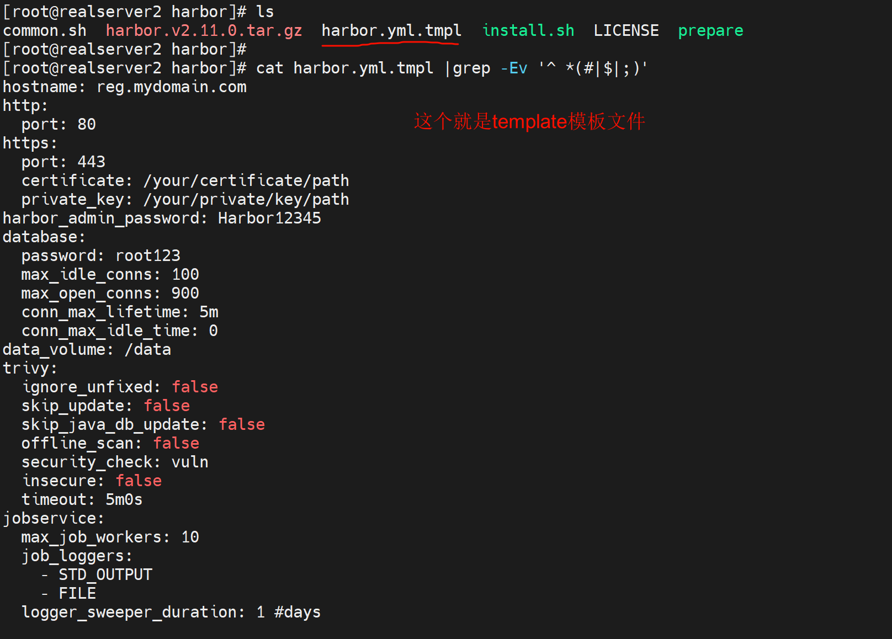


5、修改yml文件


修改部分内容👇

①harbor的访问域名或者IP

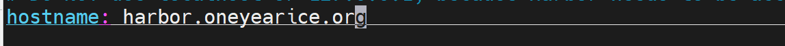

②ssl证书可以关掉，实验用无所谓

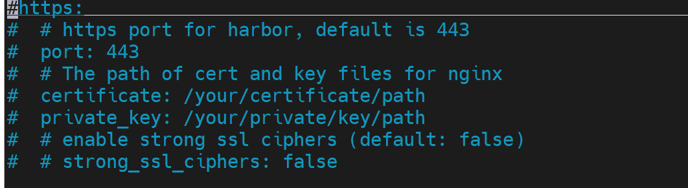

③默认的admin账号密码

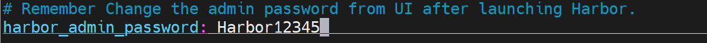

其他不用修改

metric是Prometheus监控用👇

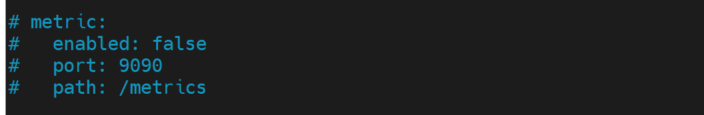


6、运行install.sh进行安装

早期需要安装python环境，现在python都是自带了，版本也不低。

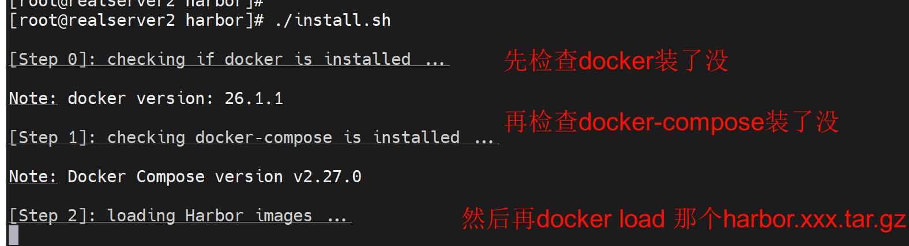

加载镜像👇

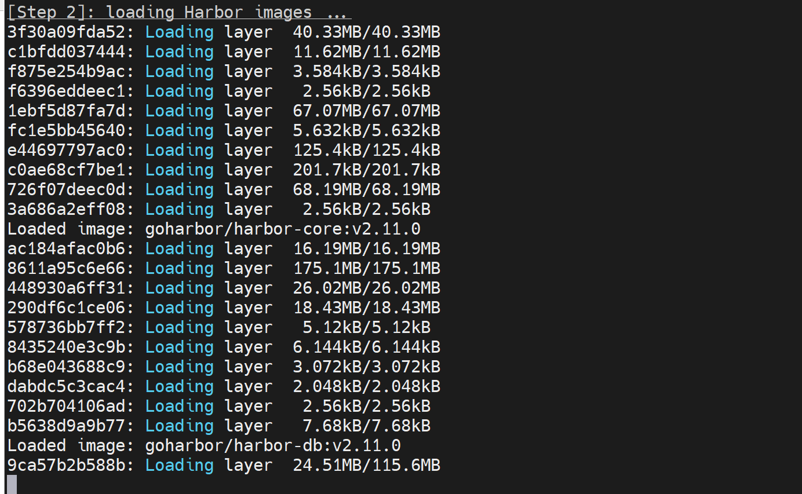

其后就会创建docker-compose.yml文件，然后就会使用docker-compose up -d啦👇

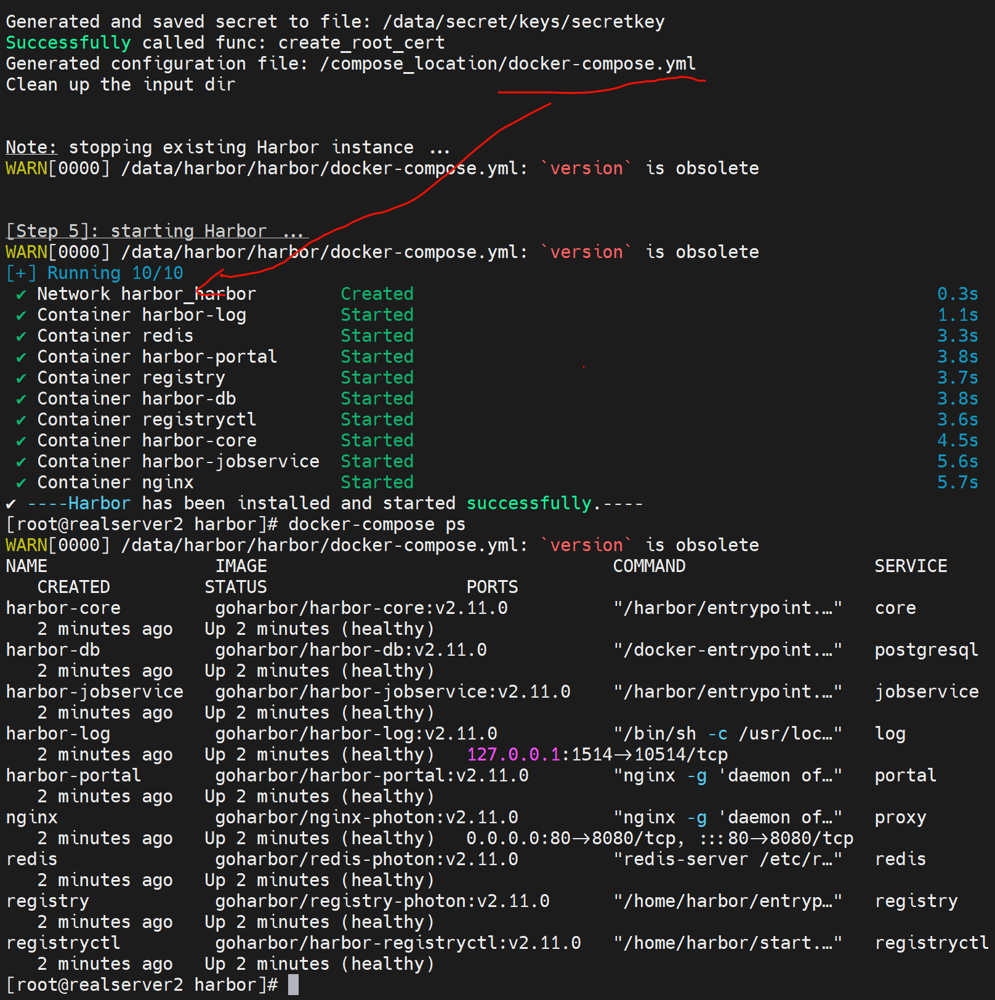

可见proxy就是nginx啦，然后访问一下就OK了

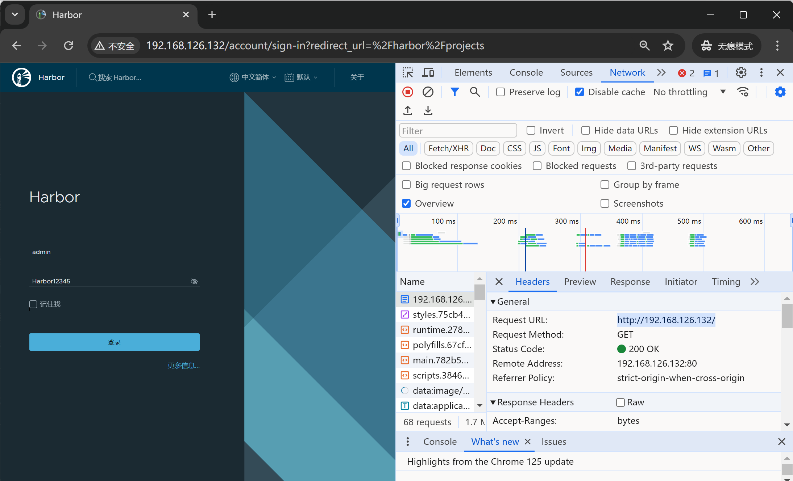


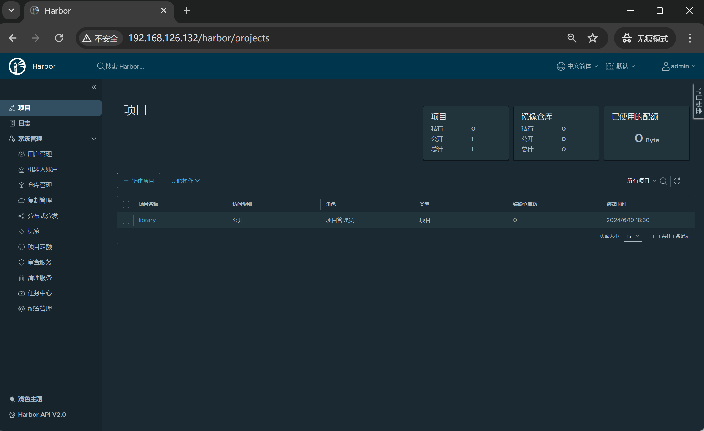


关机下班~~


开机发现harbor的这个几个容器就没有起来几个

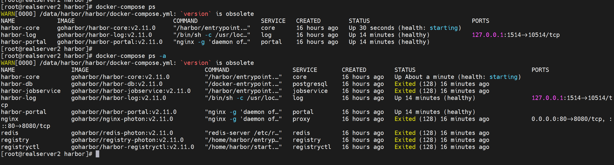

原因可以看logs，但是看不出个所以然来

但查看docker-compose.yml里可见很多都是有依赖关系的，猜测原因如下

1、开机启动了docker，systemctl enable docker

2、docker起来了以后，这些容器就立马restart always了

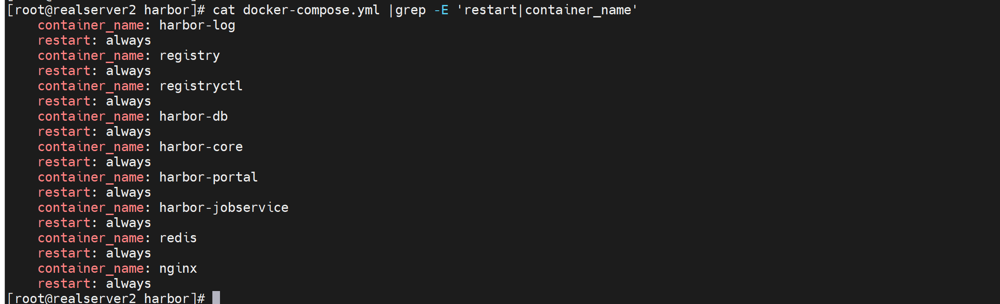

但是有依赖的

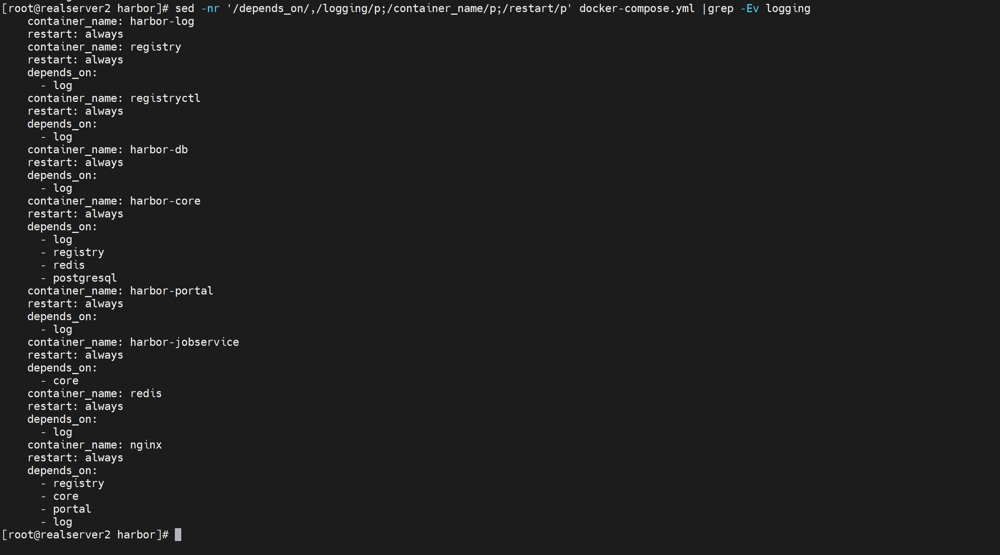

看👆图，可以得出两点结论

①十有八九是因为存在依赖启动关系，才导致一窝蜂的restart always没有启动得起来

★ 看来光有restart always不够，还需要daemon.json里的live-strore true来辅助！

②笔者具有深厚的sed技能理解能力，此乃通才的潜质~~~，解释下，这里的sed 里的分号的逻辑其实是存在两种动态的逻辑的：1、就是或者  2、就是并且，哈哈哈不相信？一个sed里的多个语句用分号隔开，笔者也就是本大爷竟然扯犊子说既有或者 也有 并且的逻辑，哈哈哈，不信你看


早在一年前就梳理出来了


再次验证说明

1、如上上图的sed取出docker-compose.yml里的关键词 container_name、restart、以及depends_on的子模块内容。

这个就是典型的或者


2、然后上图之前的sed专栏里，同样使用

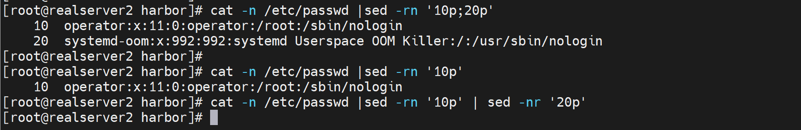

来说明了此时  sed 里 多个;分号间隔的 或者 关系；是不等价于多个 管道符 递归的。


1和2就是  或者逻辑   存在于  挑选内容的时候


3、在删除内容的时候，分号代表的逻辑就是并且

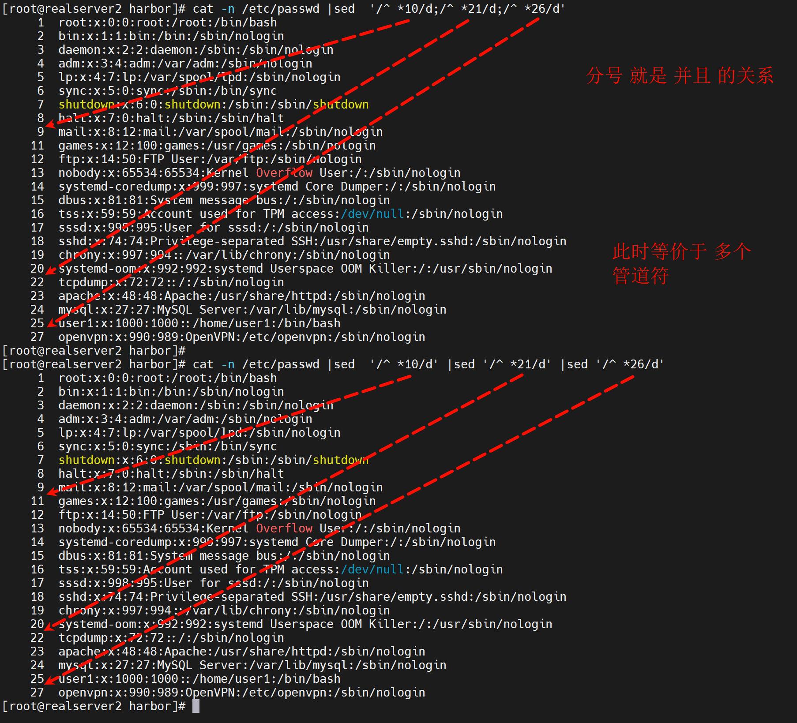


4、所以sed 里的 多个动作用分号隔离，多个动作之间的关系 

是**并且**，此时等价于多个grep；并且的逻辑存在于取东西

是**或者**，此时不等价于多个grep；或者的逻辑存在于去东西。


5、**方法论**：当你用sed **取**东西的时候，一个sed里的分号之间的动作 就是 **或者**

当你用sed **去 **东西的时候，一个sed里的分号之间的动作就 **并且递进**


怎么理解到生活中来呢，就是上图生活化的例子，这里再次梳理

一个A4纸，好比你要用sed处理的对象；你有两种动作，

第一种动作 从A4纸上 取两个小形状，此时就是 或者的关系

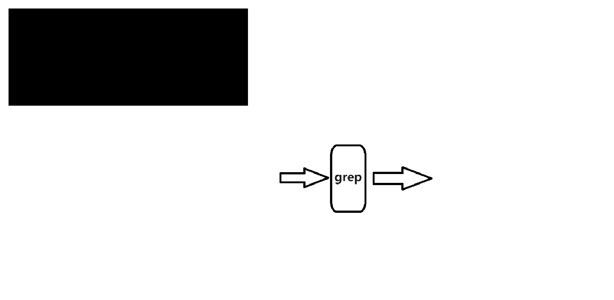


取出第一个小圆片(^_^) 作为结果是不可能被grep出一个三角形的，就好比你取出字母A，然后A里grepB出来是不可能的。


第二种动作 将A4纸 去掉 两个小圆片，此时就是 并且的关系


去掉一个小圆片的结果是背景的A4纸，此时自然可以交给grep再次去掉另一个小三角的。这就是并且递进的关系。


那就起个名字吧，就叫做蒙面侠效应~ 上面的GIF最终像不像眼罩，那不就是蒙面侠嘛~

所以哥们下次和人吹牛逼，就会说sed有一个蒙面侠效应~，然后观察对方表情，酌情进一步解释，当然对方在努力听明白后会恍然大悟 原来如此，然后就忘记了蒙面侠这个起因词汇，当然脑子快的会问一句蒙面侠是什么鬼~~~


好了继续Harbor


打开harbor管理页面

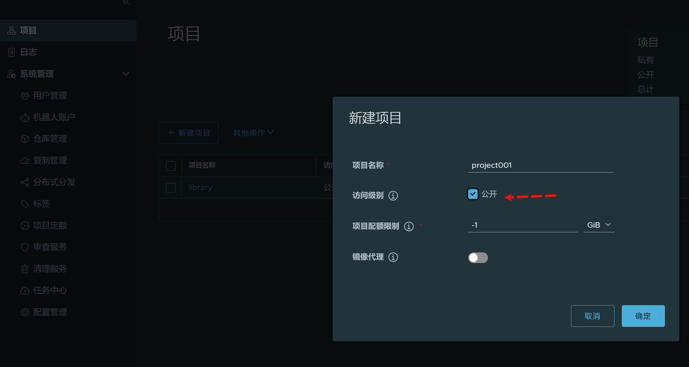

公开是指 下载的时候是否需要login。 上传怎么着都需要login的。


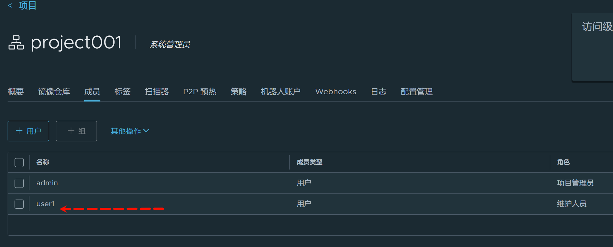

项目归属成员


然后用user1推一个镜像上来

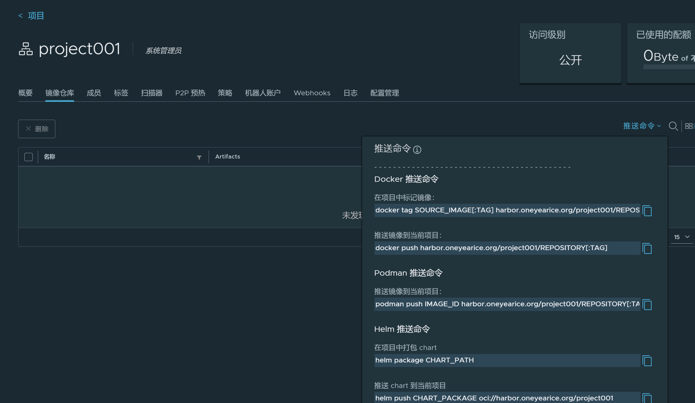

域名是当初这里配置的

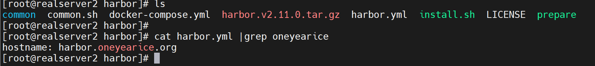


```shell
docker tag SOURCE_IMAGE[:TAG] harbor.oneyearice.org/project001/REPOSITORY[:TAG]

docker push harbor.oneyearice.org/project001/REPOSITORY[:TAG]

```

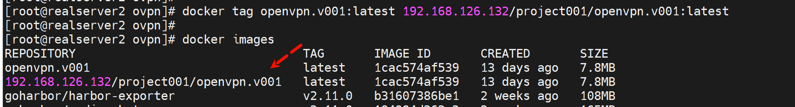

直接推是推不上去的，不仅仅是因为没有login，而且默认是走的443👇

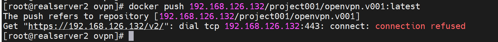

所以要login，还要解决默认走443的问题

1、解决443问题

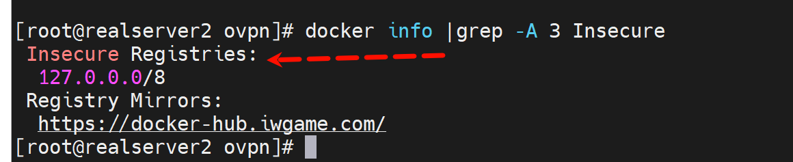

写域名写IP都行

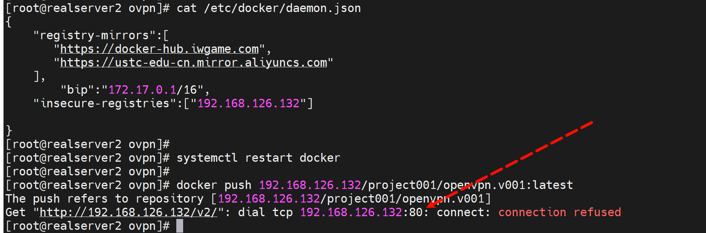

这个refused就是80端口实际上没了

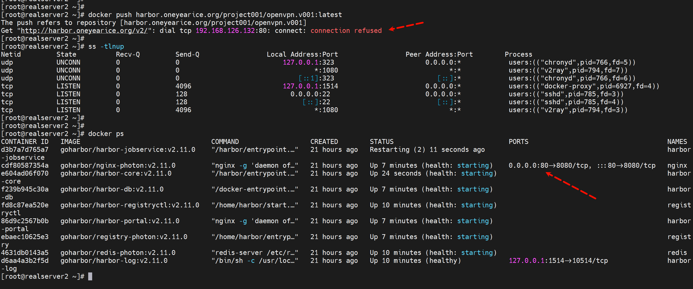


重新up一下就对了

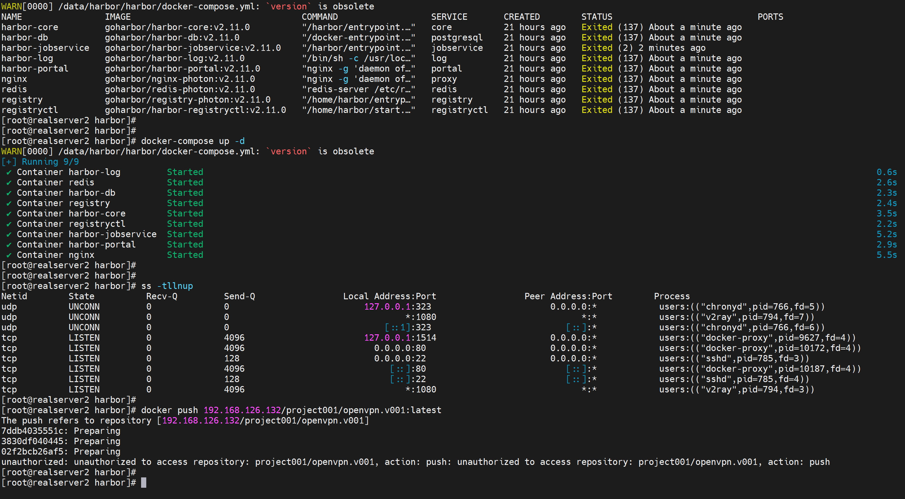

此时就是没有login的事了


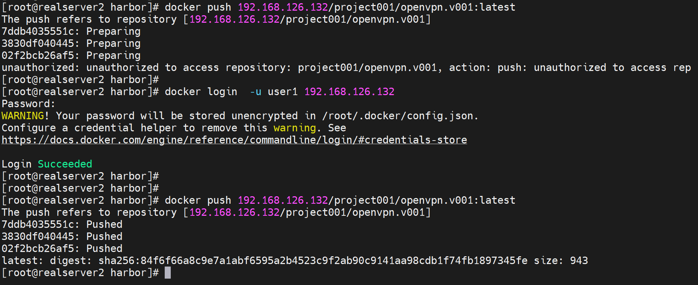

就好了

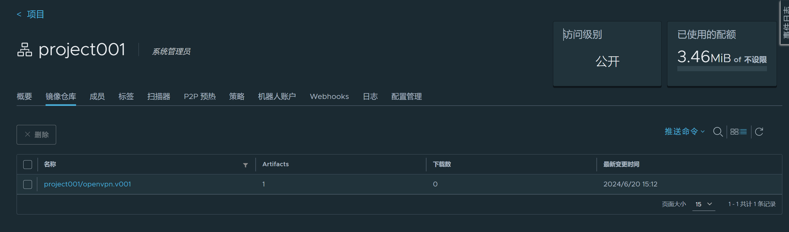

此时网页上就看到了👆


发现镜像点进去一些操作都是灰的的

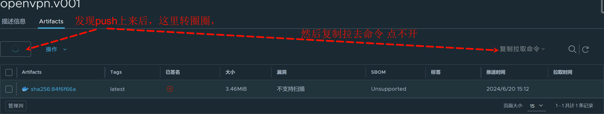

唉~~笨呐，勾选一下就好了

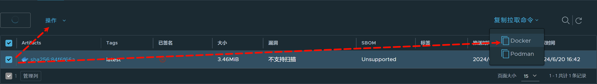


可以拉的

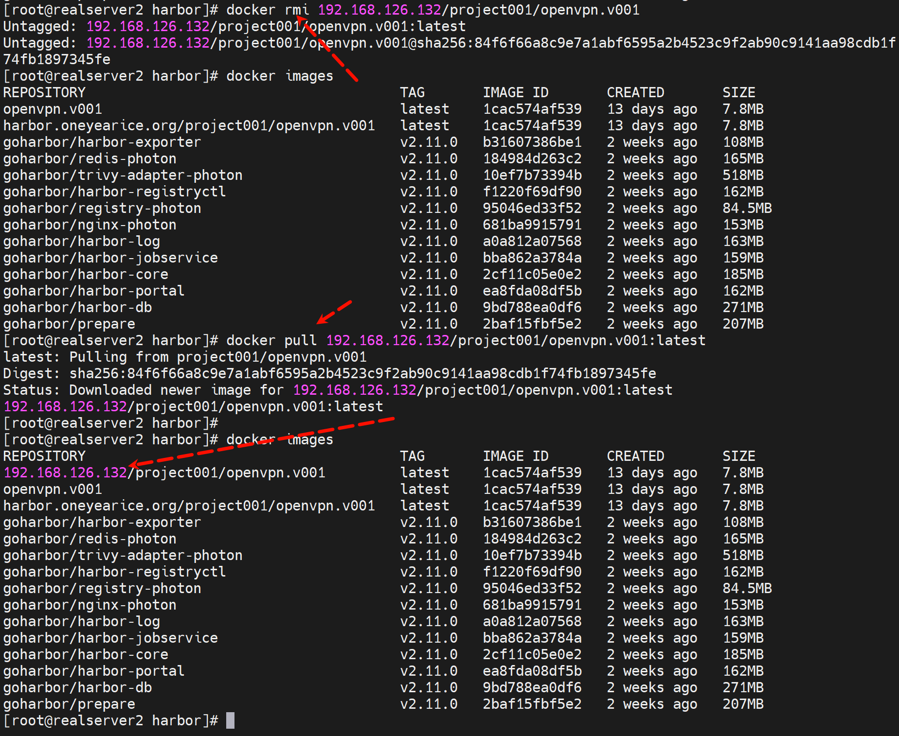


用复制的CLI就是一串编码

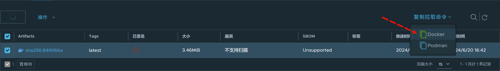

一样好用的

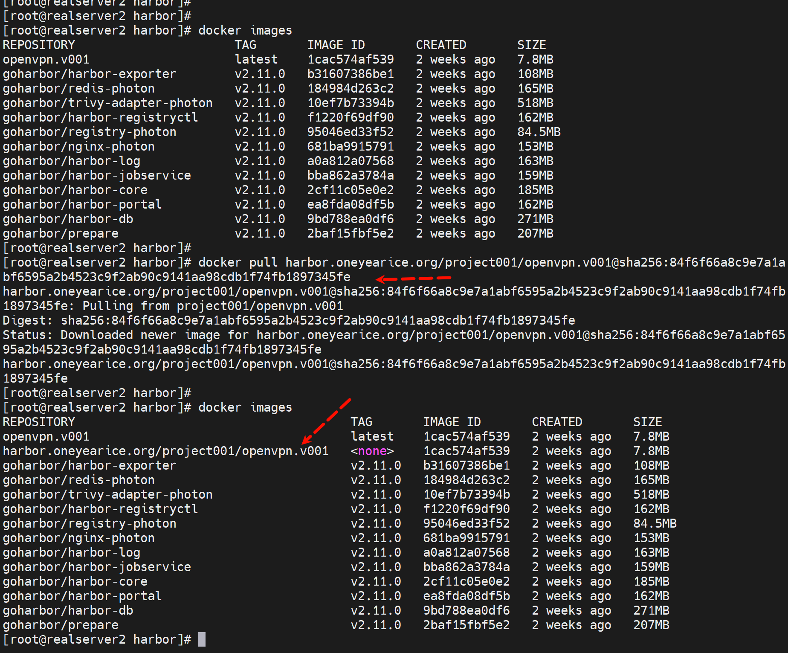


效果一样的👇，其实就是版本tag往往也就是哈希值来做一样的效果。

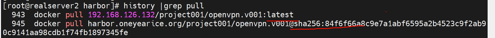

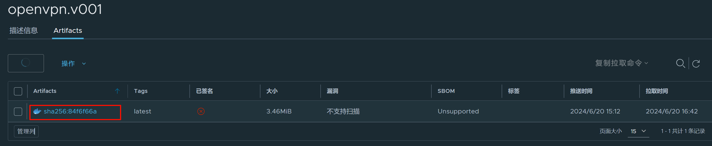


