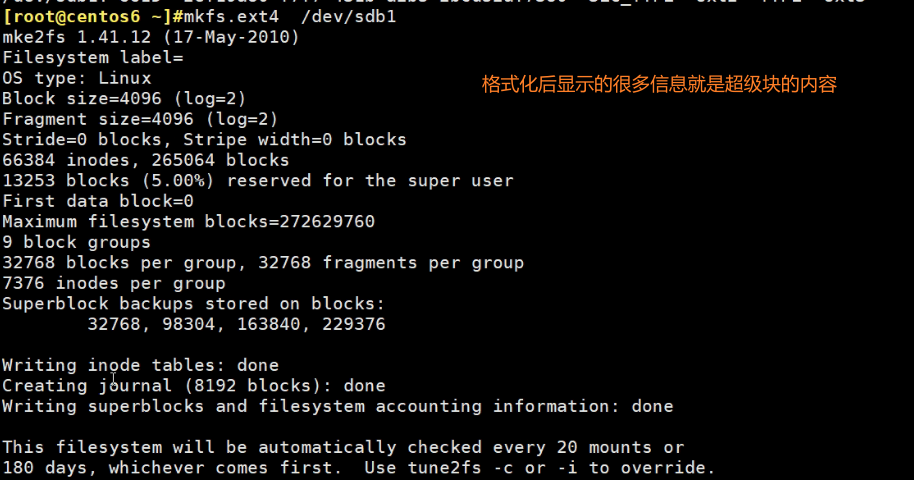
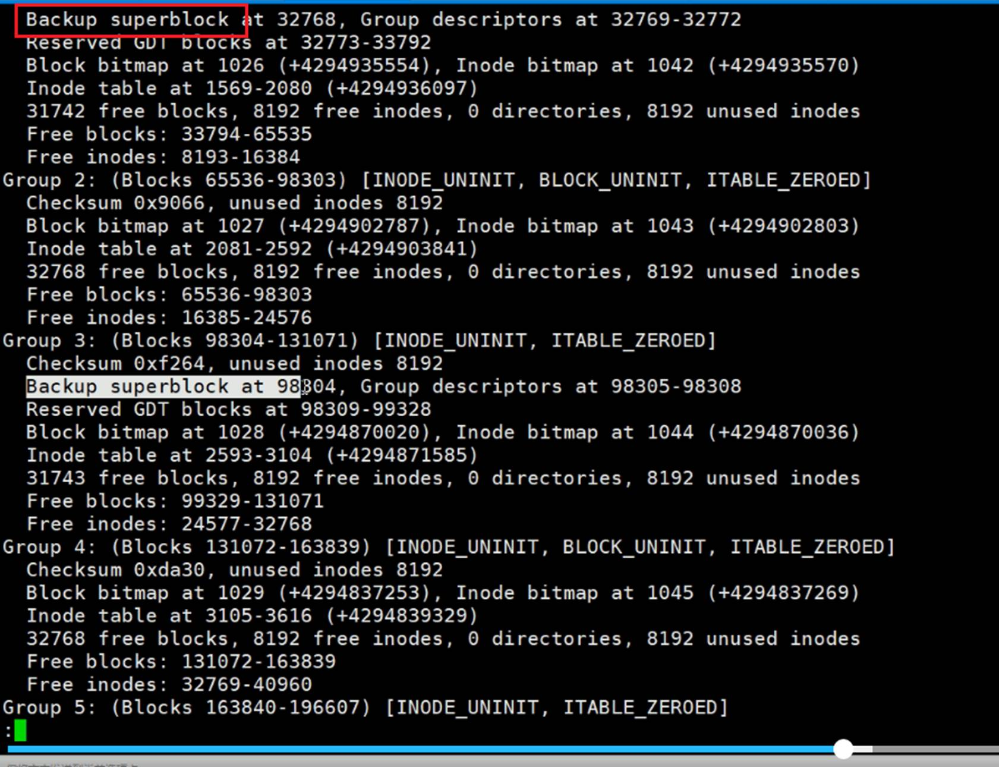
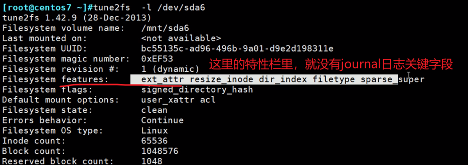
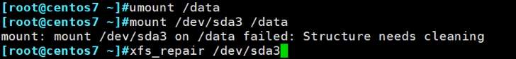
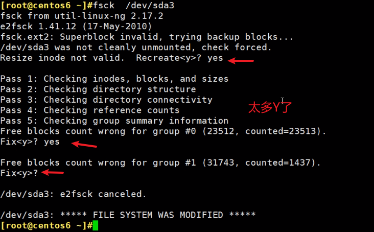

# 第4节. 文件系统管理实战

文件系统的格式化咯


这是centos6和7上的分区，sdb1和sda6\7，都还没有创建文件系统，而创建文件系统就是所谓的格式化了。

 


一般就是ext4或者xfs，其实还是看系统默认支持什么（centos6默认ext4，centos7默认是xfs），就用什么。

管理工具就是mkfs这个工具

注意，文件系统本身是属于操作系统的功能，由内核来完成的。内核支持这些个文件系统，就是说内核提供了（内核级的）关于这些个文件系统的驱动模块。这点可以通过locate确认

locate xfs.ko，文件系统都是ko文件，查看有没有xfs文件系统的内核驱动。


查看ext4文件系统的驱动：xz就是压缩格式


这些都是属于内核级的功能。

 

那么问题来了ls，cat这些命令，对于用户来讲他访问文件，ls、cat去访问这些文件的时候，其实是通过文件系统来存放到硬盘上的。

那么这些命令是怎么和文件系统交互的呢？要知道底层用的文件系统有很多种，这些命令又是如何对应N个文件系统的呢？是不是意味着针对xfs有个ls.xfs子模块，针对ext4有一个ls.ext4子功能呢？显然不是这么干的！不可能让一个软件开发者考虑这么多种文件系统的。

所以为了让用户更专心的访问磁盘文件而不是考虑文件系统的差异，让开发或使用人员更透明的使用各种文件系统，就提出了VFS概念。


什么是VFS虚拟文件系统呢


题外话，其实从上图可以看出来一点点，就是cache缓存偏向于VFS，buffer偏向于硬件了；

还有一个简单得说法--缓存是读，缓冲是写磁盘得时候。其实这种说法里得缓冲也是说得磁盘，这就和上图不谋而合了，冲 更多是针对硬盘或是针对硬盘驱动得，缓存更多是偏向于VFS文件系统得。至于读还是写，这个我暂时人为是不分得。


对于用户cat ls cp mv等命令不会直接跑到磁盘上去操作磁盘文件。用户空间的程序是没有权限没有能力直接访问硬件的（而文件就是放在磁盘硬件上的）。

所以要用系统调用，让操作系统内核帮其完成访问磁盘上的文件


对于fat、ntfs、xfs、ext4


 

而VFS就是一个集大成者：把各种各样的文件系统通用功能收集起来，对外让用户来访问，用户就无需关心下面各种文件系统的区别，因为统一都是用VFS这个文件系统来访问。

这样用户开发的软件都是和VFS打交道的（比如ls、cat、mv等都是和VFS打交道的），而这个VFS文件系统再和底层的不同文件系统打交道就不用我们关心了，这是有内核来完成的，是操作系统本身来完成的。


这样就开发一个诸如ls for vfs就行了


如图可见当前不支持NTFS这种windows的文件系统，因为用的少，内核就没有内置添加这个功能，你要用自己编译到内核里。

源码编译见上文http的操作。

 


正常用不到这么大，用到了性能就不行了，虽然支持这么大。

 

## 创建文件系统	


 


mkfs.ext4=可能还不等价于=mke2fs好像是默认格式化ext2的！！


还可以这么写，mkfs -t xfs  、mkfs -t ext4

 


 

### mkfs 格式化后怎么知道具体是什么文件类型


mke2fs /dev/sbd1 默认是ext2


上图的


因为本质上ext2和ext3是相同的，就是3多了日志，所以这两个是兼容的。


硬盘分区的空间可以理解成两大块内容，一个是metadata元数据-节点表（存放文件的大小、权限、时间、所有者、还有一个指针指向数据存放的位置），一个是数据。

实际上还要更加复杂，分区划分成多个组group，每个组是由多少个块组成。


而每块多大？


不同地方的blocks意义不同


文件系统的blocks意思和磁盘分区里的blocks的意思不同


存放文件的时候，必须以block的整数倍来计算。哪怕一个字节的文件，你也要给我4K字节的空间。

分区里的block就是1个block就是1k。


如果磁盘里都是大量的1k，2k的小文件。此时4k块大小，空间就浪费了很多。如果文件都小，那么文件系统的block最小单元就别默认4KB了。

而目前文件系统，块大小支持：1K\2K\4K这3个单位。

4K是系统根据硬盘分区自动分的。如果分区偏大，自动给你4K的block，如果硬盘小自动给你1K\2K的block。比如你分区就100M，默认肯定不会4K的、

也可以手动指定，-b 1k ，就是手工指定block大小了。


在磁盘上组织空间的时候，是把若干个连续的块blocks组织成一个group


 


这样把磁盘划分完。分出来后，每一组group里面在有自己的节点表。


 


superBlock：①分组的描述 从第几个块到第几块是一个分组，算是一个分组的起始位描述。②自身的元数据，比如块大小比如4K，这是文件系统的属性也要放在超级块里。



还可以手动去查超级快superblock：


这个就是最早提到的元数据

磁盘上每个文件都有元数据。这一条记录就是存放的一个文件的元数据信息。也是节点表的一条记录。

这一条占的空间就叫节点的大小。


256B，就是这一行占256个字节。

当然256B不是固定的，可以再添加属性，比如ACL这种扩展属性，这样一行的空间就变大了。


与此对应的就是节点表inodetable空间占用大了，后面真正存放数据的空间就少了。

DateBlocks数据块，一块4KB；然后inode table里的一行也就是一个节点信息占256B大小的空间。


 


每个文件分配一个节点号，这里66384个节点号，就代表了该分区一共可以放66384个文件。


所以上图可以反推出磁盘空间大小：所以4096单位是B字节，一般block size就是4KB的大小。


话说回来，虽然块很多，但不代表所有的空间都能真正用起来。


 


如果你也分100G的空间，那么5G是保留下来的。这个5%是默认的行为。

5G是干嘛用的呢？是给root用的，留给0 ID的人用，防止非root用户把磁盘空间占满导致root没有空间了，改个文件，加个字节都加不进去。保证了运维人员的可维护空间。


5%的预留不一定合理，如果10T的空间，500G的预留就很夸张了。可以调节百分比，支持0.1%。


superBlock超级块还记录了分组情况，只是上面的tune2fs -l /dev/sda1命令还看不出来。

换个命令可以


0 - 8 共9个groups

 

如果superBlocks坏了，文件系统就完了（因为分组分到哪都不知道了，属性也没了！）。

所以superBlocks需要备份，实际上也有备份


superBlocks备份了好几个地方：32768\98304\163840\229376这四个地方都有备份。

所以利用超级块是可以修复出故障的文件系统的。

比如掉电、软件故障造成文件系统的元数据破坏，实际上是可以修复的，因为有备份的。


貌似是奇数有超级块的备份，偶数没有。但是这不是统一的规律，去看看别的。


dumpe2fs /dev/sda3 |less 分页看下





到group9，后面就没了。就是备份那么多就够了，不需要太多。

 

\-------------------------------

## 块位图blockBitmap

就是blocks，一个group里有32768个blocks，总共也有很多个块。

将来使用的时候 存放文件的时候 就需要挑出空闲块出来给到文件存放用。

所谓位图就是1bit1bit的图，0表示对应的block为空，1表示对应的block已使用。将来文件用的时候，就找出位图为0的block给它用就行了


 这就是整个ext2为例的文件结构，其他相同的，差不多。

 


 

xfs的结构不太一样


meta-data 元数据区

data 数据区

naming 是啥？

log 日志区

realtime 实时区


isize=512是节点inode size，和上面ext4不一样（ext4是256B），这里大小是512B。

 


sectsz 扇区512B

bsize块大小也是4KB

log 也有日志功能，日志也有块大小

数据的realtime实时空间，每创建文件的时候，先把数据放到实时空间，等写完了，再放到真正空间中。

xfs查看的方法


```
xfs_info: /dev/sda is not a mounted XFS filesystem  👈需要挂载后才能查看
[root@centos7 ~]# xfs_info /dev/sda1
meta-data=/dev/sda1              isize=512    agcount=4, agsize=65536 blks
         =                       sectsz=512   attr=2, projid32bit=1
         =                       crc=1        finobt=0 spinodes=0
data     =                       bsize=4096   blocks=262144, imaxpct=25
         =                       sunit=0      swidth=0 blks
naming   =version 2              bsize=4096   ascii-ci=0 ftype=1
log      =internal               bsize=4096   blocks=2560, version=2
         =                       sectsz=512   sunit=0 blks, lazy-count=1
realtime =none                   extsz=4096   blocks=0, rtextents=0
[root@centos7 ~]#

```


-j 等价于-O has_journal等价于直接-t ext3。-O ^has_journal 是删除日志功能

-i，inode和磁盘空间有对应关系，多大空间对应一个inode。一个文件是要消耗一个inode的，而一个文件有要消耗至少一个块，一个块如果是4K，也就是说以一个文件要消耗至少4K空间，同时消耗一个inode，而inode又被你对应成了1K，也就是说，此时一个文件要消耗可能4个inode才能对应上，而inode本身又是占空间的，inode之前说了一行一个inode信息消耗256B，所以就造成了空间的浪费，积少成多也是可观的浪费了。

-N 指定分区中创建多少个inode，同样也是摆脱不了-i的默认值的，也就是说你指定的一个值，系统并不会精确到你指定的-N的，而是考虑到-i的大小的。

-I 一个inode占用多少磁盘空间，默认256B

-O FEATURE  ：ext文件系统了除了2，3和4都是由日志功能的，


tune2fs只能看ext系列的superBlock信息，xfs的看不了


一般直接创建ext4就好了，不要创建ext2然后-O FEAUTRE没事找事，除非是已经有一个ext2了，然后再追加一下。注意mke2fs是创建的命令，对于已经格式化成为ext2的硬盘分区，需要使用tune2fs命令来追加。

例子：创建ext2 块大小1024<font color=red>B</font>、预留0.1%、inode大小128B、卷标/mnt/sda6


👆上图bolck size是1024B字节，一共是1048576个块，所以这个sda6大小只有1MB。

这个ext2是没有日志的，所以查看下




 

 

👇此时sda6的ext2后面就追加了ext3字段。其实ext3就是比ext2多了一个日志功能，此时就是ext3了。


### 关于acl的功能来源-挂载选项

centos6系统(7除外)后面分的区--不是安装操作系统时分的区，是没有这个Defeault mount options选项的。

某人看到这 就要怼了，“你的沟通有问题，不是没有这个选项，是这个选项的值为none”，所以跟这些人讲话，要小心些，唉~不要碰枪口，除非你比他牛，他就不怼你了，他会反过来将就你，这其实是有问题，客观来讲有一说一，但怼人是不对的(你Y的沟通才有问题，逮着机会怼人你牛逼~操)，这些人的态度两极分化的厉害所以不喜欢他们。不过反过来，你自己要是凶一点(不是让你怼人哦，就是态度明确硬朗、正)，工作上可能会轻松点这倒是事实，一些喜欢借力、甩锅的人就不太愿意和你怼，因为你凶啊，哈哈~。


没有的，可以通过-o acl添加该功能

 

再查看就有了，此时就可以用FACL了

会加也要会删

 

 

补充说明，这里既然是挂载选项，那么就有这个mount -o acl，不过就是centos 6需要这里的两种方式来处理（上面的一种tune2fs，还有这里的mount -o），现在都是7不需要的。


 

### 一个分区可以用三个名字来表示它


UUID具有固定唯一性，其他不具备唯一性。

早期都是些卷标，从centos6开始推荐开始写UUID了。

根据UUID查分区名、根据卷标查分区


blkid -U 等价命令


### 给ext系统加卷标


xfs系统的卷标使用xfs_admin，不过需要先卸载

 

 


 

不带-h就是超级快和group分组全看

dumpe2fs -h /dev/sda7 等价与tune2fs -l /dev/sda7

 

xfs_info必须要挂载才能看，上文应该有说过了。  # 这个具体看了，centos8和rhel8不同，


 


fsck 可以修复ext和xfs。


```
[20:41:23 root@localhost ~]#fsck.         👈两下tab补全
fsck.cramfs  fsck.ext3    fsck.fat     fsck.msdos   fsck.xfs
fsck.ext2    fsck.ext4    fsck.minix   fsck.vfat
[20:41:23 root@localhost ~]#
提示可以看到支持修复的文件系统类型，但实际上直接fsck不带后缀更好，因为万一敲错了，反而坏事，不加会自动判断对应的什么系统。
```


### 修复xfs文件系统举例

 


 


超级块一般多大，在一个分区上都是些描述信息，应该很小，但是具体多少不清楚。


上图的三个选项一个都不用，-f 是修复文件、-d是修复根。

直接xfs_repair /dev/sda3，一定不要挂载的时候修复。

 

修复后就可以挂载了

 

但是数据确实丢掉了，看来dd前10M破坏比较严重的，修复估计也就是修复超级块吧，因为有备份，可能也能修复些其他的，具体还需要研究下。


### 例子2，修复ext文件系统


bad magic number， 超级块没了已经

取消挂载


修复





 


输入 -y就行了，自动帮你输入yes


修复后挂载，看下空间大小


如果破坏的不是太严重，可以修复一些数据回来的，**备份的都是元数据、分区信息、超级块之类的，用户数据是不会备份的。**


**这是二次破坏！**👇


### 使用一个磁盘空间的3步骤：

以上就讲解了 1、分区；2、创建文件系统、3下面就要讲挂载了。
