# 第7节. 多网卡集成的企业级应用


数据传输一条龙，从网口进来，到内存、到硬盘，中间还有CPU的运算。

所以看看哪里是瓶颈，iperf就是内存到内存的测试方法，SFTP就是到硬盘的测试手段。


## 多网卡绑定的模式

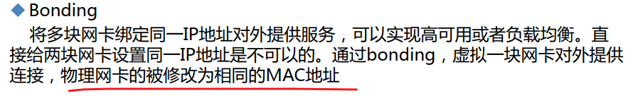 


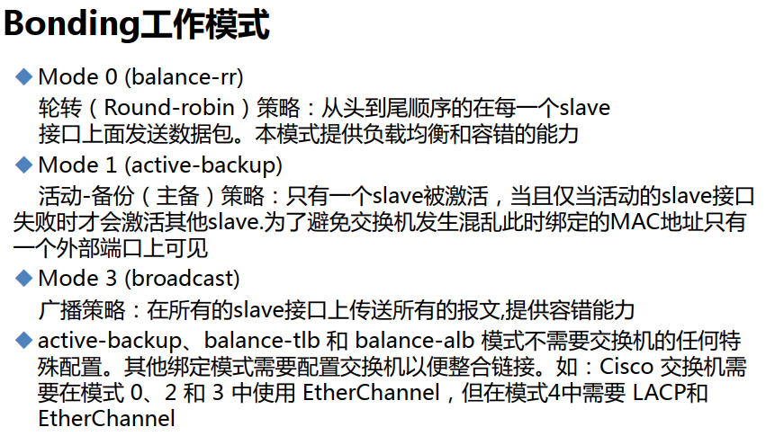

👆Mode1其实通过上述，就知道SW那头如果发现只有一个外部端口能看到MAC地址，就说明是Mode1了。

0 2 3 4 都需要SW那头配置portchannel，4还需要动态的协议。


## Bonding配置

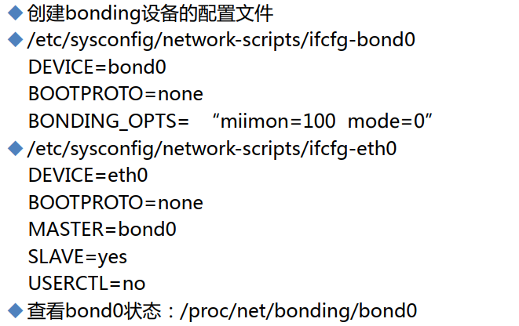 

1、miimon，比如mode1下，就是slave监控master的周期间隔100ms；

2、新建ifcfg-bond0；

3、修改两个网卡配置文件。

## 实验

VM虚机都改到一个网络里

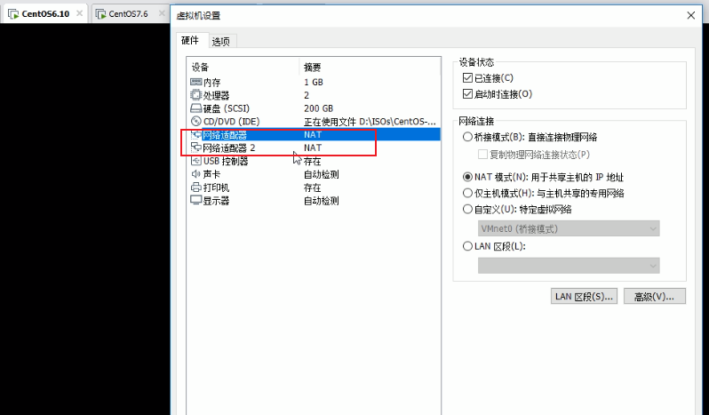

做bond之前禁用NetworkManager服务，并开机禁用。

 

删除多余的文件，保证bond成员口的配置干净

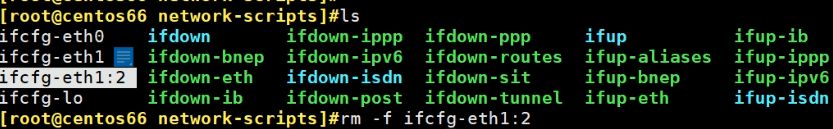

### 创建ifcfg-bond0


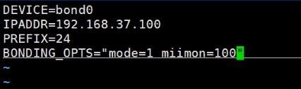 

这个设备当前是没有的ip a看不到，待会配置完毕后，重启服务器后就有了

### 配置物理接口加入bond0里

#### 编辑eth0网卡


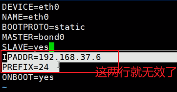 

 MASTER=bond0 以及SLAVE=yes，这样，这个网卡就属于bond0了，地址就是bond0说了算，下面的地址就无效了。

#### 再修改eth1网卡配置

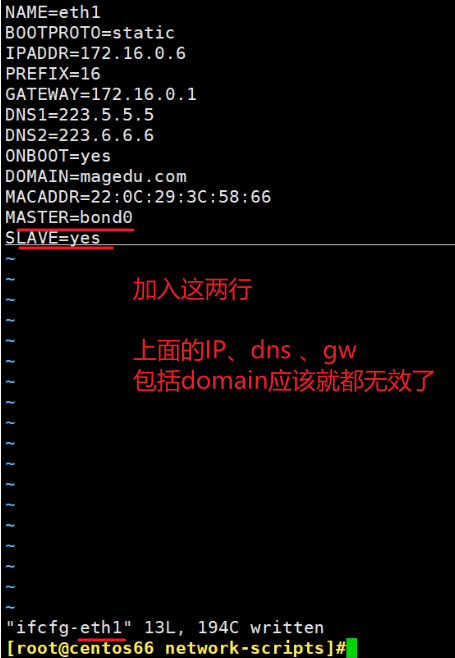 

#### 然后重启网络服务就OK了


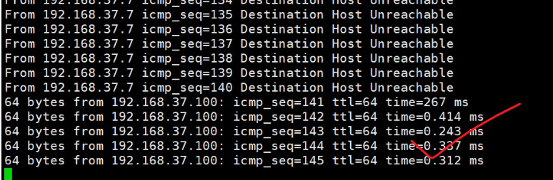 


注意，bond0起来后，运来的两个物理成员口的IP就失效了，之前ssh就断开了，只能通过本地终端登入上去看看了。

#### 检查下

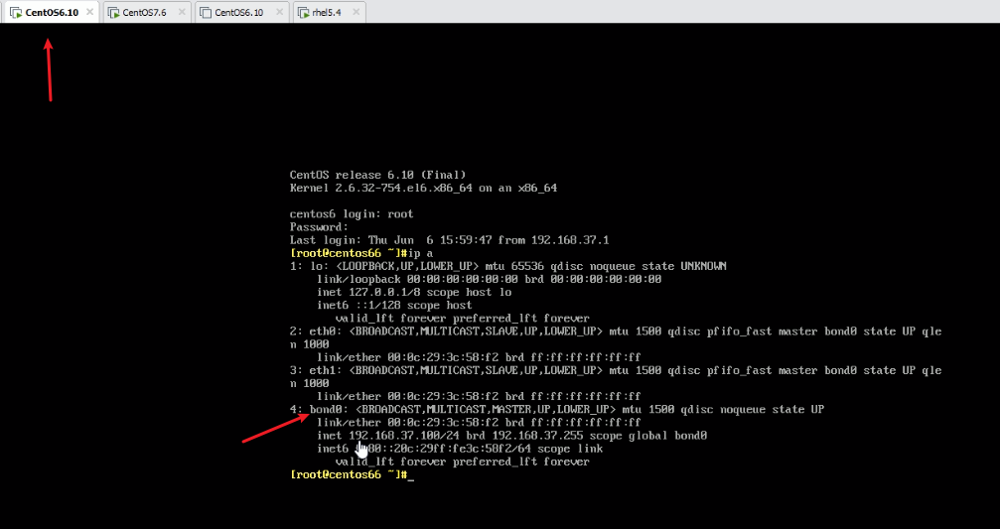 

eth0和eth1已经不对外了，而且MAC地址是成员口和bond口公用的。

因为做的是bond0，所以有一个主的，通过查看proc确认谁是A谁是S

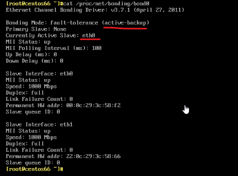 

可见当前是active-backup模式也就是mode1，eth0是主

将eth0断开(前面一个就是eth0)，测试下连通性

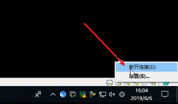 

发现丢了一个包

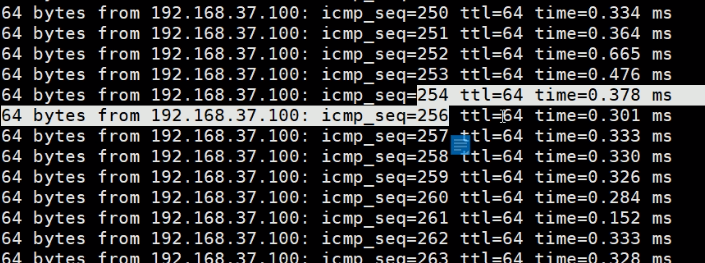 

两根线都down的样子

cat /proc/net/bonding/bond0 ，下面centos7一样的命令

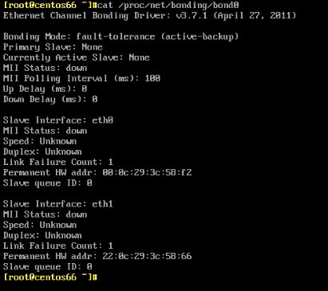 

主备切换，不会抢占。


改成mode3 broadcast看下

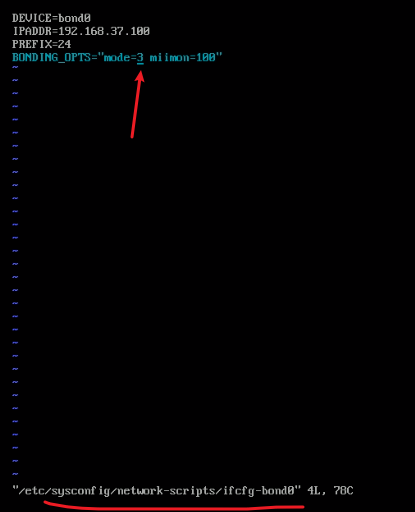 

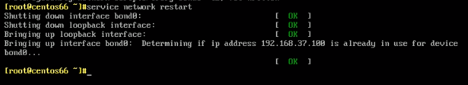 

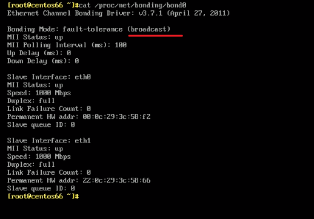 

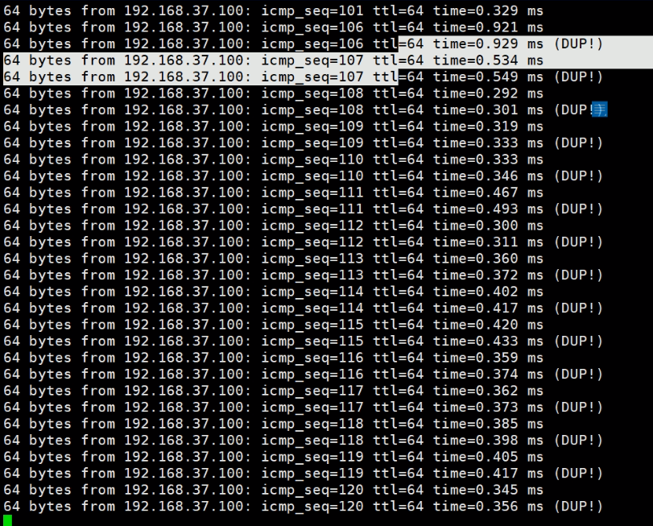

37.100就是bond0的IP了，这个DUP就说明broadcast是成员都工作的。

在这个模式下，断开一个接口，发现不通了(在虚拟机环境下)，因为要结合SW配置。

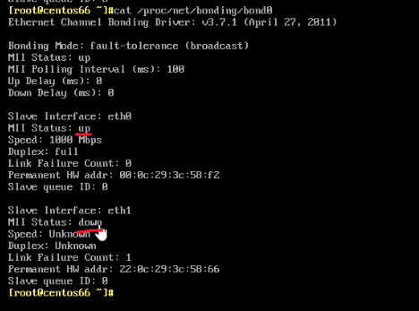 

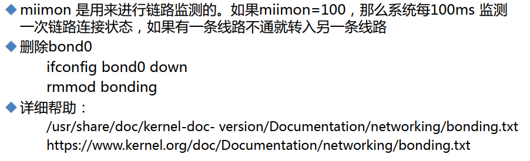 


## centos7的配置方法

centos7最大区别就是网卡名称不一样，7通常都是ensxxx，一般是cents7是根据网卡插槽定义的，为了稳定，不过一般网卡也不会增加删除，所以更多还是认为改成eth0 eth1 这种方式。

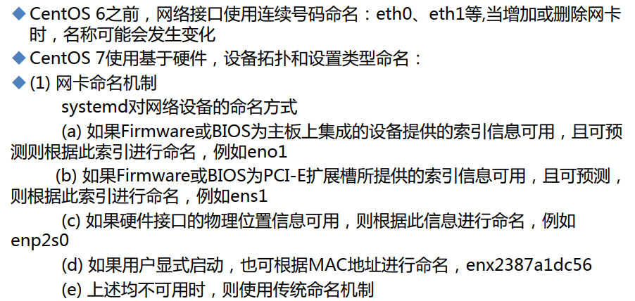


## cents7改网卡名称


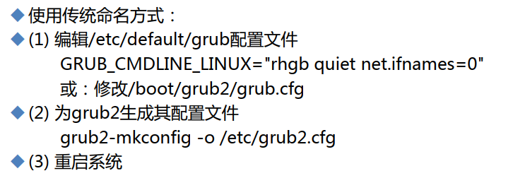 

阔以的，虽然下面的和rocky-linux不同，但是rocky-linx测试一样的操作，就是生成的文件里的ifnames=0的位置不同罢了。

修改/etc/default/grub

 

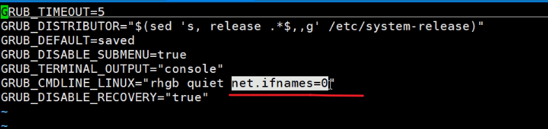 


ubuntu里也是ens33，

切换成root身份：

 

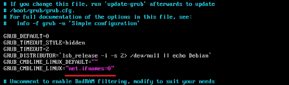 

上面改完还不够，需要利用工具覆盖一个文件

```
ubuntu需要grub-mkconfig -o /boot/grub/grub.cfg;reboot
centos7需要grub2-mkconfig -o /boot/grub2/grub.cfg;reboot
```

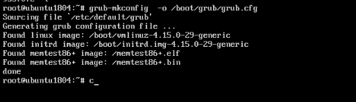 

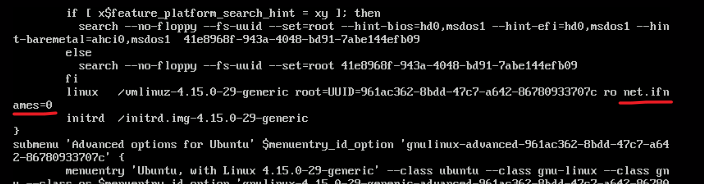 

reboot即可

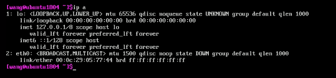


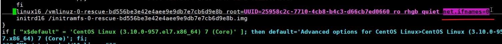 

不推荐修改，需要借助grub-mkconfig来生成这个/boot/grub2/grub.cfg文件。

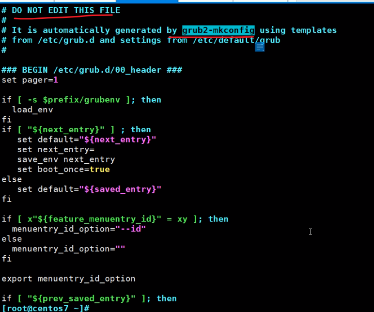

grub2-mkconfig -o /boot/grub2/grub.cfg   默认就会读取/etc/default/grub文件来生成最终文件。然后reboot生效。


总之centos7上网卡名称是自动生成的

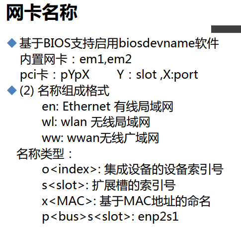 

wlxxx就是wifi网卡，


其实centos7的网卡命名的前因后果是这样的

https://developer.aliyun.com/article/609587

rocky-linux修改大同小异

https://blog.51cto.com/feko/2751292


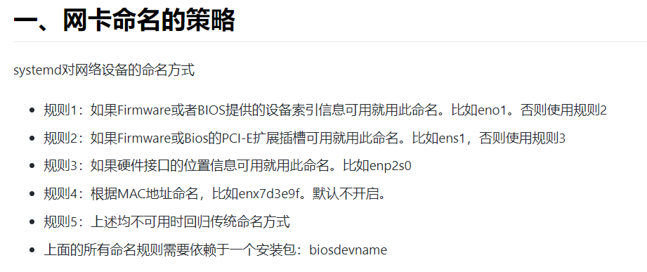 

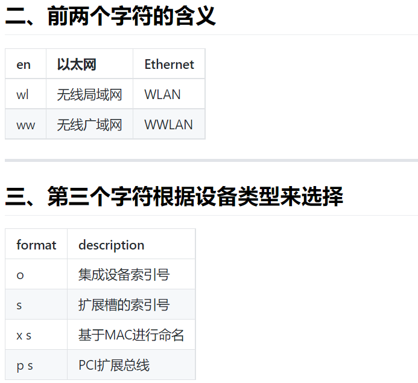 


## centos7修改主机名


 


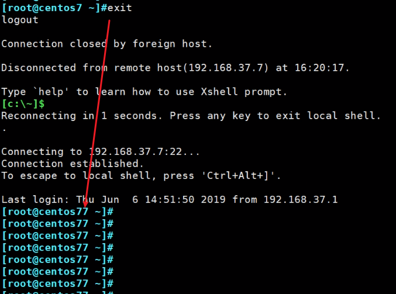 

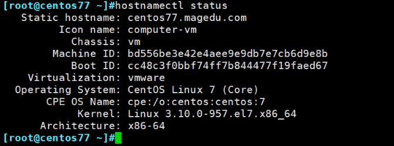 


## nmcli

nmcli  及时NetworkManger cli的意思，配合NetworkManager服务用的

通过tab键可见有哪些子命令，主要用到的是connection 和 device


device是数据链路层

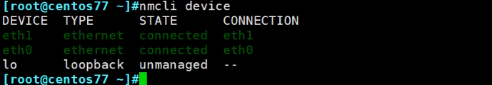 

如果网线断掉一根，就会看到如下图情况：

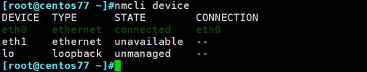 

看接口详情

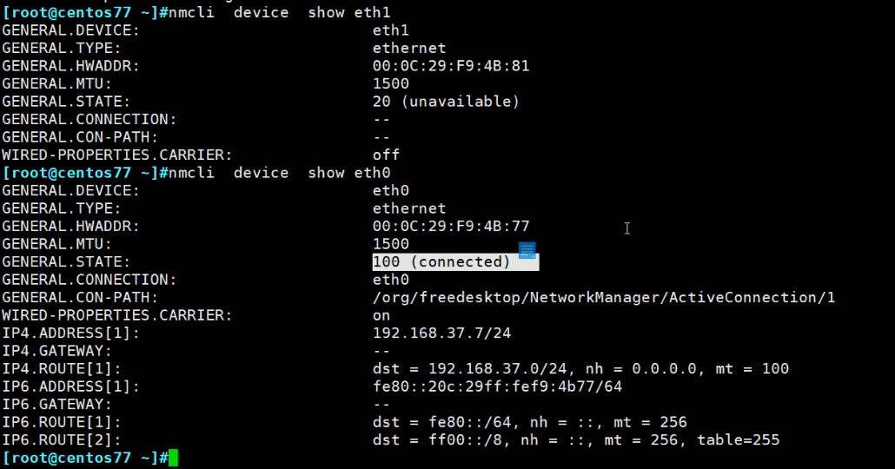

以及

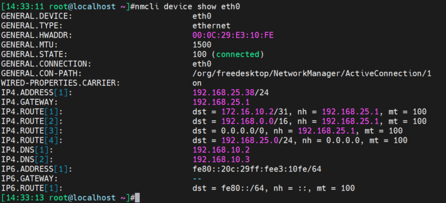


使用connection查看网络层

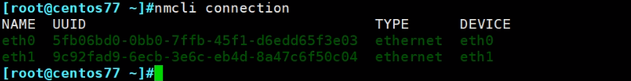

这里的NAME和DEVICE可以不同，如下

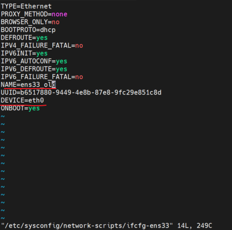 

然后systemctl restart NetworkManager可得：

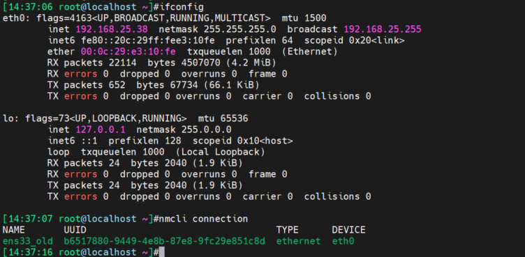


nmcli的使用场景和习惯，命令行嘛首先是，灵活

nmcli connection add con-name eth1-test ifname eth0 type ethernet ipv4.method manual ipv4.addresses 1.1.1.1/24

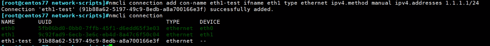

目前针对eth1有两套配置，生效了一套

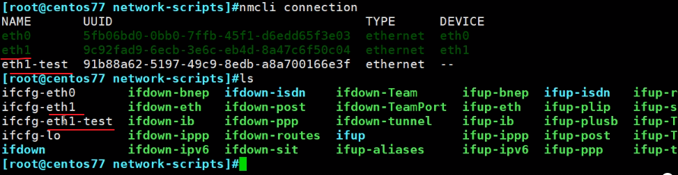 


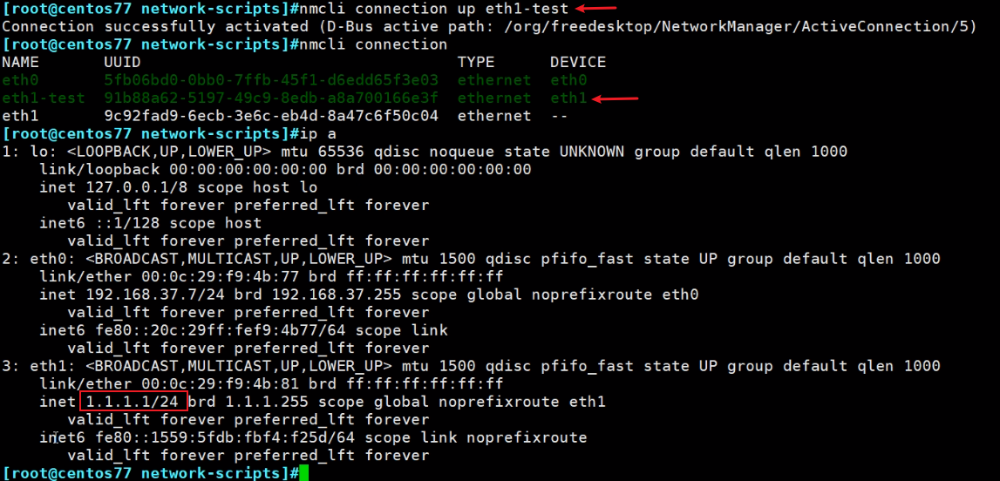

通过上图过程截图可知，nmcli connection add con-name eth1-test ifname eth0 type ethernet ipv4.method manual ipv4.addresses 1.1.1.1/24

会生成ifcfg-eth1-test网卡配置文件；但是如果是人工创建一份新的网卡文件nmcli默认是不会识别生效的，需要nmcli connection reload一下


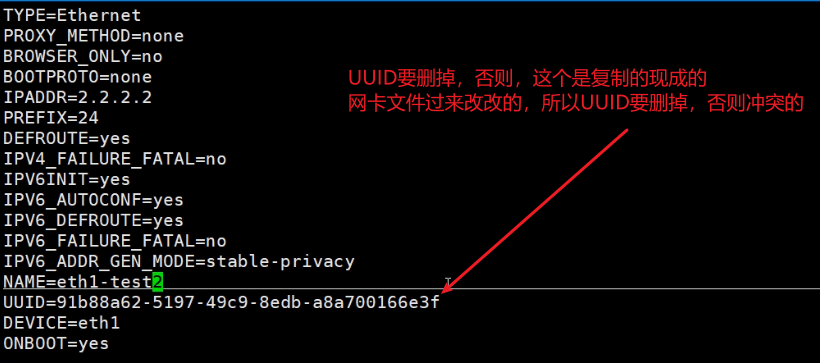

网卡的UUDI必须唯一，简单处理方法就是删掉改行就行。

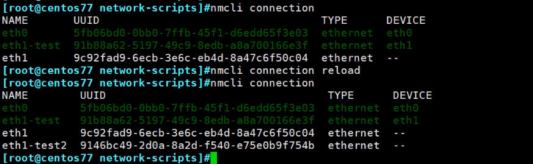 

此时eth1-test2就加载了，要是生效同样nmcli connection up eth1-test2


nmcli删除连接

删除在用的连接(也就是网卡配置)，会自动切换到另一个。

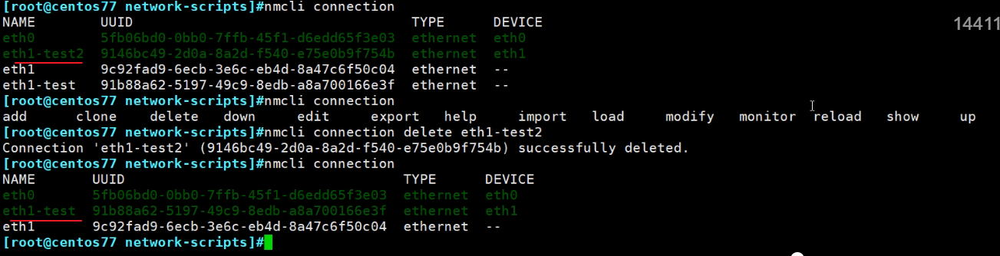

nmcli connection delete eth1-test2后/etc/sysconfig/network-scrips/下的ifcfg-eth1-test2网卡配置文件就没了。


手动删除网卡配置文件，nmcli不会自动切，还需要reload

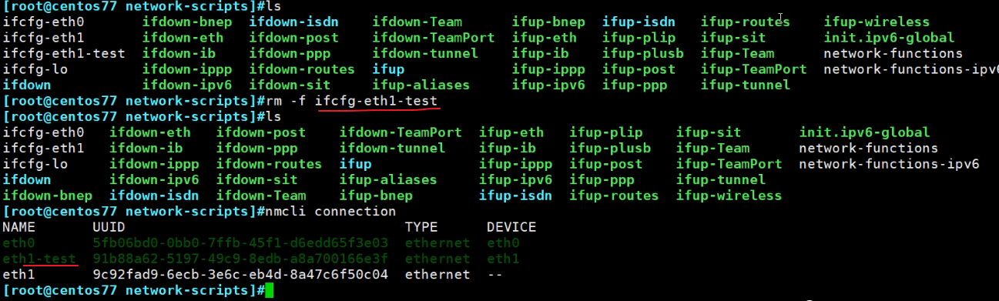

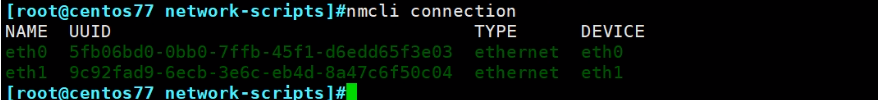 


所以总结来了

1、nmcli就是命令行来直接配置网卡配置文件的，nmcli删除创建的连接，就是网卡的配置文件。

2、如果不是使用nmcli创建\删除connection(其实就是配置文件)，而是手动创建\删除的ifcfg-xxx配置文件，就需要nmcli connection reload加载一下


nmcli强大在显示信息

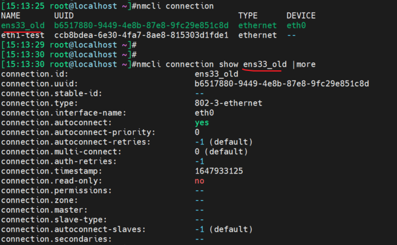


nmcli修改接口位DHCP


这样配置文件里的DHCP就修改好了


通过nmcli connection show eth1-test可见


这里的auto就是dhcp

然后在启用该配置


这个看DHCPOPTION还是不错的，什么43、150都能见着了。

不过也不是就这一种方法看DHCP的信息，还有


虽然上图是手动韩国的25.44，但是之前的dhcp获取的信息还在。

有个东西比较呵呵①新的旧的命令技术你都会②老工程师新工程师在你面前就没有优势可言③这个时候人际关系就比较和谐了


nmcli 增加IP地址


这个nmcli connection modify eth1-test +ipv4.addresses 3.3.3.3/24其实就是修改了配置文件


再加一个地址


这加的second ip，ip a可以看ifconfig 看不了，这个在上一节重点讲过了。


其他补充

 

注意哦加载(reload)是指配置文件的重新同步下：比如人工修改创建的，同步到nmcli这里


这是不需要reload的哦。


nmcli实现bonding

 

实验

1、将两个网卡都接到一个SW上，WMworkstation就是接入一个网络里

清除之前的网卡配置


开始配置

type很多啊，好友adsl、wifi、vxlan


nmcli connection add con-name mybond0 type bond ifname bond0 mode active-backup ipv4.method manul ipv4.address 192.168.37.100/24


但是已经发现远端可以ping通这个额bond0的IP地址了

 

其实原因是scope global属性导致的，只要这个设备上的接口带global属性，那么就可以背向/朝向都能ping通的。


工作在内核级别，只要流量能发到这个设备上，比如ping 192.168.37.100的ICMP到了这个设备上，那么就可以响应的。

这个ping通不代表bonding绑定成功，而是虚拟的一个网卡通了，还需要进一步绑上物理成员接口的。


上图type 后两个tab里没有bond-slave自动补齐，我的可能版本较高有的


此时就出来了，但是没有起作用，也先不捉急启用


脸厚，你没看错脸厚我们就激活一下


由于现在只加了一个eth1，所以


然后再把另一个接口加进来，


这个，如图就断了，因为ssh的这个机器的这个网卡，现在加进了bond0里了，所以自然就断了。这也是实操bond0的时候要知道的，没事，保证bond0起来就能ssh那个地址就行了。

去终端看下，已ok


同样看下 /proc/net/bonding/bond0


然后测试一下断开的效果，eth1是后面一块网卡


发现丢了1个包哦icmp_seq=309这个。


此时eth1就down，eth0就active了

 


删掉mybond0这个连接，两个成员的连接就下来了。


## 网络组

centos7比centos6多了一个网络组 新技术


network teaming和bonding一样，性能据说更好，底层技术实现不同。


**创建网络组接口**


**创建port接口**


**示例**


具体命令和bonding一样，效果一样，就是关键字改了，技术更优。


所以centos7建议用team而不是bond，6嘛只能bond了吧。

