# 第8节. 网桥实现和ubuntu网络配置


## linux实现sw

**网桥**

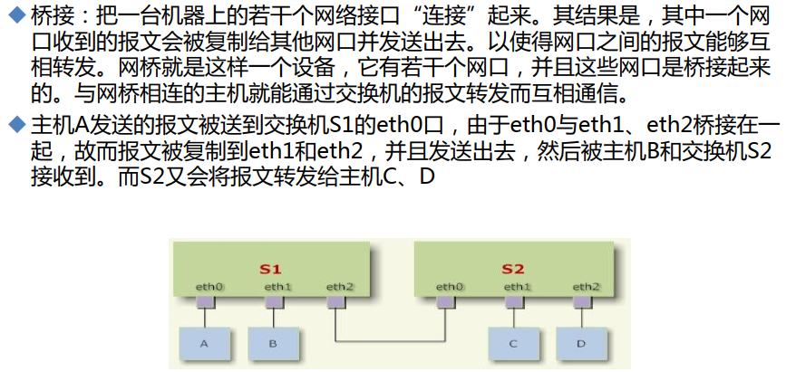


vmnet8和vmnet0按理说是VMwareWorkstation的两个网段是不通的，但是通过VM虚机的网桥实现二层互通。

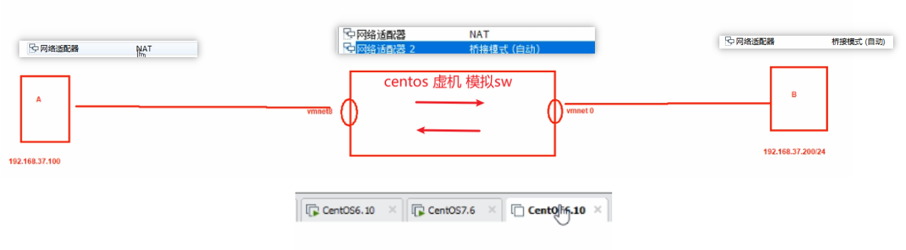

实验环境如上，下面开始配置

配置好两头的IP地址就行，请不要配置网关 我们在做二层实验


### 配置中间的机器为网桥

#### 方法1：传统命令配置，采用工具集，缺点不能存盘

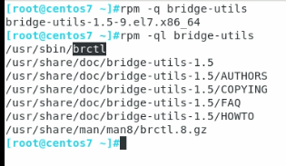 

确认已经安装了bridge-utils工具集，最小化安装时没有的

其中有一个/usr/sbin/brctl工具

将原有的IP地址等三层信息干掉，以内要实现的是二层SW的二层口

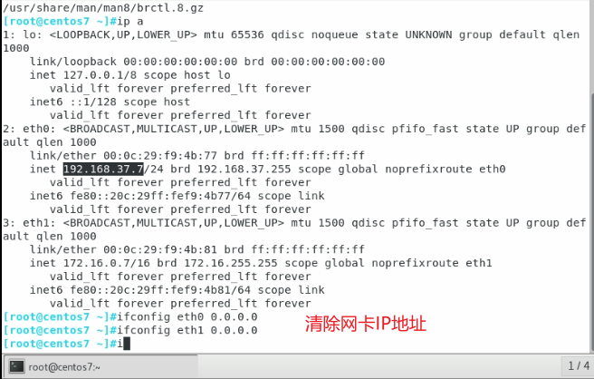


**btctl show查看当前信息为空**


**brctl addr br0创建桥接设备br0这个sw**

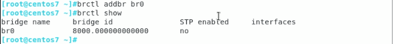


**brctl addif br0 eth0 eth1将接口加入网桥设备**


此时就其实实验就搞定了，

**还可以启用STP**


**查看sw上的mac地址**

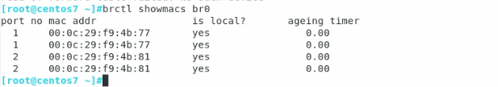

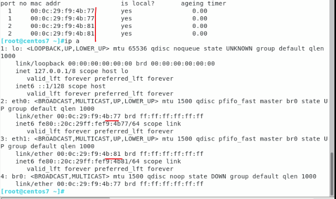

还没有学到两头的MAC地址，自然还不通，找下故障原因，其实故障原因上图👆可以看到一个br0是<font color=red>DOWN</font>的，肯定不行了啊。所以只需要ip link set br0 up就行了，哈哈大佬竟然没看出来~

两头都ping这，然后中间的sw上tcpdum抓包结果没有，看来问题不是在中间设备，这话说的，中间设备的br0没起来，就好比a----sw-----b的sw两个网口是down的，你说是不是中间设备问题，问题就是br0没有UP，ip link set br0 up即可。重要的事说两遍~


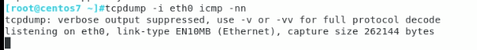


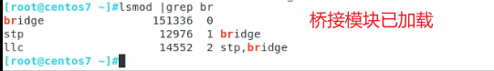 


#### 方法2：centos7的专门工具nmcli，可以存盘

上次方法1 的配置

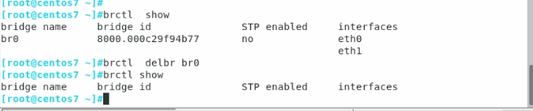

然后开始使用nmcli方法进行配置


**创建br0接口**

```
nmcli connection add con-name mybr0 type bridge ifname br0
```

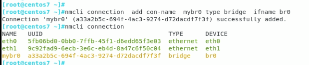


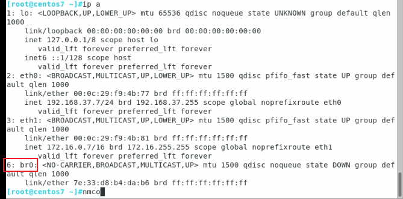


**加入成员口**

```shell
nmcli connection add con-name mybr0-eth0 ifname eth0 type bridge-slave master br0
nmcli connection add con-name mybr0-eth1 ifname eth1 type bridge-slave master br0
```


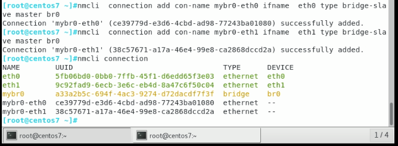


其实就是新建了配置文件

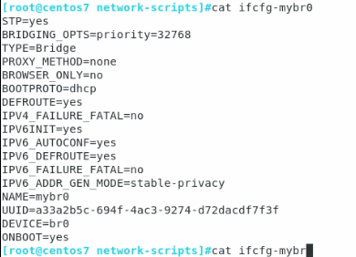


**加入两张网卡并启用网桥br0**

```
nmcli connection up mybr0-eth0
nmcli connection up mybr0-eth1
ip link br0 set up
```

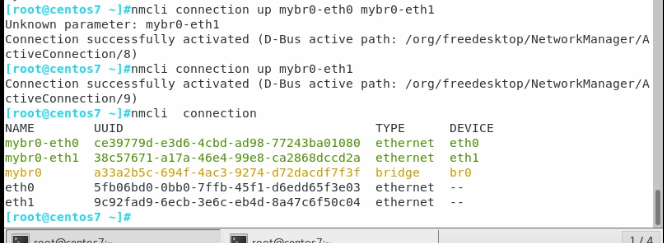

你看上图的mybr0是黄色对吧，其实在终端里是红色，也就是说是down的，是有问题。不管是什么颜色，都要up起来的。


此时br0拿到了个地址，就是DHCP的了，这个地址就是管理IP咯，类比于二层交换机的SVI口，类比于透明墙的L3地址。

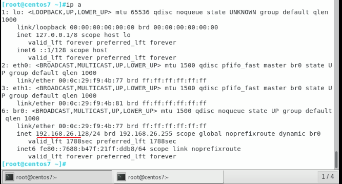

其实我在做实验的，发现一样需要ip link set br0 up 的，即使用nmcli 来做br0，一样默认也是DOWN的。


以上就可以了，均测试OK


## Ubuntu网络配置

### 网卡名的修改和centos 7一样：

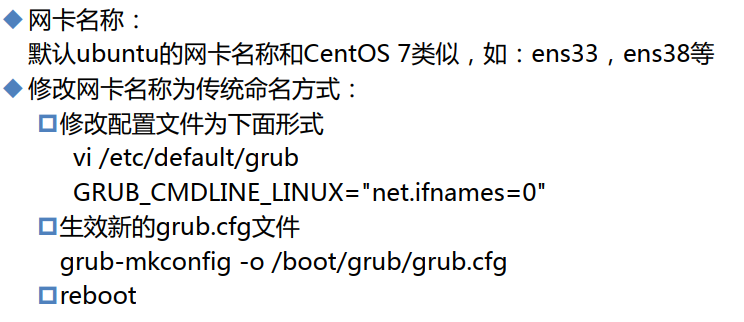 


### 网卡配置

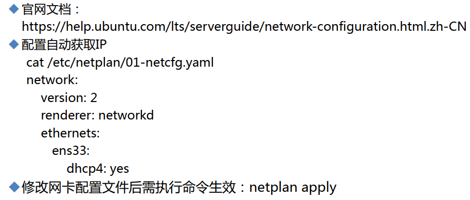

**切到root**

 


查看IP地址

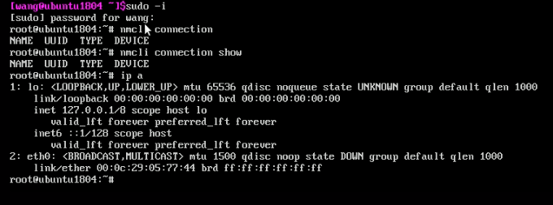

nmcli 还看不到，ip a是有接口的 目前处于down状态

尝试启用接口，并未拿到地址，

 

查看网卡配置文件

```
cat /etc/netplan/01-netcfg.yaml
```

yaml文件和python一样，缩进必须严格统一，否则报错。

查看网卡配置文件，发现写的是ens33而不是eth0，之前改过名字了，所以配置文件里的名字也要改

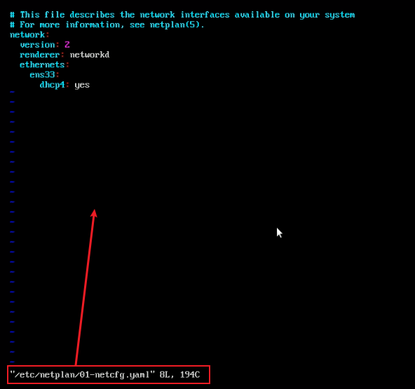


改成eth0，注意缩进两个空格

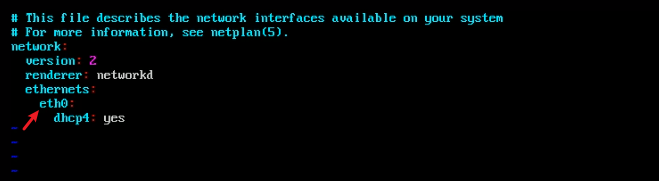

重启服务，netplan apply类似于systemctl restart netowrk。

 

此时就能DHCP动态获取地址了

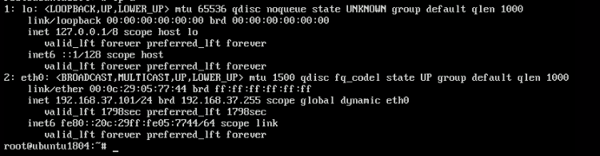


https://ubuntu.com/server/docs/network-configuration

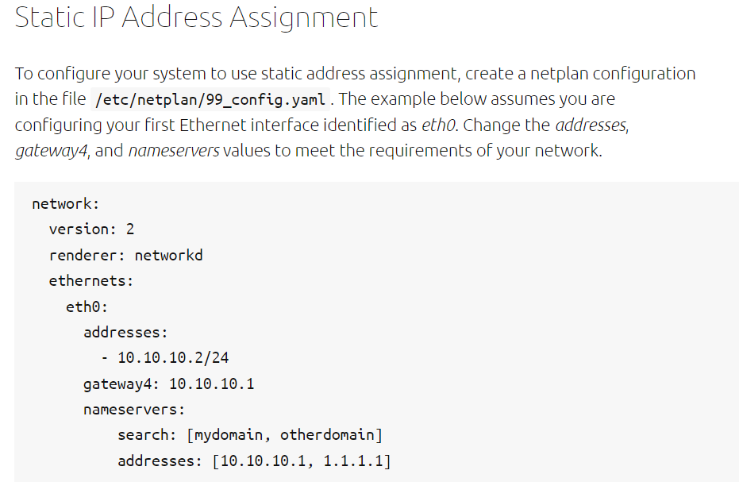

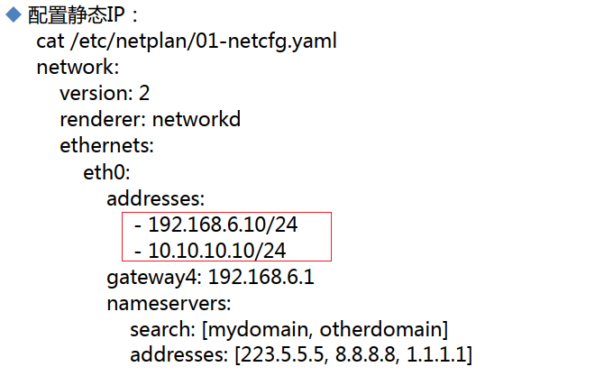


按图配置好后，重启服务netplan apply，后cat /etc/resolv.conf里是没有DNS信息的，但是实际上是在的

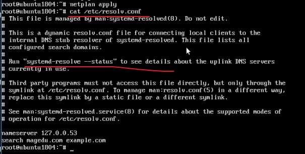

使用systemd-resolve --status进行查看具体配置的DNS信息

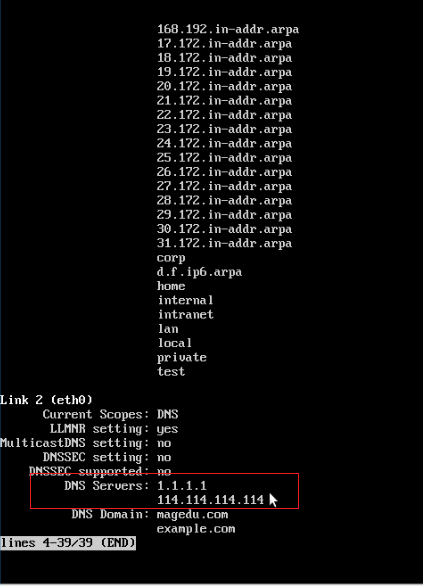 


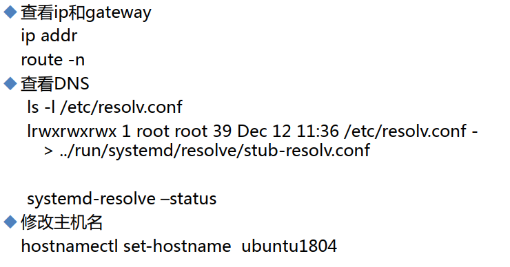


