# 第1节. 进程管理和内存分配


## 进程概念

进程，正在进行的程序，正在内存中运行的程序；若没有运行，只是安装的系统中的一个软件而已。


ls如果不运行，只是一个文件；当输入ls回车的时候，就会把这个文件读入到内存中，通过CPU读取ls程序里的一条条指令进行执行，最终命令执行完毕，结果输出，程序退出，程序在内存中占用的空间就释放，这个进程也就结束了，所以进程的启动、运行、终止，就是进程的生命周期。


此外有些程序是随着计算机开启后就自动运行的，这种进程一般叫做守护进程，表现为随着计算机启动而运行，随着计算机关闭而终止执行。也可以人为通过工具干涉自动的行为。


进程，不管是普通的进程还是守护进程，本质上都是消耗系统资源的一个单元。

此外还有线程、协程。


每个进程都会分配相应的资源：

①分配独立的内存空间

②操作系统分配唯一的编号PID进程ID

③其他属性，比如哪个用户运行的此进程


task struct ，进程运行的时候，系统会给他分配一个task struct任务结构表，这个表里存放了进程的PID、谁运行的、占用了哪些内存空间等其他信息。


task list，任务列表，就是多个相关联的task struct互相调用吧


第一进程，centos6上市initd，centos7上是systemd了

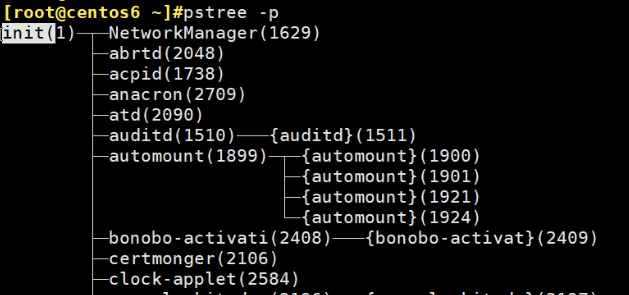

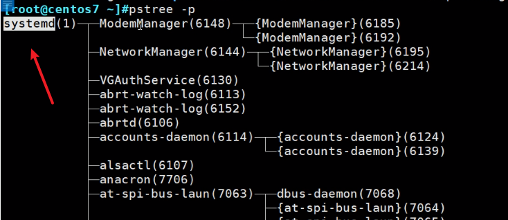


systemd不在PATH路径中，是在👇这个路径下


centos7上的init其实没了，只是systemd的软连接

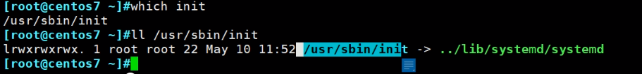

而centos6就是真实的init


第一进程开启之后，然后子进程一般都是fork()函数创建，clone()很少用；创建子进程后，一般采用CoW写时复制机制。


所谓CoW写时复制机制就是

1、父进程已经分配了一定的资源，当创建子进程的时候不会立即给这个子进程分配内存空间，也就是说👇两个父子进程都采用的相同的内存空间 。

 

2、当子进程涉及到数据修改的时候，就会立即复制父进程的内存空间，然后将子进程指向这块新的内存空间

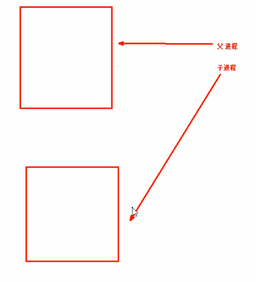 

这就是CoW(copy on write)，只有数据发生变化的时候才会产生复制的行为。

这样就比较节约内存空间。


在cp命令的说明中有提到CoW


## 进程、线程、协程

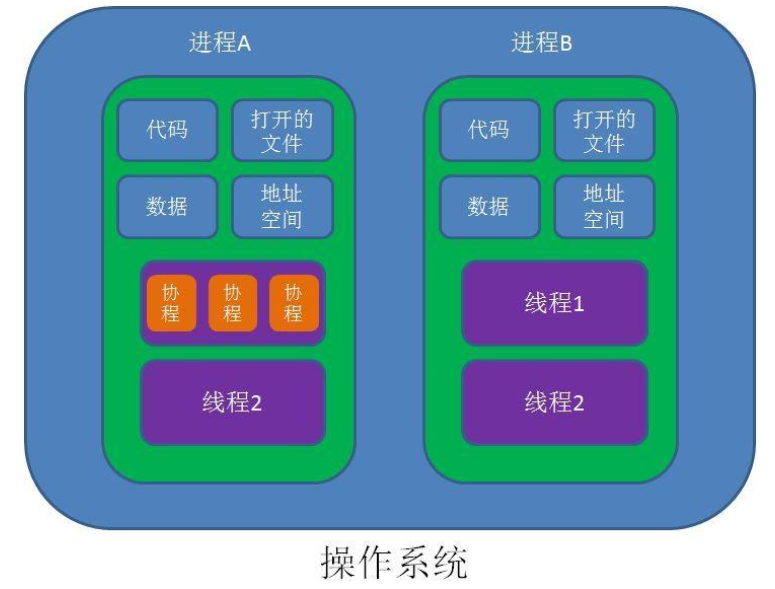

进程时独立占用资源的单位，进程A占用的资源和进程B占用的资源时不相干的。

进程相当于项目小组；

线程相当于完成项目的人，所以进程里至少得有一个人--线程。项目复杂了就需要多个人来完成工作，进程里就有多个线程了。

一个进程的任务切成多个小任务，每个任务由单个线程来完成。


线程从哪里可以看到，pstree -p可见

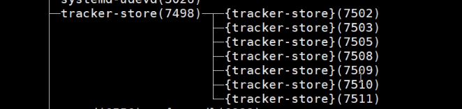 

花括号就是线程，其实花不花括号无所谓，一个线程也是线程，如下：


这种就没有多个线程，因为进程下面就一个线程，所以没有花括号。


进程、线程的资源分配都是由操作系统来完成的。

协程和开发语言相关，有的就没有协程的概念，python里有。

协程相当于线程里独立执行的一个语句块；协程的之间的调度由程序员来控制的。

▲进程和线程的控制由操作系统来完成的；协程的控制是由程序员来完成的。


进程运行必然要分配内存空间，而内存空间的分配是以页page为单位进行分配的。

之前学习文件系统的时候，磁盘上保存文件的最小单位也是4K，那里也有一个最小单元。4K是默认值，额可以修改，一般不改。

内存中给进程分配内存大小，也有一个最小单元，也就是page=4K。这个页最小单元不能改。

▲磁盘给文件分配磁盘空间是4k4k的给；内存给进程分配内存空间也是4k4k的给。


进程在运行的时候以为自己拥有所有计算机的内存空间，它并不知道还有别的程序在运行。


**MMU**是CPU里的一个固件单元，就是CPU的一部分咯，复制计算虚拟内存和物理内的映射关系，而这个关系要存下来方便快速取用的，**TLB**就是这个存下来的映射表。

在一个进程看来，使用的是系统所有的内存就是那么多；而实际上只是物理内存里的一部分，这一部分可能是连续的 可能是离散。所以虚拟内存空间自然也是线性的连续的空间了。虚拟内存空间也叫线性内存空间。


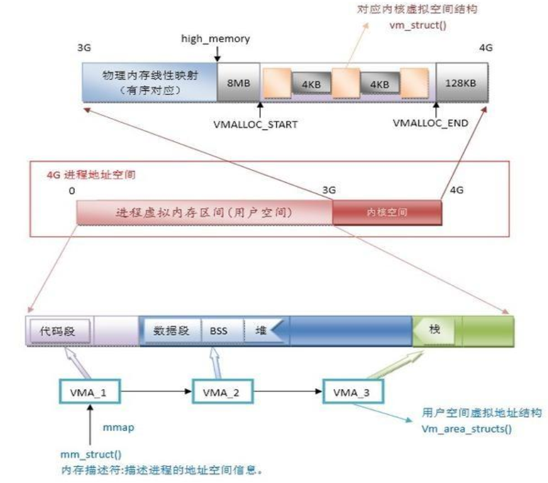

1、用户空间3个G、内核空间1个G

2、用户空间就是给应用程序用的，每个进程都使用的是虚拟地址空间

3、每个进程的虚拟空间又可分为：

​		①代码段：比如ls二进制程序代码，放在这里；

​		②数据段：比如程序运行需要的变量，放这个空间；

​		③BSS:Block Started by Symbol segment: 也是存放变量，不过是一些没有初始化过的变量，比如申明了int或者flat的变量，但是没有赋值。

 这个变量n就放在BSS里 

 这个n就放在数据段里

很好记，有值了就是有数据了，就放在数据段里了。

4、堆：存放系统中需要使用到的一部分内存空间，该空间可动态调整，算是公用的空间；需要时分配，不需要是释放。比如某些进程比如排序类的就比较占用内存，就需要分配一些堆的空间，大概这个意思咯。

5、栈：函数里用到的变量，和堆head不同在于--看下面这段吧，讲的看起还不错

```
程序的运行场所是内存，栈和堆是进程的虚拟内存中的两部分区域。

当程序被执行时，程序代码，你所创建的变量、常量等都会被压入栈空间里，栈是程序代码的执行区域。栈的内存地址是连续的且被一一记录，所以说当你创建了一个变量(比如int var = 1)，我们就可以通过var这个变量来访问变量的内容。在这里，var就存放在栈中，它的地址已经默认被编译器计算好了，调用过程也不需要你涉及到有关地址的操作。更直观的感受是数组，数组里的元素在栈里面是连续排放的，相邻两个元素的地址相差1。

而堆是不同于栈的另一部分区域，系统会给每个程序分配一部分栈空间让他们能够运行起来，问题就是栈空间必然存在不够用的问题，而堆不属于程序，堆是独立的，是公用的。只要你new，就可以得到相应一部分的堆空间。

有栈，为什么用堆？

栈里面的东西有生命周期，说俗点就是变量作用域，你在函数内部创建一个变量，函数调用结束这个变量就没了。而堆里面的东西独立于你的程序，new之后，除非你delete掉，否则一直存在。

有什么要注意？

堆里面申请的东西，是随机分配的，不像栈里面的地址都已经计算好了。所以申请了堆空间之后一定要创建一个指针保存你所申请到的堆空间的地址。不然就找不到你申请的空间了。

堆空间的东西申请好，在用完之后一定要delete掉，以防止堆溢出。
————————————————
原文链接：https://blog.csdn.net/u012460314/article/details/52355668
```


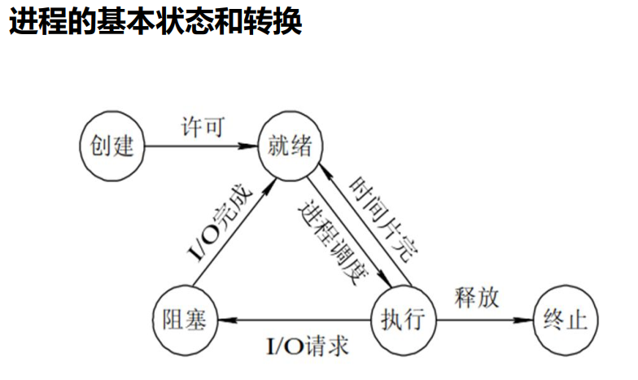

1、创建：fork()函数创建一个程序，先进入了就绪态(ready)；

2、就绪态ready：就是进程需要的资源都准备好了比如内存空间、文件、变量、代码等，准备好了CPU就可以来执行这个程序了。

3、执行态：如果进程执行时间较长，多个进程之间就存在 进程调度 ，而每个进程会分配时间片，时间片用完就回到就绪态，等待下一个时间片的分配。因为时间片特别短，所以即使是单核CPU给人的感觉也是多个程序同时跑的。

​		时间片用完，没有执行完，进程就得停止(注意这里不是阻塞哦 不要理解错了，然后这里的停止不是普通意义上的停止就是不断地保存现场和继续执行地过程)，就需要保存现场--将执行的状态保存下来，待会下一次时间片分配了继续执行。这存在一个状态切换的过程，就会带来一点资源的损耗，比如CPU的寄存器的值的存储和清空以及再次读入。

4、阻塞态：进程执行中如果涉及磁盘IO，磁盘IO的耗时远远大于CPU的，所以这个进程就停在这--阻塞态，等磁盘IO的结果出来 再继续执行。

​		注意阻塞态完了后 也就是得到结果了 I/O完成了，程序是进入就绪态，才能得到时间片继续运行，所以说阻塞态的进程停在那，实际上也就是现场保存在那，等I/O的结果在继续要时间分片。所以阻塞态必然是进程停止的--这个停止不是kill也不是systemctl stop xxx，而是“不再续杯时间片”的保存现场，I/0有了结果才会去进入就绪态去要时间片去继续执行程序。

5、终止：此时程序执行完毕，所有占用的资源得以释放，比如内存、占用的文件等。


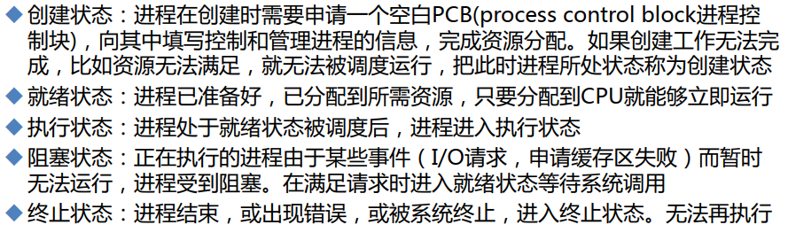


## LRU介绍

Least Recently Used 近期最少使用算法，释放内存

在系统中很重要的一个内存使用算法

https://zhuanlan.zhihu.com/p/34989978

不管是大佬讲的还是博客写的，其实主要的理解思路就是：读取数据时从硬盘--写入内存---从内存读取到屏幕打印或者其他输出，

然后PPT也好，博客也罢的图片，都是站在从内存读取数据的角度出发去谈这个事情的，比如读取4 内存中有就调到最优，读取1 内存中没有就压栈的方式，垫底的淘汰掉。

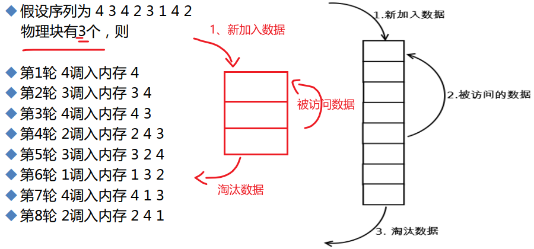

上图的物理块 说的就是内存块的意思。


LRU这个近期最少使用就释放掉的短发，经常用于缓存的处理，

数据从硬盘里读入到内存，再从内存中读取到所需之处，为了提高效率 就会在内存中开辟一处空间用来存放数据，LRU算法就应用于这个内存空间，从而就得到了常用数据就放在了这块空间。而这个空间就叫缓存cache。


```
面试官-问：常说的经常用的数据放到缓存中，是怎么就做到的，怎么就把经常用的放进了？

你-答：LRU及变种，回答完毕。

面试官-心里想：被他装到了。
```

其实这会我学到这，我想搜索LRU及其变种还有之前看到的LFU的具体解释的，但停了一下，判断了一下，不是懒的去查，而是继续往下看，后面看需要再 在这个点上继续深入就好，进一步思考，很多时候大脑需要的是停一下也就是冷静的思考能力，不是被某一个情绪左右，这其实就是真正的自由


学到这，思考一个问题，既然内存都是虚拟内存\线性内存，也就是每个进程认为是独享的内存-是独立的，那么进程之间要互相通信，也就是内存要互相能访问才能互相通信对吧，所以就需要进一步在内存空间上做文章。

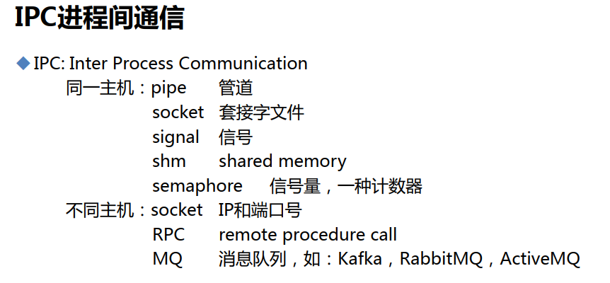

在进程内部的多个线程之间通信还是比较容易的，因为它们都是公用一块内存空间的。而进程和进程是互相独立的内存空间。


## 进程之间通信分两种

### 1、两个进程在同一台主机上

#### ①pipe管道：

比如没有名字的--匿名管道，如：|，<font size=2 color=green>题外话这个"|"念啥你们知道么，哈哈~</font>

比如有名字的管道--表现为一些文件，如p打头的


具体就是，进程A把数据传给管道，进程B从数据读取管道。这样两个进程之间就可以交互信息了，思考--这里面是否存在半双工问题啊？是的，是半双工的。

如果希望同一时刻，两头都可以发送数据--全双工，就要用到socket了。

#### ②socket套接字：

socket套接字也分两种

a、unix**套接字文件**s打头的文件，这是一个全双工的管道


b、**ip+port socket**，<font size=2>这个写到下面的两个进程不在一台主机上片段里</font>

### ③signal 信号

通过一些命令可以给进程发信号，而进程收到这个信号以后，会按信号的定义去操作。

比如，sleep 100的时候

 

 

这个ctrl c 就是向这个sleep发送了信号导致其退出。

至于信号有哪些种类，有什么作用，第4节再说。

#### ④shm: share memory

共享内存，进程和进程之间共享内存

堆是不是就是共享内存呢？

#### ⑤semaphore：信号量，一种计数器

比如有10个资源，100个进程使用，当然一个资源同时只能被1个进程使用；

如果此时10个资源全都被占用，此时这个semaphore计数就为0；

如果有个资源释放出来了，此时semaphore技术就为1；

以此类推，通过这种方式，进程之间也能通过信号量这种计数器知道资源的使用情况，从而合理分配资源，从而实现了资源的使用上的进程之间的沟通。

### 2、两个进程不在一台主机上

更多情况下，两个进程并不在同一个主机，

#### ①其中就有socket里的ip+port这种方式。

<font size=2 color=red>提到ip+port，就会想到"面向连接"和"无连接"这两个叫法，一个是tcp一个是udp，而连接就是双方的信息在彼此的内存中进行动态的持续的维护；无连接--就是仅仅初始化 但是不维护咯。比如TCP的滑动窗口，重传这些都是连接这个概念里的内容，UDP显然没有维护这个概念。</font>

<font size=2>https://www.ietf.org/rfc/rfc793.txt里搜索connections关键词可到标准定义</font>

<font size=2>国外的文字表达再翻译国外，往往需要咀嚼一下，比如面向对象编程，面向过程编程，面向连接的TCP，这里的面向XXX，可以体会一下</font>

<font size=2>而面向连接，这连接在了、初始化了，面向它，就意味着要表达它维护它；UDP才不会面向连接，自然不会维护它。了解，这就是最底层的思维，丝滑了把，舒服了吧，无用了吧，费时间了吧，有点点意思了吧。</font>

IP是确定主机，port是确定进程服务，这种sockt是比较底层的方式，一般开发不这么用，比较多地是使用RPC和MQ来实现不同主机进程之间的通信。当然PRC和MQ的底层还是socket(ip+port)。


#### ②RPC: remote procedure call远程过程调用

情形如下，A上的程序执行一段；然后把数据发给B，调用B上的程序继续执行，得到结果 回传给A；A拿这个结果继续执行。这就是远程过程调用。

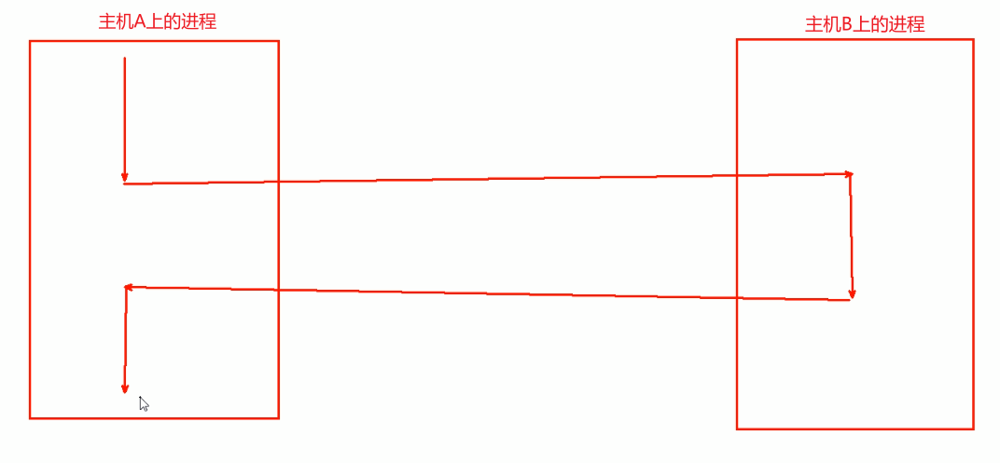


#### ③MQ： 消息队列

左边每个进程A B C 想互相通信，可以通过右边的MQ消息队列来中专，你写我读，就可以了。


## 进程优先级


<font size=2>注意，在实际系统上优先级不是0-139，而非实时进程的优先级100-139转成了nice值-20到19同样也是比小的。</font>


优先级分为 实时优先级和非实时优先级；

<font size=2>是这样表达的，进程分为两种 紧迫性高的和不高的，高的就是实时处理的，就叫实时进程，不高的就是普通进程。针对实时进程需要优先调度也就是优先级高0-99，这种优先级也叫实时优先级。</font>

1、realtime实时进程的调度方式：

①优先级高的会抢占优先级低进程的资源，0-99比小，0最高；

②如果两个进程优先级一样就遵循FIFO或RR。

​		FIFO：谁先来，就先处理谁；RR：轮询 每个同优先级的进程互相轮着来。


2、非实时进程也就是普通进程的调度方式

应该也是一样的队列机制肯定也有FIFO\RR的。


优先级也是按时间片的规则来的，也是存在时间用完就要暂停的情况的。

原则优先级的比较也是存在一个排序的，而排序就要用到什么冒泡、插入等排序的方法，这样就导致花费CPU花费时间的 效率较低，所以实际会存在1-139个队列，将对应的进程划分到不同的队列里去，从而直接达到了排序效果。

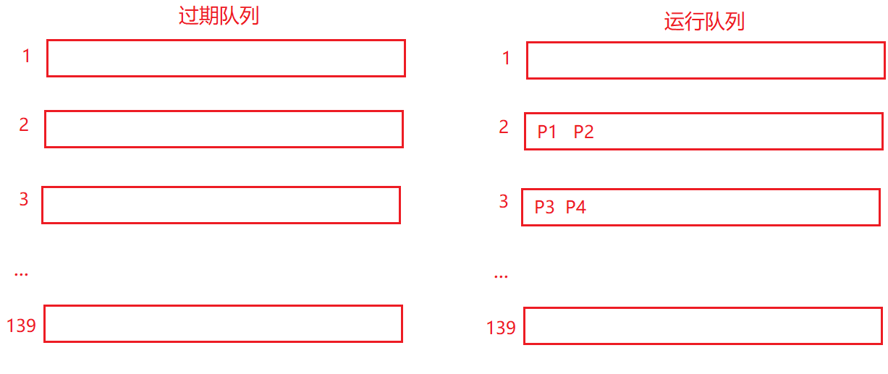

当P1进程时间片消耗完后就把P1放到过期队列里，P2时间片用完也移入过期队列；当运行队列1的进程都没了之后，该队列空了 从运行编程过期，此时将过期队列2变为运行队列。


显然这里的队列机制，和我们网工学的QoS的队列类似的，但是这里大佬讲的太浅了，有机会所谓机会就是需要用到的时候，可以再搜一下相关资料。


## centos中优先级情况，主要是显示和修改方式

system的优先级 和 命令查看的结果 并不一致，下图是大佬总结的


chrt命令用来修改realtime的，全称就是change realtime，

注意一下👇centos chrt写99就代表0优先级，0就对应上面的99优先级，其实就是centos 优化了一下变成越大越优╮(╯▽╰)╭

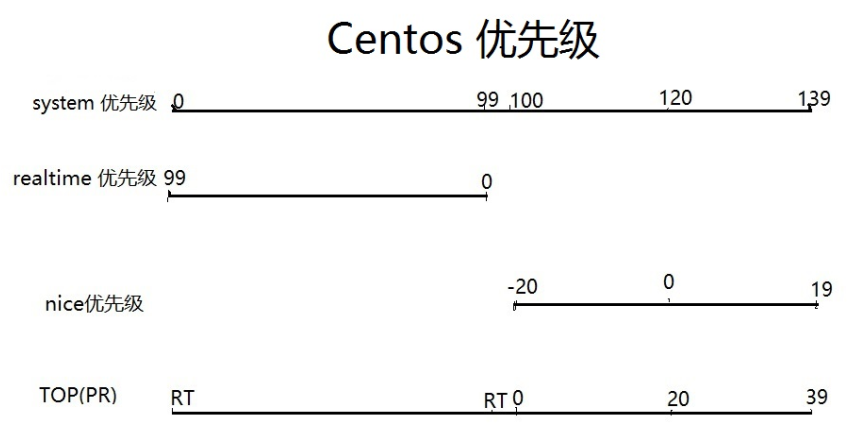

问题来了：上图中，值是越大越优，还是越小越优。回答：越左越优，屌不屌~。

system优先级是0-139区间，但是对应到命令后往往不是这种大小，这个要注意的。

centos的命令

1、chrt命令：是修改realtime；

2、nice命令：就是修改nice值得；

3、top命令里的PR列：看法又不一样了；

4、所以有这里有个小市场--就是写个脚本统一下，哈哈。


TOP里的PR，别看错了，不是NI。

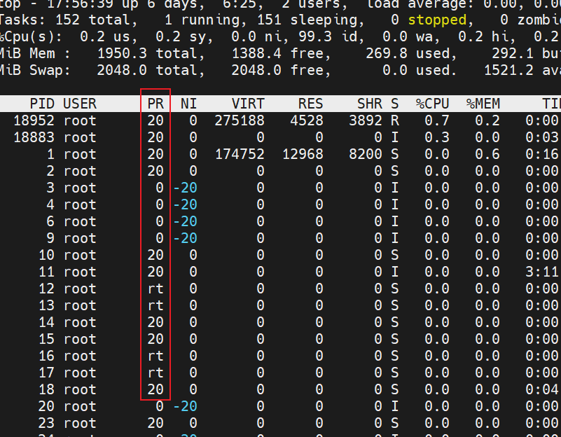

上面讲的PPT如下“：

  

Big O是啥哦？

进程数量不同，最终的比较的效率存在高低的，存在一个时间复杂度，和软件开发的效率有关，大佬如是说。 

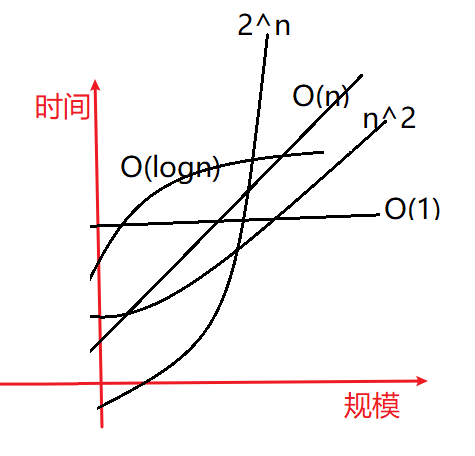 

工作效率是


当数据量达到一定规模，很多以前正常的工作的，后面就开始出现莫名奇妙的问题了，这就是时间复杂发生了变化，计算不过来，自然各种问题就出来了。这确实挺吓人的哦，你想从故障找规律好像是不可能的了，因为没规律可言了就是处理不过来了。


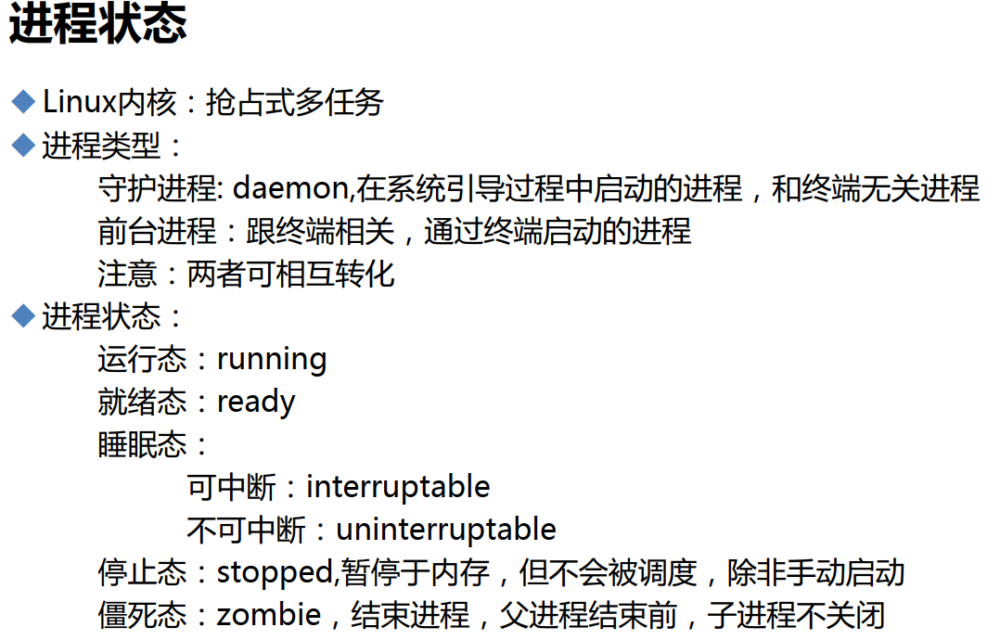


**抢占式多任务和协作式多任务**

**抢占式多任务**：是按照时间片分配资源，进程的时间片消耗完，CPU理解被内核拿回来，然后继续分配，不会被某一个进程卡死了就一直占着资源。

**协作式多任务**：早期的dos，就是没有时间片的概念，就是一个进程执行，就等他执行完，才释放资源。这样会导致某个进程出问题，连整个操作系统都僵在那了。所以以前老版本的windows动不动就蓝屏死机。


**前台进程和守护进程**

前台进程依赖于tty线程，所以有2中处理方法

<font size=2>注意console就是本地终端登入的不存在这个情况哦，你怎么关，无非是关闭控制台嘛，关了再进去ping还在的</font>

1、nohup xxxxx  & 记得exit安全退出终端，否则不生效

2、screen稳当就是显然没有nohup一条命令帅气

**守护进程**不是用户登入上来运行的，所以不存在tty关闭就终止的情况。


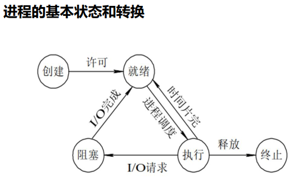

进程状态除了上面已经讲过的，还有

**睡眠态**：

可中断--睡觉，叫一下就醒来了；

不可终端--冬眠，回暖才会醒过来，就等着你的IO结果，放到内存里了拿到结果了，它才会继续工作否则只能在这等着。

**停止态**：冻僵了？消耗资源不，既然暂停于内存 还是消耗点点资源的吧？不过不会消耗CPU，因为不会有时间片分配给它。

**僵尸态**：异常状态，正常就会释放资源，但是僵死，还是占用内存资源的。因为已经死了，kill也杀不掉了，也激活不了，只能重启计算机处理这种异常状态。


举例mingetty就是 登入界面 的提供程序

 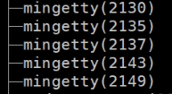 

 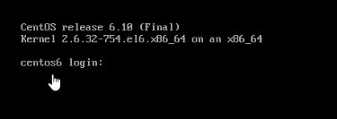 

上图一直不登入，这个程序虽然还在运行，CPU是否消耗-否，内存是否消耗-是。

ready是什么都准备好了，就等CPU的时间片了。上图是还差输入ID的，显然还没有准备好所有条件，还不是ready就绪态，还不给它分配时间片也就是CPU的使用权。

所以大部分的进程都是睡眠态。可以唤醒，键盘输入回车后，就发送一个 让他进入就绪态。这里应该有个点，就是睡眠态如何进入ready态。一旦进入就绪就等待CPU的时间片进入运行态。


## 进程分类

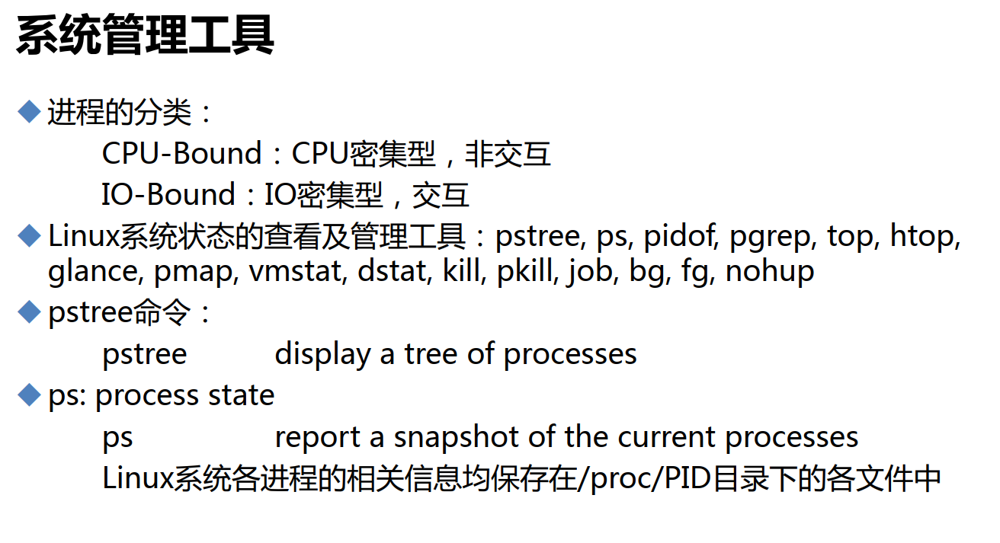

1、CPU密集型：CPU消耗大，内存硬盘消耗小，比如数据计算、编译安装等

2、IO密集型：磁盘靠大文件，CPU就发个指令就完了，但是大量数据需要从磁盘考入内存，然后内存到网卡发送出去，这就涉及IO。


早期的时候CPU是参与IO的，说明如下：


1、CPU发送cp f1 f2复制指令后

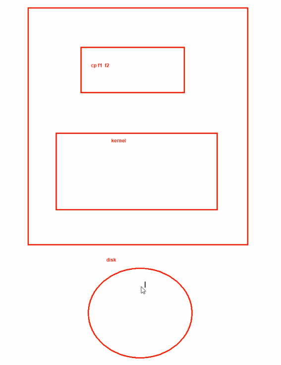


2、这个过程中，所有的数据全部要经过CPU，当然这是在说以前

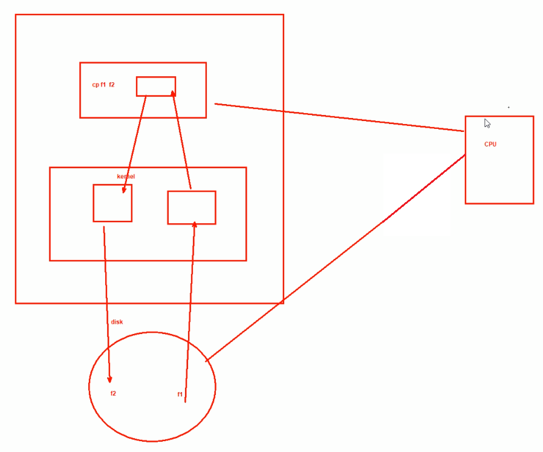


3、现在内部架构发生了大变化

CPU只需发送一个指令给DMA，然后DMA就去完成磁盘和内存的数据交互。

这里后面重新画图吧。

DMA有了，CPU就不忙了


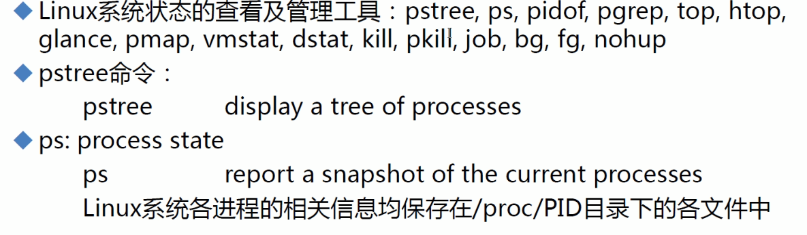

到底是CPU忙、IO忙还是网络忙，通过命令去排查。


