# 第4节. 进程信号和前后台管理

在本章 第1节中提到了信号 可以实现 进程之间的通信

信号有很多种，trap -l或kill -l可见信号的种类

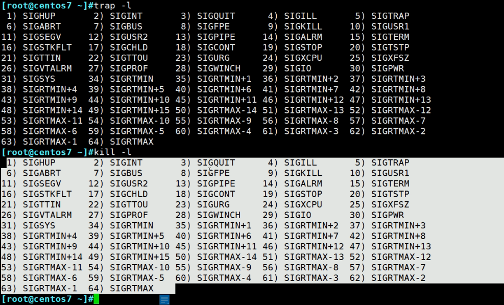 

每个信号都带有特定的含义，这种废话以后不要说，

**如何向一个进程发送指定的信号呢**，可以使用kill命令发送信号

1、信号的名称如上图，你可以写全名，也可以省略掉SIG这种所有信号都有的前缀，比如**SIGINT**可以写成**INT**还可以用前面的**数字编号**

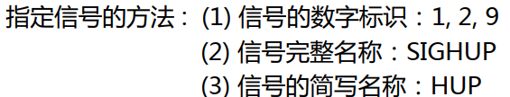  

## 1 SIGUP 无需重启服务，重新读取配置文件

这个一些服务里有命令的，估计十有八九就是用的这个UP信号实现的。

有个什么reload的命令来着，记不得了

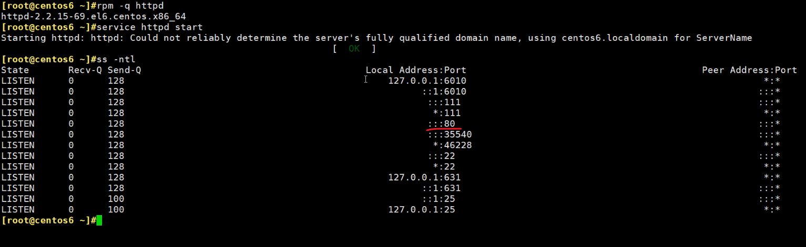 

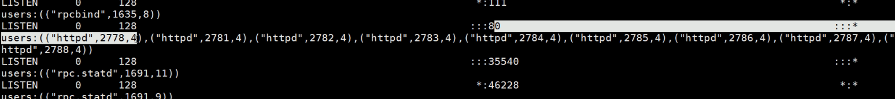 

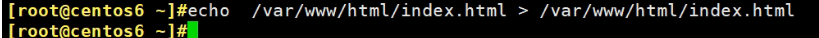 

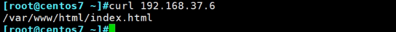 

准备将首页信息放到这个地方

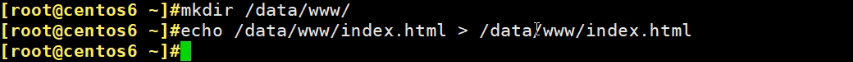

这就需要修改配置文件：

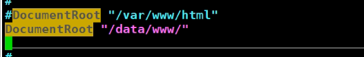 

centos6这样就行了，7可能还要加一段代码

配置文件改完，一般就是重启服务，但是现在可以这样

查看httpd的进程ps aux：

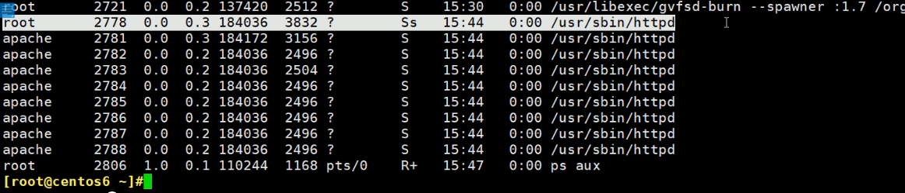

其中root那个是父进程，可以通过ps auxf 就能识别

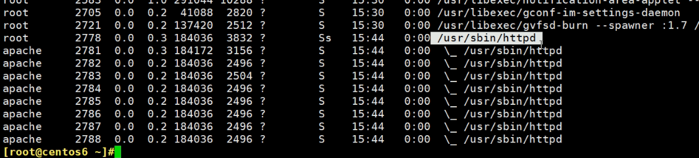

所以PID就是2778

kill -SIGUP或kill -UP或者kill -1 都行

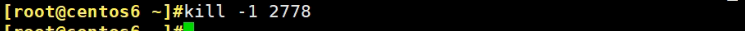 

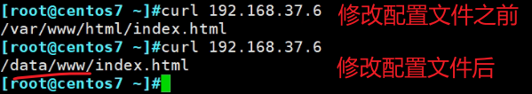 

## 2 SIGINT 相当于ctrl c

一些需要ctrl c的情况

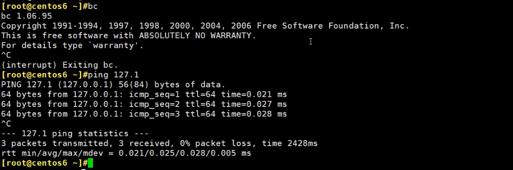 

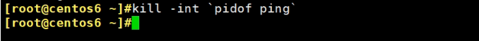 

然后那边的ping就终止了

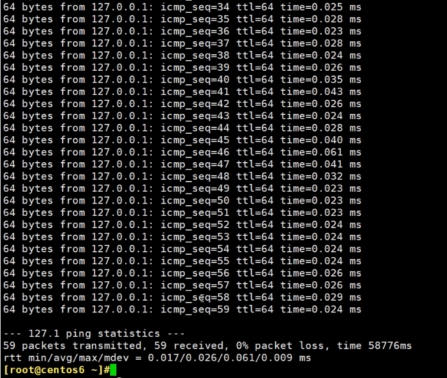

## 3 SIGQUIT 相当于ctrl \

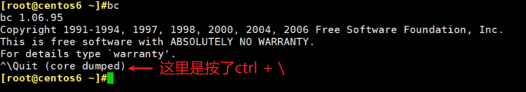 

相当于quit退出

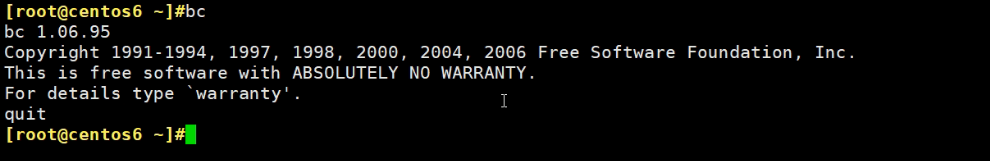

所以用信号测试一下，下面bc挂起来

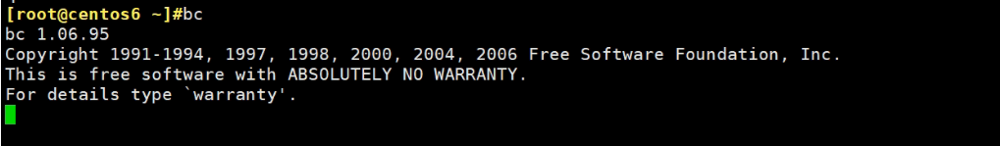

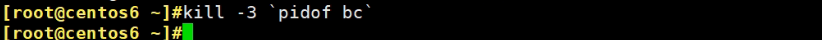 

然后就quit退出了：

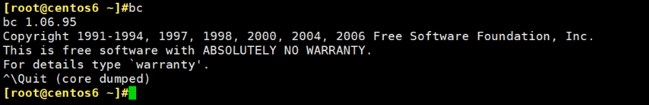 

上面就看到INT和QUIT可以关闭进程，但有些进程不一定能关闭

vim 一个文件 进去后

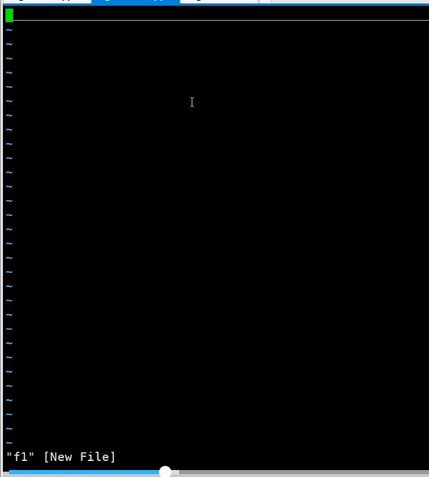 

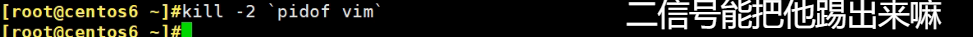 

踢不掉的，

再发3信号，发现可以的

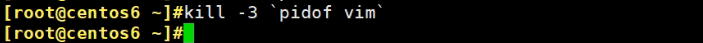 

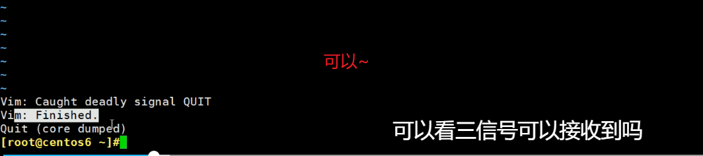 

kill -3 后vim里的内容就 没了？不一定，你在他kill 之前w!保存了就可以。

如果是vim下按i进入了编辑状态且有修改内容，那么kill了就会产生.xx.swap文件

## 15 SIGTERM 终止进程，kill的默认信号

kill \`pidof xxx\` 等价于 kill -15 \`pidof xxx\`

 

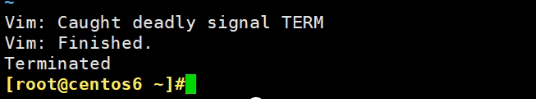 

 同样15信号也可以杀vim进程，也不是所有进程都能被其关闭的。

比如bash的进程，kill -15就杀不掉

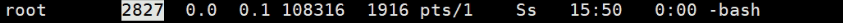 

 

不会报错，但是实际上杀不掉的，还在：

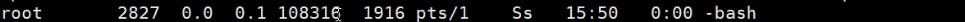 

可以换一个强力kill就是-9

## 9 SIGKILL 强制杀死正在运行的进程

进程就是正在运行的程序，正在运行的进程本身就是废话

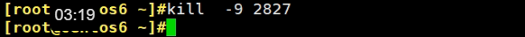 

这个2827是bash，所以xshell的登入的一个窗口 直接就没了。

这个是窗口多开后进行的操作，杀的是别的窗口，自己的窗口查看方式：

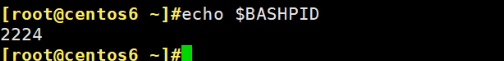

ps aux 可见

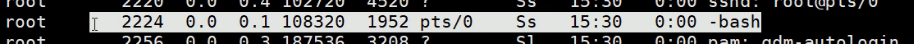

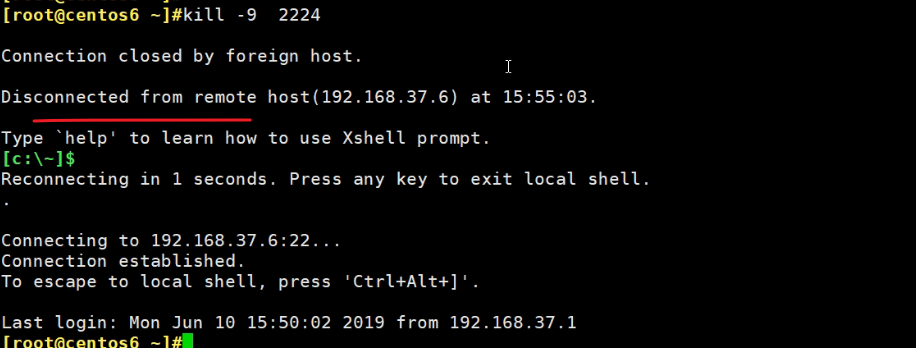

直接就把自己的bash就干掉了，不过上图是有个1s的重连才会自动连接上的。

## -9是否能杀掉所有进程

比如说systemd是否可以被-9强杀

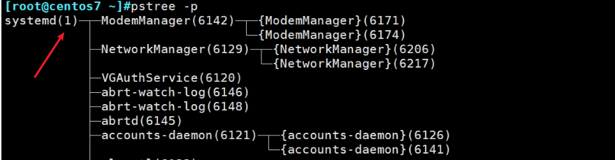

kill 1肯定不行，等价于kill -15 1, 这是15的默认值，kill -9 1也一样杀不掉

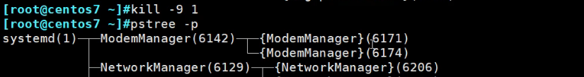 

虽然杀不了，但是存在问题的。

pgrep -l mingetty

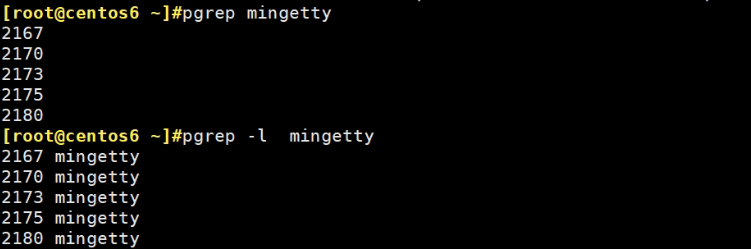 

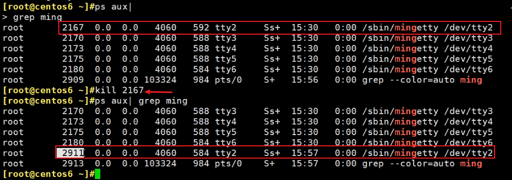 

杀了，又再生了，

这种进程就叫再生进程--respawn ，杀不死没事，看下父进程

pstree -p看下mingetty的父进程是init

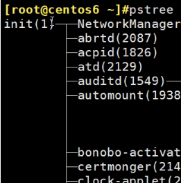 

 

这种重生进程，其实可以杀，通过kill 1 一下父进程--父进程虽然不会被杀(kill -9 1也杀不掉)，但是你继续看

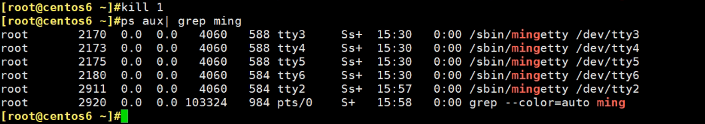 

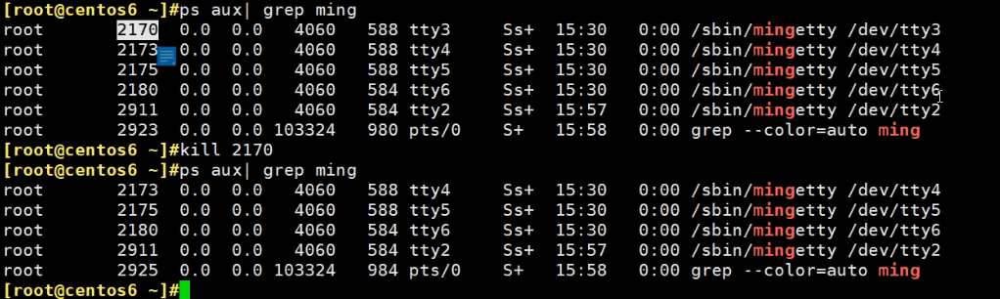

此时就杀掉了，所以init和systemd不是说杀不掉就可以杀的，还是会有影响的。

mingetty其实就是登入的终端，ctrl_alt_f3对应的就是tty3已经被杀掉了，所以下面的界面就卡住了，输入回车都没有反应了。

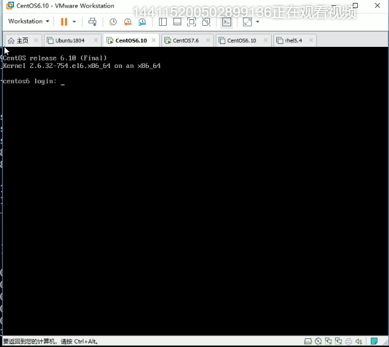 

换一个ctrl_al_f4可以的就是tty4

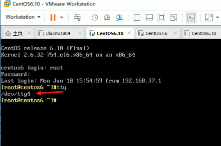 

有后台的进程才有再生功能，mingetty能再生，是因为有init做后台。

## 批量杀进程

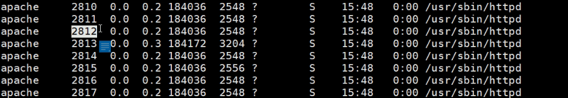

killall httpd  # 使用进程名称来杀

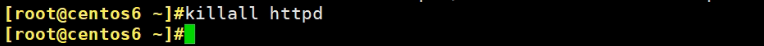

所以到这里就学习了

1、按PID杀，kill

2、按进程名称杀，killall

下面学习3、按模式也就是正则杀，pkill。

### pkill的模式和选项和pgrep是通用的，它俩的帮助都是在一块的。

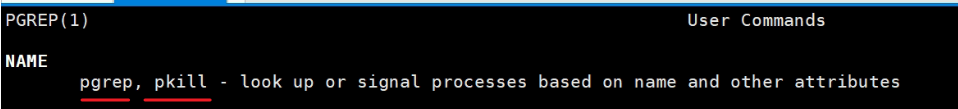 

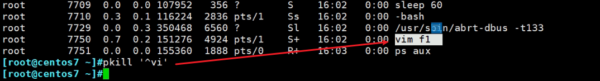 

然后就杀掉了

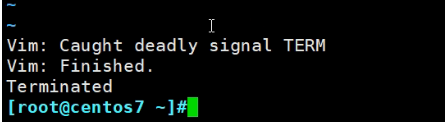 

t就是看控制终端的tty的

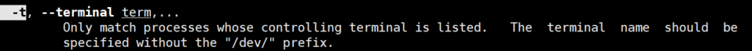

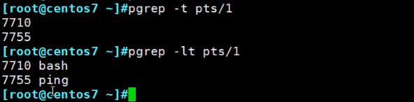 

杀掉pts/1行运行的所有进程

 

其实图中要用-9,pkill -9 -t pst/1就可以删掉所有能杀掉的了。否则bash杀不掉。

然后去到运行ping的窗口上看到，就看到被杀掉了。

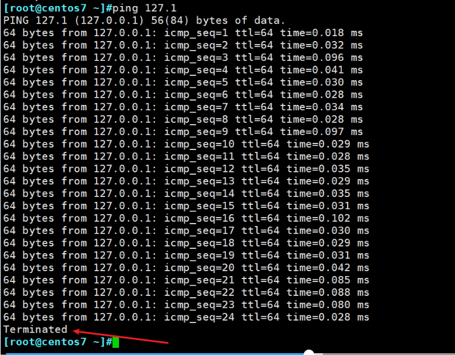

 

这两个只有pgrep有，pkill没有。

## 进程的前后台

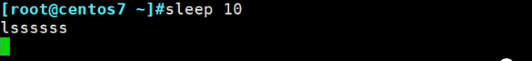 

这个就是占用了终端资源的前台命令

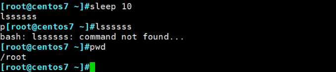 

放后台的方法

这就已经放后台运行了的，但是输出还是在前台输出的。

前台执行是占用终端资源的，后台不占。

此时跑是在后台跑了，但是输出还是在前台，所以ctrl c结束不掉了就，ctrl c只能结束在前台跑的进程

怎么关呢，①再开一个窗口，kill掉ping就行了，②将后台运行的进程再次调到前台来就好了。

手速要快

### fg 命令就是front groud

 

既然在前台了，ctrl c就可以了结束了

fg可以把后台的进程也可以是没在执行中的后台程序调到前台来。

---

再次研究这个现象

ping 127.1挂着，当前ping的状态是可中断的休眠

然后按ctrl z，此时就放入后台，但是不在是运行状态了

 

 

T就是后台，处于停滞状态，冷冻？

## 如何恢复:1、恢复到后台运行bg；2、恢复到前台运行fg

开始操作，当前通过jobs可见是后台stopped

 

使用它bg命令back groud，此时就恢复到前台运行了

 

所以此时ctrl c不起作用，ls看看的

下面是通过fg直接恢复到前台的。

### 再来一个问题 已经是后台如何让他stopped

如何将已经后台的进程--正在跑着的，变成继续后台但是是休眠态

由于此时已经是后台了，ctrl z发不到后台了。

发19 SIGSTOP，后台休眠信号。

killall -19 ping

 

 

确实停止了，达到了ctrl z的效果。

还可以让他继续运行，除了bg或者fg，还可以发送18 SIGCONT信号，由于现在是后台stopped，所以18发过去就是后台运行

 

 

但是没有办法说 发个信号让他从 后台stopped变成前台运行哦。

 

### kill的0信号

0信号是不属于信号列表的，通过kill -l可见没有0信号的

 

killall和kill是共用信号数字的

 

这说明ping当前是工作的

如果ping没有运行，就是这个结果

 

案例：如果http服务没有启动，就重新启动

这个可以放到crontab里1分钟跑一次，确保一些进程莫名奇妙挂了，这个情况也是存在的。

假如某个APP挂了，等个1分钟也就自动好了，就是这里的crontab，不过前提是systemctl start httpd要能起的来哦，如果配置文件有问题自然就起不来了。

关于screen和nohup ping & 两种后台执行，直接搜全文，都有的。

 

这个默认行为不好，因为文件会越来越大

需要丢到/dev/null里。

 

 

窗口一关，bash就没了，ping也就没了，其实不是

 

父进程bash8292没了，但是ping这个8401子进程还在，父进程没了，重新找了个父进程systemd。

其实视频里漏掉了exit安全退出，否则有时候不会后台运行的。当然这里的实验没有问题，但是我以前必须①nohup cmd > /dev/null $ ②exit才行的。

### 作业操作

 

kill %xx  # 注意是是作业编号，不是进程编号

 

 

## 并发

这么些是按顺序，而且由于linux默认就是永久ping的，所以结果只会有127.1

 

 

注意ping -c 3这钟不好，我们一般都是ping -w 1，其实就是我啦，因为-c 1 万一不通，就会等好久才会给你一个结果说不可达，-w 1就是1s没有结果就认为不可达了，这个就够了，就是合适的。

### 并发-方法1

 

 

bash all.sh瞬间出来下图

 

改成-c 3 多ping几次看看

 

方法2、3就是子进程后台、线程后台

 

注意上图看着以为是脚本，其实可以是命令

 

