# 第7节. SSH服务配置和基于KEY验证

**默认的ssh登入方式**

关于SSH第一次链接的安全性，即解决方案：
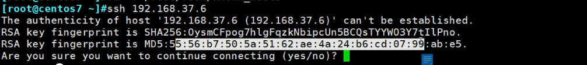
你可以见Server端的公钥用HASH算一下，将值公布在网站上，CLIENT去链接的时候对比一下一样再yes。SSH后续连接就是安全的了。（*其实谷歌AWS等都不是这种方式了，都是用的公钥文件，下文讲)

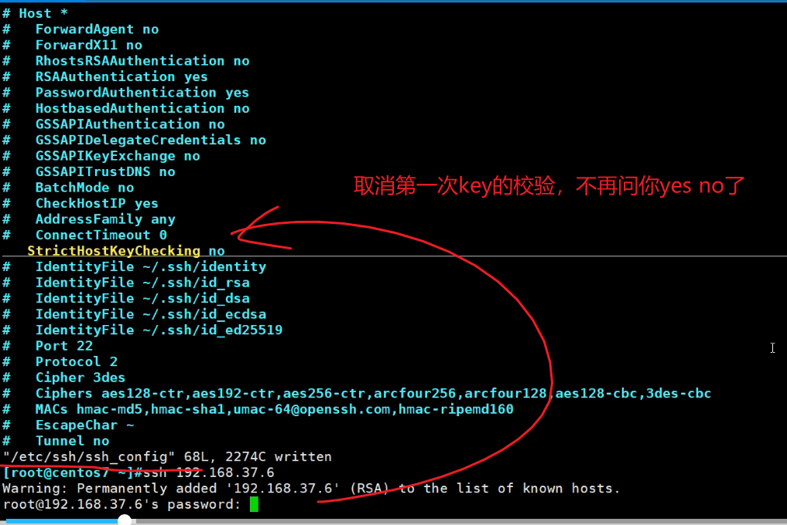

 yes的作用就是，就是把对方的公钥放到的.ssh里。 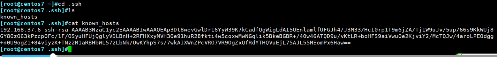

 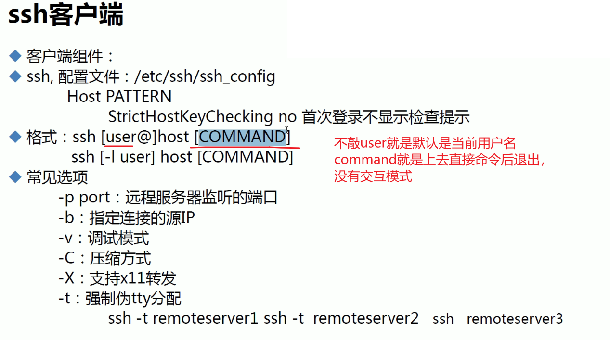

 -b 比较牛哈，ping知道怎么带源，ssh也要知道哈。
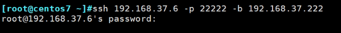

 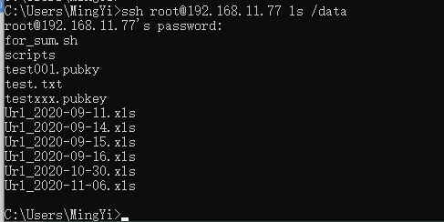

 **关于Xclock所代表的X协议**
 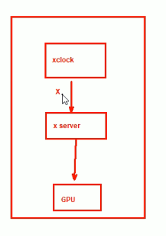
 xclock代表的client端
 xServer就是服务端
 两者是通过x协议沟通，
 图形的显示是通过server上的显卡实现。

 xClient和xServer不在同一台电脑的场景，比如我A ssh B 登入后，输入xclock这个谁是server谁是client呢
 A是server，B是client，因为登入到B上进行xclock，而要显示时钟图形界面是在A这个server上的。
 A和B的X协议是通过ssh协议封装传递的。
 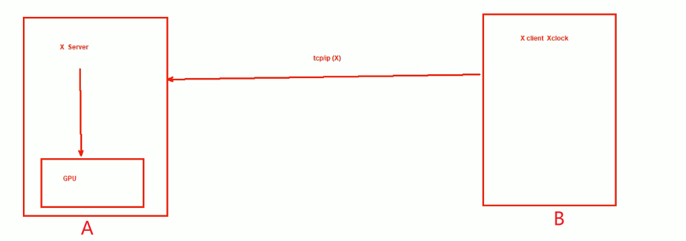

 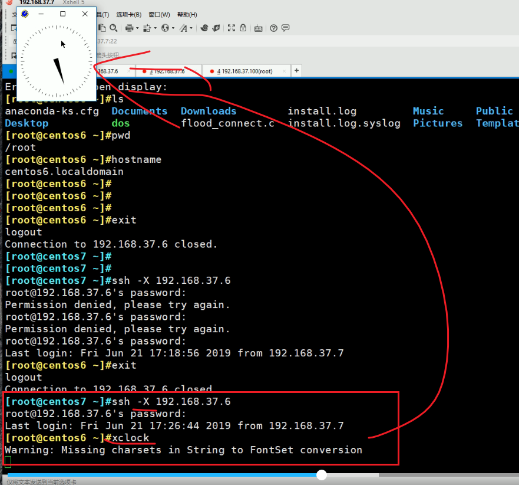

 注意：如果server端不是xshell，而是scrt软件，就不行了，因为scrt没有给你安装X协议server。xshell是xmanager一套软件安装的，是默认安装了x协议的。

 windows没有xServer，xshell安装的时候默认安装了xServer，secureCRT没有xServer要额外安装软件的要注意的。
 xshell不是单装的 xshell而是安装的xManager，所以带了xServer软件

 

 **改MAC地址的一个案例**

 当你改完网卡配置文件后还是改不过来的时候可以试试下面的方法：

 modprobe -r e1000，-r是remove掉网卡驱动，通过ip a发现没有卸掉网卡
 ethtool -i eth0 ， 年后看下是哪种模块，请认真学习噗冬伐
 modprobe -r pcnet32，找到驱动了，进行删除
 modprobe pcnet32 重新安装驱动，mac得以刷新
 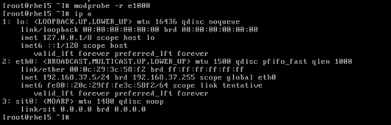

 

 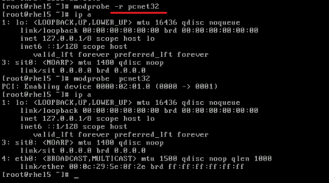

 

 **一跳一跳地ssh上去**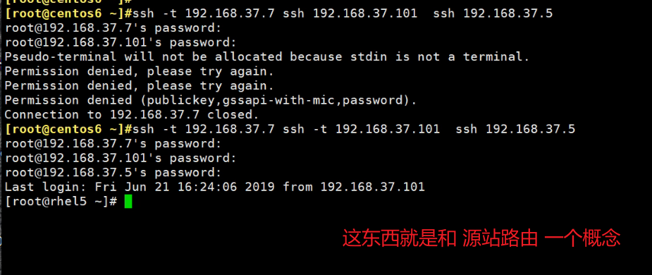
 server会看到是192.168.37.101连上来的。
 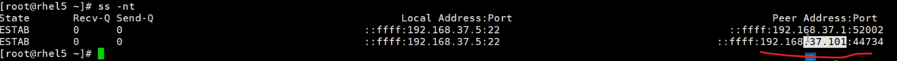

 

**下面讲基于KEY的ssh**

这里的key就是RSA里的密钥对，其实上面默认的ssh其实也是有公钥的，只不过之前的是单向公钥加密码；现在是双向公钥，并且弃用了密码。

安全性方面注意：
 私钥拷走就有大问题
 1、私钥拷走
 2、修改私钥文件的属性
 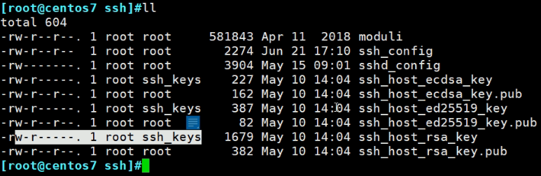

 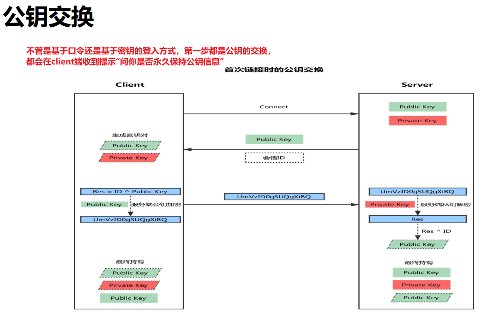

 公钥交换，这个说法就很奇怪，听起来加上看上图，都觉得没错，但是实际上，res=ID^xxx这套东西通常是DH算法，而DH算法，就是在交换密钥，SSH加密可能试用非对称密码来加密传输的数据，

1、加密通道的形成，肯定不是公钥的传递，这个图片只是理论上的非对称做法，实际应该略微修改成对称密钥的传递。

2、所以从实际应用出发，上图的client PBULIC-KEY是不存在的。

3、所以下图的SSH加密通信应该改成对称密码加密而不是非对称。

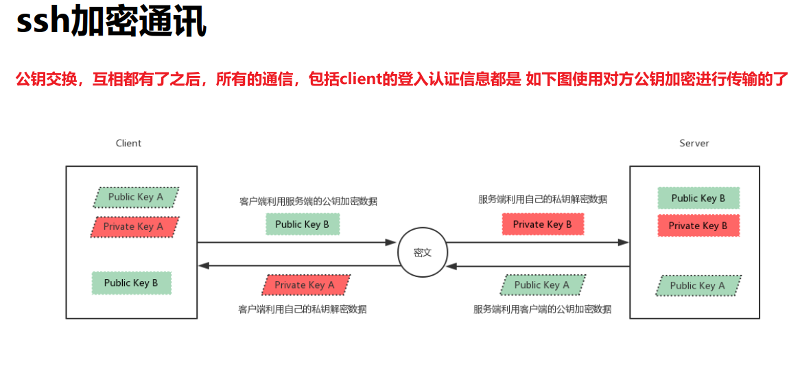

 在上面加密隧道形成后，于是开始认证，包括认证成功后的数据传递

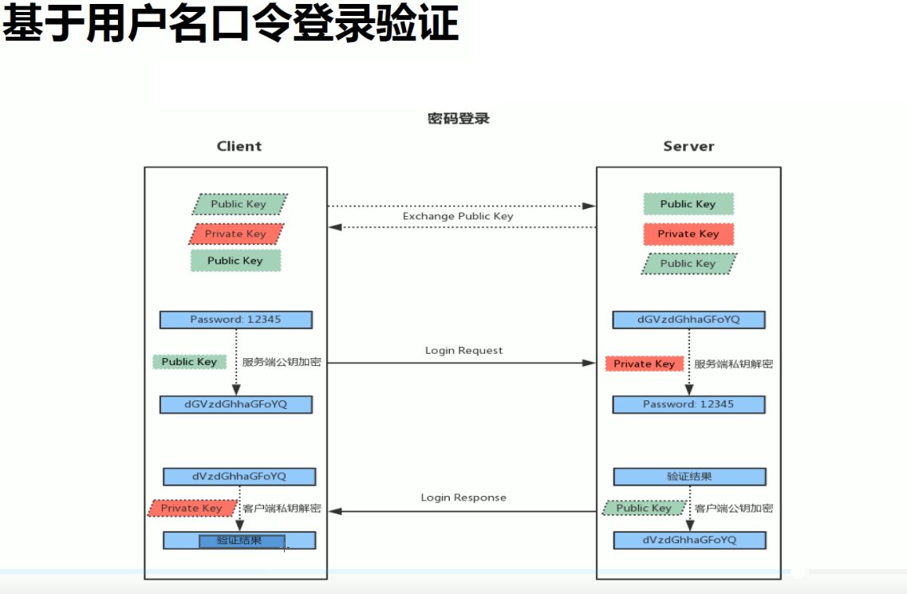

同样上图得改，改成用户名+密码 然后通过对称密码加密发送过去，而不是Public key。

 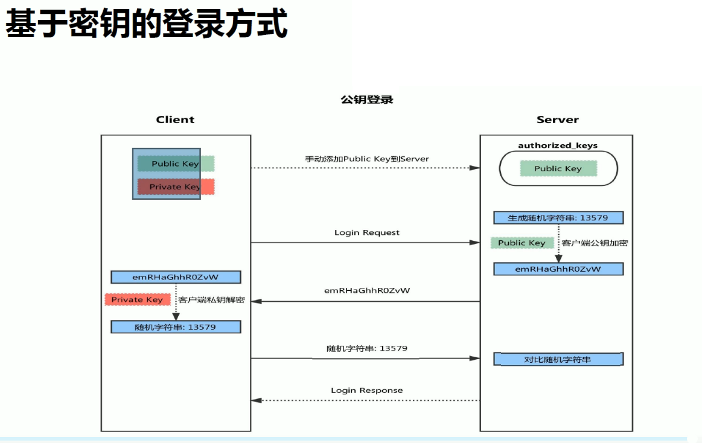
 图中倒数第二步的 13579传输可不是明文传过去的，是基于对方公钥加密后传递的，其实这图是第二个阶段了，第一阶段是公钥的交互，交互后以后所有的通信都是使用公钥进行传输的了。

上图这个key的认证倒是对的，另附一图佐证

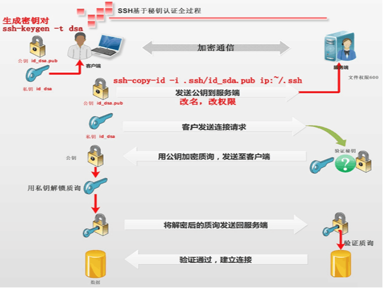

然后参看资料

https://juejin.cn/post/6844903685047189512

http://www.h3c.com/cn/d_200805/606213_30003_0.htm

 密钥认证的实验
 ssh-keygen -t rsa 默认就是rsa
 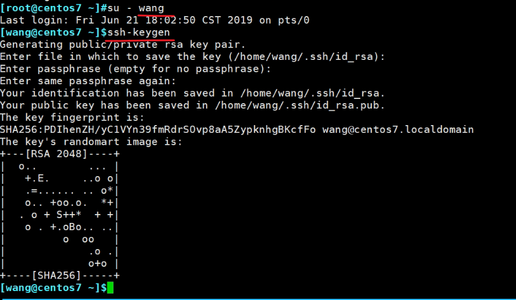
 注意密钥对存放路径，上图中有，然后上图是切到wang用户去生成密钥的。
 生成了公钥和私钥文件
 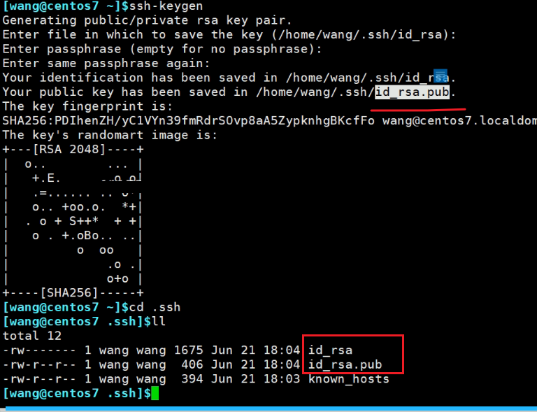
 接下来要去弄server端的authorized_keys文件
 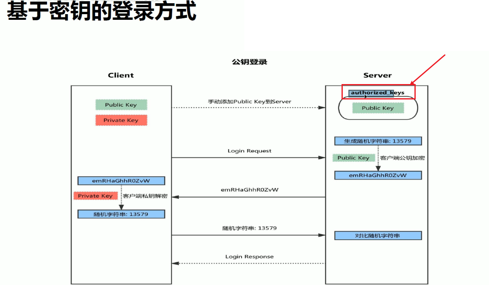
 该文件自动生成
 ssh-copy-id -i /home/wang/.ssh/id_rsa.pub root@192.168.37.6
 注意即使你敲错了id_rsa，也不会传私钥过去的，会自动给你传公钥的。

 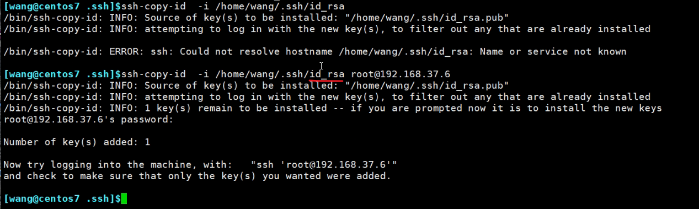
 确实是写的私钥，实际系统给你传的也是公钥。ssh真贴心
 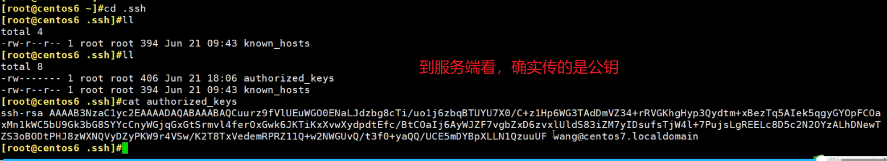

 现在直接登了就
 
 scp走的就是ssh协议，所以复制也不要输密码了
 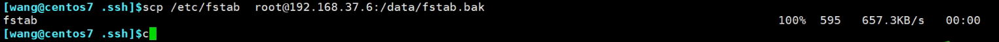
 直接不用输密码了
 
 也挺安全

 但是这台电脑的安全一定要保护好，这台机器的账号要是泄露了就危险了。

 以上总结
 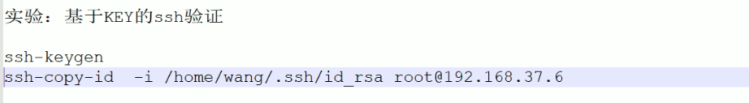

 

 

 
