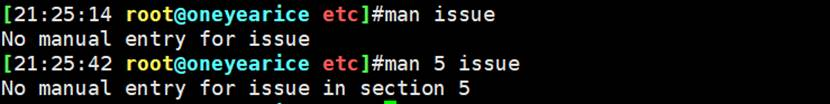
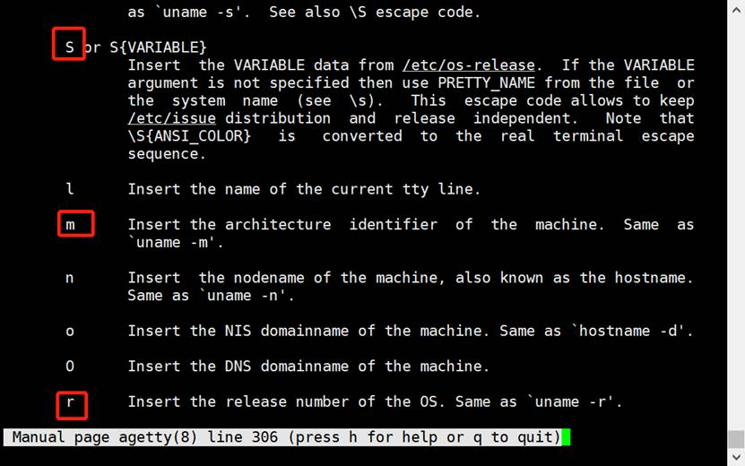
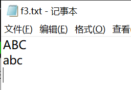

# 第4节. linux帮助用法

 

## 查看帮助相关整理

帮助有这些

```
whatis

command –help -h

man and info

/usr/share/doc

Red Hat documentation

其他网站和搜索
```

 

## **whatis**是外部命令，是用来告诉你去找man手册第几页的 以及 该命令的简要说明


 

 

 

如果系统是刚刚装好，whatis是没有结果的，就会出现如下提示，我就不还原系统了。


whatis数据库存放的帮助的简要说明，在刚装好操作系统是没有的，是需要过一会自动生成。如果你不想等，只需要执行

centos6上 **makewhatis**

centos7上 **mandb**

这样就能生成whatis数据库了。

 

whatis只是简单说明，详细用法还得参考其他帮助

 

## -----------↓-----Unicode字符集和UTF-8编码--------↓-----------

1、有关文件类型

cat是查看文本文件的，二进制文件看不了，常见的二进制文件有：图片、视频、可执行文件，bash也是


 

2、二进制的怎么看，二进制太长了，一般就是以16进制形式查看。

**hexdump /bin/bash**


**hexdump -C /bin/bash**


在linux保存处理都是二进制的，上图的A就是41这个十六进制对应的二进制进行存放在磁盘上的。


阔以的，这排版都得倒一下的~

 

3、这些英文或者汉字对应的都有二进制表示的，这种就需要编码表来实现。ASCII就是早期著名的编码表。ASCII（American Standard Code for Information Interchange）

 

4、ASCII只能表达128个字符，只适用于欧美国家，后来就有了GB2312、GBK我国自己的编码表，以及还有韩国自己的。每个国家的编码都不一样。可能存在都是55这个十六进制，代表的字符不一样，这就产生了冲突。为了统一，就有了统一命令的Unicode，

 

5、Unicode只是一个规范，定义了全球所有文字或者叫字符和二进制的对应关系。它并没有明确下来这个二进制在磁盘上保存到底是什么形式（用哪种风格）并没有确定下来，比如具体这个二进制在磁盘上占几位，Unicode就没有明确下来，为了具体明确下来（磁盘上存放某个字符占多少位、在网络上传输的时候转成二进制占多少位）就推出了编码的具体实现—比如UTF-8，UTF-8就是Unicode的具体实现。

6、Unicode属于**字符集**（字符和二进制的对应关系）、UTF-8是**编码方式**（站位的明确定义）。还有UTF-16和UTF-32，UTF-8使用的最多。

UTF-16用2个或4个字节来表示某个字符。工作中，用得少

UTF-32，所有的文字全都占4个字节。工作中，用的少

UTF-8，使用1-4个字节来表示字符。比如UTF-8兼容ASCII码就是一个字节就够了。生僻字3个或4个字节，常用文字占1-2个字节。

 

7、Unicode（UTF-8）处理的逻辑机制是这样的，我们vim或nano处理某个文件的时候，在编辑的时候，vim是个软件，自然会在内存中运行这个vim程序。vim打开比如xx.txt这个文件，就会把xx.txt里的字符就转化成了Unicode。你在xx.txt里就可以编辑修改，此时注意这些字符都是在内存中以Unicode形式存在的，当然显示的时候是转换成人类看懂的文字的（这是计算机内部处理的）。

然后你一旦保存，就是存到磁盘上去了，保存到磁盘上就表现为具体编码形式UTF-8了。

后面你再次读xx.txt文件的时候，就是读入内存中，那么此文件在内存中又是以Unicode形式存在的。

 

8、在网络传输的过程中，PC----请求----Server。比如PC请求http://www.xx.com/index.html, 这个文件在server的磁盘上保存时UTF-8形式，读取到server自己的内存中就是unicode，在网络上传输就是UTF-8，读取到PC处的内存就是unicode，存到PC本地的磁盘就是UTF-8了。当然我记得还有一个BASE64，也需要了解一下。在加密数据的时候就有先使用对称加密后在使用BASE64进行网络传输的，图片在网络传输也是使用BASE64的。


**---------------------↑---------帮助的用法-------------↑------------------------**


9、命令帮助，内部命令和外部命令的help是不一样的

## 内部命令：**help COMMAND** 或 **man bash**

只要是内部命令，都可以通过man bash查看，（当然man也可以看外部命令）


因为/bin/bash文件里集成了所有内部命令，所有man bash就能看到所有内部命令的详细帮助。


bash的man手册有4000多行，有人对其进行了翻译，就是普通学员做了这个事。当然网上也有人汉化也可以参考。

 

## 外部命令帮助用法：

①COMMAND -help -h

②man COMMAND

③info COMMAND

④README INSTALL ChangeLog这些程序自身的帮助文档

⑤程序官方文档 也就是官网的Documentation

⑥发行版的官方文档

⑦Google bing baidu等搜索引擎

 


[OPTIONS]...就是选项可以有多个，FORMAT就是在下面列出了很多的FORMAT

 

10、date


 

 


1970-1-1是Unix诞生日


11、显示前天是周几


 

```
date 010210102020.300
```

 

 

 


 

unix的诞生日，很多时间计算都是从这个点开始的，比如

 


显示前天周几

 


12、man手册

## manual的意思，利用man可以查看很多外部命令的帮助


上图whereis列出了man帮助的文档。gz压缩文档，不用解压后查看，直接用man命令查看即可。

 

13、man对应的文档基本都是放在/usr/share/man下的。


**man1**：linux命令基本都在第1章，是我们常常需要的；

man2：系统调用，OS对 外部APP提供内核调用的接口，开发用的；就是应用程序需要和操作系统内核打交道，就得系统调用来完成，在第二章里。man socket 一般看到的就是man 2，属于网络方面的系统调用。不过为啥我的腾讯云上的VPS默认是man3的socket。另外就算是开发也不会直接进行这种底层调用，一般也是通过C库或者python库去调用。


man3：C库调用

man4：设备文件及特殊文件

**man5**：配置文件格式，也是我们关心的，linux好多配置文件，配置文件有很多格式，这些说明就在第5章里。


这个issu文件怎么配置，他的帮助就在第5章里。然而VPS上并没有




换成我自己的vm虚机就有了


应该VPS是最小化安装，当然也不是都没有，最小化安装man ls，man bash都有的。


man6：游戏

man7：杂项

**man8**：管理类的命令，管理员，root身份进行一些管理型的命令。

man9：和开发相关的linux内核API。


14、man使用注意点

man xx 默认看的是man1，1以外的章节 需要特别指定第几章才行。比如passwd这个文件配置说明。

/etc/passwd是个文件，/usr/bin/passwd是个命令，这两个passwd不是同一个东西。


显然whatis查看的不仅仅是命令，而type只是查看命令是内部 还是外部 亦或是alias。

man passwd看的是第1章，看的是passwd命令（/usr/bin/passwd）


如果要/etc/passwd配置文件帮助，就需要：man 5 passwd


总之，先whatis xxx看一下在那一章节，然后man n xx去看

 

 


man也是个外部命令，可以用whatis去看一下有哪些章。

1p都是和开发相关的。


 

man man可见


 

15、man搜索和vim搜索一样


或者 ”?second”，n 和 N是下一个或者上一个。方向键上下，一样调用历史记录。

 

man -a 查看所有，q+enter进入下一章


 

man -k passwd查看包含passwd的帮助类似whatis passwd，但明显要比whatis passwd多得多。


 

man -f passwd 等价于whatis passwd


 

man -w date查看帮助文件在磁盘的路径，类似whereis date，区别在于man只是看man手册在哪，而whereis date还显示命令（文件）的路径。


 

 

16、man举例


\S就是OS版本

Kernel就是Kernel

\r内部版本

\m X86架构

 

这个issue就定了用户登入提示信息。

 

**现在需要：显示用户在哪个终端登入上来的，（原本是tty查看的），还要显示时间、显示主机名，此时就需要查看帮助**


说明了issue只有第5章有，是预登入和标识文件。

 

直接man issue就行了，因为只有1个 第5章


上图是man issue的所有信息了（就这么多行，到底了），其中并没有看到什么\S \r \m的解释


不过有一个SEE ALSO可以参考


于是man motd


我们issue是登入之前，而motd是登入之后，不是此时需要的帮助，换一个

man 8 agetty




都找到了


再来对比一下


都找到出处了, welcome…是自己加的

修改为：


​                     

17、linux的语言默认是英文，不建议转成中文，但是可以转，如下


有些地方就是中文了


但是man里面还是英文的，

还需要安装如下的中文的包 才能在man手册中显示为中文。


安装的话，我准备使用本地安装光盘里找一找相关软件包，所以不适用VPS了，换成本地CENTOS7


上图表示现在光盘没有挂载，可是我已经在WmwareWorkstation上勾选了connect了。此时只需要在GUI界面上使用和cli同样的账号，此时是root，登入一下就行了


 

进到光盘的路径下，里面就是所有的安装的软件文件，而且后缀都是.rpm。找到man开头的


发现了zh-CN的中文包了，这个就是可以修改man手册里的中文的包。

使用rpm -ivh 安装，注意ls man按tab补全后ctrl a切换到头将ls改为rpm -ivh，因为rpm 不带自动补全功能


此时在修改一下LANG，localectl set-locale LANG=zh_CN.UTF-8，退出再登入，然后就可以看到man手册里的中文了


但是man 1 passwd就是命令的帮助手册还是英文的


 


说明中文支持的还不是非常全。不过只是了解一下怎么切中文，一般也不会切的。

 

所以，切回英文 localectl set-locale LANG=en_US.UTF-8。

 

 

18、info 命令一般不用，不过info里面的都是一个个链接，更像是一个网页，是*号开头的，按回车就会跳转，挺有意思的，了解一下，比如info ls


光标停在*号行，按回车，就会跳转


 

19、man帮助使用较多，info基本不用，此外还有一些不怎么用的帮助，了解一下

GUI里的Applications\help里面点开可以查看的，这是CentOS7的。CentOS6实在GUI的system/help下。

 

20、不怎么用帮助之/usr/share/doc


每一个安装好的软件包，都有一个对应的文件夹放在/usr/share/doc下，你可以进去查看软件的说明。


这些文档大部分都是文本，PDF\HTML\TXT 都能打开看基本上。

 

 

21、linxu只是一个操作系统，常规操作掌握后，更多精力是放在linux系统之上的应用程序—这些第三方软件（apache、nginx、mariadb等），这些软件就要去官方网站查看文档。

第三方应用官方文档举例

http://httpd.apache.org

http://www.nginx.org

https://mariadb.com/kb/en

https://dev.mysql.com/doc

http://tomcat.apache.org

http://www.python.org

 


点击documentation后，可以看到


这个软件有很多moduels模块组成，其中有core模块，点击进去可以看看该模块里的各个指令directives。


点击root命令


要学会看懂这里面的说明，因为官方文档才是最权威的一手资料。

 

 

22、现在还没进入都linux上层应用的学习阶段，现在还是在学习操作系统本身，系统本身也有官方网站以及documentation的。

红帽知识库和官方在线文档

http://kbase.redhat.com

http://www.redhat.com/docs

http://access.redhat.com

https://help.ubuntu.com/lts/serverguide/index.html

 

比如现在需要看centos8的安装指南

http://www.redhat.com


如图就找到了CentOS8的安装手册，有升级的、基本安装、定制化、高级安装（kickstat自动化安装），而且右边栏还可以选择查看的文档格式（pdf or web）


 

23、搜索引擎

http://tldp.org


 

http://www.slideshare.net # 这网站是很多国外的人在研究技术的时候写成了PPT，可以拿下来改吧改吧。

 

http://www.google.com

```
搜索的技巧
https://segmentfault.com/a/1190000038432191
https://funletu.com/12851/.html

openstack filetype:pdf
rhca site:redhat.com/docs  #这种站内搜索，受限于对方的安全措施，应该叫反爬机制

```


 

https://www.ibm.com/developerworks/cn/linux/index.html

要知道IBM已经收购红帽了，所以该网站也是阔以的。


 

 

24、帮助举例


## ASCII 字符集 在编码的时候使用 八进制、十进制、十六进制。

然后，man ascii


ASCII码总共128个字符，每个字符对应的八进制、十进制、十六进制分别是什么，分两列展示。


想用echo一下ascii，不知道怎么玩，可以man echo在搜oct就行了


所以echo -e “\0xxx”还有echo-e “\x21”


 

 

25、ascii查看举例


\x0a是十六进制的，是不分大小写的


 

26、\r和\n


## 这是\r的回车return的效果，没有换行，所以还在本行，就会把之前的xxx覆盖了前两位。

 


这是换行+回车的效果，linux的\n就是微软的\r\n

 


linux也认\r是回车的意思，所以\r就是回车、\n就是换行在回车，这里两个回车了，效果还是把车停到了最左边，就是100个\r也就是1个\r的效果，一个\r也被集成在\n里了。

 


所以，在python使用paramiko非交互模式获取H3C的dis cu inter | I inter后，详情如下


如果上图re.split处这么写：portPer1.split(‘\n’)，在print(i)的时候你会看到显示都是OK的，但是一旦将这些i传入list里后，就会出现xxx\r\r如下情况：

**此处需补图，回公司才有环境，还得自己整一个网络环境出来，用eve吧明天搞。**

所以H3C的display 看到的分行，其实里面是xxx\r\r\n，我猜它这么做为了，为了个屁，就是强迫症，多次回车保证车必然停在最右边，然后\n换行，所以我改成了re.plit(xxx)如上图。

 

 

27、对比一下MS和Linxu的\r\n

我们已经知道\r\n是MS的换行，\n是linux的换行，这里说换行自然就包含了回车了。

下面看实验


传到桌面，在打开


可见linux的\n到MS里是没问题的，结论MS兼容\n

 

反过来，来一波

 

在windows新建f2.txt


使用rz传到linux里或直接拖进去


carriage return简写了


结论

MS的\r\n到linux下linux只需要\n就能进行换行回车，所以多了一个\r，当然cat的时候是看不到的，或者说python处理的时候可能print也是看不到的，但是\r确实留在了文本里面，确实会为后面的数据处理带来麻烦的。

相对的，linux下的\n到了MS里，MS处理的就很好，奇了怪了。我明明记得很多txt文本在windows里看到的都是xxxx\nxxxx\nxxxx\n不换行的格式错乱啊，难道是sz工具对其进行处理了？

尝试不使用sz工具，而是用sftp进行linxu->ms的文件传输，结果一样还是MS里显示OK。

尝试不用echo -e "ABC\nabc" > f1.txt的方法创建内容，而是使用vim


依然在MS里显示OK，好了此问题不研究了。MS你优秀~



我明明小写abc后面在linux里就没有换行，传过来结果换行了。

 

## 方法论：在文本处理的时候，文本从linux->MS，\n前加上\r；从ms->linux，\r\n去掉\r。

 

以上就说明了：二进制在磁盘上保存机制不同，不可见的符号是看不到的，但是在磁盘上保存确实有的。

 

 


xxd和hexdump -C一样的效果，专门看不可见字符。

 


 

 

 

 
