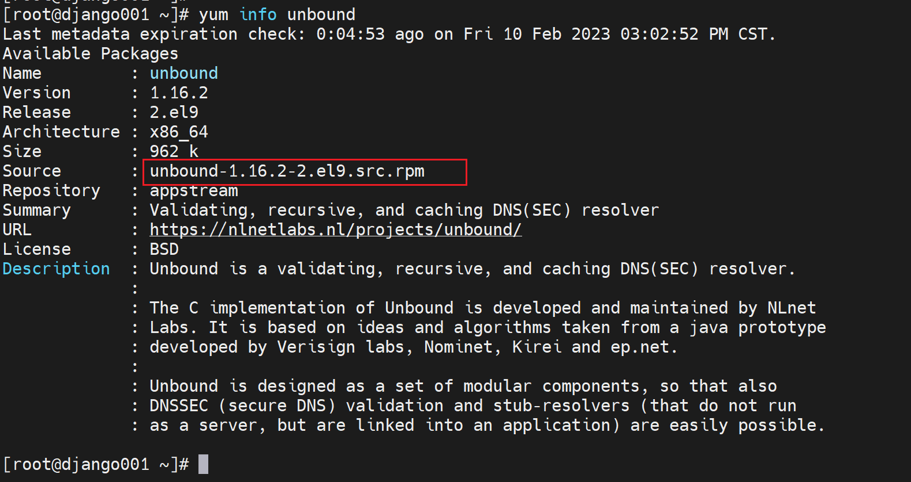
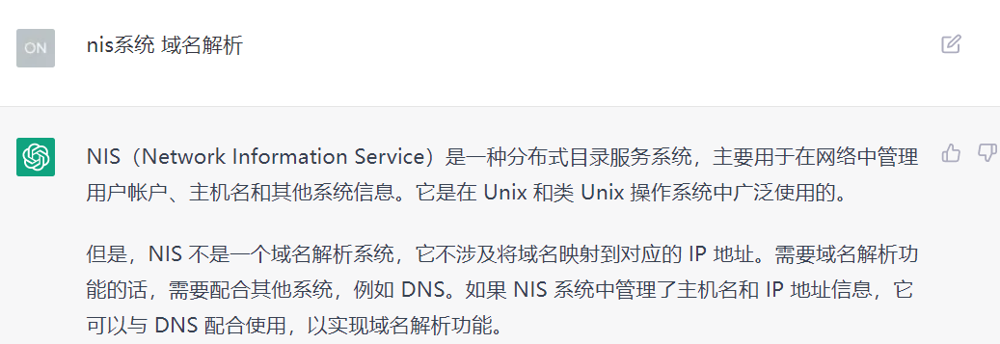
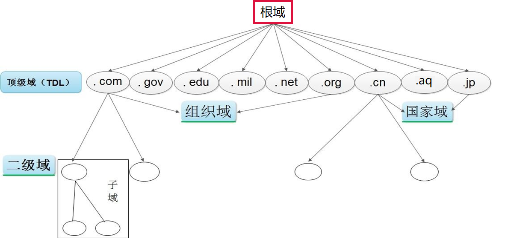
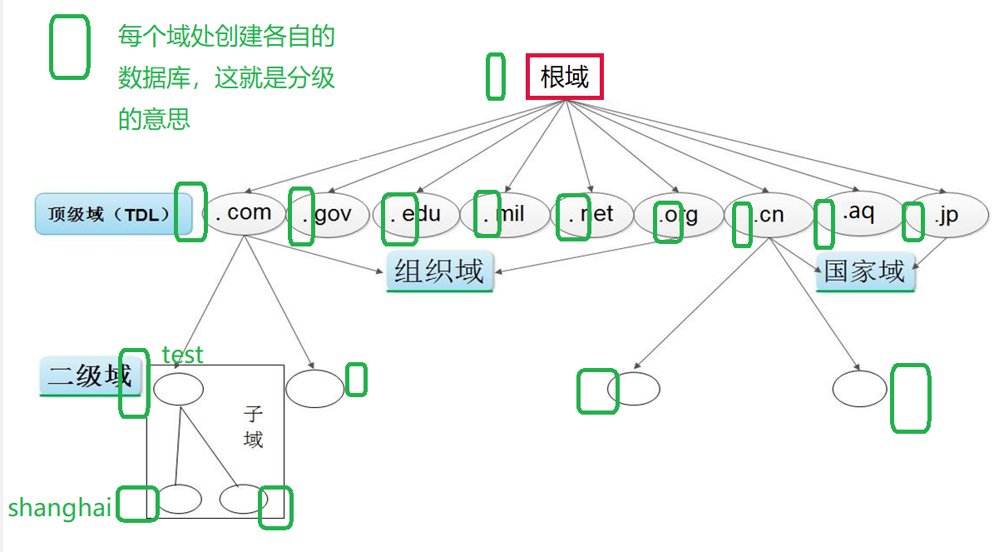
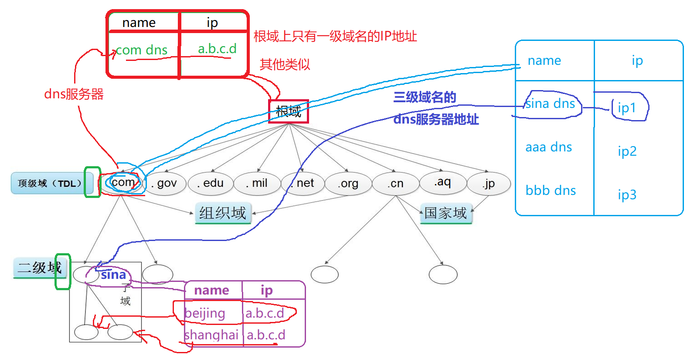
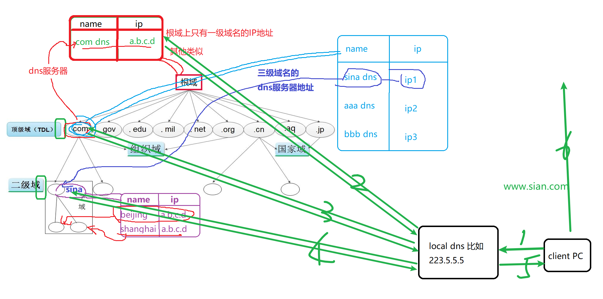

# 第1节. DNS服务简介

bind9是这次主学的，dnsmasq也是不错的，其他微软的，路由器上的都行，但是考虑一下这个案例：

公司的员工从飞塔出去，飞塔基于sourceIP做ecmp从ct和cu出去，此时存在一个问题，内部dns从ct出去，此时从cu出去的用户dns拿到的却是电信的，虽然在当前BGP IP较多的情况下，但是随着用户量变多，鸟也变多了，所以娘好儿子才能好，不对，所以良好的方案就很重要了，你不能凑合着用对吧，

你说为什么不用出口设备做DNS分流+ISP路由清单，①没清单②DNS分流要截获的吧，这个iKUAI肯定可以做，没研究。但是作为DNS的学习来讲，显然必学的，所以我的方案来了。

你说为什么不用出口的pbr，或者核心的pbr，pbr是固定一拨人走一个出口，现在利用dns分为2个奇偶，随着用户奇偶，就能自动将dns分流，而且随着飞塔的ECMP随机性，奇偶一定是分别从2个出口走的，但是至于走哪个口是随机且相对固定的，一段时间奇数时走ct，一段时间奇数又是走cu，与之相对的偶数就走另外的线路。ECMP就是随机且相对稳定的负载分担。

1、当前用户在fortigate上是sourceip的ECMP，所以奇数和偶数IP分别随机又相对稳定的分流到两个ISP上的

2、DNS内部有两台10.2和10.3，但是都是从第三条电信EIP出去的。

3、此时加入一段时间偶数IP是从ct出去，奇数IP从cu出去，而dns从EIP出去，此时奇数IP的dns请求就需要调整。

---

方案如下

1、将10.2的路由保留继续从EIP出去，10.3的路由从第四条线路联通固定IP出去；如果你没有这么多线路，你就用ct和cu啦。具体就是将10.2和10.3都改为从飞塔出去，然后飞塔就会根奇偶ECMP出去。

此时10.2就成为了偶数IP员工的一员，10.3就成为奇数IP的一员了。

2、需要将偶数IP的dns request 转到10.2(因为dns也是偶数，所以它也是这一部分员工走的一样的线路，这就保证DNS也是从员工出去的线路问的，拿到的自然就是当前使用ISP的解析地址咯)，将奇数IP的dns请求转到10.3

3、由于10.2和10.3是用的dnsmasq做的，本来我是想大家都用10.2，然后10.2上做view将奇数IP的请求转到10.3上去，由10.3去代理查询，但是dnsmqs不支持view，所以就需要学习bind9再两个dnsmaq前面套一层，不能说dnsmasq就是轻量级的，套一层bind9只做view转发，想想就美滋滋~

但是我就不硬上，反正也不急，慢慢撸一遍DNS~emm，之前就看过一遍忘记咯。

开始

================================================================================

一、

bind9和dhcp都是isc开发的，

https://www.isc.org/download/

此外还有一个unbound，不过看版本就是知道太新了，不一定有bind9稳定。

https://nlnetlabs.nl/projects/unbound/about/

bind是伯克利大学开发开源的

主流的CPU芯片：

x86:	intel amd 兆芯(购买了早期的citrix)

移动手机端绝大多都是ARM：苹果A12，高通-晓龙855，华为-麒麟985，联发科-各种山寨？

华为被制裁由将来可能就不用ARM了，

MIPS:	龙芯-生态圈小-用的少，早期比ARM强，ARM在移动设备爆发的时候起来了。

RISC-V罗马数字5代的意思：开源的芯片级的linux架构，华为被ARM制裁 所以加入到这个CPU开源芯片研发团队了。而这个RISC又是伯克利大学人做的。

---

FQDN Full Qualified Domain Name

oneyearice.github.io, oneyearice就是主机名(或者是别名)，github.io就是域名，这是分层的结构，一级域名，二级域名等

DNS是一个分布式的系统，结合hosts的零散和NIS的集中 两家之长~

www.sina.com.cn.

最后其实是有一个.点的。只是在浏览器输入的时候省略了不写了，windows里dns服务里好像之前见到过。

FQDN<--->IP之间互相是可以互相转换的，通常是域名转IP咯。

NIS是把所有的域名解析放到一个地方，而DNS是在每级域处都建立数据。

shanghai.sina.com 就是这么顺下来的

不过还有一个www.sina.com 就是不是递归的dns数据库而是直接二级域的本地数据库里的一个www主机名

同样shanghai.sina.com除了本地的www.shanghai.sina.com,也许还有下级域

然后用户是如何找到www.shanghai.sina.comde 或mail.iwgame.com或者ftp.iwgame.com等IP地址的,两种查询方式，一般都是递归

名词解释：

所谓权威DNS服务，就是比如你要访问的www.shanghai.sina.com这个域名的权威就是在哪里对外发布的那台，哪里就是权威，对应的上图就是最底层的三级域名服务器。

如果223.5.5.5有缓存就直接给你了

FRU算法 缓存长时间不用就慢慢 删掉了就

