# 第2节. 数据库基础原理2

### 外键：一对多

上图100是外键FK，如果在外部另一张表里没找到100，就不让你添加。

一对多可以使用主外键的方式来表示出来。

### 多对多：第三张表

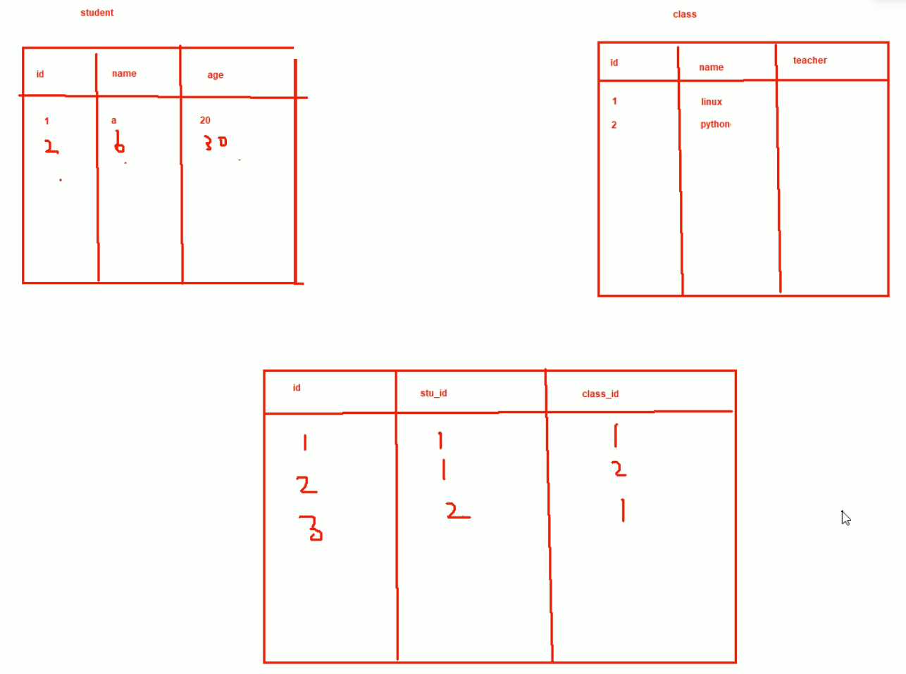 

构建第三张表来实现多对多，但是第三张表里的stu_id和class_id不能是凭空写出来的，下图的200和100就不对了

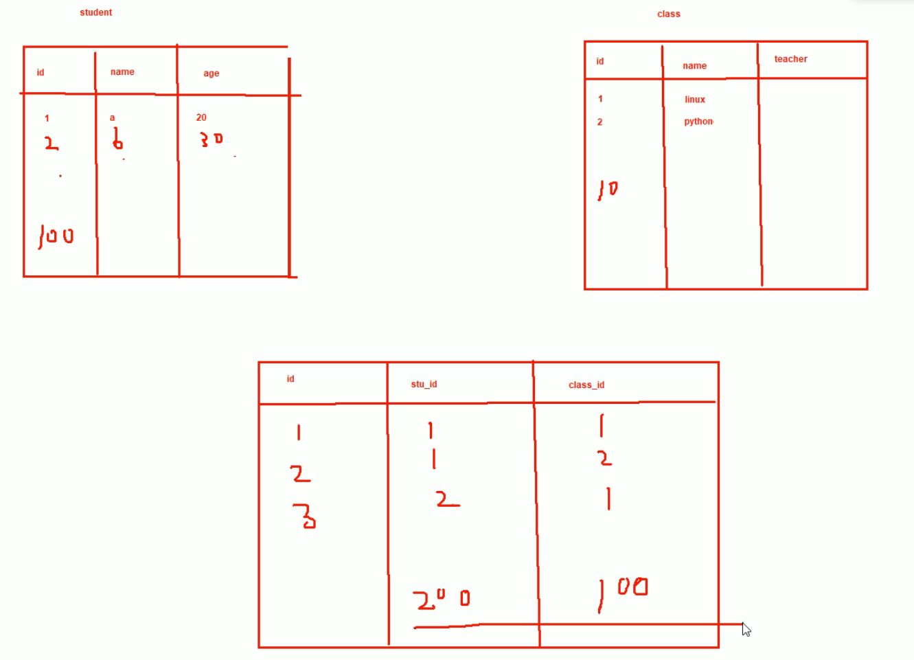

所以需要使用FK外键

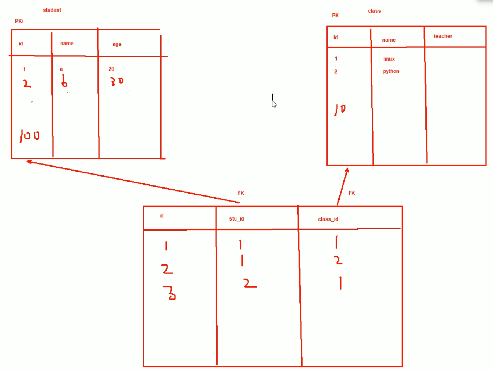

通过第三张表，通过主外键的关系，把原来两张表的多对多关系表达出来。

### 范式

一般掌握前三范式，否则范式遵循太多也会导致数据的查询麻烦。

第一范式：

下图就违反了第一范式：

1、列必须是不同类型

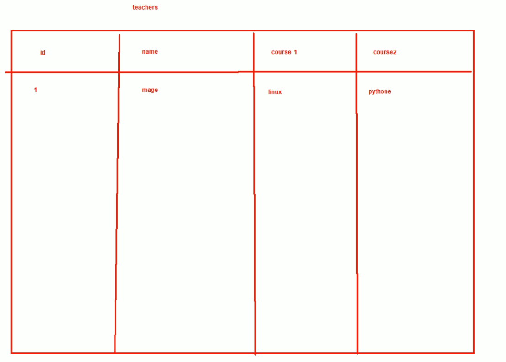 

因为mage可能教10门课，而其他的某位老师可能就教1门课，所以其他字段在这一行就都是空。

2、列不能有多个值

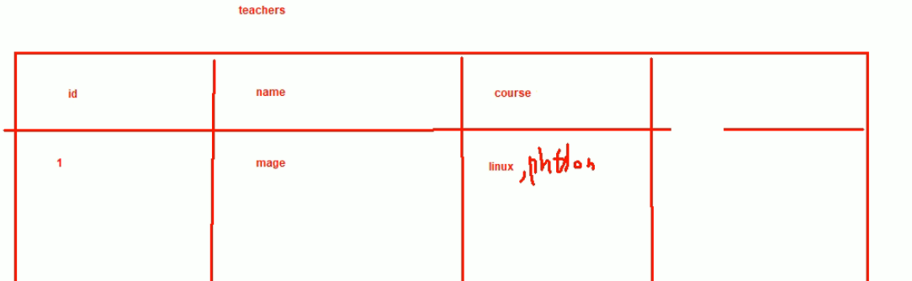 

可以另起一行，不过也不太好，如果mage教了10门课，mage的个人信息就会重复10行。

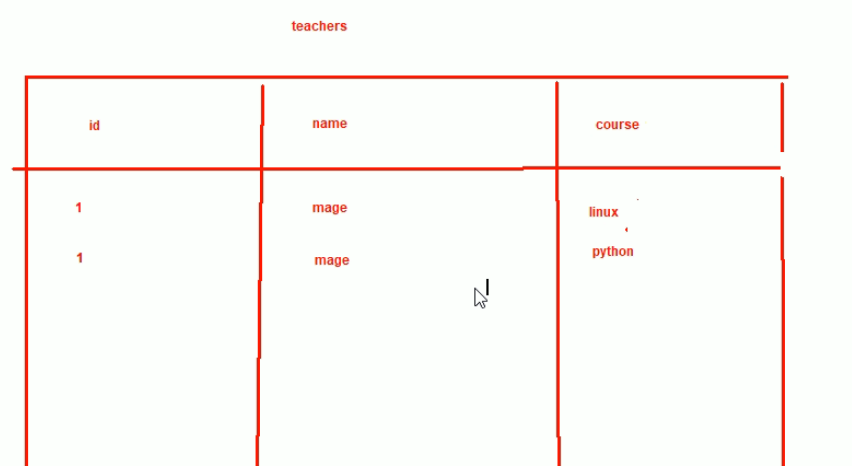

为了解决上述单列多个值和单人重复多行的问题，于是可以构建第二张表和第三张表。

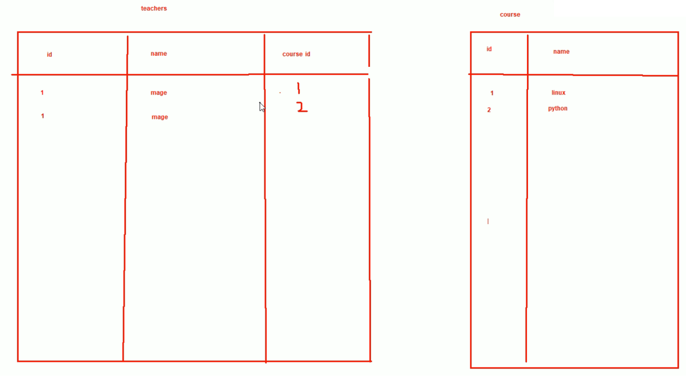 

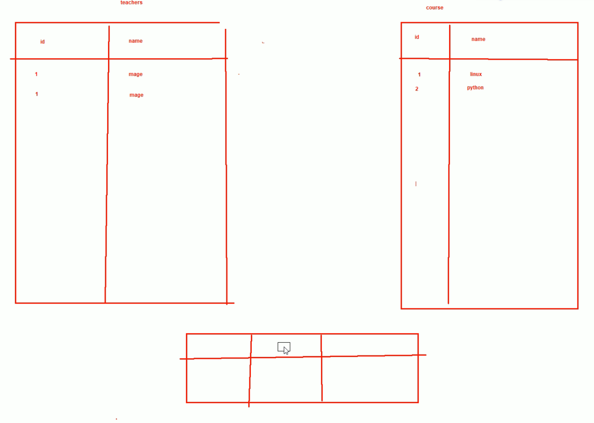

第三张表就是FK外键使用上面两张表的PK主键就行了。

### 第二范式2NF，

首先2NF肯定满足1NF了

下图的PK在那个字段上都不合适，name、city都不存在唯一性

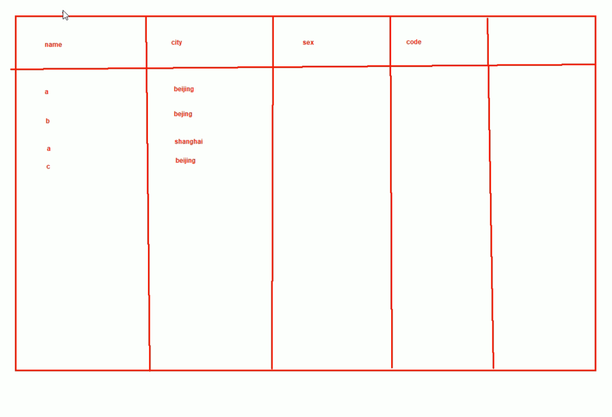 

此时需要设置复合主键PK

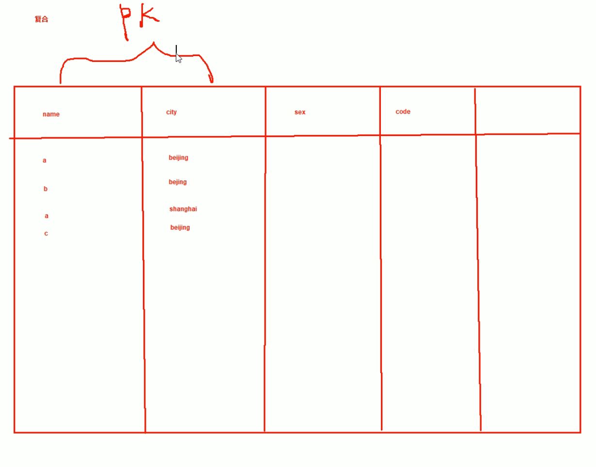

此时code电话区号依赖于city，现在主键不是city而是name+city这个复合PK。2NF范式2就要求每列的字段也就是属性要与整个PK有直接相关性。只是和部分主键有关联，这是不符合2NF的。

怎么解决呢，方法就是把城市和区号拿出来单独列一张表。然后原表里删除code和city，改为city ID来关联。👇

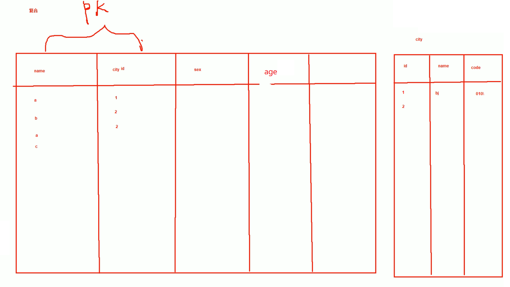

现在在第一张表(左)里整个属性都是和整个复合主键直接相关的。符合了2NF第二范式。

上文是使用了复合主键来做唯一标识，还可以重新做一个主键

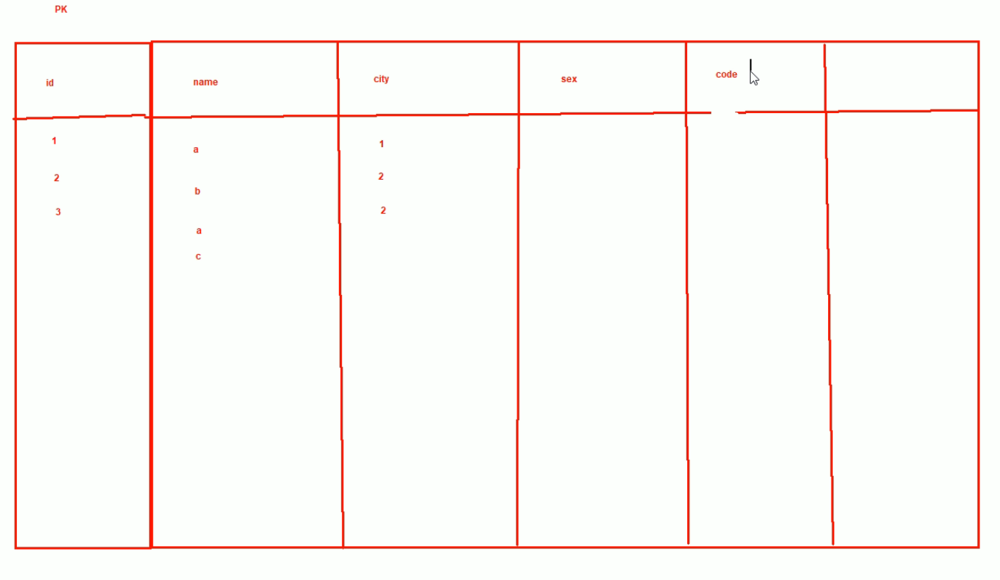

此时就一张表，code虽然存在多行重复出现的问题，不过code和id本身区别也不大。可以接收。

真正的问题是这就违反了3NF第三范式，当然你要是无所谓打破范式也不是不行。

### 3NF就是属性不能和非主键产生关系

非PK字段之间不能有从属关系

解决方法就是将从属关系的字段，独立出来一张表。

满足1NF 2NF 3NF这三个范式后的好处是数据存放紧凑，没有什么重复冗长多余的情况。

带来的负面影响就是：数据规划要花时间、查询只需要一张表就能查到了，无需跨表查询。跨表查询有一定复杂度和时间的消耗。

### 3个范式就是推荐建议，范式就是用来违反的，具体情况具体解决。

设计DB的一般是软件开发人员。他们来设计结构。DBA应该可以吧

 
