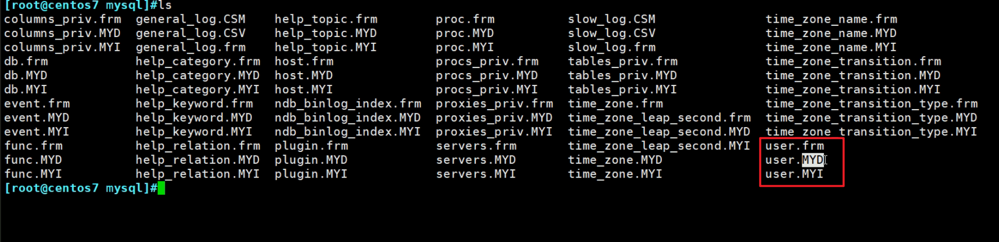

# 第1节. 索引类型和结构原理

索引可以极大的提升数据库的访问速度，好像缓存命中和也能提高哦

全表扫描，效率太低了，需要索引。

## B树的特点

1、数据也是放在指针层的

2、找17号和找28号，耗时是相差很大的，也就是说查找的速率不是很平均

3、根上只有17和35两个索引号，分成了3个指针，太少了，要多一点，然后整体树结构要成矮胖型的才好一些；而数据也是和索引放在一起的，就导致数据如果太大，就占用了索引的空间，一层空间如果被数据占用太多，索引能用的空间就少了，整体就胖不起来了。

​		但也不能太胖哦，胖到极端，就是所有数据铺在根，那TM还有个屁的树结构哦，就变成了所有数据挨个查找了。

4、每次从根开始查找，效率低；比如要找10-30，就每次都要从根开始台麻烦了。而实际上上10-30就是连续的空间。

优化方案就是B+树，不仅仅是mysql这么用的，其他数据库也是这么玩的。

## B+树

1、只放数据的摘要比如元数据，比如学生的信息不放，只放学生的编号

这样单层里存放的元素个数会更多，显然不仅仅是图中的3个 5 28 65这么少的了。

2、根和分支仅仅放索引，不放数据，叶子节点才放真实的数据信息

 

3、查询速度平均了：不管找8号学生的信息还是找28号，由于真实信息都放在leaf层，所以都需要从根编列到底层，但是由于每层索引指针多，整体查询就快了。

4、查找连续的数据，无需每次从更遍历，因为leaf层的数据之间也是有指针的

leaf层之间也是连续的指针指好的，连续的数据段查找不必每个都从根从头查找。

这个指针在叶子节点之间，这个数据结构叫做列表。

在mysql中存放的数据，就是用B+树来存放的。

### 不一定对数据建立索引，也可以对姓名建立索引

刚才就是对数字(学生编号)建立索引

就是对学生编号从小到大进行排序--看leaf层。

如果现在对姓名建立索引的话

而数据建立的时候有默认的字符集，而字符集有自身默认的排序方式，这个前面的章节里讲过的

简单点举例就是按字母排序，简单举例👇，当然真正的结构还得是B+树的结构。

本质就是将数据的无序变有序，将随机的I/O变成了顺序的I/O，这里是指的数据的r/w咯，从而便捷查找。

有序化后，就不需要全盘扫描，自然降低了磁盘I/O。

## 索引的缺点

1、目录要随着内容更新而更新，也就是说数据变化了，索引也要变化。比如插入一个章节10章查到11章前面，那么原来的11章就变成了12章，往后章节都要+1。好比插入一条记录。

2、所以db如果查询多，修改少，加你索引是合适的。

3、如果是频繁的更新数据，查询的少，索引该不该建立，就要考虑清楚了。

4、索引还比书的目录，目录本身也要占空间，一本厚点的书，光是目录就要占十几页了。索引就有点 利用磁盘空间 换取 查询的时间的意思在里面。

5、那也是值得的，索引利用好，查询效率提升显著。前提就是数据足够多。

6、1w或10w条记录，10w对于计算机来讲也不算多，建不建索引意义不大。

## 建立复合索引

firstname+lastname建立索引，不仅仅是某个字段，而是2个或者3个字段的复合索引

建立的时候，要指定谁是第一个字段

#### 这就是复合索引👇：

大致如上图创建好复合索引后，如何利用呢?

selcet * from xx **where firstname like 'a%'**    这种可以利用复合索引吗？可以的！

但是：

**where lastname like 'b&'**   这种可以利用索引吗？不能！

1、首先lastname就不是按字母顺序排序，更本质的就是lastname不是独自排序的，是在firstname排序(后固定)的基础上再排的。

2、所以复合索引，只拿第二个或者叫第一个以后的索引，是无法利用的，因为本身就不是有序的（独立来看，自然也无法独立利用）。

**where firstname = 'a' and lastname like 'b%'**  这就可以了，因为firstname固定了，lastname就是有序的了。

**where firstname like '%a'** 这种可以利用上面的复合索引吗？**where firstname like '%a%'**这种自然也无法利用索引。

firstname 以a结尾的查，是利用不起来索引的，因为上图可见很多a结尾的firstname是无序的。

### sql写法很关键

1、在经常写where的那里的条件上创建索引，是比较推荐的做法。就是说经常过滤的条件就是你创建索引的点。

2、越是不重复的，越是适合建立索引。反面例子性别总归就两个 男/女，还建个啥索引哦；手机号就比较适合创建索引。

这个图和上面的B+树是一个意思，同样看到叶子之间是由指针的，这就比较适合连续查找，也就是范围查找。

### 适合用B+树索引来实现的场景

比如查姓名，本身索引里就放着呢，所以直接查索引就行了。

### 不适合利用B+tree的场景

1、三个字段，姓+名+年龄，你查 姓+年龄就只能利用姓的索引，因为年龄的有序性需要固定住姓和名。

2、两个思路：①开发写好SQL，你去看看怎么创建索引，因为开发可能不会考虑索引的事；②写好索引后，开发去根据索引写SQL。

​		据说索引是运维来写的。

3、一般就是分析sql语句，找到适合建立索引的字段。

## HASH索引默认就有不需要创建

看看note8

默认就是内部使用的。

比如30岁的哈希，就是这个30岁的哈希索引就会指向多个30岁的人，然后进到这些人里面查找。

但是哈希索引是无法支持连续(范围)类的查找的，因为哈希之间是没有关联性的。

这个哈希索引也是DB自身维护的，不用去太关注。

B+tree才是我们需要手动创建的。

### R树用的也不太多

这是和定位相关的，比如手机定位。

### 全文索引

这和关系型数据没有太多关系，这是文本里的关键字查找。

数据里就不会存入什么视频文件吧，不适合放大量的数据。

### 聚集索引和非聚集索引的区别就是数据和索引是否在一起

创建主键的过程就是创建索引了，因为主键会自动创建索引。

观察上图的leaf层，此处索引和数据是放在一起的，此时就是聚集索引。

当然人家是创建主键的时候自动创建出来的索引。比如学生编号这种主键索引。

讨论下一个表中 主键不能多个的原因：这里从索引的角度就能解释，假设

1、你创建了学生编号作为主键，那么连带就创建了主键索引，同时数据也要按照学号来排序；

2、假设可以创建第二个主键，此时你按照姓名创建了索引，那么连带就创建了姓名这个主键索引，同时数据也要按照姓名来排序；

3、那么问题就来了，此时数据到底怎么排吗？难不成复制一份数据出来再排成别的结构，肯定不行吗！所以DB中primarykey只能是一个。

除了MYSQL的MyISAM，其他的Oracle或者微软的SqlServer，他们的数据库特性都是和InnoDB引擎差不多的。

### 再来看二级索引

主键就一个，自然主键索引就是一个，

然后要创建非主键的索引，比如用学生的姓名创建索引，这个姓名又不是主键，索引没问题。

此时按学生的姓名按字符(字母)排序，然后看上图，按B+tree的方式，leaf层就是索引此时，数据也会放在姓名索引这里吗，那岂不是又要复制一份数据啦，不可能！数据只是可主键索引放在一起的。

上图的ROW一行就是一条记录，就是主键索引和记录本身数据在一起的，就是上图的主键索引里的Row一行里面既有主键(本身就是索引)和数据(行记录)，~~这就是聚集索引~~。

如果我们创建的是非主键索引，也叫做二级索引，此时的索引指向的就不再是数据本身，而是主键PK。

比如二级索引，假设是年龄排序的，那么17+3，就是17岁+3主键。

想想为什么叫二级索引，就是非主键的索引是指向主键，而主键才是和真实的数据在一起的。

所以索引利用上，直接利用主键效率是最高的，二级低一点。

而MyISAM不管是主键索引还是二级索引都是和数据分离的

联系一下前文学习的，MyISAM每个表都有三个独立的文件

.MYI就是专门放索引的，MYD是数据文件的，索引和数据都不是一个文件，肯定是分离的了，不管是主键索引还是非主键索引 肯定都是分离的。

##### 所以MyISAM，全部都是 非聚集索引

##### InnoDB，是默认所有的表、数据、索引都是在一起的

但是可以分开，虽说分开来，其实分的是不同的表的东西分开来，各个表里的东西也就是数据和索引还是在一起的，还是不分的。

 

重启后，hellodb drop删掉，重新导入。

从这个角度看 什么 叫“聚集索引”就清晰了，innodb即使用innodb_file_per_table分开，也只是各个表分开来存放，单个表里的 idb就是索引+数据。

所以MyISAM的 主键索引和二级索引，没什么次序，效率也是一样的。

InnoDB里，一建立主键(即主键索引)，数据的排序就和主键一致了，主键的次序就是数据的次序。

所以进一步讲，InnoDB你插入记录，就会影响插入位置后面的记录的索引编号。所以如果踩坑--管理的不好，**就会导致大量的磁盘I/O**，因为它要重新排序。所以适合于读多写少的场景。

效率待会演示差多少，有索引和没索引。

### 稠密索引和稀疏索引：

下图👇就是稀疏索引，索引不是全部都指向了数据的。

就是索引对应的是指针，

而leaf层的索引才是对应的数据👇 比如5号本身里面就存放了数据记录的。

下图👇这个就是稠密索引，所有索引都是指向了真实的数据了

