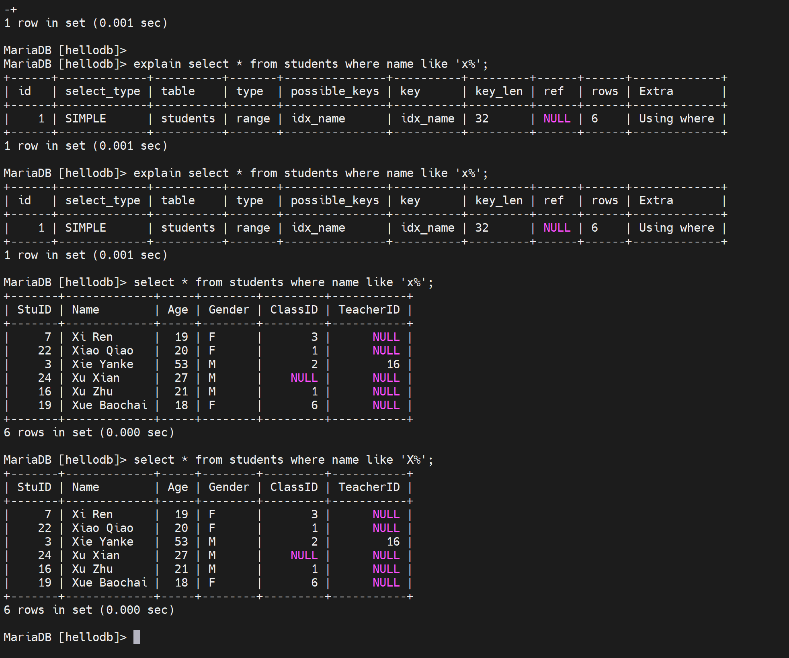
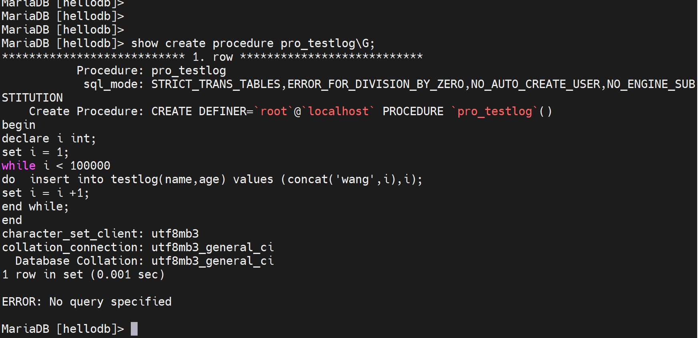
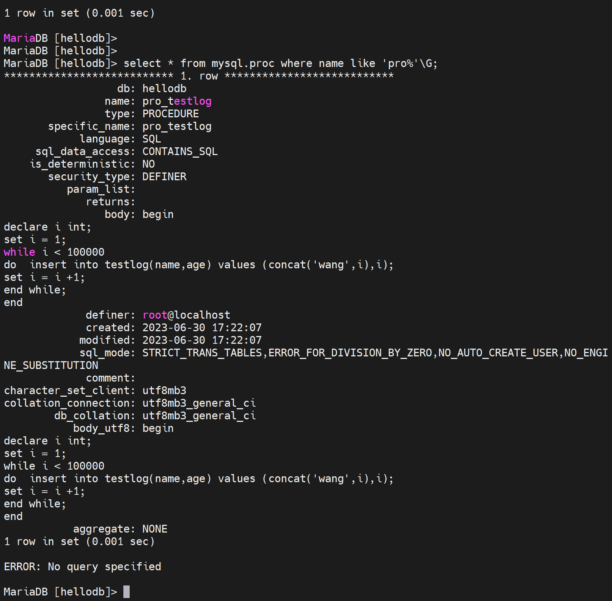
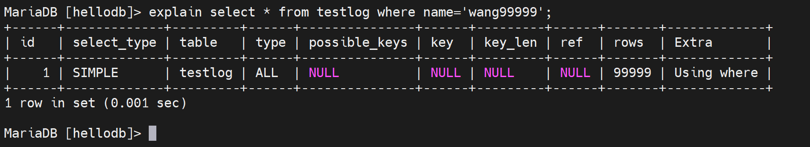
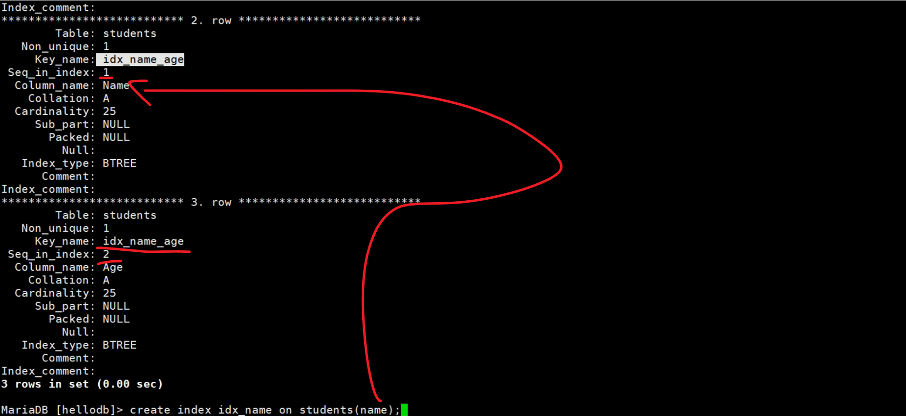
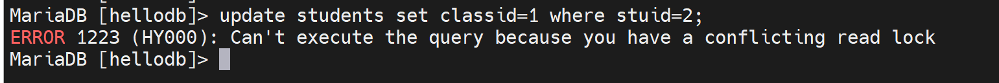

# 第2节. 索引管理和并发访问的锁机制

## 冗余和重复索引：

冗余索引：（A），（A，B）。比如firstname是创建了索引，然后firstname+lastname又创建了复合索引，此时其实两个索引都有firstname的排序，就是说不一样的两个索引，其实内部又重复的，存在冗余。

重复索引：已经有索引，再次建立索引。就是比如主键索引，你又创建一个唯一键是主键的索引？

## 索引优化策略：

### 独立地使用列：

尽量避免其参与运算，独立的列指索引列不能是表达式的一 部分，也不能是函数的参数，在where条件中，始终将索引列单独放在比较 符号的一侧

​			where age > 30   			    可以利用索引

​			where 30 < age				   可以利用

​			where age+10 > 40    		这样就不能利用索引

### 左前缀索引：

构建指定索引字段的左侧的字符数，要通过索引选择性来评估 索引选择性：不重复的索引值和数据表的记录总数的比值

​			where xxx like 'zzz%'

针对name列做索引，发现name的一个字符已经具备区分性了，所以后面的字符就不要参与索引计算了，name(1)就是截取了索引列的第一个字符。

这就节约了建立索引占用的磁盘空间。

进一步比如：name char(20)，在其上建立索引name(10)取前10个字符就行了可能就能区分了。 

这个取多少个能区分，的衡量度是啥，就是name char(20) 是20个字符的长度，你建立索引name(x)取钱x个字符，如果能区分出来90%，就可以了。

### 多列索引：

AND操作时更适合使用多列索引，而非为每个列创建单独的索引

多列索引，就是复合索引，比如经常 将 firstname和lastname做个and一个条件来进行查找，可以考虑把fistname+lastname组成一个复合索引。而不是分别在firstname上建立索引，然后又在lastname上建立索引。

### 选择合适的索引列顺序：

无排序和分组时，将选择性最高放左侧；比如firstname选择性更高，就放在左侧。

##### 只要列中含有NULL值，就最好不要在此例设置索引，复合索引如果有NULL值， 此列在使用时也不会使用索引

##### 尽量使用短索引，如果可以，应该制定一个前缀长度

##### 对于经常在where子句使用的列，最好设置索引，但是比如性别这种即使where上经常出现，也没必要设置索引，因为类别太少了。

##### 对于有多个列where或者order by子句，应该建立复合索引

##### 对于like语句，以%或者‘-’开头的不会使用索引，以%结尾会使用索引

##### 尽量不要在列上进行运算（函数操作和表达式操作）

##### 尽量不要使用not in和<>操作，确定范围的才能利用索引，比如age > 30 这种就可以利用，age ≠ 30 或者 age <> 30就只能进行全表扫描了，这种不确定范围的就不能利用索引。所以可以分开来？ age < 30  or age > 30 这样来利用索引？

##### 查询时，能不要\*就不用\*，尽量写全字段名，不然捞出来的表可能多出来别的列。这样原来的sql cli不用动，不会受表格变动的影响。

##### 大部分情况连接效率远大于子查询，用到了子查询的时候，想想能否用外连接的方式来做。

##### 多表连接时，尽量小表驱动大表，即小表 join 大表，这个好像即使你用大表join小表，数据库也会自动给你优化成小表join大表的。

##### 在有大量记录的表分页时使用limit；用limit限制一下，分批取数据，每次取个1w条就差不多了。

一般来讲，生产中数据库的性能好坏，很大程度上就是SQL 语句写的不好。如果你发现数据库性能达不到预期，就去查查sql语句写的是不是不好。

  		据说很多sql语句都是ORM自动生成的，生成的sql执行效率一般都没有人工手动写的高。所以程序员的sql基本上都是有优化空间的。

##### 对于经常使用的查询，可以开启缓存

##### 多使用explain和profile分析查询语句

这两个工具很好用据说

explain 可以看到你sql的细节，比如是否使用了索引，用的是哪个？

##### 查看慢查询日志，找出执行时间长的sql语句优化

## 管理索引

### 创建索引

1、创建表的时候就会创建主键的时候就会自动创建主键索引

2、表建好了已经，创建索引的方法

##### CREATE INDEX [UNIQUE] index_name ON tbl_name (index_col_name[(length)],...); 

UNIQUE就是要确保你的这个字段是具有唯一性的，比如手机号，身份证这些。

inde_name：是索引名称

ON tbl_name：是哪张表上去创建的

index_col_name(length)：字段的名称，在哪个字段上的前多少个字符来创建索引的，如果，逗号再跟一个字段就成了复合索引。

##### ALTER TABLE tbl_name ADD INDEX index_name(index_col_name); help CREATE INDEX;

##### help CREATE INDEX;

### 删除索引：

DROP INDEX index_name ON tbl_name;

ALTER TABLE tbl_name DROP INDEX index_name(index_col_name);

### 查看索引：

SHOW INDEXES FROM [db_name.]tbl_name;

### 优化表空间：

OPTIMIZE TABLE tb_name;

### 查看索引的使用

SET GLOBAL userstat=1;

SHOW INDEX_STATISTICS;

key_name，key就是键就是索引。这个key_name是PRIMARY是个主键索引。

Colume_name-StuID：这个主键索引是在StuID上创建的索引。

Index_type: BTREE，写的是BTREE其实是B+TREE。

针对students表来创建

如果没有在age上创建索引，是无法where age = 30 这种就无法利用索引的。

type : ALL  全表扫描

possible_keys：可能用到的key  NULL就是没有用到

key：NULL就是确实没有用到

rows ： 25行就是扫描了25行。也就是type：ALL全表扫描了。

创建索引，注意命名规范idx_xxx,比如在age上创建索引，就命名未idx_age

再来select 语句是否利用了索引

possible_keys 可能用到的索引idx_age，用了吗？   key: idx_age看到确实用了。

rows，返回最终结果有两条。

https://dev.mysql.com/doc/refman/5.7/en/explain-output.html

name字段上没有建立索引，所以👇

再创建name字段的索引

此时再次对name里s开头的进行搜索，就有索引利用了

然后看下这个现象，视频讲解里的是这样

而我的实验是这样

老师说是数据库自己算出来不利用索引反而更快，不是大小写原因。

### 创建复合索引

先删除之前创建的两个索引

创建复合索引

注意上图复合索引也是一行一个，但是关注seq_in_index里的两行的值name的索引是1；age的索引是2。

看下复合索引的利用情况

1、对name先排序的，所以可以这样利用索引

2、跳过name_age复合索引的name，直接查age，就无法利用索引了

3、好像通配符类的，除了左前缀的都不能利用索引

4、name固定后，age就有序了，就可以利用索引

### 看下主键的索引利用情况

1、主键的范围查询，是可以利用索引的

2、想用索引，就别带上运算符

这个其实还蛮重要的，代码里上图的+10可能是个变量，可能会这么写的👇

##### stuid + $var_number > 30 ; 这样就是变量要放到右边才行：stuid > 30 - $var_number

3、不等于也不能利用索引

<> 这个等价于 !=

### 查看索引的使用情况的统计

需要开启才能看到，开启方法👇

不用重进哦！上图写错了，就是要select 利用到索引才能看到统计值，explain是不记录的。

确认是否开启还可以

删掉这个不怎么使用的索引，就比较好，好在：1、节省磁盘空间，呵呵，2、减少磁盘I/O，插入记录还得重新计算后面的排序，这会导致磁盘I/O的增大。

### 先看一个字符串拼接👇：

其实可以用concat()来做

   

### 再看一个sql的存储过程

创建表testlog，id 自增长

delimiter $$ 定义EOF符号，

然后开始创建 存储过程

循环100000次，插入name,age，然后id没有插入就是从1自增长的。然后插入的name的value就是concat('wang',i)，就是wang1、wang2、wang3的插入，

i ++

##### 然后将这个大表创建出来，供后下面索引的效率展示。

导入这个testlog.sql的方式有了两种

1、进入mydql交互界面后

2、不进入mysql交互界面导入

这样就可以了，不过之前我们用source testlog.sql 敲过一次，sql就执行过了一次存储过程的创建，所以这里会有ERROR报错，没关系，删掉重来。

再来

导入OK，这次表格和存储过程都导入了，

然后此次表格是空的，还需要跑一边存储过程来生成一个大表格。

 

然后call调用一下函数，也就是存储过程，什么名字记不住，除了上面的查法，还可以这么查👇：

执行存储过程

执行完后，看看一共生成了多少行

主键是id，所以索引也是默认创建在id上的，上图👆where 写的是name，所以没有事先创建号name的索引的。

通过explain确认没有利用索引的

create index idx_name on testlog(name)创建索引👇

所以，从0.017s 无索引到 0.001s有索引。

然后看统计， 确实是2次利用

下图就是👇说明，果然是利用的缓存

### 所以这里其实有优先级咯

1、缓存有先用缓存

2、缓存不中，再用索引。

### 创建唯一键索引

就是加个关键字unique就行了

观察上图的Non_unique字段，0就表示是唯一键；主键primary肯定是唯一键咯。

### 冗余索引举例

已经有了一个复合索引idx_name_age，然后你又创建一个name索引，这个name就是冗余的。

上图可见，idx_name是属于possible_keys可以利用的索引，但实际上key只用了idx_name_age，所以idx_name其实是没有利用上的。

上图是视频里的老师创建age索引，系统判定无需使用，呵呵，我自己敲了一边是用的

总之这里要说的，就是冗余索引的存在意义，针对

1、复合索引 name_age

2、再创建name索引就是冗余的

3、而创建age索引就是不是冗余，因为name_age复合索引里的age本身是无序的是依赖于name固定的情况下才有序，不是独立的索引，不会和单独的age索引重复。

所以你不能导出创建索引，比如100个字段全都创建索引，磁盘占用不说，你加条记录，加记录是很正常的事情了吧，然后所有的索引都要更新。一条记录上的所有字段创建了所有，所以加一条记录，100个字段的索引都要更新，这样会造成性能下降的。

一般就是where条件常用的，才会加索引。不经常出现在where后面的条件字段，就不需要创建索引。

下面看看数据库的并发控制这个话题

## 并发控制

数据库 vs 文件 的一大特点，就是db可以并行r/w吧，文件不行，确实python读取一堆pdf文件里的邮箱，然后并行写道excel里就不好弄，你怎么并行呢，除非你事先定义好pdf文件的序号，然后序号作为excel表格写入的行号，这样倒是可以理论做到数据不会被覆盖，但其实excel文件本身操作系统可能就不会让你并行写入。应该的是，比如ssh 两个人到同一个机器，然后vim打开同一个文件，后打开的就会提示冲突

所以并行访问在文件级别经常出现冲突，不过IM里的在线表格不知道是怎么做的，还有wps的在线共享不知道怎么解决并行的。

锁粒度：表级锁和行级锁，MyISAM是表记锁，InnoDB是表级锁。

读锁：读锁是共享锁，一个人读的时候，其他人都可以读，但是读的时候不能写。

写锁：写锁是独占锁，一个人写的时候，自己可以读；别人不能读也不能写。

备份数据，应该是所有的数据库都是统一的时间节点，所以需要加服务器级别(也就是实例级)的锁。此时如果备份1小时，那么就锁1小时，用户就无法访问了，业务影响比较大，这种情况也是有办法解决的，在innodb里支持事务，事务可以并行访问。

存储引擎就是自行实现的锁，比如innodb的行级锁，是自动的锁，也叫隐式锁。

显式锁：用户手动加的锁。

### 自己加了个读锁，自己也不能写了，只能读。

别人能读，但是无法写。

以上就是一个经典故障案例：当然是软件层面读锁导致的，软件打开了读锁，怎么处理呢？

kill调哪个starting的进程：使用kill 3;

此时再看之前卡在那的那个update就发现，能够执行下了

上图可见卡了5分钟👆。

### 写锁，自己可以写可以读

### 有人加了写锁，别人就不能读不能写

枷锁还可以用FLUSH命令，不加tb_name表名就是全部实例加锁。

FLUSH TABLES [tb_name[,...]] [WITH READ LOCK]

可用在备份实例的时候进行全实例加锁。

自己查是OK的

别人查也是OK的，

自己写不行了

别人写也卡住了

创建用户也不行，因为创建用户本身就是在mysql数据库的表里插入用户，

使用innodb的时候通常因为有事务的机制，往往不会人为的去加锁，因为事务会自动加锁。
