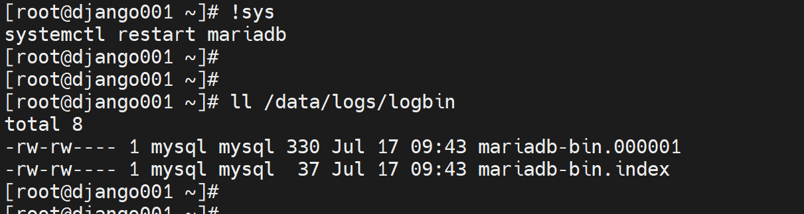
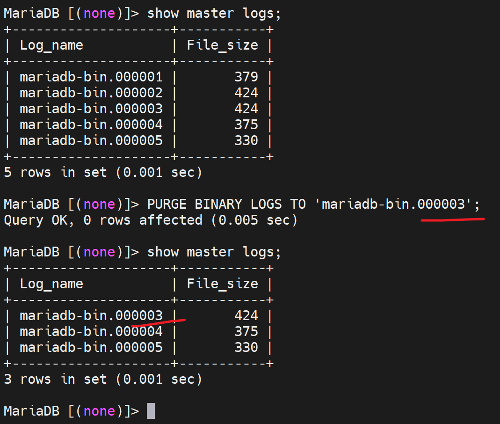
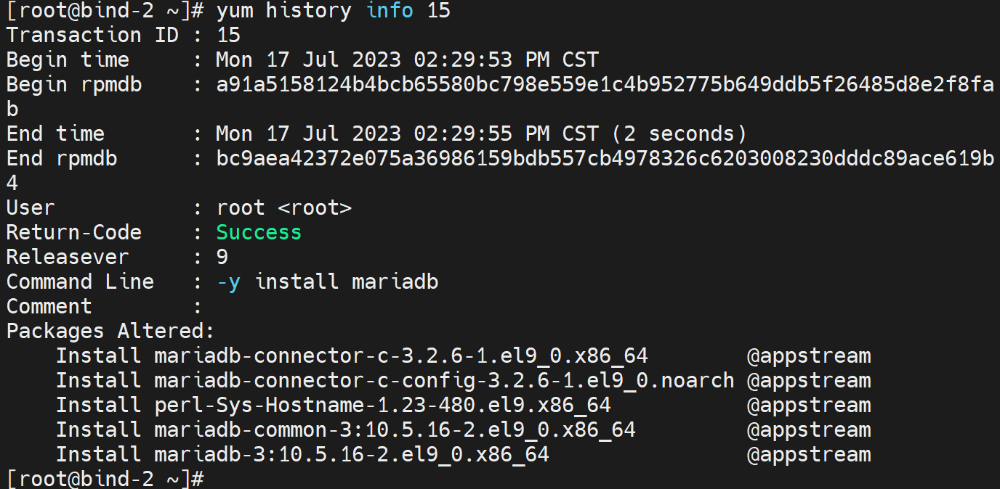

# 第1节. 数据库备份和还原原理详解

## binlog重置

 

 

flush logs刷新binlog日志，就是重新新建一个binlog。

 

清除binlog，可以rm，但是肯定没有purge来的专业

删除binlog日志文件3之前的日志、删除某某时间之前的日志。

 

不仅仅文件删掉了，Index文件里的内容也更新了。

 

reset master 初始化binlog文件名称。

reset master to No  初始化的编号人工指定。

 

相当于把原来的二进制全清空了。

## 备份概念

### 差异备份

 

1、周日是1T的数据做了完全备份，

2、周一做了差异备份，100G的差异做了备份，问题来了，增、删、改都是差异，这写备份的细节是什么，增100G很好备份，改100G呢，我认为就是所以变化的行就都会备份下来的。

3、周二的差异备份，就是从周日开始的差异，而不是和周一比较的，

4、周三周四的差异备份，都是和周日比较的。

5、假设周五的时候数据坏了，还没备份呢，此时如何还原。

6、先还原周日的数据，再把周四的备份还原一下，就行了。

7、周四的差异备份既然是从周日开始的，问，周三的差异备份是否可以删了，周一、周二同问。不能删！因为如果有一个操作时周二和周三之间做的，你想还原到这个操作之前就可以还原到周二的差异备份。

8、周五差异备份还没做，数据崩了，用周日全备+周四的差异将数据恢复到周四备份的那个点，那么从周四差异备份后到周五数据崩溃的时候，这段时间的数据如何恢复，此时就靠binlog了。此时由于binlog日志通常是独立磁盘进行存放的，所以既是数据库坏了可以利用binlog的。

### 增量备份

1、就是周日全量，周一基于周日的差异，周二基于周一的差异，周三基于周二的差异。

2、故障点如图，如何还原，周日、周一、周二、周三，依次还原，然后再用binlog日志来重做。

3、事实上，msyql的所谓的增量备份，配合一个mysql备份工具，底层用的就是二进制日志。就是每天复制二进制出来作为增量备份来着。

数据的备份策略怎么指定，和业务需求和数据库的大小有关的。

## 备份方式

### 冷备：读写均不可操作

1、简单粗暴，就是cp -a /var/lib/mysql  全部复制出来，同时看看log放在哪里的，也一并cp -a

①、比如mysql.sock这个sock文件服务一停了就没了，也无需备份的。

②、performance_schema这个也不用备份，和性能相关的。

2、配置文件/etc/my.cnf 或者其他地方也有的配置文件也要备份下来。

实验来一个：👇

另外开一台linux，然后将之前的linux上的db备份还原过去。

### ①打包数据库

便于网络传输，这点还蛮能提高效率的，一般人get不到这个点，因为如果不压缩，就是散文件，而散文件的传输存在N次TCP的慢启动，所以速度永远上不去；而tar一下后就一个整体文件，此时慢启动慢慢的启动后，达到传输的最大值了就。既然打包了，顺便也压缩一下更加便于网络传输拉。

使用J就是xz的压缩格式

压缩比还是不错的

### ②打包binlog

### ③/etc/my.cnf配置文件也要备份

### ④合并一下scp到另外一台机器上

会自动创建/databack/文件夹，结尾的/也可以不写。

### ⑤然后去新的一台linux安装maradb-server

要考虑mariadb的版本兼容性，最好是一样的。我这个都是这几天yum安装的，版本问题不大直接yum -y install mariadb-server确认下就行

我靠，版本低了，删掉重做，我才用undo 的方式，一并卸掉之前安装低版本mariadb的时候安装的依赖包

先undo 16，在undo 15

然后找一下原来10.11.2的版本

①找到原版本的思路有2，第一个就是去原来linxu的yum源文件看

②就是去mariadb官网找10.11.2啦，一般可能就是10.11也就OK了

https://mariadb.org/download/?t=repo-config&d=CentOS+Stream&v=10.11&r_m=neusoft

发现及时用原来的yum源文件，此时安装也已经是10.11.4了，没关系，继续

注意安装后的检查也要使用大小写的，虽然yum的时候不分大小写，但是rpm检查的时候却区分大小写的。

### ⑥此时由于服务没起，所以/var/lib/mysql下还是空的

然而并不是，我发现里面安装后有东西

删之~

覆盖也行，好习惯cp的时候cp -a 啊，还有 -b 啦

然后binlog复制过去

担心父目录权限？

默认有x就行了，

错了错了，无需事先创建文件夹，直接解压就会自动递归创建所需目录

权限也是OK的。

关键你是带目录压缩的吧，你试试当初不是tar -Jcvf /var/lib/mysql 估计就不行了

启动服务查看数据是否过来了

都OK了没问题

#### 冷备的缺点是需要停服，好处是备份快，但是一般用不上，除非已经停了或者就是要维护一下，可以顺带cp一把。

### 温备：读可以，写不行

### 热备：读写均可以操作

热备是比较实用的，据说是读写都行，不知道性能是否受影响，然后MyISAM不支持热备，只支持温备--备份的时候不能写只能读，InnoDB是读写都行的。

##### 你做备份的时候，热备的时候，本身是支持读写，如果有大量的增删改操作，你备份的数据其实就不是可靠的！因为数据本身都在变，要保障备份数据是一个时间点的所有数据状态。虽然备份这个动作的过程是半小时，但是备份的数据必然是一个时间点的所有数据。

1、如果是锁表不让写，那么就是温备了，MyISAM就是加共享式-读锁，不能写了就，进行温备。

2、其实很自然就想到事务的级别里的 "可重复读"的隔离级别，利用这个来做备份，记得将事务的上文里肯定也提到备份例子的。

3、mysql这个系统数据，到现在也还是基于MyISAM的，不是！老版本还是得，新版本都是Aria引擎，而且mysql.user也只是一个VIEW视图了，本身上还是

即使现在Aria引擎，也不支持事务

aria其实可以理解为不支持事务，但是有一点点的修正就是

https://mariadb.com/kb/en/aria-storage-engine/

涉及到mysql这个库的，一般就是账号、授权、存储过程这些了吧，一般这个库不大，也不怎么变动。这个库就是不管是早期的MyISAM引擎还是现在的Aria引擎都不支持事务级别去做热备，不过由于这个库和业务不想管，别人也不会频繁去读写它，所以完全可以做温备--也就是加上共享锁，不让别人写，这个时候再去备份就是温备就行了。

通常就是热备针对业务数据库，温备就是针对系统库mysql这种。冷备就是停服维护的时候复制便捷。

### **物理备份**

冷备就是物理备份，或者磁盘dd if=/xxx of=/xxx ：注意一下如果是冷备的复制文件，要知道即使看到文件的大小是比如100G，但是可能很多表格里都是空的也是有可能的，前面章节👇就讲过optimize整理一下表格就释放了。

一般来讲，不可能让你运维进到db的库里去optmize的，所以运维人员如果做冷备，其实就是明明知道实际数据可能没有这么大，也还是要复制这一堆文件的。也就是说冷备存在空间占用较大的情况，说白了就是有点浪费空间。

### 逻辑备份

逻辑备份时备份的实际数据，是把数据抽出来，进行备份。

而且也不是热备或是温备，而是相当于一个大的select ，所以和存储引擎无关。

缺点：相当于一个大的select，内部的一个client和server的sql语句啦，就是交互的cli方式，效率是低的。再一个就是如果数据库里存放的是二进制数据或是其他非文本数据，导出来的时候可能就会失去准确性。

1、数据肯定要备份的，

2、事务日志如果是正常stop服务，事务日志的记录其实都是已经写到文件里去了，当然最好是也备份一些；二进制日志一样最好也备份。

3、程序代码，这些存储过程、函数、触发器、事件调度器，这些其实不推荐用的，但是有的就用了，此时就需要备份了。不过这些比如存储过程，好像都在mysql系统库里的。

4、然后就是服务器的配置文件，也需要备份的！

上面讲了备份的一些概念，冷、温、热；物理、逻辑，其实也就是一个冷备进行了操作，下面解释备份工具，

1、cp、tar、chown改权限这个都是冷备，或者是/etc/my.cnf配置文件的备份。

2、LVM利用逻辑卷的快照，这个一般来讲还是比较快的，我的泛微OA 500G的EC，快照在15分钟的样子，当然不包含sqlserver哦，那个是物理机windows的。做法就是①加读锁，②做快照，不过我的泛微OA是vsphere快照要15分钟唉，难道LVM的快照会秒做的？

视频里老师说是几乎是1s就做完了，几乎达到了热备的效果，所以写个脚本先做读锁，在秒快照，然后解锁恢复。

但是生产中用了VM的快照来做数据的备份，这种方式是用的不多的。

(5) 解释一下：快照里的数据其实是老数据，你不是lock了嘛，挂载一下看到老数据，直接cp出来，这里就和冷备一样

(6)解释一下：快照里的东西cp出来后，完成备份后，立马要删除快照，否则一旦有新的数据发生变化，量一大，就会生成原始数据（什么意？就是快照里的东西你看得到其实还是老数据，只有这些老数据发生变化了，才会真正地生成一份老数据落下来，所以有问题的还是，因为数据没变，老数据其实是链接，你解锁后，哎没关系啊，解锁后发生变化大不了，老数据就从链接变成了真实的落地数据不就行了么，也不影响你的复制的时间一致性的）

当然这个LVM的快照本身不涉及conf文件和binlog的。

mysqldump属于常用的备份工具，不过这个是针对全备的，其他差异、增量 都不支持的其实，他的增量备份是借助于手工处理binlog来实现的。

xtrabackup是支持各种复制的备份，全备、增量都OK，是直接cli就支持的。

mariadb backup是高版本的mariadb才支持，不过这个视频是好多年的了，现在用基本上就支持了，然后这个mariadb backup是基于percona xtrabackup2.3.8也就是上面一个备份工具做的二次开发，个人感觉可能更优秀。

mysqlbackup，听名字就是mysql的专用，然后也是收费工具。他其实就是MySQL Enterprise Edition 企业版的功能来着。 mysql是orcale公司的，做了两个版本，一个社区版，一个是企业版。

mysqlhotcopy，名字里有hot，其实是冷备来着！是perl语言写的，这个perl语言本身国内用的就少。

稍后重点学习mysqldump、xtrabackup，然后个人觉的mariadb backup也要学，应该看着是优化了的。

 

