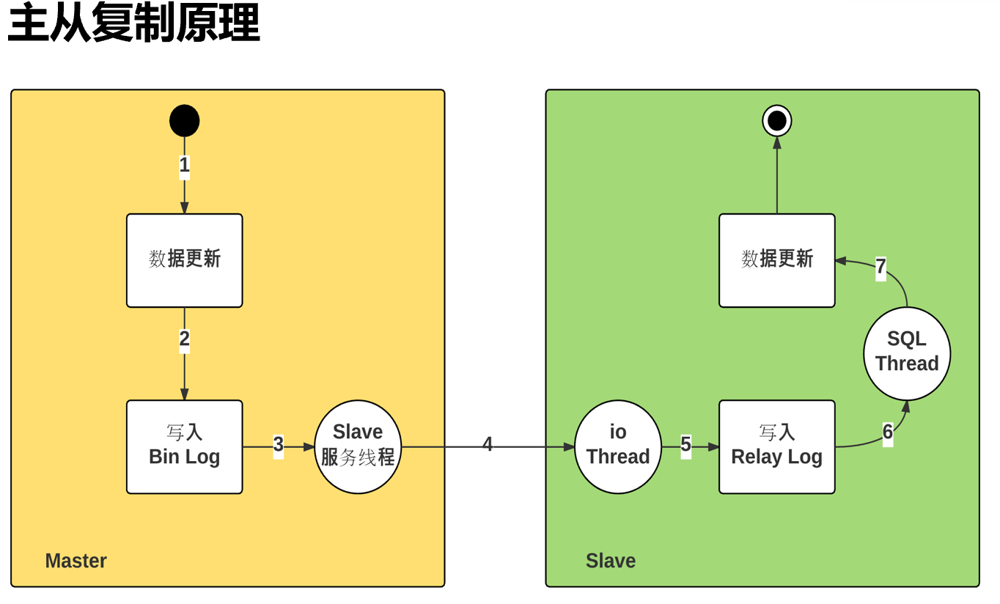
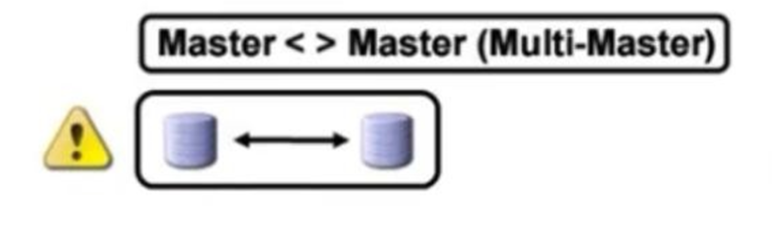
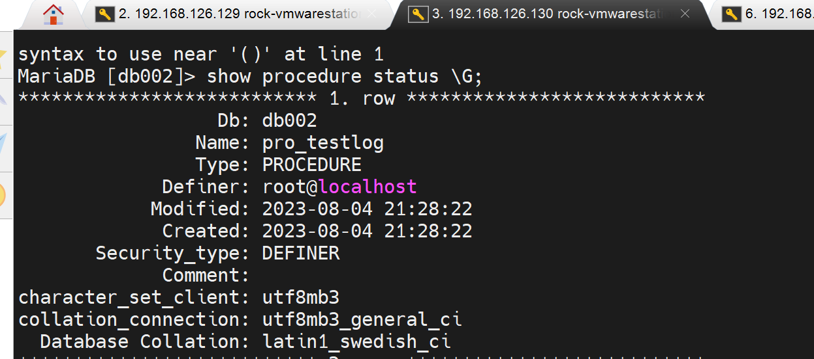

# 第4节. mysql主从复制原理和实现


主从可不是备份，主上面DDL删库，从上也没了，DDL也不是事务日志能够记录的，也无法回滚，更别说恶意的commit了；所以备份时备份，主从是主从。

scale up,scale out  纵向和横向，前者指提升硬件资源cpu，内存、硬盘等；后者指提升横向计算机数量，类似主从，集群来提升性能。


主从复制要配合读写分离


proxy就是当sql操作来的时候，进行识别：

如果是DML就送给主，主要时进行数据的修改；

如果是DQL查询语句，就送给从进行查询；

这种proxy读写分离器，或者叫代理器，或者叫路由器，或者叫调度器。

proxy有很多产品，看你喜欢哪一个了。


下面先搭建主从架构


如果主挂了，从可以在秒级顶替上来。

升级可以先拿一个从节点开始升级，然后用用看，没问题就继续升其他的。


## 主从架构


sync 主从复制，是依赖的binlog，所以binlog是要在master上启动的。

然后是怎么把二进制日志拷贝过去的，下文会细讲。


很多时候，主从架构的搭建不是一蹴而就的。要知道一个事实规律，架构这种东西从来不是生下来就一个样子的，是不断演进的。所以不能为了好看的架构而架构，一定是适合业务发展需求。




复制依赖于二进制日志，master---slave---slave，如果是这种级联，其实中间的slave对于右边的slave来讲也是主了，而主就需要启用binlog。

1、当数据更新，就会自动生成binlog日志里的内容；

2、因为要主从复制，所以启用了一个服务--叫dump的线程，在Master上启用的。这个线程会负责读取新的二进制日志，把它通过网络发送给Slave。

3、有发就有接收啊，所以在slave上有一个线程来接收--小IO thread。这个io线程就是负责从网络中接收来自于master的binlog。

4、slave的io thread接收下来，放到relay log中继日志文件里，放到中继日志文件也不是最终目的，最终目的是要让从数据库的数据也发生更新。

5、此时就需要slave上的sql thread线程来读取 中继日志里的binlog，在本地slave数据库里运行，从而实现slave的数据同步。

6、主从复制涉及 两个线程，master 那边1个，slave那边2个。dump thread、io thread、sql thread。

7、涉及两个日志，主节点的binlog；从节点的relaylog。


##### 主从架构的主是复制写操作的，主就是一台，如果写压力大业务大，主从，从再多也没用。此时，就需要分库、分表来解决。


拆库和主从不搭嘎，原来一个主服务器拆成3个，这3个依然都是主服务器

拆库的原则，是三个部分或者本来是三个表没有关系，不需要join表，所以就可以拆成各自的库。

上图👆是纵向切片，下图👇是水平切片


1、比如用户表、消息表、其他表，表和表之间存在join关系；此时纵向拆就不行了。

2、可以考虑横向拆，原来1000W条拆成500W+500W两张表，然后放到2个数据库机器上去。

3、拆开来后表的结构都一样的，只是放了其中一部分的数据

4、比如按13579奇偶数拆，奇数放一个服务器上，偶数放另一个服务器上。

5、比如按范围拆，1-500W，501W-1000W。

6、按地区拆，北京、上海

7、按用户级别拆，vip、svip

8、前端还得有调度也就是proxy，查和写都得知道去哪个库。


分库也好，主从也罢，都涉及到调度器proxy去将 读写负载分担到主也好从也好，拆分出来的库也罢。

这里就涉及一个调度器这个负载设备点的 单点故障。

调度器的单点故障是通过keepalive来解决的，nginx，f5应该也可以吧。

组合架构：拆库A+B，然后针对A做从节点，B同样也做从节点。再做好备份就行了。

分库的考量点，不是简单的数据量，而是用户访问量大到一定程度才会考虑分库。数据大，硬盘空间大一些就行了，用户量大了就不是简单加硬盘了，要考虑整体资源，所以分库是要考虑的。考虑的是访问量而不是数据库多大。


master.info里涉及给到slave的也给replication复制的一个权限。

relay-log.info是slave讲复制过来的binlog和relaylog的对应关系，复制了哪些binlog进来。

relay-log.info无需维护，就看看里面的处理的binlog和relaylog的对应关系就行。


### 复制不及时的问题，就会造成主从数据不一致，这是常见的

1、同步机制就是binglog从dump线程-io线程-中继线程-重放，这套机制就是会延迟的。数据不及时是必然的。

而且会出现延迟很大的情况👇

①并行转串行：

并行写数据，但却是串行写日志。且网络传输也会涉及FIFO的一个先进先出的默认队列。


PS：

1、dml并发写入db表里

2、日志binlog就是串行写入了

3、binlog再复制到各个下面的从节点，每个节点又是串行传输的。

4、类似上高架，多车道并单车道，类似吧。

5、如果持续出现这种现象--就是用户高并发太频繁了，串行跟不上，且网络FIFO，日积月累的延迟就大了，在有些企业里延迟可能会高达1小时。比如做活动用户访问量大，等活动过去用户访问频次下来，FIFO也就慢慢能够处理得过来了，总之要将队列里的数据先处理掉才行。如果此时主服务器宕机了，从有没有同步到数据，长达一个小时的数据就没了。

6、遇到这种情况，就是备份+binlog来恢复数据吧。


## 主从复制的流程特定

### 异步


### 同步，


如果4 5 遇到高并发，大延迟，此时6就会很慢才会得到处理:

1、用户发起dml

2、proxy转发器代理区分dml往master送，如果是读DQL往slave上送。

3、此时是DML，master收到后，就开始写到本地数据库

此时，如果写完后，直接往proxy回应，说完了，不等从同步确认。就是异步也是默认的方式。

如果，不立刻回复用户，而是先同步，等slave回应同步ok后在回复proxy，则是同步。


### 半同步，介于异步和同步之间


### 常见架构，或者也叫mysql复制模型

### 

一主一从，一主多从

级联复制，一主一从级联带多从:这个好处就是master只需要复制给一个，剩下的从都重那一个中间节点复制就行了。master压力小。这让我想起了之前《第二十四章 MYSQL数据02》- 第4节 mysql架构和存储引擎详解里的这张图👇，就是说级联的中间点加速复制不做本地落数据，叫做黑洞技术。


 

主主会造成数据不一致，因为都能写，但是M/M是可以这么玩的，前置调度器，比如F5将DML都往MASTER-A上送；然后MASTER-B要去从MASTER-A上取数据--本质上MASTER-B还是从只不过是已经提升为MASTER的SLAVE；如果MASTER-A宕机了，就直接F5通过健康检查快速切到MASTER-B去了，MASTER-B因为已经是主了无需从SLAVE再繁琐的提升到主了。

但是主主+调度器，主主里的实为从的那个主，如何做到只接收数据，不去覆盖到真正的主的呢？

主从的情况，从变成主，需要修改配置。


两主，一从，这是省钱的玩法，啥意思，就是


master-A里是db_1

master-B里是db_2

slave一个没错，但是分别复制db_1和db_2，物理上是一个从，其实是两个从库。所以主从式精确的来讲是库的主从。

slave一个没错，但是分别是两个实例--就是两个mysql服务，mysql_1同步master_1里的所有库；mysq_2同步master_2里的所有库，哈哈，一个套路。

本质上还是一主一从。


这个压根不会用了


其他的都有存在性和落地的可能。


### 复制的时候是复制的binlog

而binglo是格式的：

STETEMENT--语句型，不推荐

ROW--行型，推荐

MIXED--混合型，也凑合


## mysql复制配置


### 主节点配置

#### 关键配置就两个


#### 然后还得授权从能够访问主进行复制权限不必给大


复制的时候不确定是哪个数据库，所以就写\*.\*所有库的所有表。


### 从节点配置


①server_id是主从都需要配置的

②read_only是防止从节点被改了，被改了就无法去同步主节点了。且数据库就不一致了。其实不加也没事，要从架构考虑，因为主从前端还有一个调度器呢，只要保证前端的调度器能够正常的分离读写就行了，写别发送到从节点就行。

然后用户也不会直接连到从节点，也不会改得到数据。

read_only是针对普通用来将的，不包含root，root这个管理员还是该写还是能写。

③指定主的host也就是ip，指定从节点以什么账号密码进行复制，指定从什么binlog文件里的哪个位置开始进行复制，从那个点开始复制往后所有的binlog。

mysql > CHANGE MASTER TO MASTER HOST='host',MASTER_USER='repluser',MASTER_PASSWORD='replass',MASTER_LOG_FILE='mariadb-bin.xxxxx',MASTER_LOG_POS=#;

这个MASTER_LOG_FILE，mysql5.6以后就不需要指定了binlog文件自然也无需指定位子了。

然后这里的CHANGE MASTER TO 在前面学到过，就是


④最后启动一下从节点去复制主节点的binlog的动作

因为，要启动从节点的两个线程IO和SQL thread；需要

 

其实不必分开启动，直接START SLAVE就默认会启动IO_THREAD和SQL_THEAD两个线程了。

一旦启动，后续就自动持续复制了，不用管了。


## 主从复制实验

### 修改配置文件

#### master上配置


#### slave上配置


### 创建复制用的账号


#### 看下slave从哪里开始复制


从mariasb-bin.000032的548位置开始复制

slave那边的cli如果忘记了可以help一下


```
CHANGE MASTER TO
 MASTER_HOST='192.168.126.129',
 MASTER_USER='repluser',
 MASTER_PASSWORD='centos',
 MASTER_PORT=3306,
 MASTER_LOG_FILE='mariadb-bin.000032',
 MASTER_LOG_POS=548,
 MASTER_CONNECT_RETRY=10;
START SLAVE;

```

再输入上面的CLI之前的slave的状态是Empty空的👇。


然后数据库文件目录下当前文件如下，待会等cli敲下去就看看新生成的文件是那些。


敲下去后，此时


master.info的内容


上图发现IP地址写错了，重新敲一遍上面的CLI就行了。


👆中继日志就是复制过来的的master二进制日志和本地中继日志的对应关系。

master那边的mariasb-bin.000032的548相当于本地的bind-2-rely-bin.000001

上面的mariasb-bin也写错了，将上上面的cli重一遍就行


这两个文件是中继过来的binlog文件，类似binlog一样的，index是binlog的文件名。


敲完上面的CLI之后，从节点再看一下👇


上图可见


这个👆是slave上的参数，表示从节点同步主节点的延迟时长多少秒。其实就是差多少秒的数据了。

说明IO thread和SQL thread都未开启，去master上看看进程


同样slave这边也看一下线程情况


#### 在从节点上启动两个线程


主节点也看下线程也已经启动了


然后测试同步情况

在主节点上创建db

 


 


再测试一个大的数据生成的同步情况


主那边存储过程创建，从那边自然也有了



从节点的表格也同步了，


此时在主节点上执行存储过程，然后观察从节点的表格同步情况


主👆节点，  👇从节点


此时从节点的进程如下


目前没有延迟同步的时间，然后主节点那边的binlog文件和位置是多少，从节点自己的rely-binlog的文件和位置是多少的一个对应关系。这比较一开始要多了很多数据。


然后要注意一点，主节点那边的call 调用存储过程


所消耗的时间未1min59s，这个里面由于是要做主从同步的，所以时间要比单节点来的要长些。

所以主的压力就明显变大了，此时前端就需要部署一个调度器来实现读写分离，让读操作DQL就别往主节点发送了。


### 总结


