# 第1节. httpd基础知识

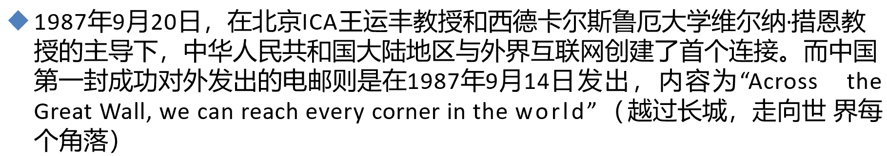

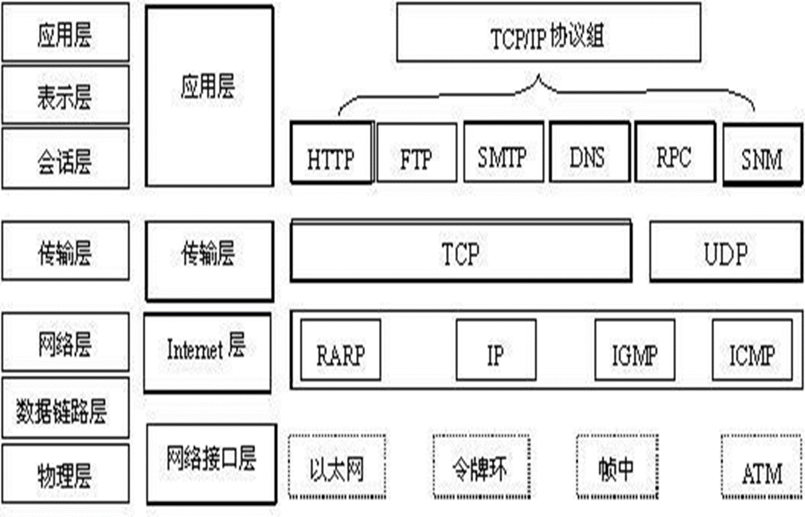

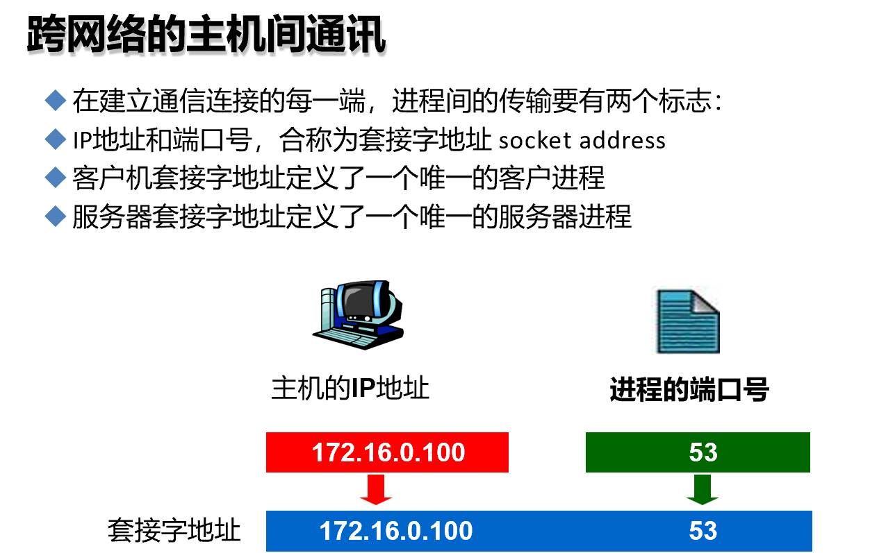

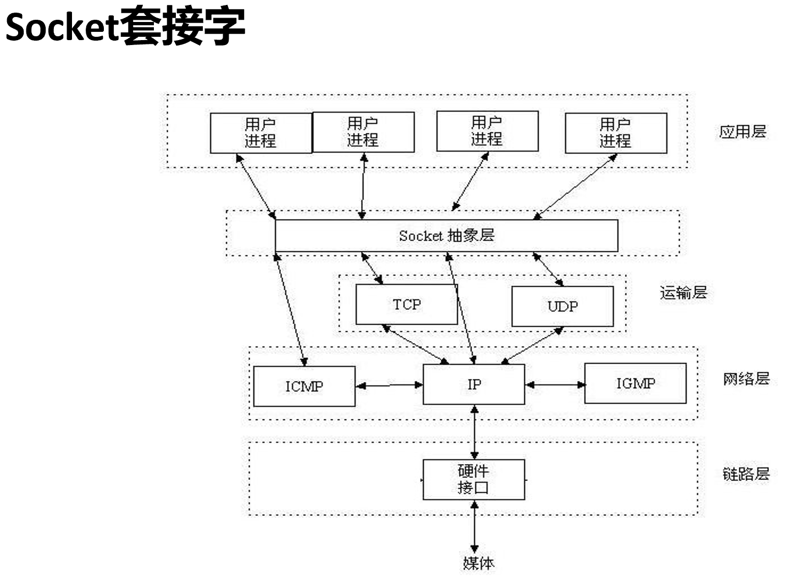

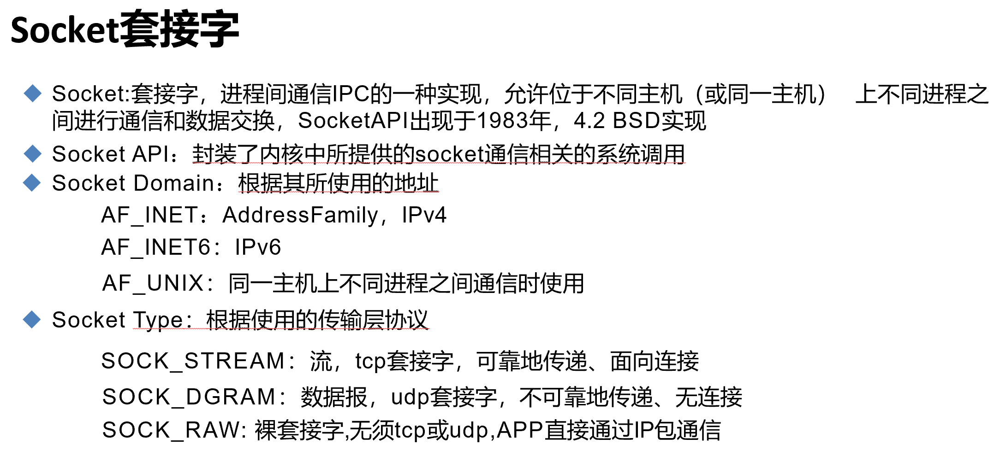

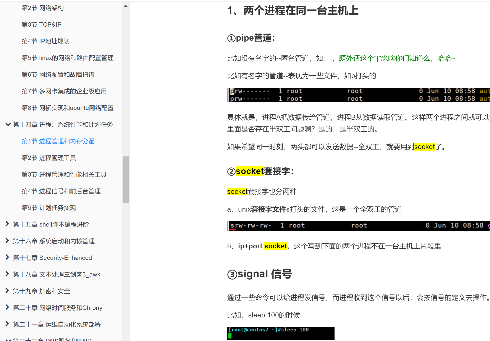

通过man socket查看

**man 2 socket** 开发看的

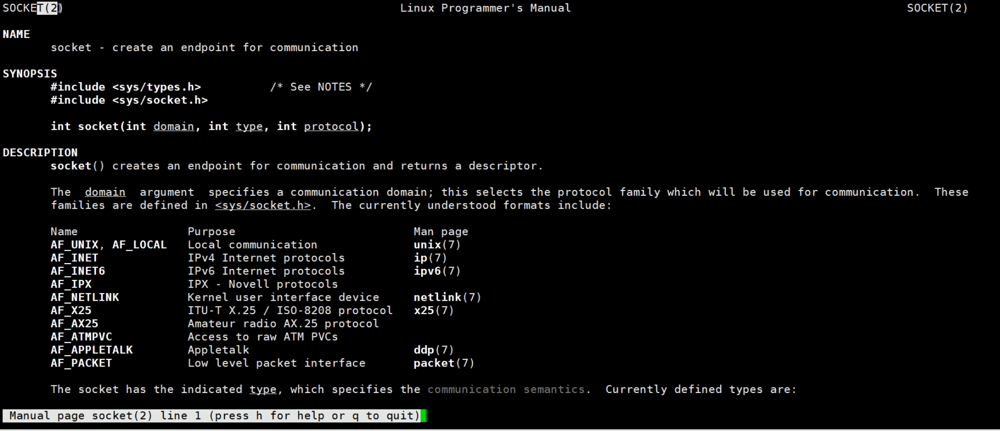

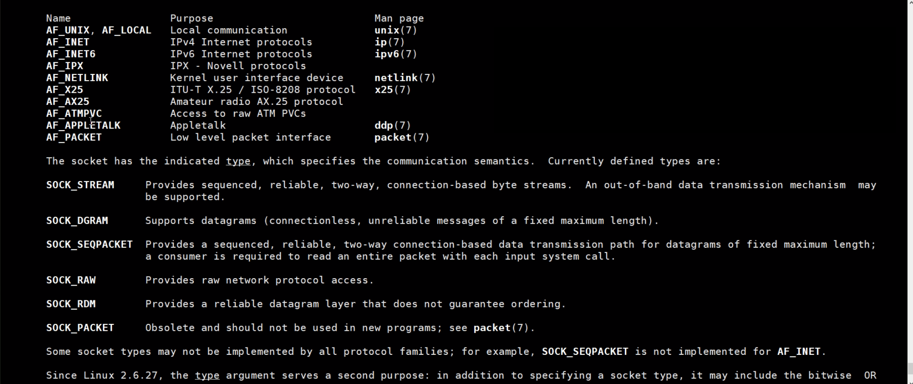

这里的accept bind connect都是C语言写的，他们都是也给tcp连接的更加底层的功能模块。

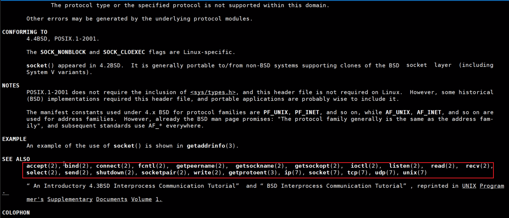

**man 3 socket **也是开发看的

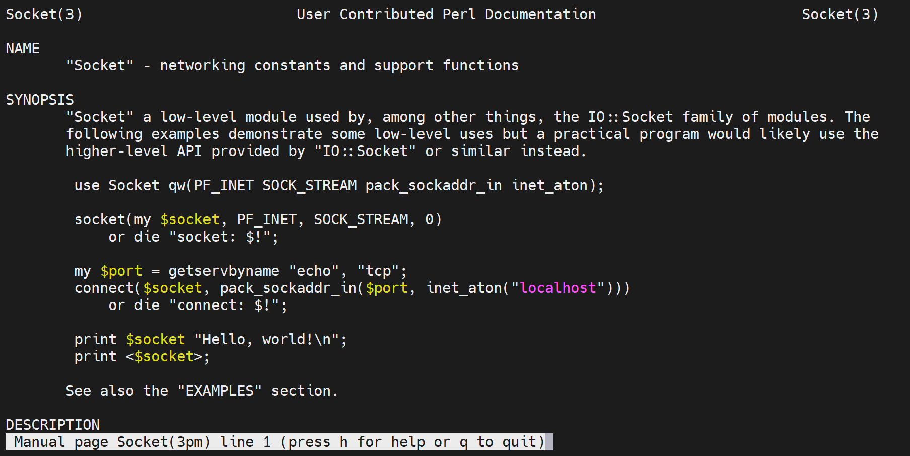

**BIND 模块**，是socket套接字绑定用的

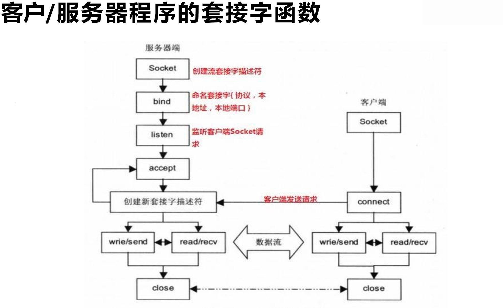

1、创建socket描述符

2、绑定socket描述符和协议|IP|PORT

3、listen，打开socket监听

4、client，同样打开socket，通过connect函数发起请求，连接的时候指定目标服务器的IP和PORT。

5、请求发过去后，server端就有一个accept函数负载接收用户的connect请求。

6、到此就形成了一个连接。比如TCP/UDP的连接，什么UDP无连接，谁说无连接的，只是不面向连接，什么叫不面向连接，就是不时刻维护连接信息。但是连接的初始化工作还是要做的，否则怎么通信呢。

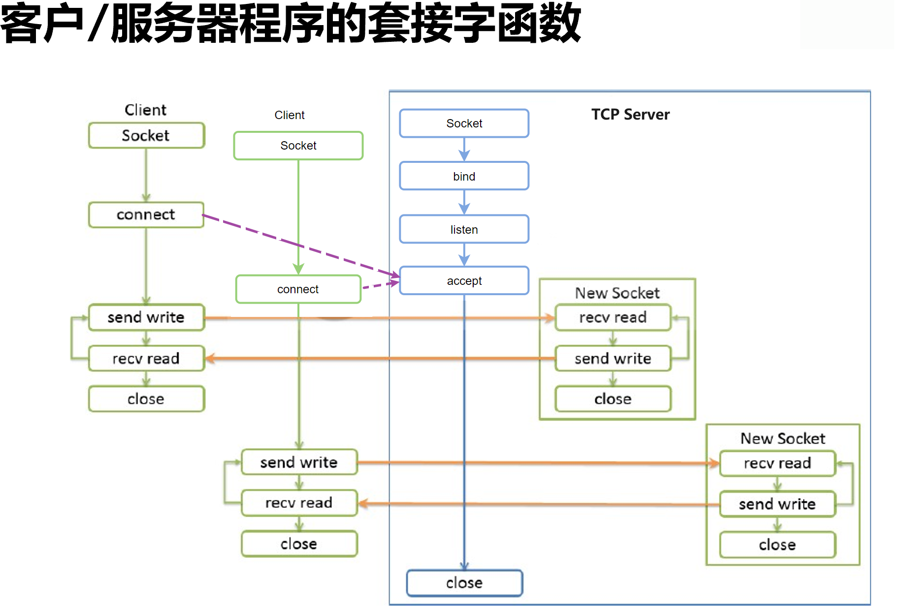

同样进一步理解socket的函数模块和工作思路

还是和上文一样，打开socket，bind协议IP端口，监听socket，处于accept状态

此时client1来了，就开启一个New Socket，然后发送/接收数据，

client2来了，同样新建一个socket，来处理，多个不同的socke连接来实现不同client的请求。这里面可以联想到一个窗口一个软件一个页面打开可能涉及多个session会话，一个session应该就是对应一个连接(socket)吧。

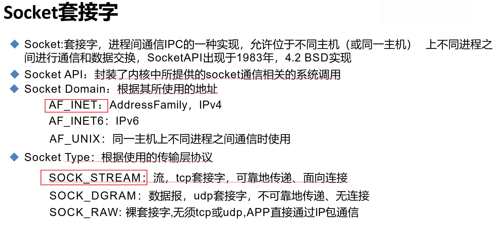

看下函数调用，py案例

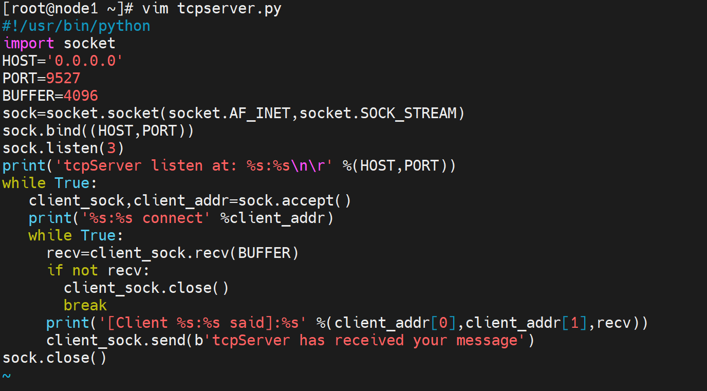

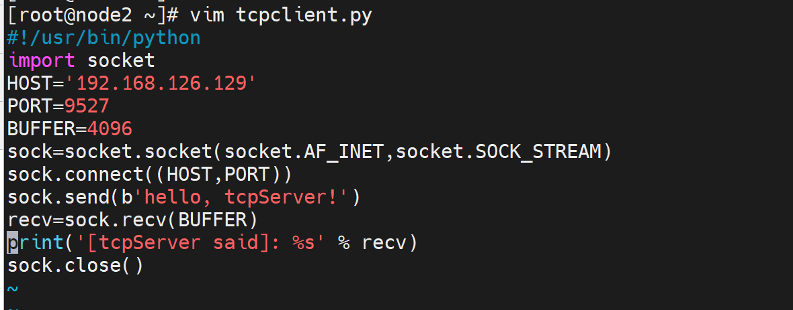

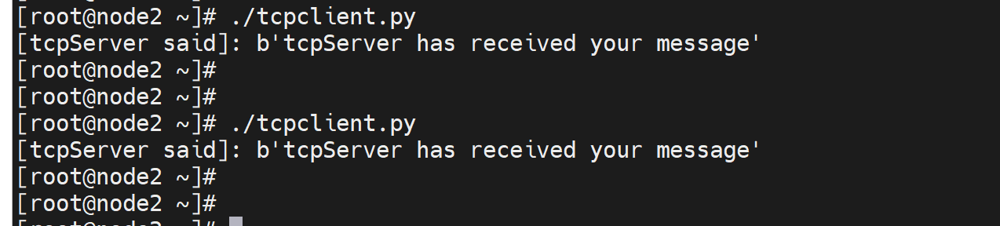

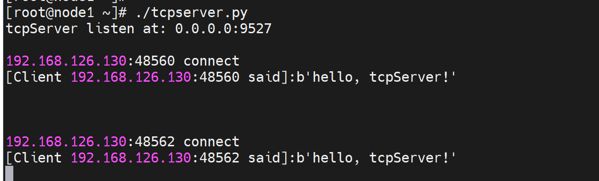

注意看下小端口的一个保留特性，权限不够的报错，这个在一些linux比如centos7上可能是存在的，但是我用rockylinux9并没有发现什么问题。

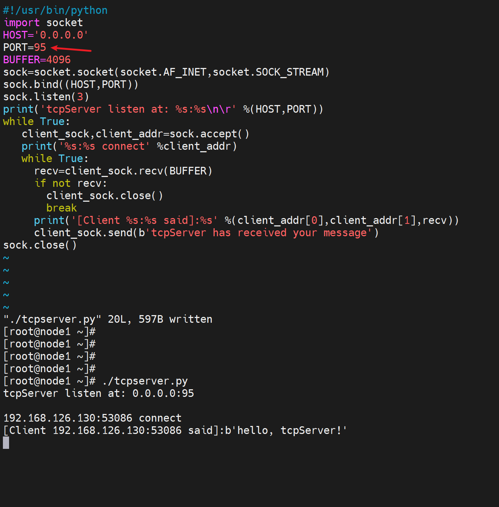

结果并没有出现小端口不让普通用户用的情况，

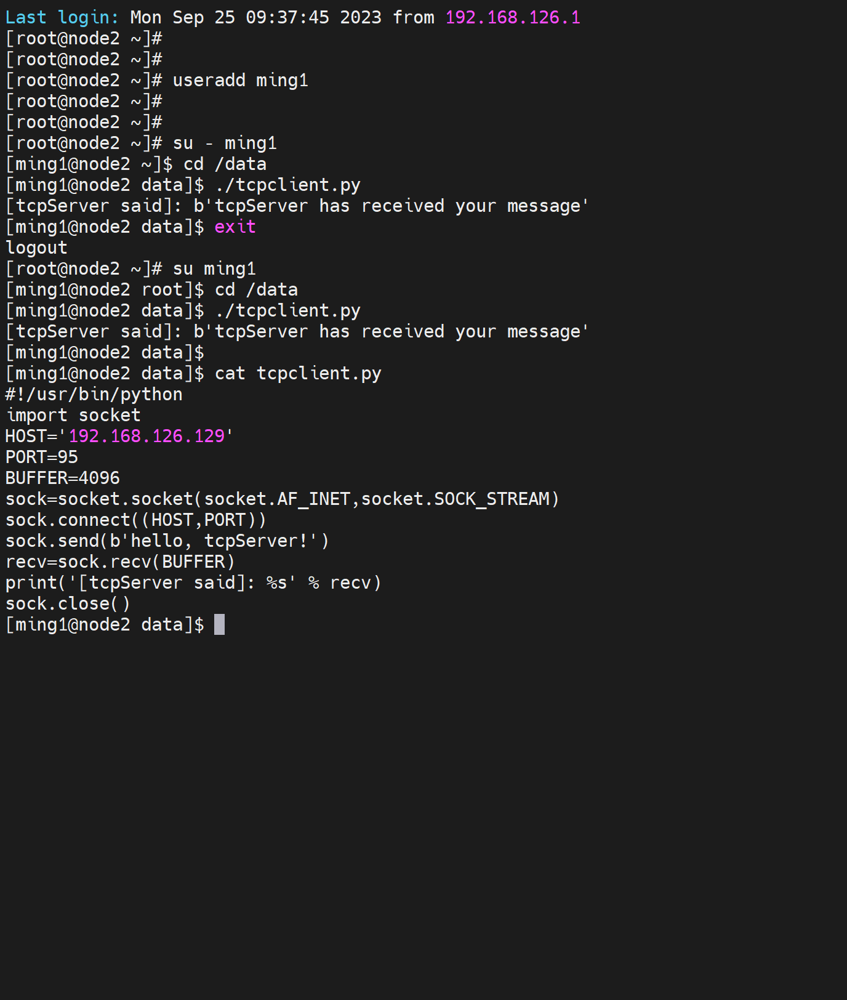

