# 第4节. httpd2


# apache的文件构成了解


## rockylinux9上apache直接yum安装的版本

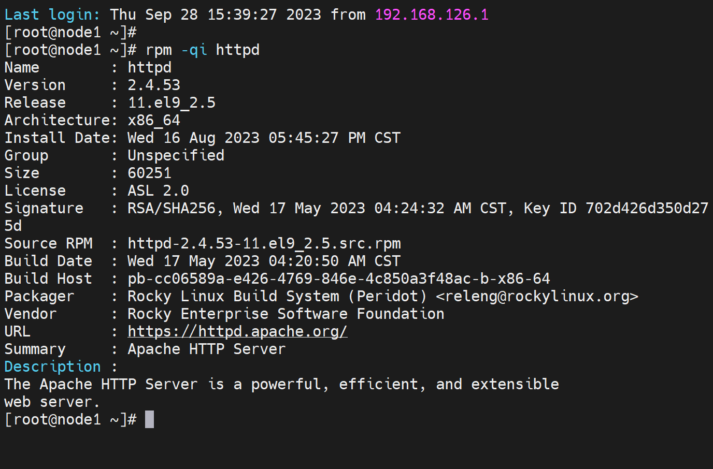

安装httpd软件时的依赖


其中重要文件，比如conf文件都在httpd-core-xxx这个软件包里。


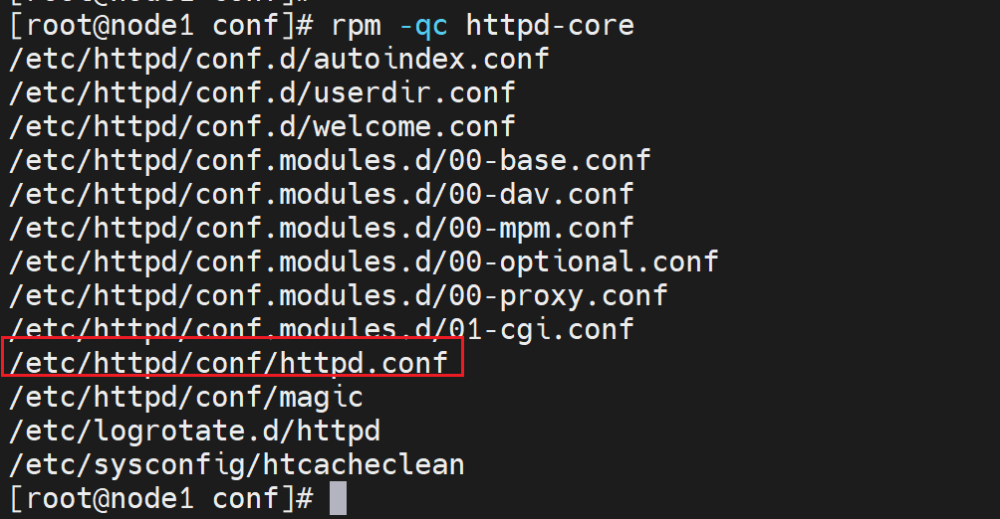


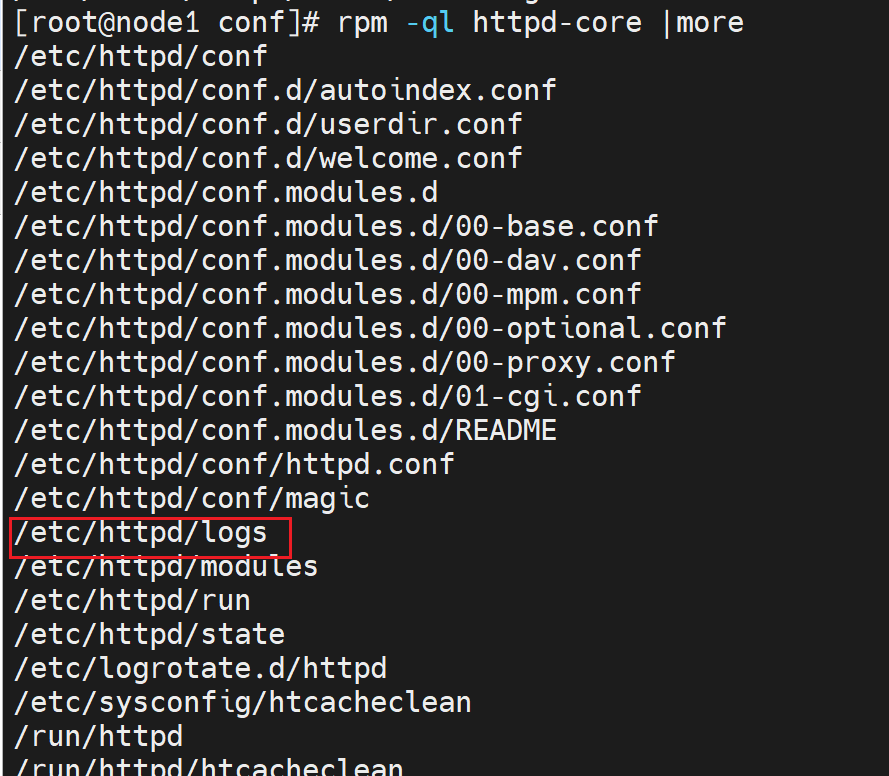


## /etc/httpd  就是apache软件的工作总目录


服务service文件就不在httpd-core-xxx这个包里了，而是在httpd.x86_64这个里

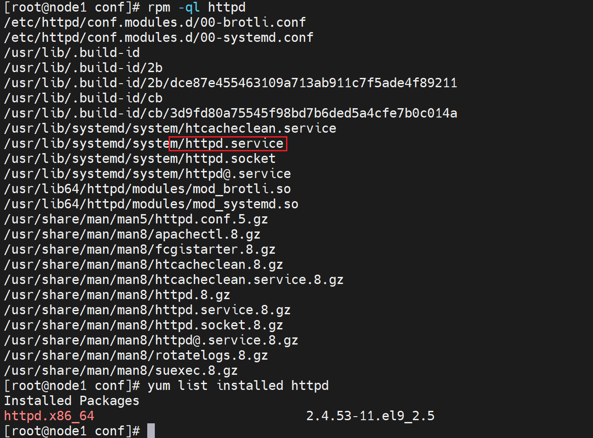


## 关于modules

**①/etc/httpd/modules 模块目录**   conf.modules.d这个一看就是conf配置文件的模板不是这里要梳理的/etc/httpd/modules这个模块

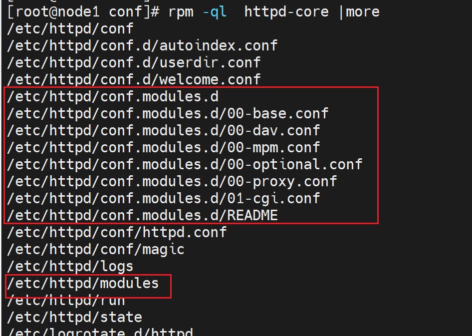

还有**/usr/lib64/httpd/modules/**这个 模块

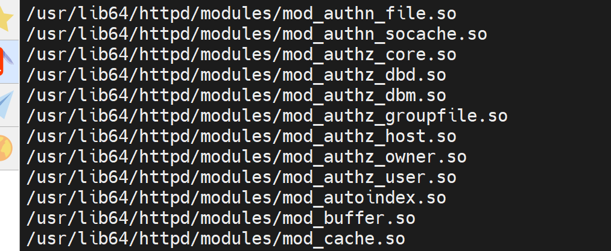


其实是一样的

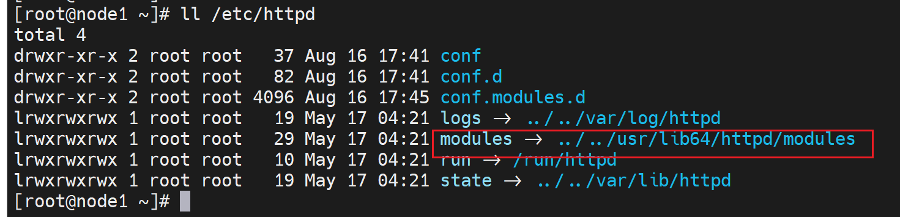

/etc/httpd/modules时/usr/lib64/httpd/modules的软连接。


/etc/httpd是作为apache的总目录，后面一些配置上，都以这个目录为相对路径的。配置上直接写的就是相对路径，而相对的就是这个目录。


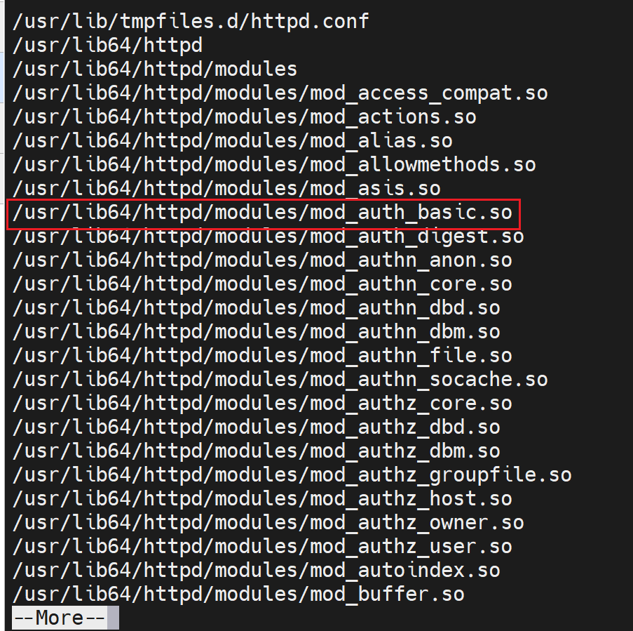

mod_auth_basic.so模块的作用：用来验证用户名密码的一个基本功能；一般来讲用户登入POST提交用户密码，对比DB里的记录，一致则验证通过，而这一套东西涉及软件开发的过程(...这就涉及软件开发了？不就是POST对比DB库嘛，先估且认同这个观点吧，估计是涉及DB和POST处理吧，正常django好像挺简单的处理这块)。而mod_auth_basic.so这个模块就可以对某一个网站做基本的用户名密码认证。


apachectl 启用关闭的二进制程序，不过一般用systemctl start httpd。


/usr/sbin/httpd是apache的主进程，systemctl start httpd启动的就是这个。


然后apachectl 这个cli也看下效果👇

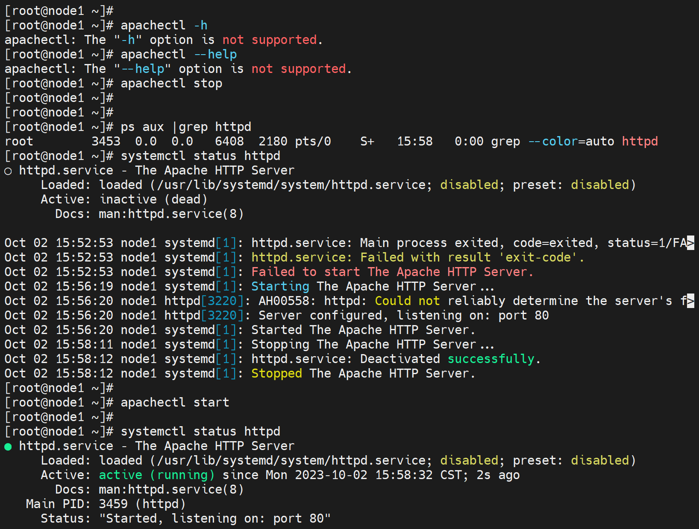


## 然后/var/www这个耳熟能详的目录

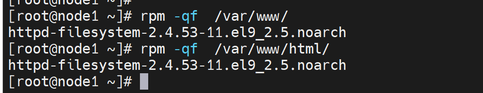

是在httpd-filesystem-2.4xxxx这个包里了，


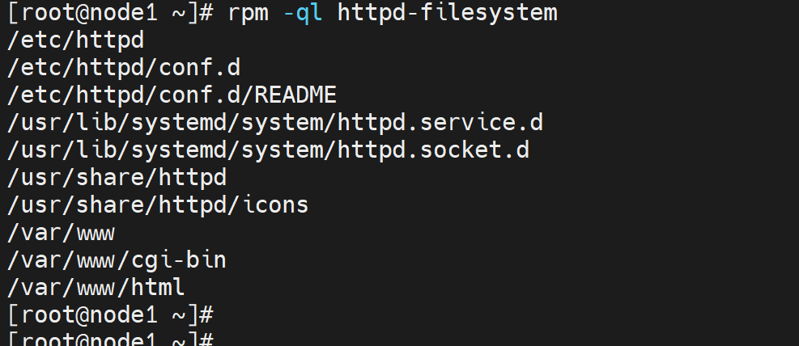


## 

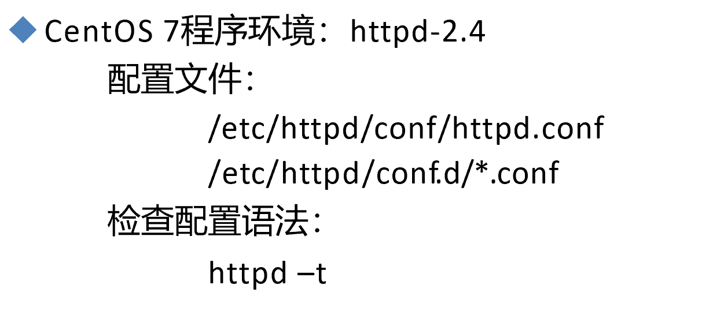

刚安装好的httpd的配置检测看看

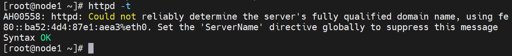

Syntax OK，语法OK，然后提示消息说的是FQDN的事情，没啥后面会配置。


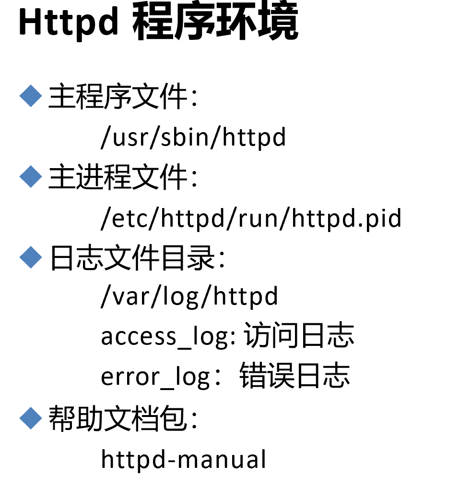


跟pptp，l2tp的服务一样，vpn服务跑起来针对针对某个用户踢下线，就可以找到用户拨入接口的进程PID；

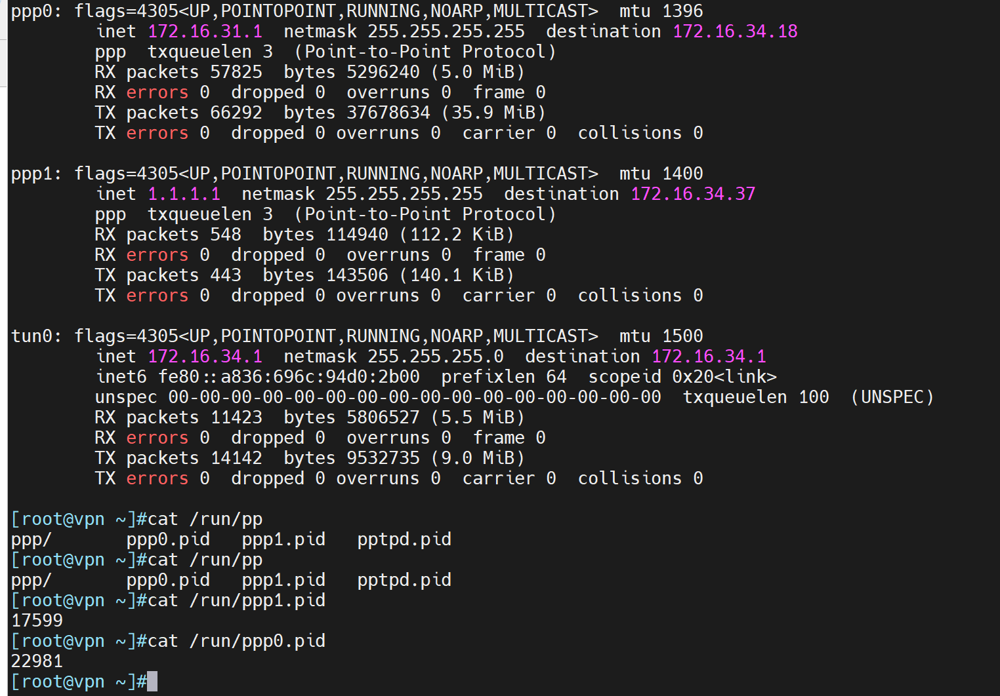

我的意思就是针对进程的ID，通常服务软件们会自己动态生成xxx.pid文件来保存的，不然ps aux 去看可能有很多不好区分--就比如上图的ppp0、ppp1如果这些很多，ps aux |grep ppp 也不知道哪个接口时哪个进程的。

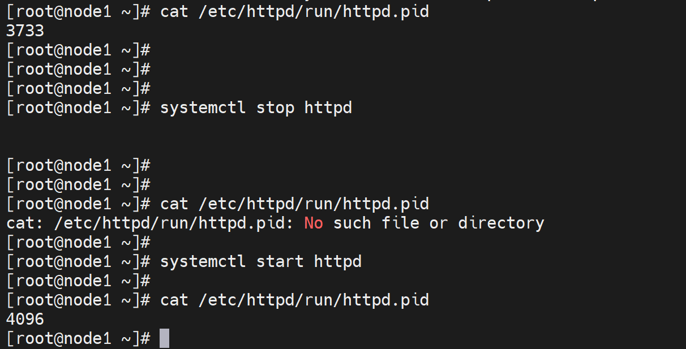


# httpd的配置

```
[root@node1 ~]# cat /etc/httpd/conf/httpd.conf  |grep -Ev '^ *#'

ServerRoot "/etc/httpd"    # 这就是根，所有的配置目录的相对路径都是相对这个目录的

Listen 80

Include conf.modules.d/*.conf  # 包含的辅助配置文件，这里就是相对路径了，/etc/httpd/conf.modules.d/了。

User apache
Group apache


ServerAdmin root@localhost


<Directory />
    AllowOverride none
    Require all denied
</Directory>


DocumentRoot "/var/www/html"

<Directory "/var/www">
    AllowOverride None
    Require all granted
</Directory>

<Directory "/var/www/html">
    Options Indexes FollowSymLinks

    AllowOverride None

    Require all granted
</Directory>

<IfModule dir_module>
    DirectoryIndex index.html
</IfModule>

<Files ".ht*">
    Require all denied
</Files>

ErrorLog "logs/error_log"

LogLevel warn

<IfModule log_config_module>
    LogFormat "%h %l %u %t \"%r\" %>s %b \"%{Referer}i\" \"%{User-Agent}i\"" combined
    LogFormat "%h %l %u %t \"%r\" %>s %b" common

    <IfModule logio_module>
      LogFormat "%h %l %u %t \"%r\" %>s %b \"%{Referer}i\" \"%{User-Agent}i\" %I %O" combinedio
    </IfModule>


    CustomLog "logs/access_log" combined
</IfModule>

<IfModule alias_module>


    ScriptAlias /cgi-bin/ "/var/www/cgi-bin/"

</IfModule>

<Directory "/var/www/cgi-bin">
    AllowOverride None
    Options None
    Require all granted
</Directory>

<IfModule mime_module>
    TypesConfig /etc/mime.types

    AddType application/x-compress .Z
    AddType application/x-gzip .gz .tgz


    AddType text/html .shtml
    AddOutputFilter INCLUDES .shtml
</IfModule>

AddDefaultCharset UTF-8

<IfModule mime_magic_module>
    MIMEMagicFile conf/magic
</IfModule>


EnableSendfile on

IncludeOptional conf.d/*.conf    # 由于当前文件也就是/etc/httpd/conf/httpd.conf里的东西太多，所以建议后面的配置都放到conf.d/下面。

```

不管怎么说先备份这个主配置文件

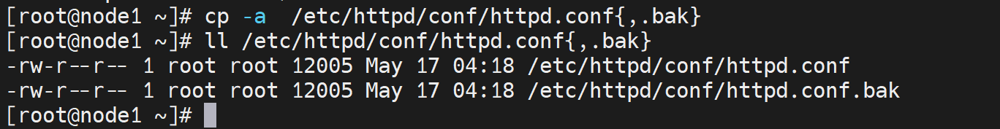


## HTTPD常见配置


**httpd配置文件的组成：**

**主要组成**

​	Global Environment

​	Main server configuration virtual host

**配置格式：directive value **     # 指令 值得格式，类似字典得键值对。

 	Directive  不区分字符大小写
 	
 	Value 为路径时，是否区分大小写，取决于文件系统

**官方帮助**

​	http://httpd.apache.org/docs/2.4/


配置的格式都是类似key value的方式


### **listen**的写法


IP-address 不写就是绑定所有IP。

IP地址本地不存在，httpd都不会让你起来

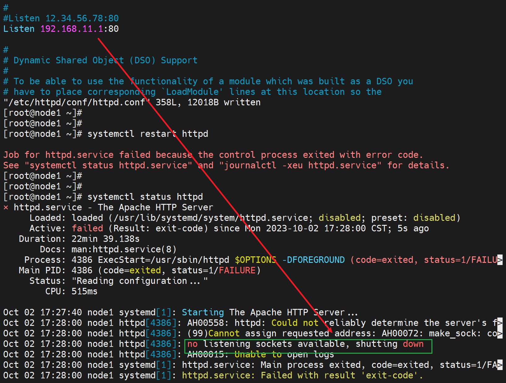


修改监听端口需要重启服务的，reload不行👇

不是所有的配置都能reload，进而无需重启服务，

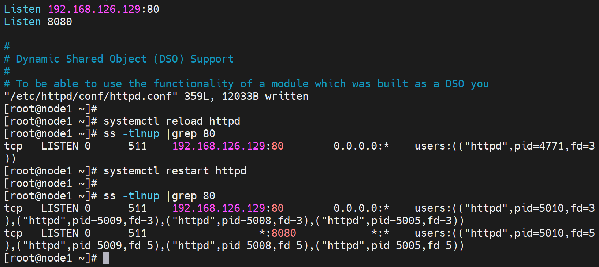

将来就可以做两个网站，一个80，一个8080。可以使用虚拟主机技术。是VPS嘛？感觉不是..


### ServerTokens


👇下图可见server字段就暴露了apache的版本和操作系统。

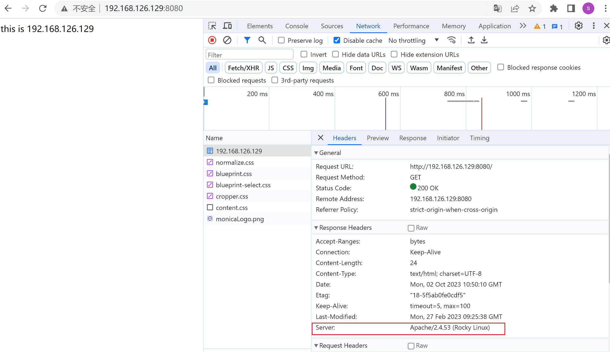


使用curl看头部信息


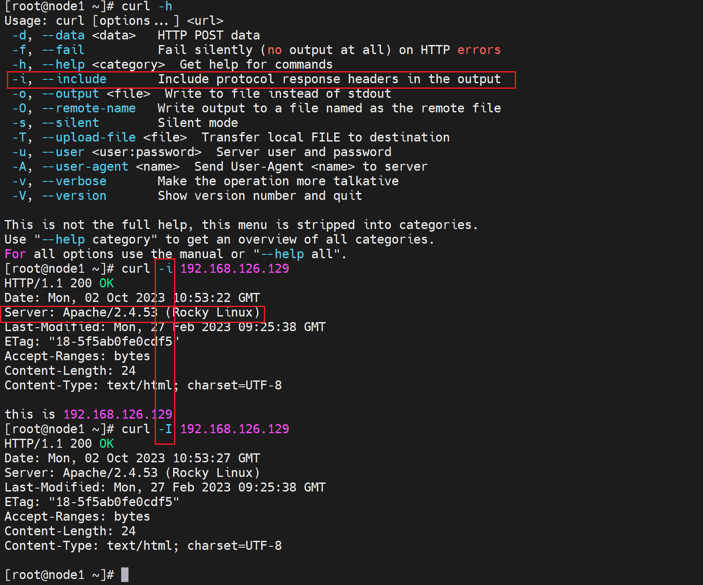

①好像-i和-I一样，忽略大小写了；其实不对的，-I 是大写，看下图案例

②就是curl -i可以查看head头部信息。其中就有server字段显示你的apache版本和操作系统。


我把/var/www/html/index.html  拿掉--就该改成xxx

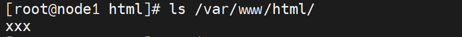

然后呢就有两个现象，① -i和-I不同  ②403报错

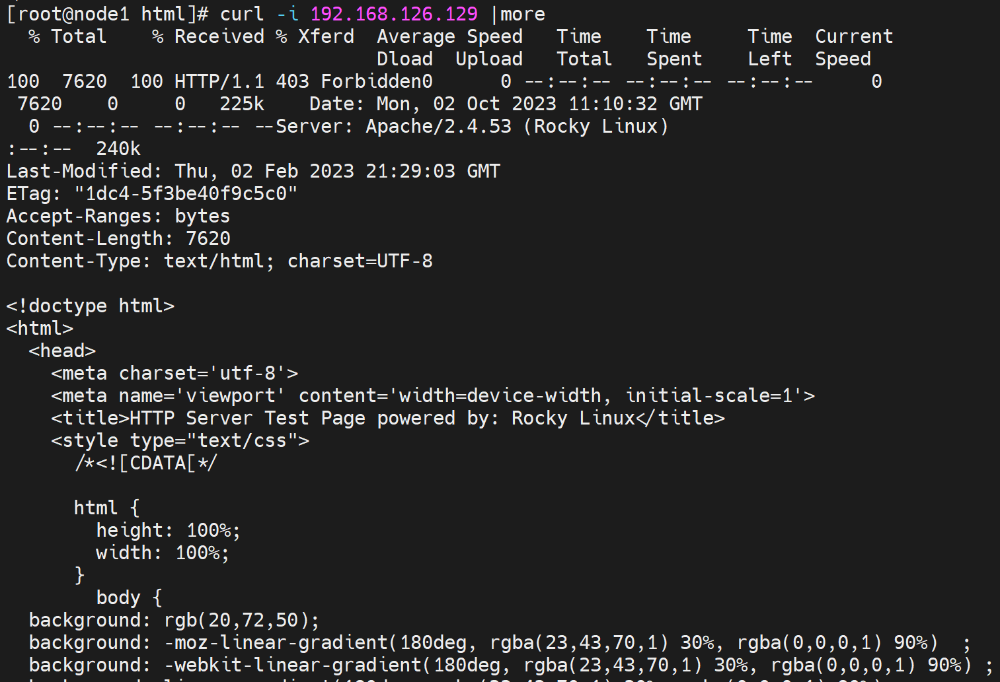

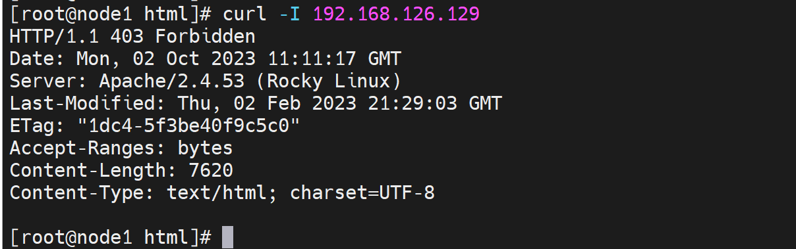

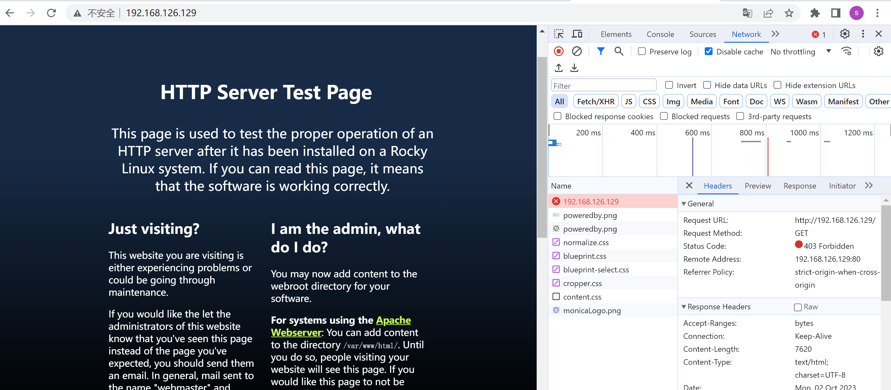

然后403页面报错，是**页面不存**的一个报错，了解下👇，当然也可能是**页面文件没有访问权限**。这里就是index.html没有创建导致的报错403。


还有一个点，就是如果你修改了index.html的默认位置--/var/www/html/index.html，那么修改后的路径也要让apache这个id有至少读的权限吧。


修改index.html文件无需重启服务，刷新页面就行了


回到serverToken的内容，ServerToken就是用来掩盖真实的server字段信息的。

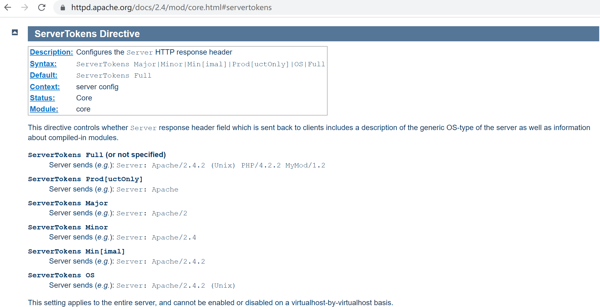


根据参数说明，可知httpd默认用的full，就是把信息显示全了，然后透露信息最少的是Prod[uctOnly]，方括号是可以省略的意思，linux通用写法。

其实prod暴露的信息也没必要，最好啥都不暴露，这就不是httpd自带的功能了--或者源码修改这些信息(字符串Apache搜一搜改一改就行了)然后编译安装；如果不改源码，就需要前端通过调度器来过滤掉。


### 修改配置文件推荐不要动/etc/httpd/conf/httpd.conf这个主配置文件

恢复一下之前的listen的修改

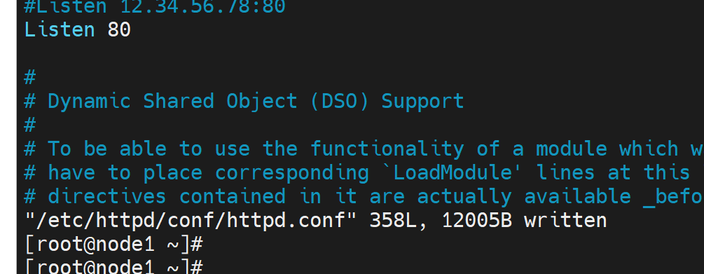 

/etc/httpd/conf.d/下新建test.conf，编辑所需指令和值

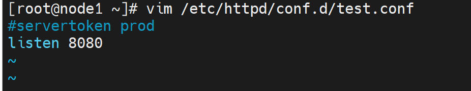 


再补一个servertokens


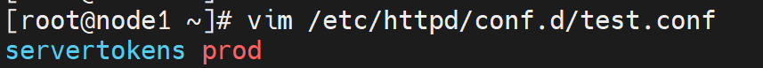

需要重启服务的

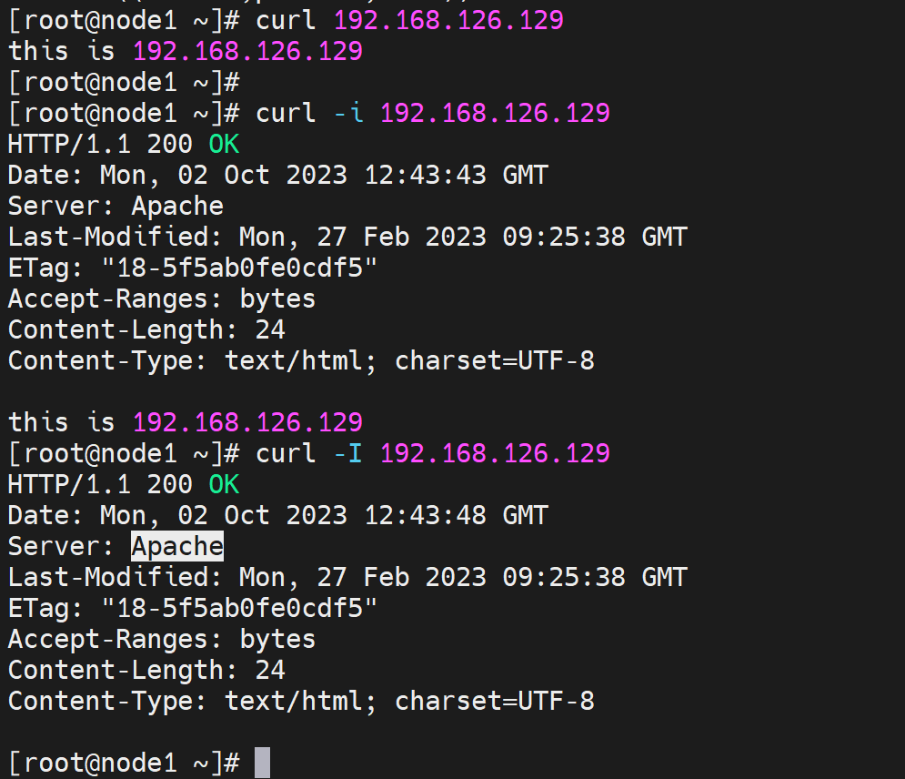

👆这张图就看清楚了-i和-I的区别，-i就是include包含头部和页面内容。-I就是仅仅头部。

然后servertokens可见，已经生效了，只有Apache这个简略信息了。


### 持久连接

**Persistent Connection**：连接建立，每个资源获取完成后不会断开连 接，而是继续等待其它的请求完成，默认关闭持久连接

**断开条件**：时间限制：以秒为单位， 默认5s，httpd-2.4 支持毫秒级 

**副作用**：对并发访问量大的服务器，持久连接会使有些请求得不到响应 

**折衷**：使用较短的持久连接时间

**设置**：KeepAlive On|Off 

​			KeepAliveTimeout 15

**测试**：telnet WEB_SERVER_IP PORT

​			GET /URL HTTP/1.1 

​			Host: WEB_SERVER_IP


前面的章节讲过http1.1版本默认就支持persistent connection的👇

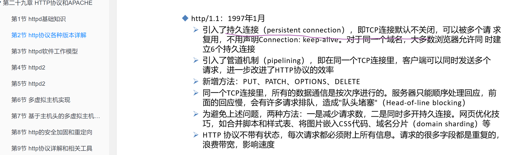 


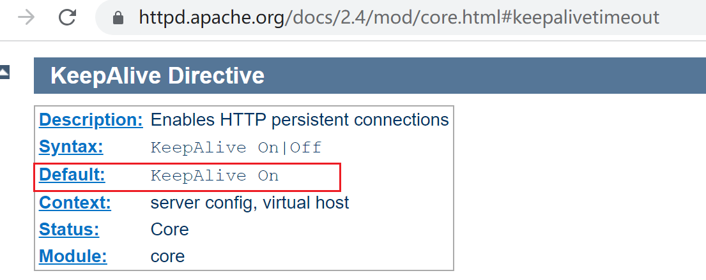

官方说是默认开启的，当然2.4版本的http的，自然也是http1.1协议。

如果知道是否开启了"持久连接"--通过telnet 80然后GET方式进行测试持久连接

①持久连接就是一个tcp连接里，可以处理多个用户请求

②测试方法：

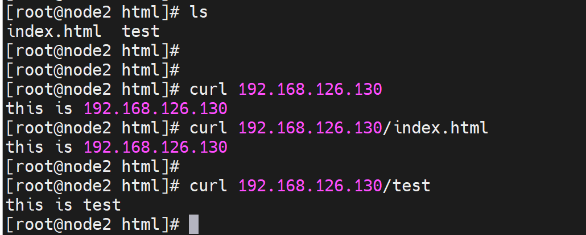


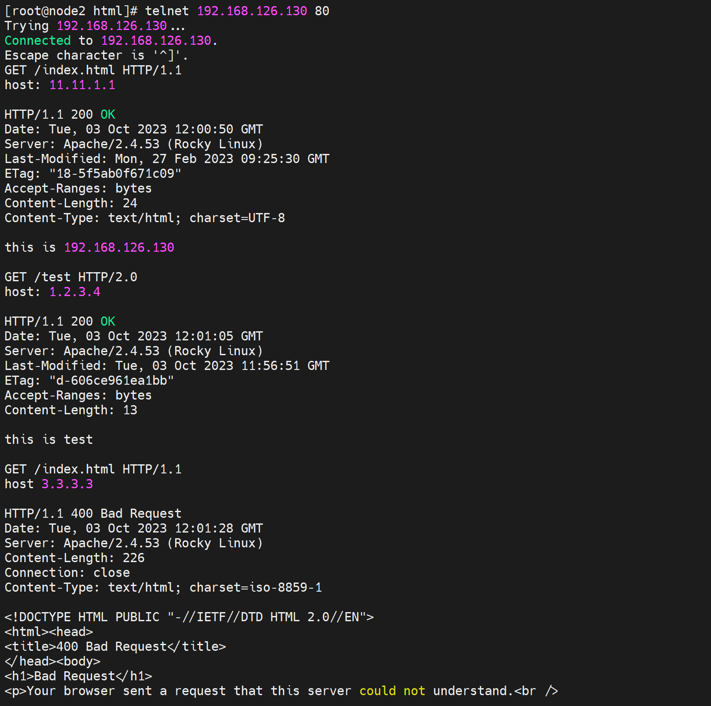

上图👆就是用telnet开启了80的端口TCP连接--算是一个长连接，然后这里有keepalive timeout的超时(默认是seconds秒为单位，也支持ms毫秒)。

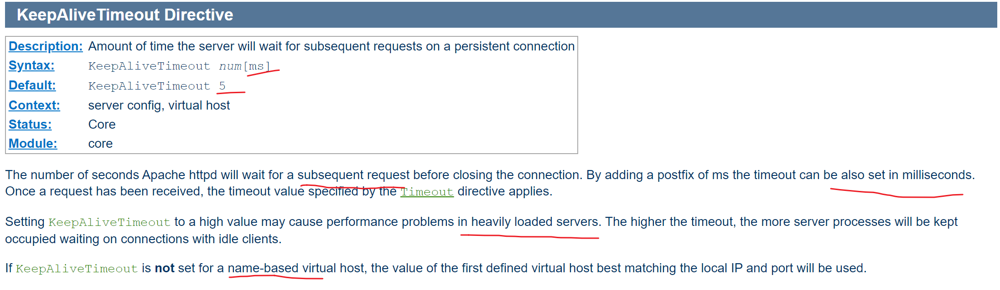

这是👆KeepAliveTimeout Directive的参数解释，这里要注意默认是5秒钟，然后5秒钟的超时表现在什么点上呢，就是你输入host 3.3.3.3 回车发送了个GETrequest出去后，开始计时的，也就是wait for a subsequtent request befor closing the conn。怎一个subsequent了得~随后的，所以两个请求之间超时时间就是keepAliveTimeout。

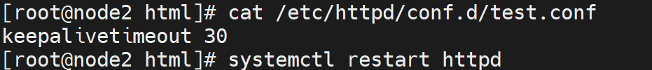

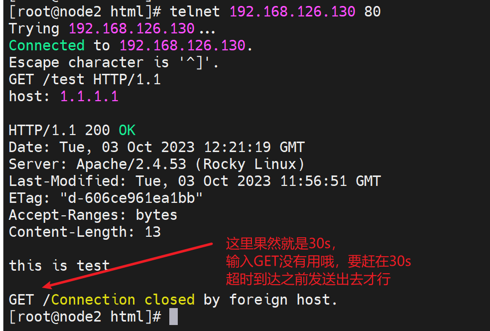

除了这个keepalivetimeout，还有一个参数设置是 持久连接里 资源下载次数(get其实就是下载页面了) 到了也可以断开。通过poe.com问一下就找到了


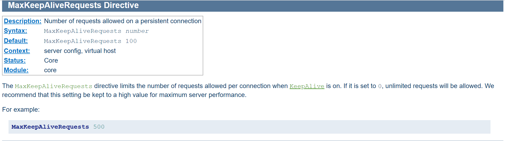

测试下👇

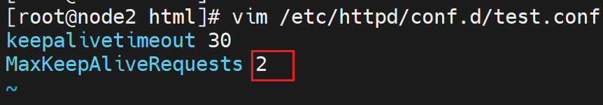

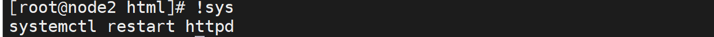


👆上图可不是keepalivetimeout 30秒超时哦，没到呢；这是maxkeepaliverequests 2，2次下载超了的限制。


然后补充说明一下，测试方法👇

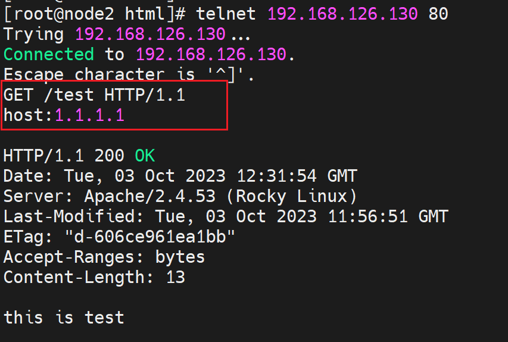

其实就是类似curl以及浏览器的行为，通过抓包可见

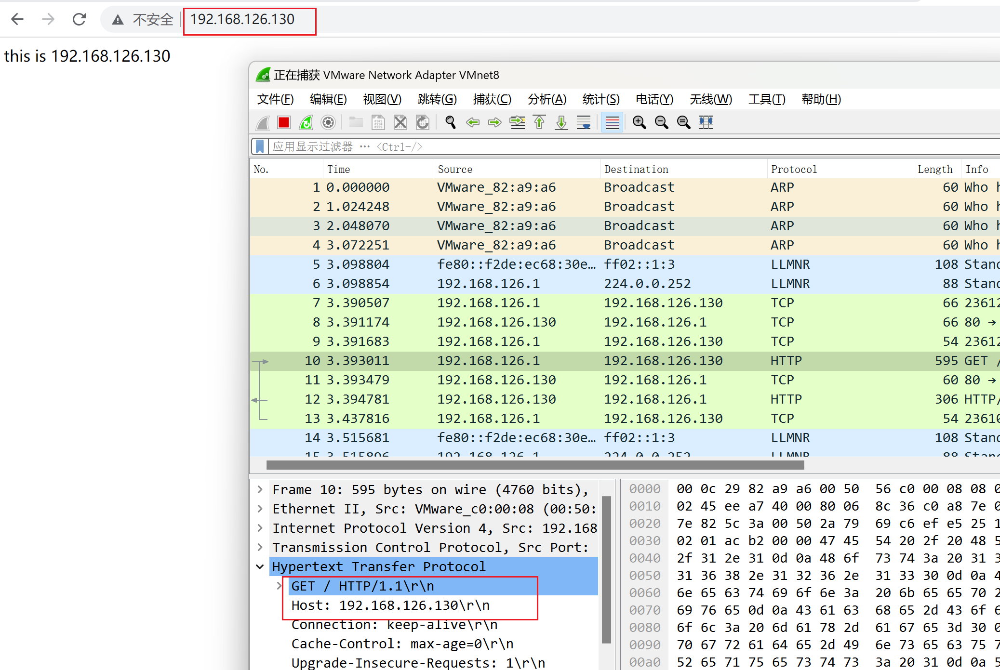

curl一样，就不抓了，然后host其实是可以随便写的。


### DSO：Dynamic Shared Object

动态的共享对象，也就是说http的模块是支持动态加载的。

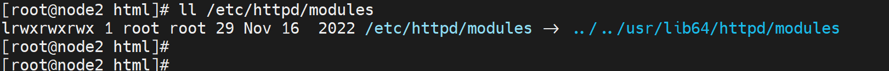

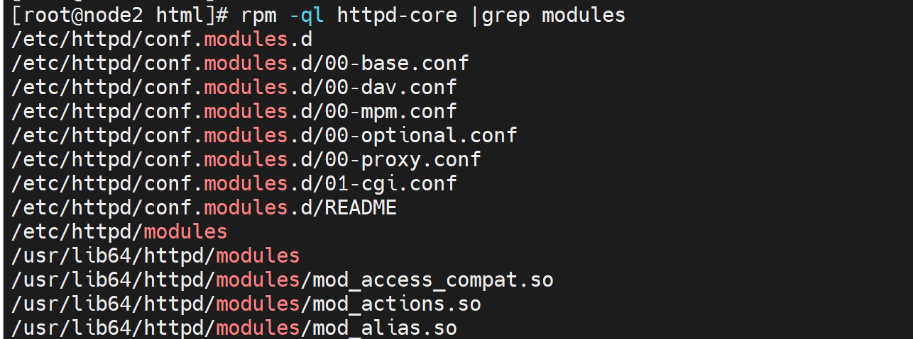

上图其实还有很多，modules，通过ls 去看更方便


这些模块是否都加载了，可以通过👇httpd -M来查看，可见105个模块，加载了93个。


👇这张图就说明了，确实是ls /etc/httpd/modules的模块mod_auth_basic.so加载后通过httpd -M可见的👇

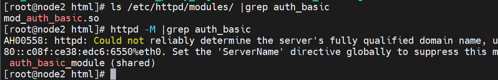


关于模块加载也是由配置的，同样在主配置文件/etc/httpd/conf/httpd.conf里可找到👇

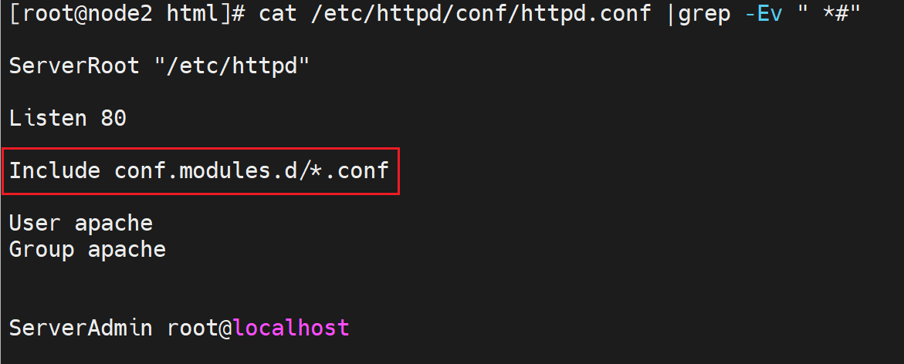

👆说明要进到/etc/httpd/conf.modules.d/下看

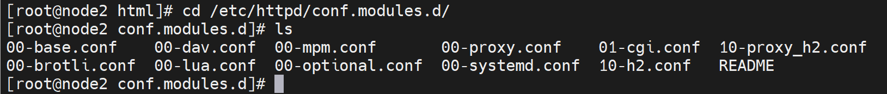


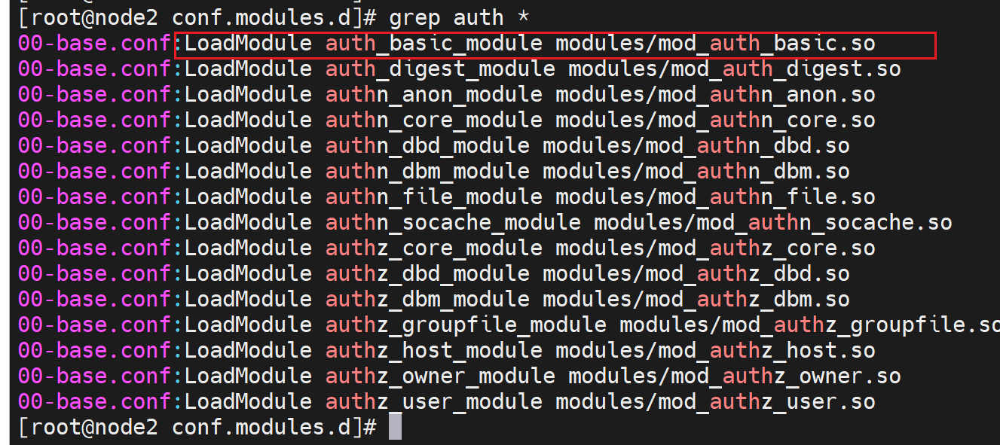

👆这样就就看到了LoadModule加载哪些具体的模块了，这就是105个模块，加载了93个的原因。

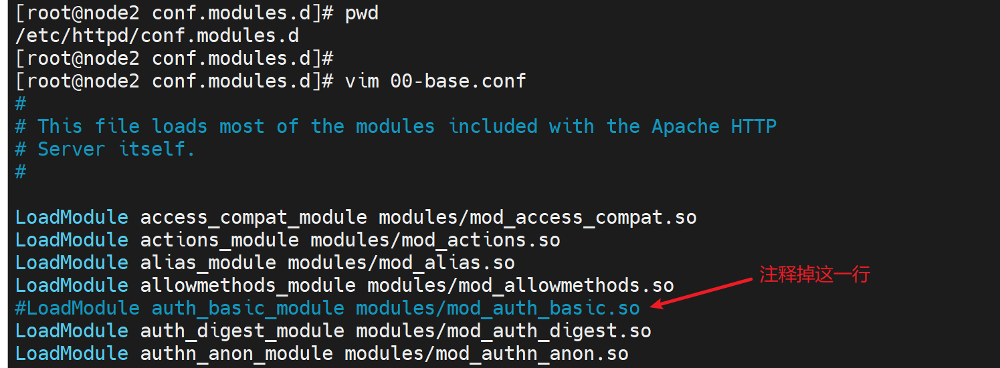

注释后，再次看看加载模块的数量

果然少了1个

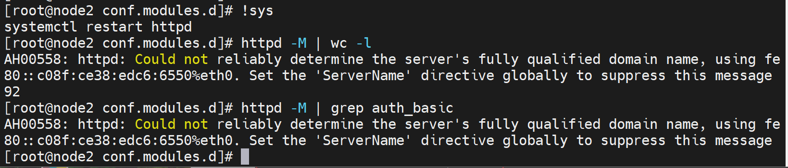

记得恢复该模块的加载，后续要用

### 所以这也是加载和卸载模块的方法👆

总结如下：

DSO： Dynamic Shared Object

​	加载动态模块配置，不需重启即生效

​		/etc/httpd/conf/httpd.conf 

​		Include conf.modules.d/*.conf 

​	配置指定实现模块加载格式：

​		LoadModule <mod_name> <mod_path>

模块文件路径可使用相对路径：相对于ServerRoot（默认/etc/httpd）

​	示例：LoadModule auth_basic_module modules/mod_auth_basic.so

动态模块路径： /usr/lib64/httpd/modules/

查看静态编译的模块  httpd -l    # 看的是静态编译的模块区别share的，是绑定的模块。

查看静态编译及动态装载的模块	httpd –M   # 看的是全部的包含：share(共享)模块和static(静态其实可以叫独享)模块


然后static模块是无法通过之前上文讲的 配置文件去 卸载，是httpd服务本身自带的默认就有的。  真要想"卸载"也可以---就是源码里去掉，重新编译。不过估计卸了也就没法用了，这个自带的估计是core核心的东西。httpd软件组成本身就是核心core+模块modules。


### MPM(Multi-Processing Module)多路处理模块

前文讲过prefork，worker，event，这里讲如何进行配置

以前：要进行该处理方式的切换，需要重新编译，因为是绑定在core代码模块里面的。

现在：但是从centos7开始(奇了怪了，难道不是从httpd的某个版本开始嘛，怎么还是从centos版本开始呢)，也支持配置文件的方式来切换了。


默认处理方式是：以前好像是prefork--就是一个主进程-多个子进程-每个子进程里只开一个线程；现在不是了，现在好像是event(可以去/etc/httpd/conf.modules.d/00-mpm.conf可见就是event)，有3680独立的子进程，还有几个了很多线程的子进程。


不过通过ps auxf看到的只显示到子进程。线程就不显示了👇


ps -ef一样


然后进程数不是限死的，如果进程数不够，依然会增加的。不过这里涉及线程，不知道具体的增加细节了，可能先增加线程吧。


没有讲是Unix到底是默认哪个？

看配置文件，果然是event👇


修改方法，官网查看路径


妈的，哈哈，查个屁，/etc/httpd/conf.modules.d/00-mpm.conf里写的好好的，你上面截图的时候看不到，靠哦，什么眼神。

这里注释原来的，取消所需的就行了


重启后，再pstree -p 应该就没有花括号--也就是没有线程了，结果事与愿违


👆还是有一堆线程啊，一个进程里开了好多线程，奇怪了。不过更像worker。


再切成worker


发现worker开启的线程要多了去了，和event一样多。


所以，我觉的，新版本的prefork也不是原来的prefork了，不是一个进程里就开一个线程了，确实可见开了但开的不多，相比而言 线程开启的数量远远小于event或者worker。

通过pstree -p 是无法区分worker和event的，event是每一个子进程里的多个线程中有一个是监听线程，这是里面程序调度的事情了，无法在pstree中查看的。


不过我好奇的是为什么现在的prefork不是单纯的一个子进程里仅仅一个线程了。


### 测试mpm的event和prefork的并发能力worker同理


记得修改页面文件的访问权限


测试CLI


-C1000就是1000个并发，同时去server上看看并发量；-n 是发动的request个数。


ps aux看到的是进程涨了很多，原来就是几个，现在是258个

pstree看到的都是线程数，1296个了已经。


等了一小会👆结果被 server端reset了，说明请求量太大了吧，减少请求量继续测试


在👆上图ab测试的过程中，多次在server端查看并发情况👇


PS：上图👆提到的此时 restart 会等蛮久，我觉的不一定是ab的并发回收慢造成的，本身httpd服务重启就慢，有时候快，过半的时候感觉都是慢的，从前面不断的重启动作得出的经验这是。

好，第一个prefork mpm的并发结果有了，主要就是看Request per second，每秒处理了3个请求。这是平均测试结果。


再修改为event mpm来测试下


多次查看进程数和线程数没有变化，说明该释放的都释放了，而且6个进程和209个线程基本上就是event的初始开启的量了。

然后ab 命令走一波

然而这里仅仅看requests per second发现event反而只有3.08，要小于perfork的3.13哈哈，怎么可能，不过综合开进程和线程的开启数量，event是要远远小于perfork的。从这个角度来看就是event要更加节省资源的。换句话说如果相同资源的消耗下event的并发处理就会远远高于prefork了。   另外为啥event模式系统服务没有多开写进程和线程，让处理量上一个台阶，这就不知道了，可能服务判断处理的速度还行无需增加资源开销。


然后上图👆测试期间，并发没啥大变化，结束了5分钟左右，也不见回收1个线程


搞不懂。。。哈哈，继续往下看吧，这里先这样，并发测试


偶然看到这篇

https://lvwenhan.com/tech-epic/500.html

需要自行研究下的感觉👆

然后，这个URL只是该作者的一篇，全部的高并发在这里https://github.com/johnlui/PPHC，挺牛逼。不是我现在该去看的，不过像innodb、分布式db、K8S，这些确实是我的方向，所以这个blog我感觉确实是大佬级的。


### 并发数超了-client的socket打开数


说是收到ulimit -a里的打开文件数限制


连接数，最终就是打开的socket文件，linux一切皆文件。

调大也没有用，可能是不止调这一个地方。


哦，操~~~！ 是CLI敲错了，并发-c 1010 大于总数 -n 1000了，这算乌龙吧~


搞错了~再来一遍👇


调大socket 文件上限，确实就可以了


### 并发超了-server端的进程数

在server端改为perfork进行测试


大页面文件的并发，结果就是被server reset了，超出了server的承受能力--就是进程数超了，大页面文件下载的慢，进程占用时间长，回收的慢，不够用了。


改成小文件就可以了，所以下面研究下server的处理上限问题，小文件测试的时候，server的进程数是够用的，因为回收的快，小页面打开(下载)处理的快，进程回收的快，所以够用


### prefork 的 配 置 


 **StartServers** 	     # 这是一开始的ps auxf |grep httpd 默认开启的进程数

 

perfork默认是开5个进程数

然后线程开的也不多


**StartServers** 				**8 **			# 初始开启8个进程

**MinSpareServers 			5 **     	#  最少保留5个空闲进程

**MaxSpareServers 			20**		# 最多保留20个空闲进程

连起来的意思就是，8个初始进程随着用户请求变多，会开启的越来越多；

但是至少保留5个空闲的进程不分配出去，比如从8涨到100进程，那么会开105个。

当用户请求下降了，那么比如100个用户请求大文件，100个进程开着，随着请求处理结束，这个100进程会回收80个，留20个空闲，因为最多20个。

我是这么理解的👆


 **ServerLimit 						256最多进程数,最大20000**


2000或者20W可能和MPM模型有关


MaxRequestsPerChild 		4000 子进程最多能处理的请求数量。在处理 MaxRequestsPerChild 个请求之后,子进程将会被父进程终止，这时候子进 程占用的内存就会释放(为0时永远不释放）


然后修改一下配置


然后重启服务


然后看下对应的参数是否落实


修改MaxClients为2560发现确实调大了，而且该参数官方网站上是找不到的，可能是早期版本的参数在2.4里没有写，但是依然有效。


然后MaxClients 2560这个调大了以后，StartServers 2000这个初始的子进程数就对了2000个就OK了


以上是间隔3-5分钟多次键入的，👇间隔2分钟多次输入的命令，说明此时子进程数和线程数涨停👇。


这个参数是httpd 2.2版本里的参数。


由于此时进程数调大了，再次用ab测试一下

这是👇本篇 上文的 内容--之前ab测试的结果


这是👇调大参数后的测试结果👇，肯定就可以了因为server初始化了2000个进程，这里ab测试时1500个并发，而且2.4的prefork虽然2000个进程，但是同样也开启了线程1W+了都，肯定支持1500个tcp连接了。

同样此时内存消耗也大：server端👇


看下现在的测试结果👇，确实不再报错，但是内存要够的，好在我的内存还行给的。怎么判断给的内容够不够，简单，free -h 看看涨不涨不就行了，没变化就是够用了--上图就是内存：2.8G用了。


进程数也涨了写，线程同样涨了，说明2000个初始子进程StartServers还不够，因为m.txt太大了


半天10分钟过去了， 1500个并发就瞬间消耗1500个tcp，然后要访问2000次，m.txt又太大，下载耗时长tcp得不到释放，从第一个tcp建立到最后一tcp释放，历经了一共1500*2000=30 00 000 次的tcp连接。前面页面加载完m.txt就会得到释放吧--感觉会释放-不过释放的条件可能时timeout和上面设置的4000个请求数MaxRequestsPerChild。


总结

ServerLimit和MaxClients都是限制最大并发连接的参数，都需要改的。


### worker MPM的参数


threads 一般表示线程，python里的import 也是这么表示的


MinSpareThreads 最小空闲线程

ThreadsPerChild 25 就是 每个子进程里开25个线程，直接看GPT的解释吧👇


