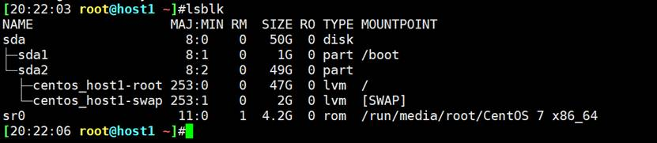
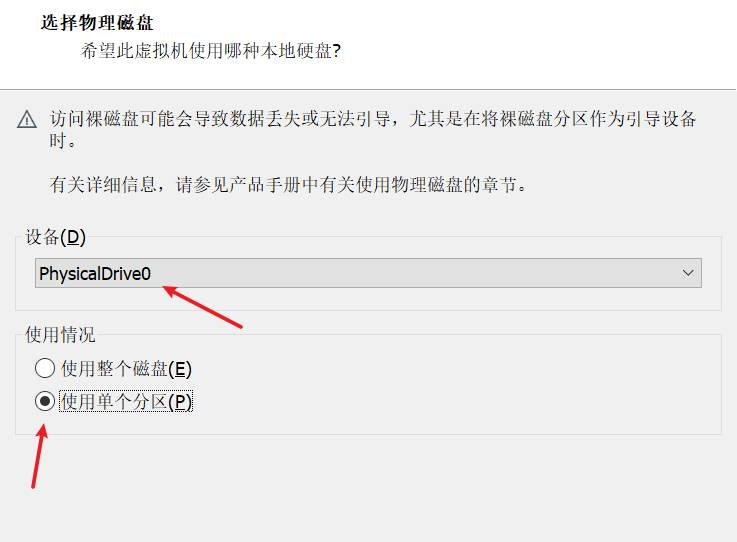
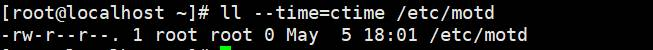

# 第1节. 文件系统

1、文件系统结构元素

就是文件目录结构，

/boot 启动相关文件，例如内核

/etc 配置文件，比如之前的/etc/issue /etc/profile.d/ /etc/bashrc等

/dev 硬件设备

b开头，表示块， 

c开头，字符文件，

都是设备文件

tty，字符设备，是一个个字符来进行输入输出的

块设备，光盘、硬盘，是以一块一块为单位，而一块代表N个字节，比如4096Byte表示一块。如果是块设备，每次输入输出就是4Kbyte。一下子读入4K或写入4K。

比如硬盘分区都是BLOCK为单位，

比如issue该文件里面存放了点数据，如图才346byte，但是由于磁盘分区上保存数据是以块为单位的，哪怕你只是修改该文件1个字节，实际上读取的也是以块为单位的，所以 假设4KB一个block，那么，读动作 就是一下子读取4kbyte到内存中，改完了写入磁盘分区也是也是 4kbyte的空间站位。

总之，实际的数据量虽然不大，可能把这个数据写入、写出的时候，实际会大很多，就是这个意思。

 

 

2、/bin 给普通用户用的  /sbin给系统管理员用的  还有/usr/tmp 都是软连接，

ll的细节注意一下

ls /bin和ls /bin/效果一样，都是现实/bin下的所有文件  # 这里还是要用ll -d去看文件夹，反正有些py模块里，文件夹就要用XX/来标识。实际操作需要验证一下的。（带不带/，要不要-d，之类的）

ll /bin 和 ll /bin/不一样，前者是显示文件夹本身，后缀是显示该文件夹下的文件。  # 这话也是错的，因为/bin是个软连接，本身是文件。

ll /bin -d 和 ll /bin/ -d 不一样，虽然都是显示文件夹metaDate。前者是显示软连接的元数据，后缀是显示源文件的medaDate。

这两个都是等价的

 

 

这两个显然不同。

 

 

所以总结，看文件夹的信息，就是ll /bin -d，这样最靠谱。

靠谱的原因就是-d看起来是看文件夹，其实对文件一样有效。所以看文件本身不进入子层，正确的使用方法就是ll /bin -d ll / -d这种了。

上面仔细看图就好，其实还是软连接造成的操作上的细微区别。

 

 

3、/usr 下很多文件夹和/很像， /usr 像是个二层根。

结构是有规范的无论是什么linxu版本，都基本符合这一套目录结构。

FHS：Filesystem Hierarchy Standard  http://www.pathname.com/fhs

文件要存放规矩

 

## 4、两个特殊目录/proc 和 /sys

这两个目录大小为0

虽然是0，但是在/proc下是可以看到数据的。

说明proc下有很多数据的，但是proc文件夹的大小就是0。这是因为proc看到的是内存中的数据，内存数据不占磁盘空间，所以ll /proc -d显示的是磁盘空间占用大小。

 

/sys 是映射的硬件信息

/proc是放进程process相关信息的

 

 

## 5、以/sys为例，可以用里面的一些文件来管理硬件

这里换本地的VM来做实验—增加新的硬盘

当前只有一块硬盘和一个光盘

现在要实现加硬盘不重启的效果，以VmwareWorkstation为例，直接在VM里添加即可(略)。

但是添加完了，一般需要重启才行。不过可以这样：

在/sys

此时就新加的硬盘就出现了，也不需要重启系统。

一般就是host2或host0就行。

可以考虑将上面的两条命令定义成别名

现在再加一块硬盘，就可以利用别名快捷实现了

 

 

## 6、linux文件名最长为255个字节，验证如下

创建一个256字符（一个字符对应一个字节？），利用ALT + NUMBER 在输入字符即可

按住alt不动，紧接着输入256，然后松开后输入x，这样就完成256个x的输入。

一个x字符对应的就是一个字节，UTF-8格式规定的。不信可以这么检查

vim test，里面写一个x，然后hexdump test -C 看一下：

再man一下ascii找到小写的x

确实是16进制的78，而16进制78就是一个字节的空间。

所以，touch xxxx...xx 256个x就是256个字节的长度了，验证方法有效。

 

## 7、包含路径在内文件名最长4095个字节。

**蓝色**-目录

**绿色**-可执行文件

**红色**-压缩文件

其实就是看后缀，系统一看后缀是.gz的就给你打上红色了

**天蓝色**-链接文件

灰色-其他文件

**黄色**-设备文件，有的是b块设备、有的是c字符设备。

​                  b的单位是块，是随机读写，不是顺序的，是随机的放在磁盘的某些位置。而c的单位是字符，是顺序一个个字符进行输入输出的。块设备通常是有缓存的，硬盘有缓存，而字符设备是没有缓存的，就按照顺序进行访问就行了。

**粉色**-socke文件，套接字文件，s开头的，是为了实现网络通讯的。后面讲mysql会用到。

/run下面又很多粉红色文件

**棕色**-管道文件，p开头的，是实现进程间通信的，就是同一台PC上的不同APP互访，用的不多，用socket用的比较多。

 

文件的颜色和后缀的关系，实在/etc/DIR_COLORS下定义的

看下一个pip40,33确实是棕色

 

 

试一下上图DIR_COLORS的效果

01,31就是红色没跑了

 

 

然后在试一下exe文件，默认是注释了的， 

现在打开

还是没有变，不急，执行一下DIR_COLORS文件，执行不了，退出重进就行了

搞不懂为什么.bashrc可以. ~/bashrc直接跑一遍，是修改的配置生效，无需退出重进。

而. /etc/DIR_COLORS却不能这样。

 

 

## 8、文件名规则

1、上面说了255个字节的文件名

2、说了4095个字节带路径的文件名

3、说了颜色

4、还有，除了斜杠和NULL，所有字符都可以用来作为文件名，但是使用特殊字符的目录名和文件名不推荐，

5、标准Linux文件系统（如ext4），文件名称大小写敏感，如果是linux挂载了fat的硬盘（ntfs，需要额外装软件，才能挂到linux下），则给硬盘下大小写不敏感。总之文件名称的大小写是跟着文件系统走的，而文件系统就是你格式化硬盘分区所选择的xfs、fat32、ntfs这些。

验证方法：linux关机，添加硬盘-使用现有的物理磁盘-选择磁盘1（假设你的fat分区在1下，这里看到的0和1就是物理硬盘的编号）-分区2（假设fat格式的是分区2），启动centos

 

这里的0就是硬盘0，1就是你电脑的第二块磁盘。我就一块0.

确定即可

但是我的实验不能加载物理硬盘

 

没什么意义，有时间可以换个机器试试，成功开机后，然后接着下面操作：

 

lsblk -f 可见是这个硬盘是vfat格式

文件系统，需要挂载到一个目录才能使用

所以mount /dev/sdd2 /mnt

df 可见sdd2已挂载

 

cd /mnt

ls

可见各种windows下的格式，

此时该/mnt下的文件就不再区分大小写了。

 

这个实验就是说，标准linux文件系统(如ext4)，文件名称大小写敏感。

然而你可以挂载fat32硬盘上去，这个就不区分大小写了。

  

 

 

理论上可以，但直接创建是失败的。可以这么做：

 

 

删除一样，

 

或者 带上路径就行了

 

 

 

 

## 9、文件类型

\- 普通文件

d 目录文件

b 块设备

c 字符设备

l 符号链接文件

p 管道文件pipe

s 套接字文件socket

共7种类型，联系上文

除了-普通文件，其他的文件操作都要小心。特性不一样

p和s 主要是为了两个应用程序之间互相通信用的临时文件。比如两个软件交换数据，一个往pipe里写，另一个从对应的pipe里读。

 

 

## 10、CentOS 7的bin和usr/bin实际是同一个东西了

同样的，lib和/usr/lib，

这些在早期的centos6里不是这样的，都是独立。就是很相似，所以干脆合在一起了。

lib是放库文件的。

 

 

## 11、pwd

-P 显示原文件路径

-L 显示的快捷方式就是软链接文件的路径  pwd默认带-L

同样需要注意的是，ll -d 看到的情况也要验证一下，是否是软链接的还是原文件的。

 

 

## 12、有些场合下，相对路径不是相对当前的cwd（current work direction）当前工作目录

比如前文提到的软连接，以及练习-2里也有提到，

就是相对于你要存放软连接的路径的 相对路径

 

 

## 13、basename和dirname，

创建和之前文件相同目录下的另一个文件，可以将下图中的/data/dir1/通过其他方式取出来，比如py里的os.gold、os.walk还是os.list都有方法的。或者你直接将/data/dir1作为变量。

 

 

 

## 14、cd备忘

cd ~ 等于 cd 进入当前用户的home目录

cd ~user1就回到了user1的家目录

 

cd – 上一次的路径，效果就是当前和上一次路径返回切换，原理就是OLDPWD这个变量里保存了上一次目录

之所以回得去，就是因为有一个变量保存了上一次的pwd信息。

 

 

## 15、ls备忘

ls -a 包含隐藏

ls -l 显示metadata

ls -R 递归，应该有用，os.walk估计还没这个ls -R原生的优秀呢

ls -d 

虽然是directory，但是ll -d通常用来看单个文件或文件夹都可以的

 

ls -1 文件分行显示？啥意思

ls -S 按从大到小排序，这个好

ls -t 按mtime排序

ls -u 配合-t选项，显示并按atime从新到旧排序

ls -U 按目录存放顺序显示

ls -X 按文件后缀排序

 

 

 

ls其实现在也是alias别名了，想用原始的ls只需要\ls就行了

 

 

 

 

关于atime

所以正如练习-2里提到过的，atime并不是实时更新的

Access：最近访问时间acces time (atime)，这个不是实时更新的，为了防止大量的写accesstime这个操作，节省资源 

但是当你当前读取的时间比上次atime超过1天了都，所以肯定给你立马更新了。最小差值多少，这个可以测一下。

由此可见，还正就是日期从25号变成了26号，

且时间跨度有一个值大概在12小时，

总结一下，hours在12小时，day + 1，基本就会cat后立刻更新时间了。当然可能12小时都嫑。我只是无聊，至于到底几个小时，who care。

 

clock -s 记得还原

 

 

## 16、ctime

文件的属性发生改变的时间

属性就是：一行里的各种数据，包括

文件的权限、inode数量（硬链接个数，注意软连接不算在meta data里）、所有者、所属组、大小。

这些通通都是元数据

上图cli写错了，直接stat /etc/motd就行了，不要time stat

meta data发生改变，ctime就变了

 

注意atime 各种time不属于元数据。文件名是属于元数据的

 

## 17、selinux和防火墙 先不管，关闭即可

上图是selinux

 

 

防火墙也是启用的

 

关闭selinux

原来是enforceing，改成disabled

改完后，需要重启才能生效，不过可以结合cli方式临时关闭selinux就不用重启了。

不过可惜，disabled没有对应的值，0-permissive，1-enforcing。所以我还是老老实实重启吧。

systemctl disabled firewalld.service # 开启不启动

systemctl stop firewalld # 关闭防火墙

 

最后这样：

 

 

 

 

 
