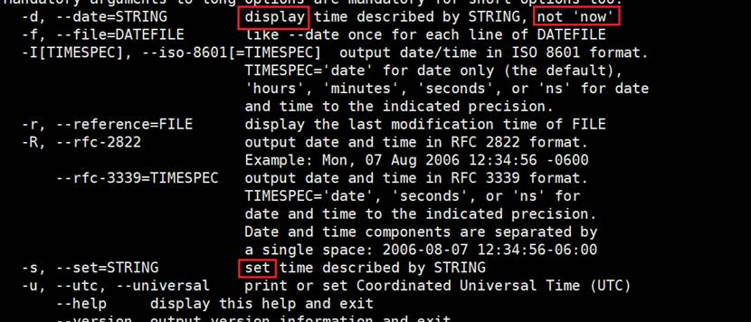

# 第2节. 文件管理

## **1、centos6以前的版本禁用selinux** 

 

vi /etc/selinux/config

SELINUX=disabled

 

chkconfig iptables off

service firewalld stop # 应该是这个吧，如果不是，上面一条重启不自启动就行了

 

 

## **2**、**文件通配符**

**★文件通配符，顾名思义，就是匹配文件名称的，别想多了。**

\* 匹配零个或多个字符

? 匹配任何单个字符

~ 当前用户家目录

~haiwang 用户haiwang家目录

~+ 当前工作目录

~- 前一个工作目录  # 等同于cd -，但是ls 不能ls -这么用，要ls ~-这样

[0-9] 匹配任意一个数字

[a-z] 任意小写字母一个

[A-Z] 任意一个大写字母

[haiwang] 匹配列表中的任何的一个字符

[^yingxiong] 匹配列表中的所有字符以外的字符

 

 

y开头的


包含x的

 


.txt结尾的，但是不包括.txt，因为*不会包含隐藏文件。


 


*在文件名通配符领域里，表示该位置有一个或多个，或者没有，都可以

 

要在非隐藏文件里找需要的文件名，就可以用ls *来做

而要在隐藏文件里找，就用正则就行了


而查看隐藏的我现在想到的就可以用正则来做，后来又发现还有l.（列出当前所有的隐藏文件和文件夹）。


 


 

### 查看隐藏文件

l.只能看当前文件夹下的隐藏文件/文件夹，如果是看其他路径，就需要参考l.这个alias里的原来语法：

```
ls -d /data/.*
```

 


只看文件夹

```
ll |grep "^d"
ll -d */
```


ls ??? 表示就看3个字符的文件


汉字unicode，一个汉字也是一个字符。只是一个汉字这一个字符 在磁盘上保存不是占一个字节。

 

unicode 汉字，可能占2-4个字节。

 

在通配符里面没有^[xxx]这种写法，和正则regex相似又不一样

 

文件里面过滤字符串，这是不是通配符的活，通配符是匹配文件名称，文件内容交给regex

 

 

## **注意事项**

ls /data/f[a-c].html表示啥

[a-c]代表aAbBc，这个regex又不同了

[A-C]等价于AbBcC

见下图


 

如果就是想要小写或大写，可以这么写

 

[:digit:] 任意数字，相当于0-9

[:lower:] 任意小写字母

[:upppere:] 任意大写字母

[:alpha:] 任意 大 小 写字母

[:alnum:] 任意数字或字母

[:blank:] 水平空白字符

[:space:] 水平或垂直空白字符，垂直空白字符是啥？回车？还是↓

[:punct:] 标点符号

[:print:] 可打印字符

[:cntrl:] 控制（非打印）字符

[:graph:] 图形字符

[:xdigit:] 十六进制字符


注意两个[[:lower:]] 方括号的意思，里面的[:lower:]是一个整体表示一个小写字符，外面的表示任意一个字母。

等价于正则里的[a-z]写法。

 

 

只看隐藏文件的方法，和上面的对比一下


 

l.的缺陷，只能看当前文件夹，下图就是，明明cli里写的ls -d /data/ .*但是看得还是当前目录的


上图有一个思路对了，手残敲错了，应该如下


 

 

 

只看文件夹的方法


一个是看非隐藏，一个是看隐藏的文件夹

 

 

通配符，在py的os.xx模块里，好像就不是regex而是通配符

 

 

按理说练习应该放在外面，但是这是课堂视频里的练习，不是作业，就不放在外面单独文章了

1、显示/var目录下所有以l开头，以一个小写字母结尾，且中间出现至少一位数字的文件或目录

```
ls /var l*[0-9]*[[:lower:]]
```

2、显示/etc目录下任意一位数字开头，且以非数字结尾的文件或目录

```
ll -d /etc/[0-9]*[^0-9]
```

 # 这里可以考虑吧-d去掉，为的就是遍历一下/etc下文件夹下的文件或更深层次

3、显示/etc目录下以非字母开头，后面跟了一个字母及其他任意长度任意字符的文件或目录

```
ll -d /etc/[^[:alpha:]][[:alpha:]]*
```

注意些通配符的时候，有根弦--通配符不是正则。然后一个字母要有大小写[a-zA-Z]

4、显示/etc/目录下所有以rc开头，并后面是0-6之间的数字，其他为任意字符的文件或目录

```
ls -d /etc/rc[0-6]*
```

5、显示/etc目录下，所有以.d结尾的文件或目录

ls -d /etc/*.d # 注意.d文件也算是.d结尾的，这样就看不到了

ls -d /etc/*.d;ls -d /etc/.d

6、显示/etc目下，所有.conf结尾的，且以m.n,r,p开头的文件或目录

ls -d /etc/[mnrp]*.conf

7、只显示/root下的隐藏文件和目录

ls -d /root/.*

8、只显示/etc下的非隐藏目录

ls -d /etc/*/

 

 

## **3、touch**

1、创建文件

2、如果文件存在，只是修改时间（atime、ctime、mtime）都给你改当前时间了

 

补充：


默认ll的时间是mtime

3、总结，touch是安全的创建文件的方法

 

 

**还有个创建文件的方法**

**>** 


echo >> f5.txt 追加内容也是一个道理


 

以上的> 或 >> 是依赖于shell的，


上图换成csh就不行了

 

\> 、>>不是命令，其实是重定向。

**>** 常用来快速给文件清空，无论文件有多大，都给你快速清空。据说灰常好的小功能。

 

 

touch [OPTION]... FILE...

-a 仅改变atime和ctime

-m 仅改变mtime和ctime

-t [[CC]YY]MMDDhhmm[ss] 指定atime和mtime的时间戳

-c 如果文件不存在，则不予创建，这个一看就不错

 

 

## **4、保持日志为前一天**


生成昨天日期作为文件名，上图是错误的写法，会自己坑自己





