# 第4节. 文件节点表


 

## 文件的存放有inode表格和data表格


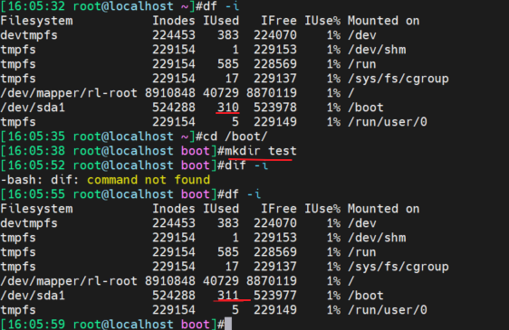 

上图可见，创建一个文件夹后，inode就占掉一个。

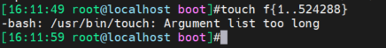 

touch命令本身不支持这么多个参数，所以换种方式

```
echo f{1..524288} |xargs touch
```

节点编号

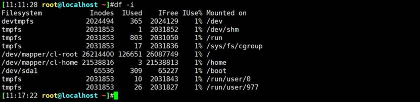

 上图可见分区的空间大小，以及节点数最大值。sda1的inodes最大值为65536。

超出节点编号就不行了

**echo f{1..65539} |xargs touch**

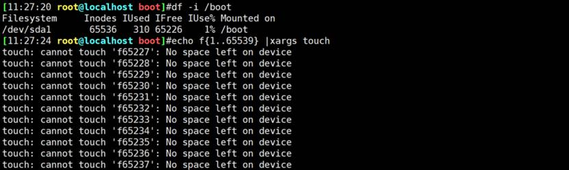

所以看到没有设备空间不一定是真的，可能是节点编号满了。

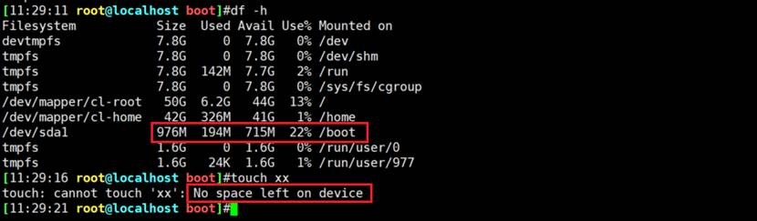

删除rm *是不行的，可以删除所在文件夹rm -rf /boot/testdir

 或者这么删就行了啊：

```
echo f{1..524288} |xargs rm -rf
```

节点编号和软连接和硬链接密切相关

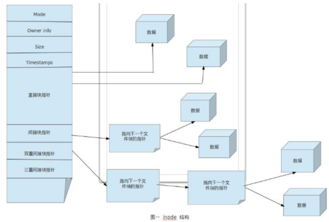 

 

ext文件系统的架构

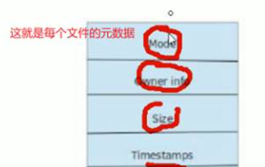 

 

直接指针是12个

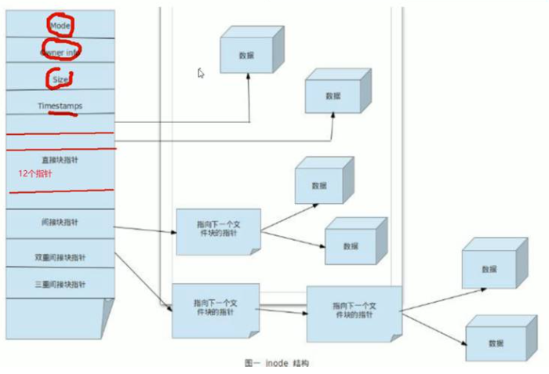 

 **①数据量低于48K，直接指针就可以搞定。**

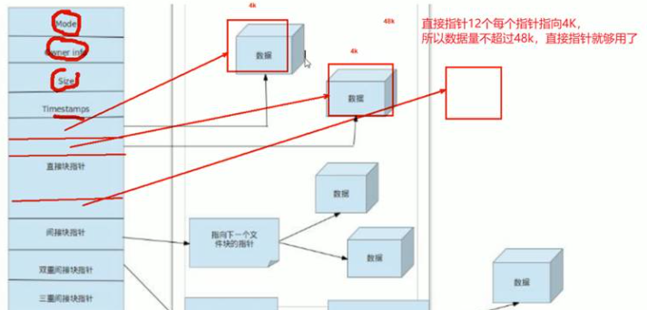 

**②超出48K--4M，使用间接指针表示。**

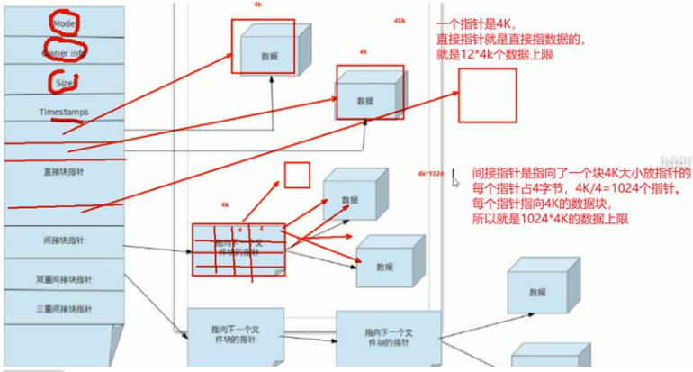 

**③4M-4GB的采用二级指针**

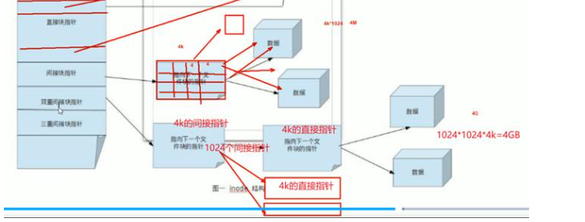 

现在centos7是XFT文件系统和ext的文件系统不一样。

不管什么系统都是类似的机制。

 

对于文件夹来讲他的内容放的是什么

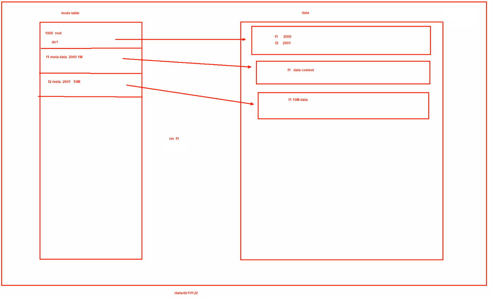 

**文件名是属于文件夹的内容DATA。是放在数据块空间的。**

明白这一点，rm f1本质上是删除他的节点表，指正指向的数据块就没人用了，该空间标记为空闲free状态，但是不会删除数据。如果你新建一个文件可能会覆盖掉的。

此外dir1/下的F1的数据就清了。

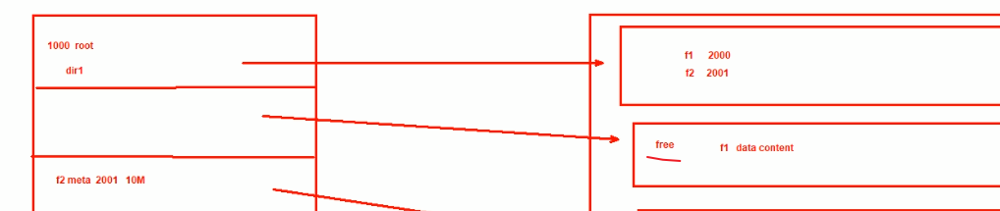 


所以删除f1是需要有f1所在文件夹的权限就行了。

硬连接，本身就是同一个文件


跨分区了**，不同分区**肯定不是一个文件了，所以肯定**不支持**


硬链接**不能针对文件夹**创建。据说是防止循环现象。

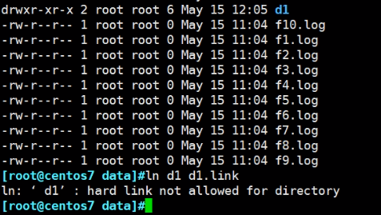 


--------------


 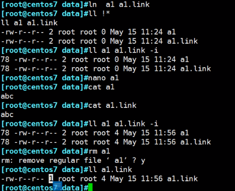 

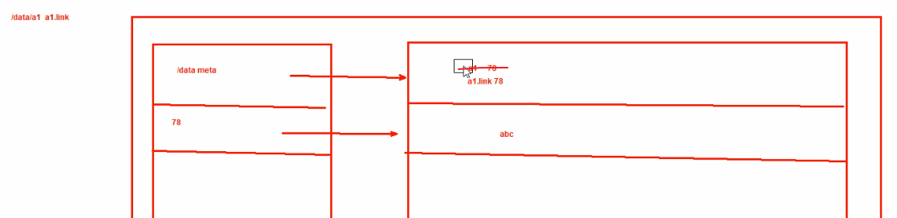 

删a1的操作等价上图的示例 


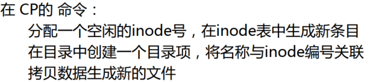 


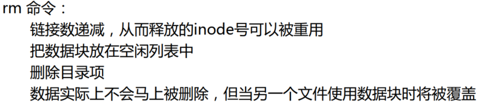 


备注：

```
👉以下是vim一个文件，然后echo 然后vim vim 发现indoe在两个数字跳来跳去的(估计和vim打开的时候会自动创建一个.xxx.swp有关，可能是这个原因，也不是swp文件的inode不在那两个反复替换的inode里面，反正vim该文件inode是变的，而且是2个inode数字来回变)。然后echo不会。
[10:54:28 root@localhost data]#echo inode_echo >> test
[10:54:43 root@localhost data]#stat test
  File: test
  Size: 19              Blocks: 8          IO Block: 4096   regular file
Device: fd00h/64768d    Inode: 33577448    Links: 1
Access: (0644/-rw-r--r--)  Uid: (    0/    root)   Gid: (    0/    root)
Context: unconfined_u:object_r:default_t:s0
Access: 2022-01-29 10:54:20.066021237 +0800
Modify: 2022-01-29 10:54:43.345023132 +0800
Change: 2022-01-29 10:54:43.345023132 +0800
 Birth: 2022-01-29 10:54:20.066021237 +0800
[10:54:44 root@localhost data]#ll -i
total 8
51325766 drwxr-xr-x. 2 root  root  6 Jan 19 19:57 dir
  373349 drwxr-xr-x. 2 user1 g12   6 Jan 19 19:58 dir2
33577410 -rw-rw-r--+ 1 root  root  7 Jan 29 10:53 f1
33577446 -rw-r--r--. 1 user1 g12   0 Jan 19 19:58 f2
33577448 -rw-r--r--. 1 root  root 19 Jan 29 10:54 test
[10:54:47 root@localhost data]#
[10:54:50 root@localhost data]#vim test
[10:55:00 root@localhost data]#
[10:55:00 root@localhost data]#vim test
[10:55:03 root@localhost data]#ll -i
total 8
51325766 drwxr-xr-x. 2 root  root  6 Jan 19 19:57 dir
  373349 drwxr-xr-x. 2 user1 g12   6 Jan 19 19:58 dir2
33577410 -rw-rw-r--+ 1 root  root  7 Jan 29 10:53 f1
33577446 -rw-r--r--. 1 user1 g12   0 Jan 19 19:58 f2
33577450 -rw-r--r--. 1 root  root 28 Jan 29 10:54 test
[10:55:04 root@localhost data]#stat test
  File: test
  Size: 28              Blocks: 8          IO Block: 4096   regular file
Device: fd00h/64768d    Inode: 33577450    Links: 1
Access: (0644/-rw-r--r--)  Uid: (    0/    root)   Gid: (    0/    root)
Context: unconfined_u:object_r:default_t:s0
Access: 2022-01-29 10:55:01.373024600 +0800
Modify: 2022-01-29 10:54:59.985024487 +0800
Change: 2022-01-29 10:54:59.987024487 +0800
 Birth: 2022-01-29 10:54:59.985024487 +0800
[10:55:09 root@localhost data]#vim test
[10:55:25 root@localhost data]#
[10:55:25 root@localhost data]#
[10:55:25 root@localhost data]#stat test
  File: test
  Size: 39              Blocks: 8          IO Block: 4096   regular file
Device: fd00h/64768d    Inode: 33577448    Links: 1
Access: (0644/-rw-r--r--)  Uid: (    0/    root)   Gid: (    0/    root)
Context: unconfined_u:object_r:default_t:s0
Access: 2022-01-29 10:55:25.695026580 +0800
Modify: 2022-01-29 10:55:25.695026580 +0800
Change: 2022-01-29 10:55:25.697026580 +0800
 Birth: 2022-01-29 10:55:25.695026580 +0800
[10:55:27 root@localhost data]#
[10:55:35 root@localhost data]#
[10:55:35 root@localhost data]#vim test
[10:55:44 root@localhost data]#
[10:55:44 root@localhost data]#stat test
  File: test
  Size: 50              Blocks: 8          IO Block: 4096   regular file
Device: fd00h/64768d    Inode: 33577450    Links: 1
Access: (0644/-rw-r--r--)  Uid: (    0/    root)   Gid: (    0/    root)
Context: unconfined_u:object_r:default_t:s0
Access: 2022-01-29 10:55:44.687028126 +0800
Modify: 2022-01-29 10:55:44.687028126 +0800
Change: 2022-01-29 10:55:44.688028126 +0800
 Birth: 2022-01-29 10:55:44.687028126 +0800
[10:55:45 root@localhost data]#
[10:57:23 root@localhost data]#stat test
  File: test
  Size: 55              Blocks: 8          IO Block: 4096   regular file
Device: fd00h/64768d    Inode: 33577448    Links: 1
Access: (0644/-rw-r--r--)  Uid: (    0/    root)   Gid: (    0/    root)
Context: unconfined_u:object_r:default_t:s0
Access: 2022-01-29 10:57:23.128036141 +0800
Modify: 2022-01-29 10:57:23.128036141 +0800
Change: 2022-01-29 10:57:23.129036141 +0800
 Birth: 2022-01-29 10:57:23.128036141 +0800
[10:57:23 root@localhost data]#echo 12 >> test
[10:57:29 root@localhost data]#stat test
  File: test
  Size: 58              Blocks: 8          IO Block: 4096   regular file
Device: fd00h/64768d    Inode: 33577448    Links: 1
Access: (0644/-rw-r--r--)  Uid: (    0/    root)   Gid: (    0/    root)
Context: unconfined_u:object_r:default_t:s0
Access: 2022-01-29 10:57:23.128036141 +0800
Modify: 2022-01-29 10:57:29.437036654 +0800
Change: 2022-01-29 10:57:29.437036654 +0800
 Birth: 2022-01-29 10:57:23.128036141 +0800
[10:57:30 root@localhost data]#echo 333 >> test
[10:57:35 root@localhost data]#stat test
  File: test
  Size: 62              Blocks: 8          IO Block: 4096   regular file
Device: fd00h/64768d    Inode: 33577448    Links: 1
Access: (0644/-rw-r--r--)  Uid: (    0/    root)   Gid: (    0/    root)
Context: unconfined_u:object_r:default_t:s0
Access: 2022-01-29 10:57:23.128036141 +0800
Modify: 2022-01-29 10:57:35.603037157 +0800
Change: 2022-01-29 10:57:35.603037157 +0800
 Birth: 2022-01-29 10:57:23.128036141 +0800
[10:57:36 root@localhost data]#


total 20
33577460 drwxrwxrwx.  4 root  root    78 Jan 29 10:58 .
     128 dr-xr-xr-x. 18 root  root   236 Jan 10 18:13 ..
51325766 drwxr-xr-x.  2 root  root     6 Jan 19 19:57 dir
  373349 drwxr-xr-x.  2 user1 g12      6 Jan 19 19:58 dir2
33577410 -rw-rw-r--+  1 root  root     7 Jan 29 10:53 f1
33577446 -rw-r--r--.  1 user1 g12      0 Jan 19 19:58 f2
33577448 -rw-r--r--.  1 root  root    62 Jan 29 10:57 test
33577447 -rw-r--r--.  1 root  root 12288 Jan 29 10:58 .test.swp

```

