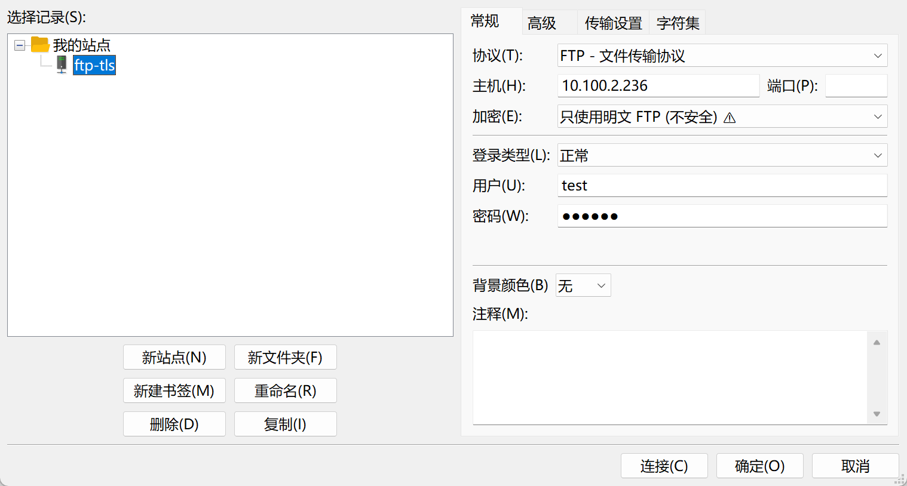
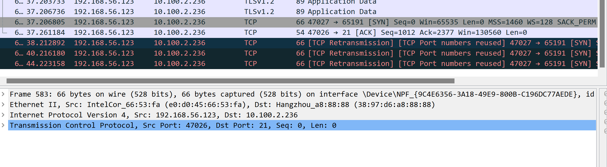
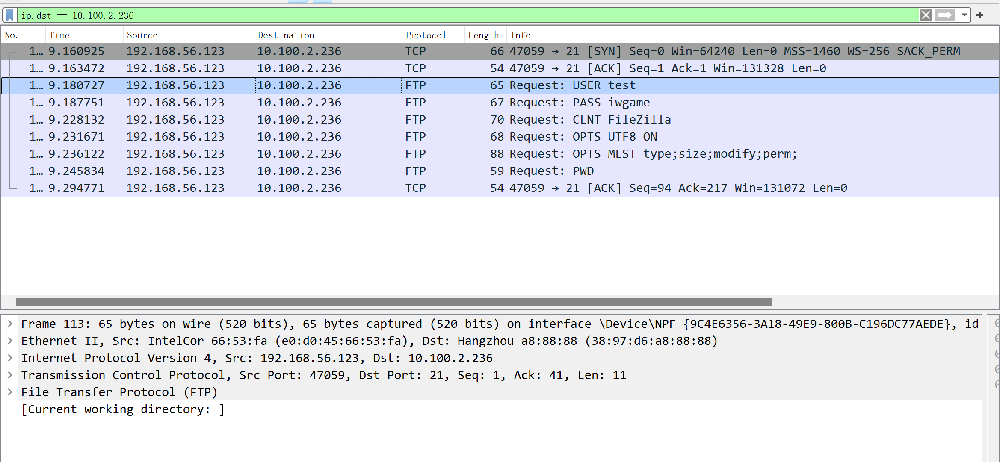
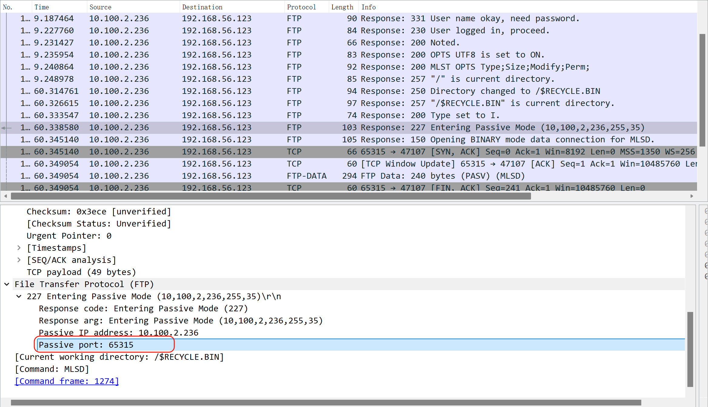
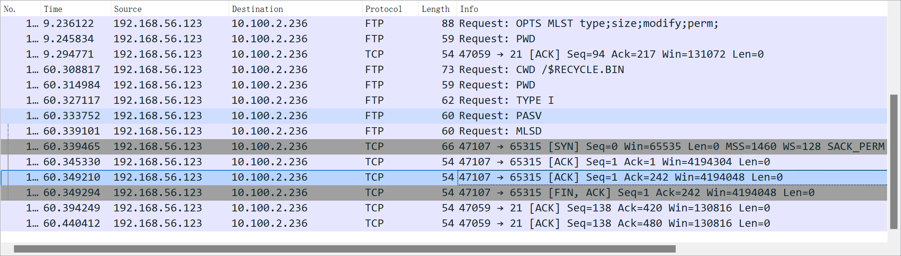
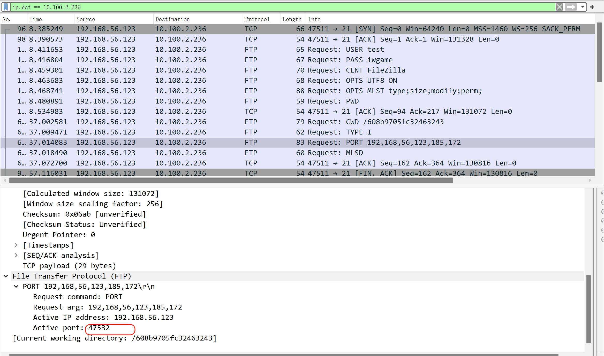
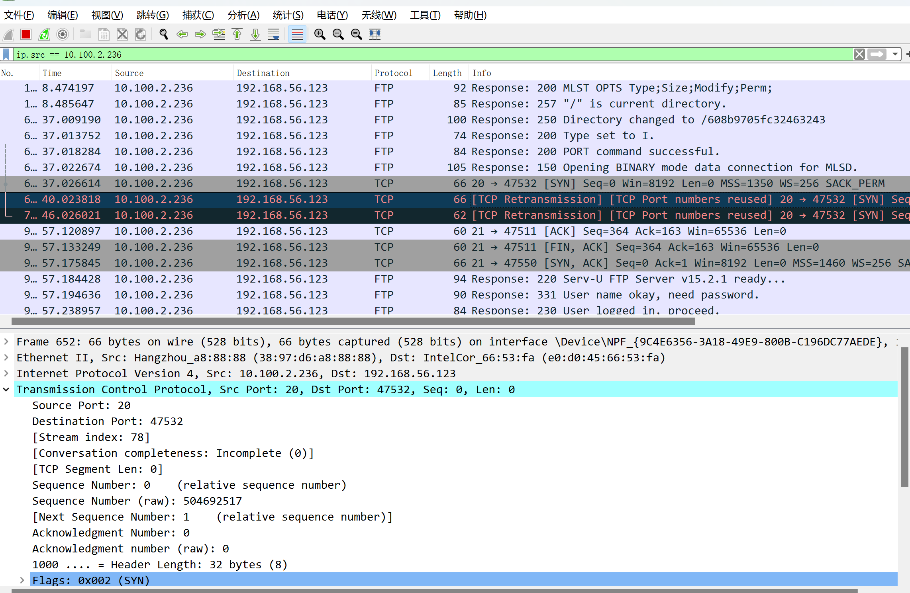

# 第1节. linux防火墙基础

# 工作案例-ftp

**开发内网 ftp server，办公外网ftp client**

此时要知道如下概念

1、ftp 主动被动

2、ftp 如果over tls 加密字段范围

3、一般作为硬件防火墙SSG比如，不管client 是主动还是被动 访问server、ssg只需要放行 c--到--s的 21端口就行了。   会自动inpsect 第一通道里的数据(ftp不能加密)，找到主动的21-链接的pc的随机端口；找到被动client--链接--server的server随机端口。

**实操**

一句话总结：就是FTP要明文，policy是需要放开21，其他理解下就行了。

ftpclient软件一般默认就是走的PASV被动模式，也就是第二通道，

1、中间的硬件防火墙比如**ssg要看得到的--也就是FTP要明文**，否则无法自动给你放行

2、SSG看到了不管是 被动模式访问server的随机端口，还是主动模式server21访问出去的随机目标段端口，只要SSG看到了，都会自动给你放行的，不用管。

3、只不过一般主动，还需要放行PC 这个clinet的windows的防火墙的进来的流量。

同样改为主动，ssg也会默认给你放开内网server:20----> 外网PC 随机端口的策略的，不过PC的windows防火墙要关掉。

如果加密，TCP以上都是加密的

不加密，就是tcp以上不加密，才能看到  被动也好，主动也罢的 随机端口。

被动的包看看顺便👇

主动模式的包随便看看👇

当然这个是windows的防火墙没放行47532

放开就好了

