# 第3节. nginx全局配置和性能优化


### nginx的配置文件

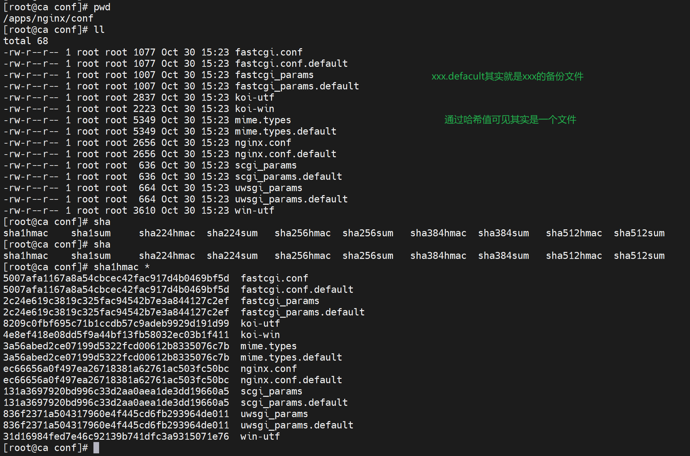


## nginx的配置

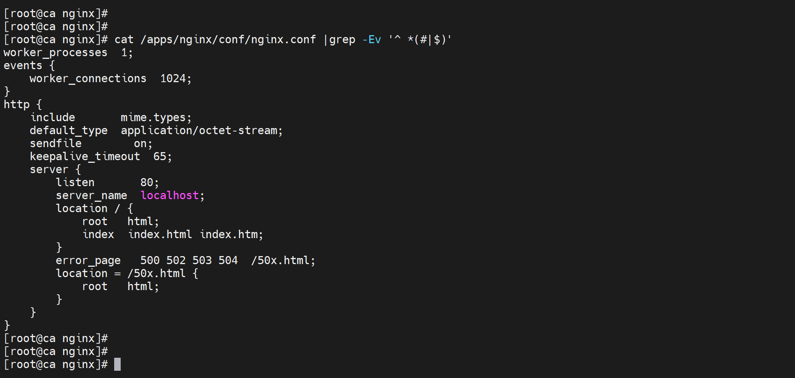


上面一段是全局配置，包括，nginx软件以谁的身份来运行，worker进程是几个，


下面的http打头的段，是泛指http，包括http，已经fastCGI-这个其实不是http但是是web服务也和http相关，所以也放在这里；但是后面做tcp的反代后单独块了不在http块里了。


然后语句里面还有嵌套，就是类似字典里还有字典。不同的指令只能出现在不同的语句块中。

比如上图👆的sendfile on，能够出现在什么语句块里，就需要通过官网来了解


然后配置文件，好习惯其实就是规范配置，是一个网站一个配置文件独立存放的，不是堆在一个主配置文件里的。

yum 安装的 nginx的主配置文件还是有点东西的👇

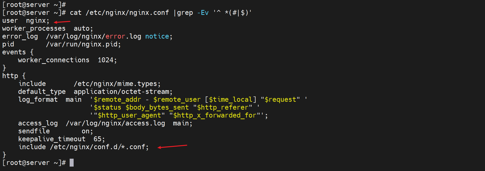

编译安装的主配置文件好像少了的意思👇

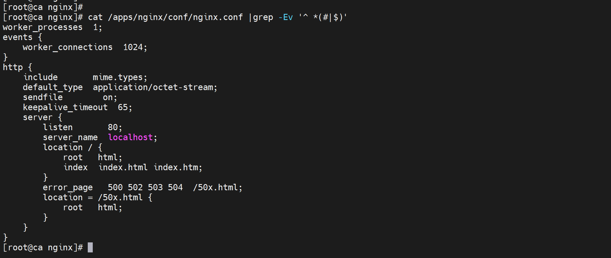


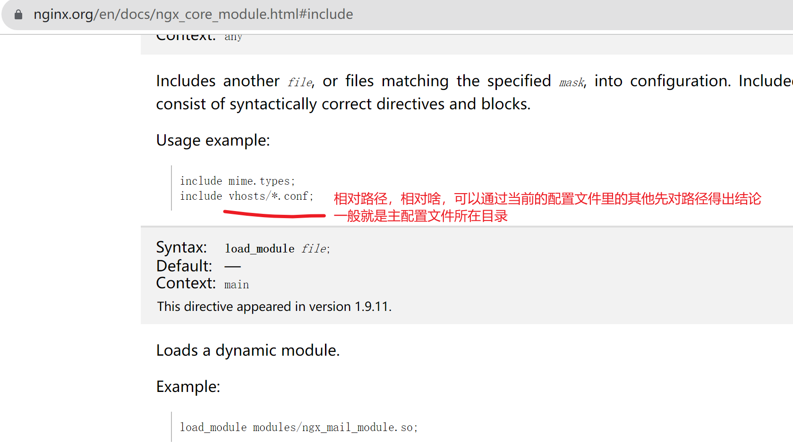


```
cd /apps/nginx/conf
mkdir conf.d
稍后配置文件都放到这个conf.d里

```

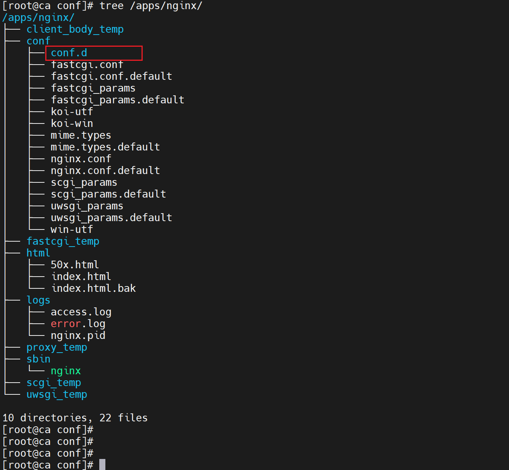


总结PPT


​	


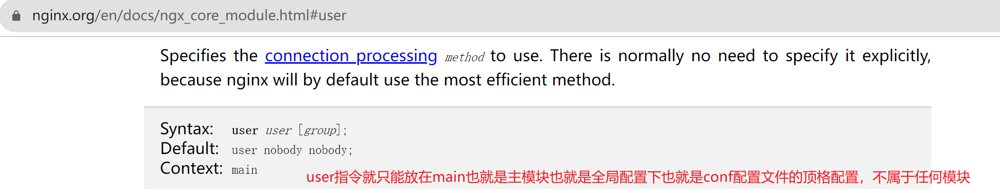

看上图👆default默认user就是叫nobody的这个用户，结果编译安装的时候ps auxf看到的是nginx用户，原因就是编译的时候指定了用户了


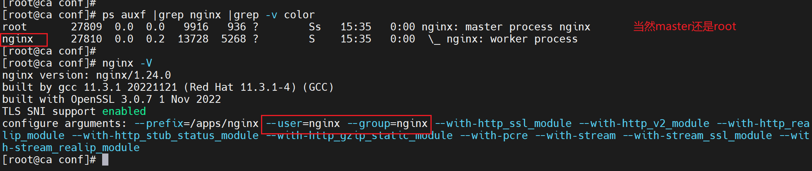


看看yum安装的

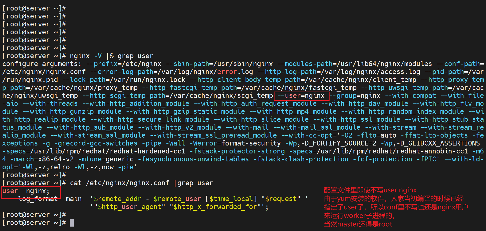


### 看看PID的路径

yum 安装的

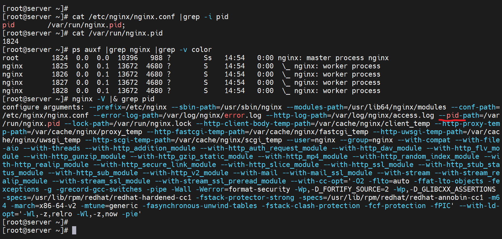

我在想，编译安装的是不是都写到conf里了，应该不是，否则conf不可能那么短的

然后就是conf应该优先于nginx -V看到的配置选项咯，实验过了，是的。


### include包含的文件


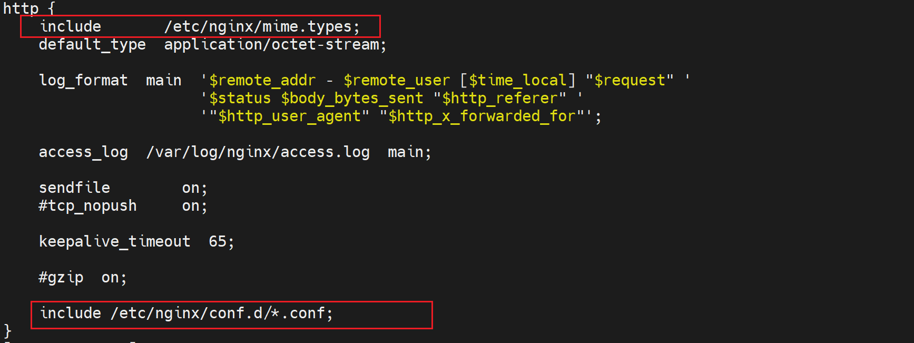


### load_module 模块加载文件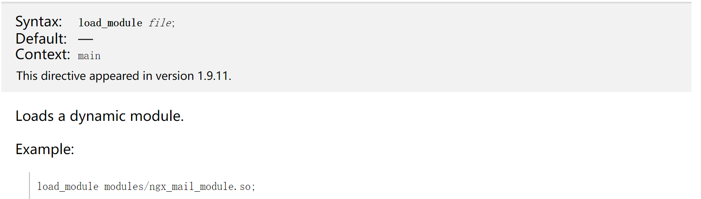


### 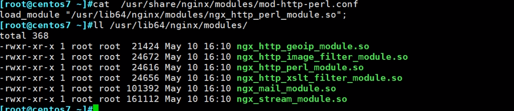


## 下面看看和性能相关的配置


worker进程数一般推荐和cpu核数一样，不过这也是默认的行为


auto意味着自动根据CPU核数来配置

实验的时候：新增CPU后，保证worker_processes为auto后，nginx -s reload如果nginx的worker进程数没有上来，就需要nginx -s stop 和 nginx，重启生效了。


### CPU有L1 L2 L3三级缓存

lscpu可见，L3缓存时所有CPU共享的，L1和L2是针对一个CPU来讲的。

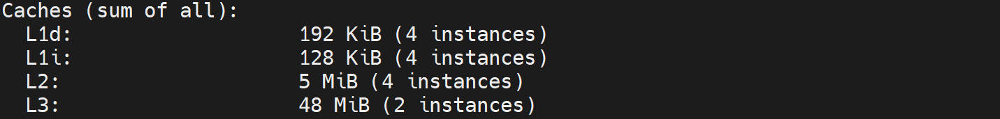

L1有指令缓存和数据缓存


**看下跑在哪个CPU上，也就是nginx应用程序和CPU的绑定关系**

先看下前面的内容，反正学习的过程中如果存疑，①搜前文②GPT③谷歌

前文关于L1 L2 L3 的说明和如何查看和绑定进程到CPU，当然nginx应该有自己的方式


继续看nginx的worker进程和cpu的关系，然后进一步做cpu绑定。为什么要绑，也不是一定要绑，就是绑了以后L1 L2这两个缓存本来就是CPU专用的，CPU一飘，L1L2的缓存内容就用不了了，所以从找个角度考虑，是需要绑的。

```
ps axo pid,cmd,psr
```

目前四个worker运行的CPU情况如下👇


使用ab并发请求，观察是否存在cpu飘的情况：注意ab测试的url要带上http以及最后的/斜杠。

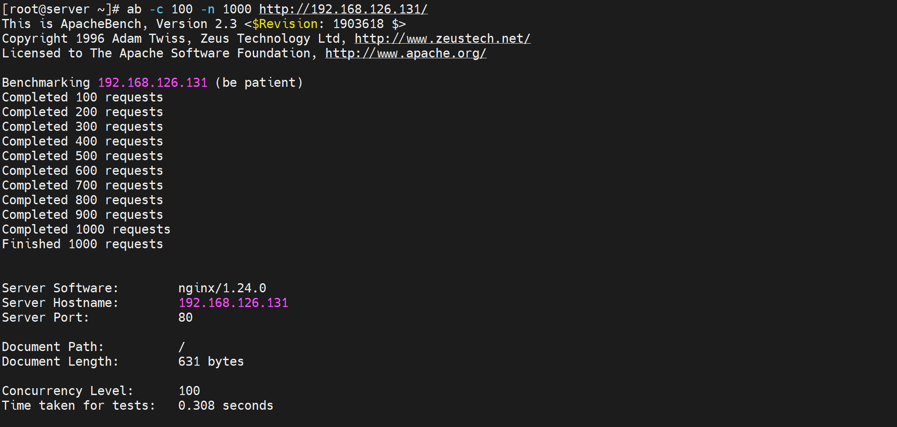

果然cpu开始飘了


下面就绑一下worker进程到各个cpu吧

```shell
worker_cpu_affinity 00000001 00000010 00000100 00001000  # 假设有8个cpu，4个worker就这么些

worker_cpu_affinity 0101 1010   # 就是worker2个进程，worker1绑在cpu0和cpu3上；worker2进程绑在cpu1和cpu3上。
```

 

有几个cpu，就些几个bit，比如00000000代表第0个CPU，00000001代表第1个CPU。从0计数

我是4核就这么写👇，注意结尾的分号要写的。

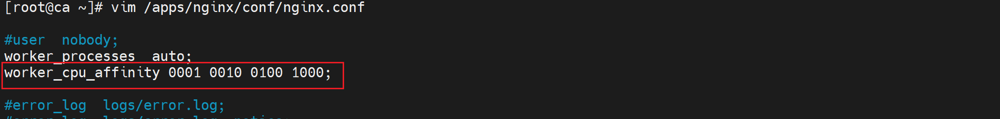

这样就worker1绑在cpu0，worker2绑在cpu1，worker3绑在cpu2，worker4绑在cpu3了👇，再次使用ab压力测试，发现此时CPU不飘了就。L1 L2 利用率就上来了，否则CPU一瓢1 2两级缓存就没了。

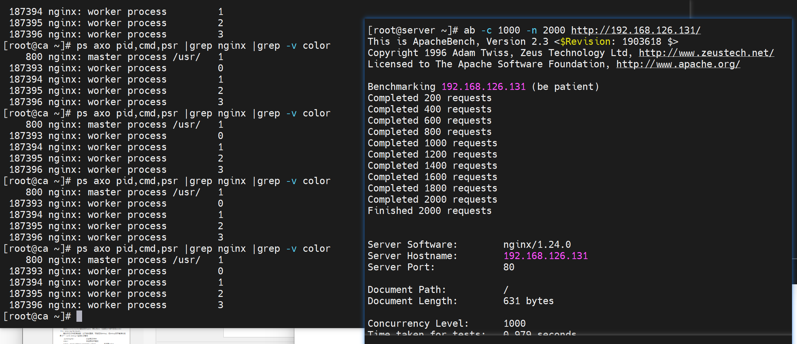


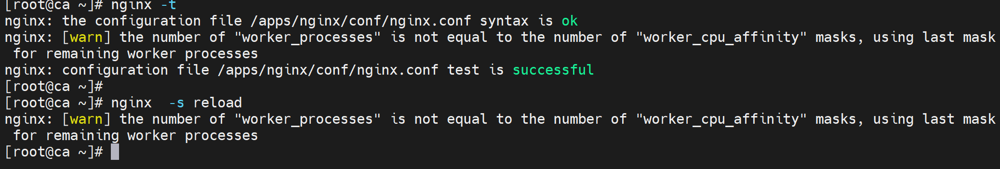


不过只是warn告警，服务不会停掉，只是绑CPU可能有点问题。

绑定OK后，CPU0就绑在worker1上，CPU1绑在了worker2上，但是不是说CPU0就只能为nginx服务，还可以被别的应用程序使用的。


### worker进程的优先级nice

```
ps axo pid,cmd,nice
```


### worker的优先级

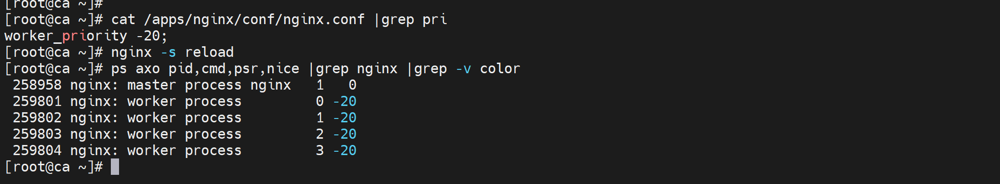

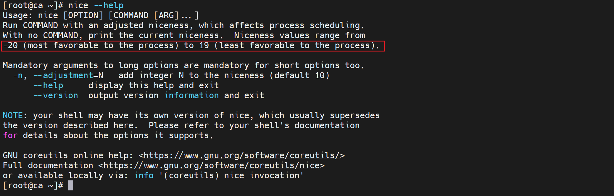

官网写错了

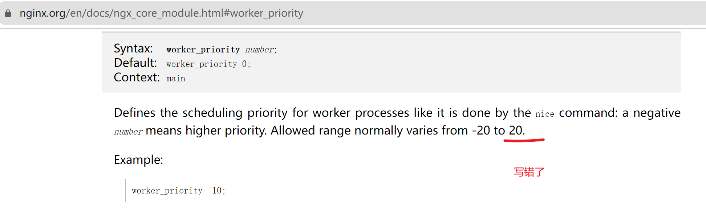

就算写1000最大也就19(也就是最低优先级是19)

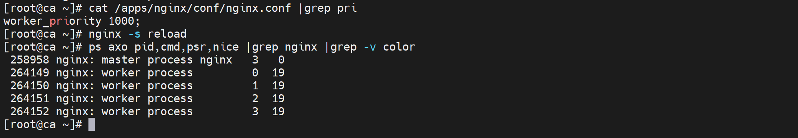


### worker进程打开fd数要和ulimit一致


看下系统内核本身的fd并发限制--是单进程打开文件的限制

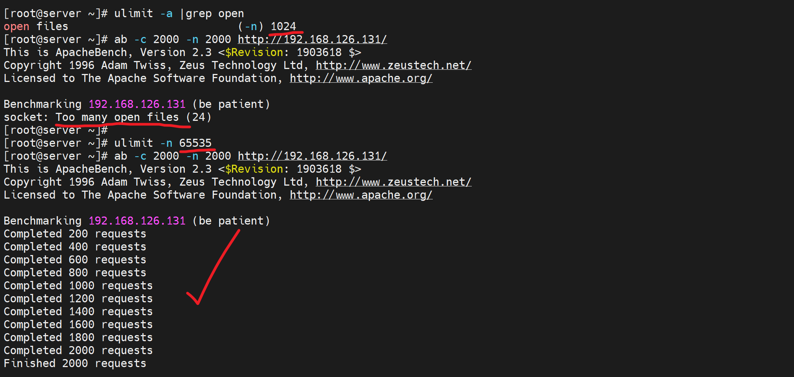


虽然nginx就开了4个worker线程，


但是一个worker就能应对大量并发号称无上限，因为使用的是epoll模型，所ab高并发测试的时候响应灰常快。


### 永久调整ulimit的值

**系统里调整**

PAM文件和security文件看看

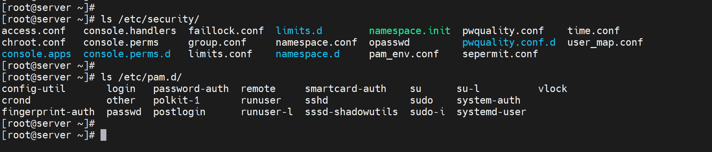


**nginx里调整**

在nginx里直接修改配置文件就行

1、所有worker进程总的并发数


2、每个worker进程的并发数

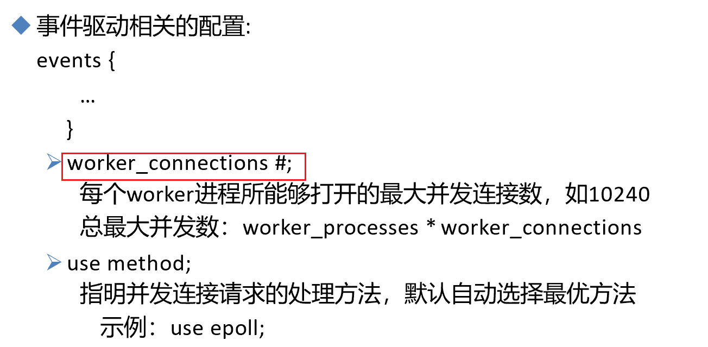

use mothod 不用指定，默认就是epoll应该也是最好的方式了。也不一定如果是nginx跑在linux上默认就是epoll，如果跑在windows上默认就是select。官方就是说默认使用最有效的方式，应该是这么理解的了。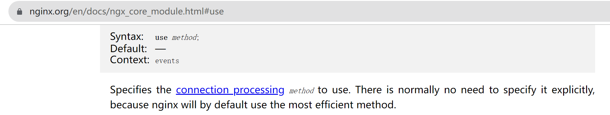


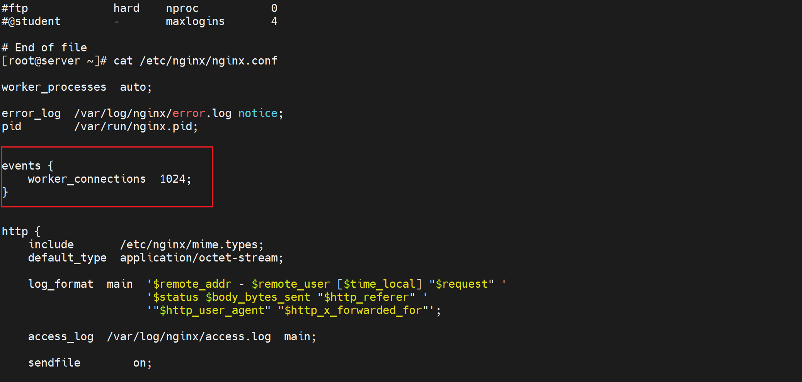

上图👆得到的并发上限是多大，假设它的硬件资源是OK的，1024是一个worker线程的并发数，auto就看lscpu里几个，如果是4核，那么1024*4=4096的并发数。

一般nginx作为web服务器3W基本到顶了，比apache强也不是说没有上限的。apache一般提到的C10K也就是1W咯。


### accept_mutex 默认on不会惊群


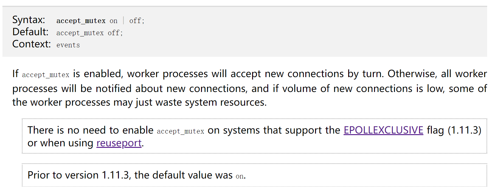

虽说accept_mutex on是一种优化，不过EPOLL也不需要这种优化。。。感觉最好还是改成on。


mutl_accept默认是off的，如果on，并发就更强了，不知道是否推荐打开。

然后图中写明了事件驱动相关的配置，说明配置的语句块是在event里的，具体官网可查确实是events里配置


然后multi_accept针对kqueue是无用的，kqueue是和epoll和select对等的机制

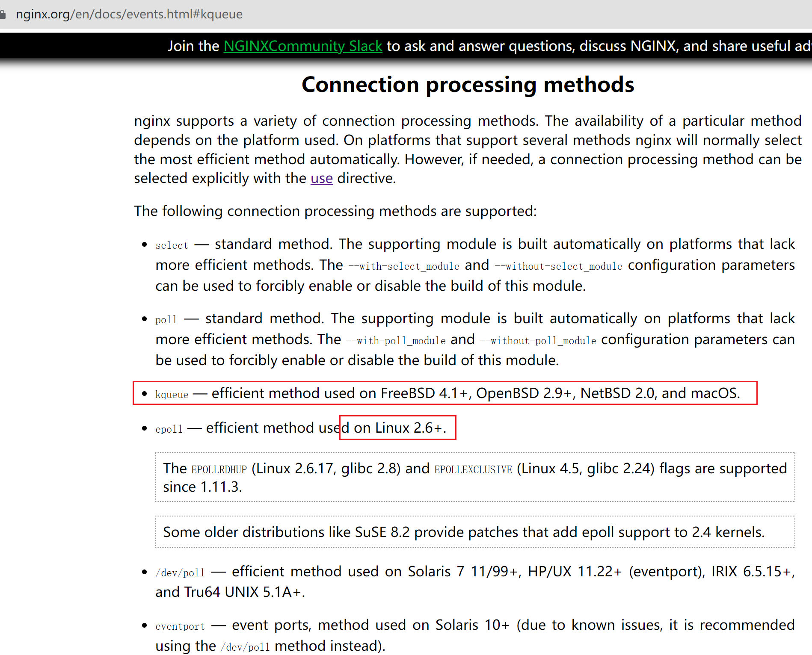

所以MAC用户如果本地测试可能就要小心了。存在连接处理机制的不同。


### 调试和定位


nginx命令一敲默认就是后台运行，是通过daemon来配置的off就是前台运行了

master_process on; 就是以master和多个worker进程的方式来运行，off就是只有一个单进程了也就是master。

error_log file，里面除了error日志，还可以带上debug(但是要nginx -V |& grep with-debug 有东西才行，说明编译的时候开启了debug，配置文件里无法打开debug只能编译里启用。)，就好比msyql的慢查询日志里面还可以带上是否用索引的日志。


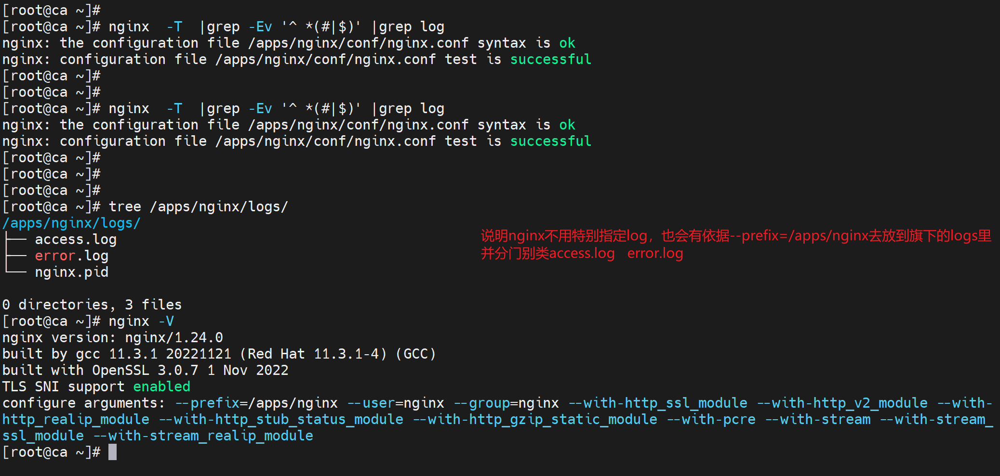

上图是实测结论，下图是找到的官方依据

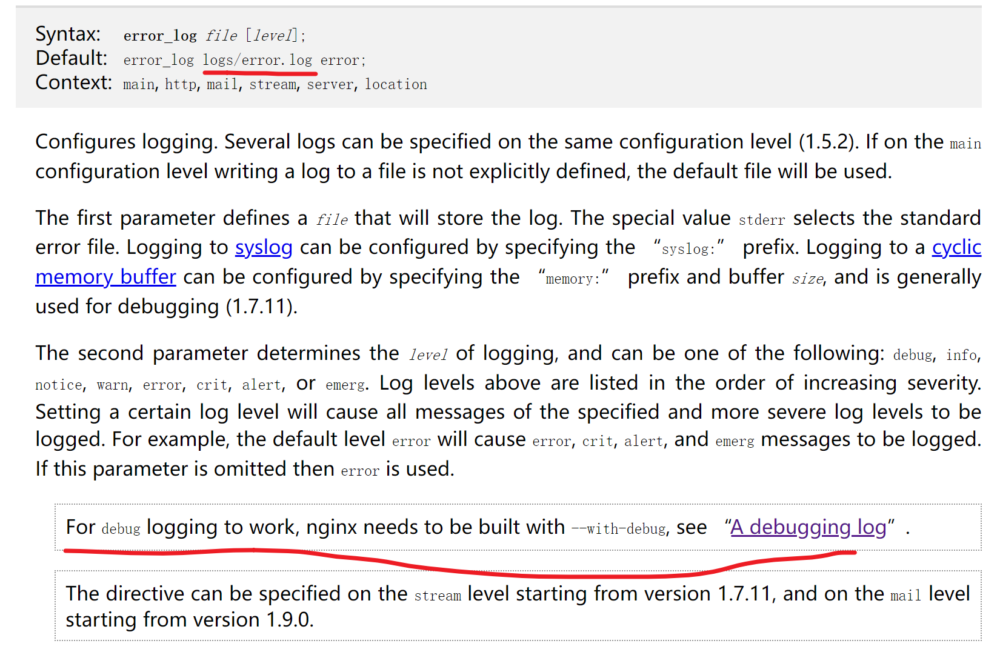

就是相对路，相对于--prefix=/apps/nginx/的，所以结论是对的。


还有关于access_log，关注一下关键词combined，这个在httpd里也是出现过的，代表着log的格式，

同样按此思路去找一找nginx的combined的格式定义在哪里的。


默认的log_format就是combined，然后combined的格式如下👇


**不管什么日志，access_log也好，error_log也罢，都是要分开来，跟server语句块走的，就是虚拟主机的log各自分开来。**


**nginix到现在接触到的优化点**:  

```
worker_process(线程数跟CPU走)
worker_cpu_affinity(cpu亲缘性绑定)
woker_connecctions(单worker的并发数)
还有log放到server块里。
还有👇
accept_mutex on;  # 就是防止惊群效应。
multi_accept on;  # 每个worker线程可以同时接收所有新的网络连接
```


