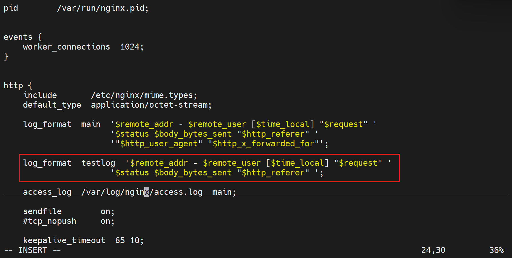
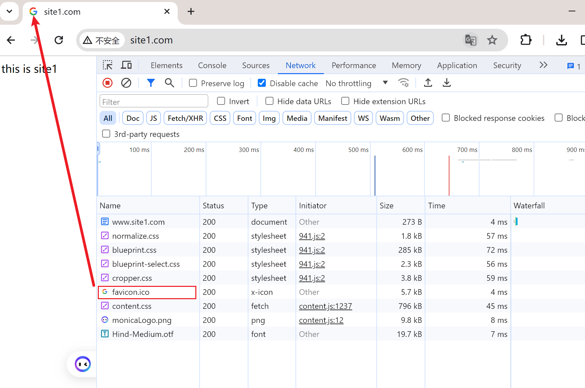
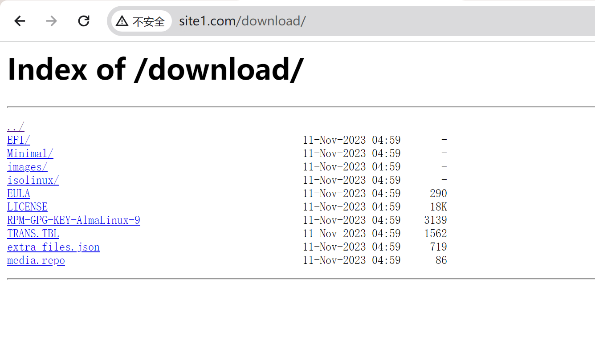

# 第2节. nginx第三方模块echo和自定义json

## nginx变量

同样可以利用echo显示出来吧

好像br才能在浏览器中换行

linux cli里还是有点问题

要加引号的

然后br只是针对浏览器的，linux  curl无需br的

然后还要关注这里一直看到的 ?id=1&core=100其实就是$args的变量的结果，用在sql语句去后端查DB的。

如果你不清楚nginx的站点的目录，但是你又知道配置文件的路径，可以这么做

**cookies的显示需要curl里带上才行的**

正常访问网站，server会构建cookie发给你，下次你浏览器就会自动携带这个cookie了-这是浏览器自带的行为。

cookie的用途，将来可以根据cookie来进行调度，session会话，前端有个调度器，如果轮询就不知道轮到那台node去了，之前的信息就丢了，所以可以根据cookie或者说这里的user，如果是ming这个用户，就往同一台node上转发。这就不会造成会话丢失。

但是，cookie是7层内容，LVS不支持。

整体上判断nginx的性能要地域lvs，这是再说四层转发的功能和lvs的四层转发。

### 自定义变量

变量之间赋值：不过要联系到python里的列表赋值和字典赋值这种 指针类的 要小心。

如果是http，就可以重定向到https。但好像也不用echo一下 判断一下 ，多此一举。

## 访问日志的格式

和httpd也就是apache一样。

log_format 指令只能在http模块下定义；但是调用log_format指定的格式变量就不一定了

也是①先定义格式②定义完个时候，再引用这个格式。

apache也是一样的格式

还有用户认证的记录，这是之前讲过的

日志如下👇

log_format 指令只能在http模块下定义；但是调用log_format指定的格式变量比如下图的main就不一定了

每个服务器，也就是server都应该有自己的访问日志，区分开的，所以自然是server模块下可以使用access_log来调用log_format格式，进一步产生自己的独立的日志。

### 自定一下log的格式和产生的地方

http_referer是从哪个url跳转过来的。

上面新的日志格式就改完了，下面就去虚拟主机那里调用就行了。

access_log off;就是不记录这个server块，虚拟主机的日志。

重启服务日志文件就有了，不过是空的，访问一下，日志文件里就有内容了👇

要注意 - 有的是 格式排版，有的是没有数值。

要注意，上图的14就是index.html的文件大小

大小会有出入，文件越大可能出入就出来了。

/favicon.ico是当你访问站点的时候，会自动的找你的图标，这是自动的浏览器行为，结果没有就是404找不到了。

然后可能更提倡用json格式，因为有key value，不像上面的一行一个全是内容，一些值就不清楚具体是什么意思了。

但是用json格式保存，就意味着你查看不是 行记录了，人工查看就不是很舒服咯，对吧。

重启服务后，访问，看下日志

格式化下

### 关于日志或者大文件的清理方法

1、>

2、cat /dev/null >   # 一些shell不支持 上面个的>重定向的方法，就用/dev/null垃圾箱的方式来做

3、别用echo，echo是有一个字节的，是一个换行符

### 浏览器的行为，会找图标

扣一个图标下来用用

找到站点的根目录，将图标放进去

浏览器的行为

curl就不会，因为curl是cli不是图形界面，不存在图标啊

解决方法就是补一个图标文件

或者访问这个favicon.ico文件的时候就不记录日志，这有点掩耳盗铃哦，也许不是，哈哈

图标默认就是在站点的根，这里上图是指定了具体位置了。

### 缓存

这图👆是说的文件的缓存

而下图👇是日志的缓存，也是LRU算法，也是max、inactive、min、valid这些参数。

open_log_file_cache on;  # 启用缓存

max=N  记录多少条缓存

inactive=time  多长时间内 该缓存 没有被访问，就认为过期了；而且在inactivetime时间内 还要访问min_uses=N个次数才认为是活动的缓存。反之这段时间内该缓存没有达到min_uses次则缓存删除了应该就。

valid=time 多长时间检查一下缓存情况，就是检查一些信息是否过期了。

### nginx做下载页面，类似yum源之类的

1、将sr0光盘挂到站点目录下，直接是不能访问的

这里的一个排查思路，就是umount后，写一个index.html文件，再用浏览器打开看看如果可以就说明路径啊，配置啊都没问题，问题是文件夹里没有index.html文件。其实不必测试了，知道这么个思路就好了。

**好了，现在将使用ngx_http_autoindex_module模块**

涉及选项

autoindex on|off    开关咯

autoindex_exact_size on|off  一般就是off显示粗略的不对的文件大小，主要是没啥大用，on还要实时计算不好，对资源消耗方面。

autoindex_localtime on|off  使用on就是用本机时间，然后本机时间就用ntp同步了。

autoindex_format html|xml|json|jsonp  显示格式

这不就是可以用来当yum源咯👆

