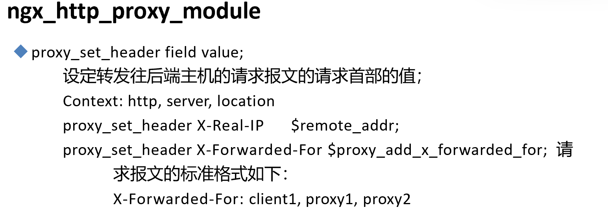
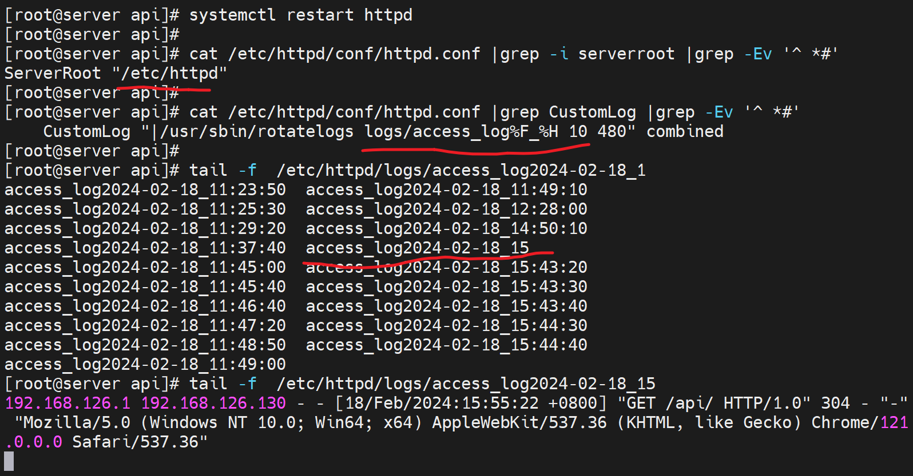
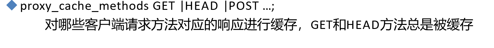

# 第1节. nginx反向代理缓存和IP透传等功能


之前一节，接触了反代，但是发现两个问题

1、用户ip没有真实的反映到后端服务器上

2、调度没有真正的实现


# 如何让后端服务器得到真实的用户IP




nginx反代的数据交互4个过程，②和④nginx是可以修改的


要实现RS(real server)也能获得真实的c(client)的IP信息，可以将这个信息在nginx上添加到请求报文的头部里通过②发个RS。


关于请求头，除了浏览器自己加的东西，也可以自定义一些(nginx 反代的时候或nginx做server的时候或者httpd做server的时候都可以吧)。


这些都是键值对，nginx上自定义 添加什么key:value都是可以的。

**proxy_set_header X-Real-IP $remote_addr;**

X-Real-IP自定义的键，值就是用变量$remote_addr，这个在配置log格式的时候就见过的


然后key的配置位置，http、server、location都行，我们就放到location里


在反代nginx也就是192.168.126.130的nginx的配置中定义一个key，并使用remote_addr变量作为value👇


这样配置以后，只是添加了head头部里的一个叫做X-Real-IP的key，value是client ip，要想real server也就是后端真实的服务器记录实际的ip，还得修改对应的log字段吧。否则默认也是看不到的。

在后端服务器上，这里就是192.168.126.133上 的httpd配置中log里调用该变量。


固定格式 %{xxx}i




其中192.168.126.1就是真实的用户IP，儿192.168.126.130就是nginx反代。


这个X-Real-IP是自定义的，随便写的。


### 如果存在多级代理，remote_addr不好用了就


注意这里有一个变量教X-Forwarder-For，然后没经过一次反代，就会添加到proxy_add_x_forwarded_for变量里，类似列表的append。

第一个加进去的就是真实的客户端IP，然后后面的都是反代的IP。

类似这样：

然后X-Forwarder-For也是自定义个的名称，随便换名字都行；关键是后面的$proxy_add_x_forwarded_for是固定的变量，当然规范还是用通用的名称便于维护。


然后

①、整条链路上所有的代理nginx上都要做这个配置，才能完成client,proxy1,proxy2的信息传递和累计。

```
proxy_set_header X-Forwarded-For $proxy_add_x_forwarded_for; 
```

②、最后的real server上加X-Forwarded-For变量到日志里就行了。

```
 LogFormat "%{X-Forwarded-For}i %h %l %u %t \"%r\" %>s %b \"%{Referer}i\" \"%{User-Agent}i\"" combined
```


# 缓存功能


C1第一次访问某个资源，nginx反代会像real server请求；并缓存该资源

C2也访问这个资源的时候，就命中了该缓存资源，于是nginx不会再向后端请求，直接将对应资源返给C2。


## 实验缓存的效果

1、既然是缓存，就要找一个大点的页面做测试

2、ab命令测试

在192.168.126.133上的api目录下弄一个大文件m.html并可读👇


在192.168.126.130上curl 可见👇


同样在130上ab测试


### <span id = "jump">👆以上是未开启中间反代缓存功能的结果</span>，c--nginx---server


①首先proxy_cache_path指定的path就是存放缓存的地方

②levels=levels就是1:2:2这个和之前上传资源的存放是一样的


然后缓存的使用，也分内存和硬盘空间，

③key_zone=proxycache:20m \# proxycache是自定义的缓存名称 用来调用的，然后20m是指内存中缓存的大小，主要用于存放key和metadata（如：使用次数）

比如，存放的key是什么，比如就是url，然后对url进行哈希运算，运算之后放到缓冲区proxy_cache里


比如，metadata元数据里存放了访问了多少次。

④inactive=120s；   缓存有效期，应该就是磁盘上的文件失效自动删除，我理解。

⑤max_size=1g;   磁盘上缓存文件也即是path里的东西最大占用空间。

⑥proxy_cache zone | off; 开启缓存，默认是off。 zone就是写上面定义的keys_zone名称--proxycache完成开启缓存，调用在：http、server、location模块里。

⑦proxy_cache_key string;   对什么内容进行缓存呢，对key键的内容做缓存的，默认的proxy_cache_key的值是 $scheme$proxy_host$request_uri;来做缓存的。

scheme是协议的变量；proxy_host是代理服务器的主机头；request_uri就是请求的uri了。

组合起来就是完整的url了吧。然后针对这个组合的信息做哈希，如果哈希一样，就认为缓存信息就一样。$scheme$proxy_host$request_uri;这个信息作为key进行哈希，然后去哈希值的1:2:2也就是倒数1位作为文件夹/倒数2-3位作为子目录/倒是4-5位再作为子目录，然后将页面html的内容存进去。

这样的话，下次再访问同样的url的时候(内容中存着呢)，就按照同样的哈希值进到对应的1:2:2目录下找网页内容就行了。然后直接放给用户。


此时就总结下：其实很简单，就是key_zone=xxxx:20m；这就是内容中定一个zone名词叫xxxx，然后里面通常就存放访问的url和调用的次数，如果有人请求的url命中内存中放的url，且根据你定义的响应码如果是200 之类的就利用缓存，此时就会到对应的哈希目录里去找网页内容，而这个对应的哈希目录就是levels=1:2:2方式建立的。

，

⑧proxy_cache_valid [code...] time;  比如proxy_cache_valid 200 302 10m;就是针对200、302缓存10分钟。 上下文也就是配置模块写在http中。


 


当出现错误的时候，意味着后端服务器不能响应，此时可以使用过期缓存来应答给用户。虽然后端服务器down了，但是曾经缓存过这些资源，所以还是可以让用户看看的。

所以，这里的"过期"是指和后端real server相比而言是过期的缓存，不是指inactive=120s那个失效时间？


哪些方法启用缓存



默认是GET和HEAD都是被缓存的。


## 下面开始实验


proxy_cache_path只能在 http模块下进行配置


其中proxycache代表整个缓存定义信息(proxy_cache_path的内容)

接下来还需要引用这个缓存定义proxycache，引用可以在三个地方👇，这里使用server虚拟主机里去配置。


proxy_cache proxycahce;就是调用了上面定义的缓存信息。


不过当前还没有缓存信息


触发下


这个就是用户访问的url的哈希值作为文件名；倒数第1个d，倒数2-3位就是3a，倒数4-5位就是9d，整体就是1:2:2来利用哈希值来创建目录的。这样做的好处就是大量级的文件将来可以快速索引过去，如果堆在一个文件夹里ls都能半天才出来。

该文件的内容就是网页。


### 此时缓存有了，ab 压测再看👇[无缓存的效率](#jump)


### 然后缓存方面会有一个问题，

①rm -rf m.html  # 删除页面文件

②cp /etc/fstab /xx/xxx/xx/m.html  # 创建一个不一样内容的页面文件，但是名字一样

③curl 看看结果还是只来未删除的页面内容，

④原因：因为文件名称没变，url没变，哈希没变，所以还是利用的老的缓存。

⑤处理方法：缓存时间不要太长，超时后，页面重新请求就对了；或者手动清理一下缓存。


## 后端服务器信息的隐藏和透传


比如上图的ETag要隐藏起来，ETag是后端服务器负责生成的。访问不同的url的ETag值也不一样。

上图是在192.168.126.130 反代上测试的，其实和client用户那边差不多了


然后下图👇是在后端real server上curl的ETag是一样的，可见ETag就是real server生成的，反代nginx也不会修改的，就是透传到用户那边的。


如果不希望用户看到ETag，就可以在反代上配置proxy_hide_header Etag; 加以隐藏。


有些客户端看不到的，默认就看不到的，也可以用prox_pass_header field;加以透传。


### 添加一些自定义的头部信息或尾部信息

上面的是修改，就是隐藏和透传，现在是添加自定义的key:value


①缓存利用状态信息添加到头部里


add_header X-Cache $upstream_cache_status;


X-Cache自定义的key名词，可以改成其他的，虽然不推荐改。

然后第一次是MISS表示没有命中缓存，第一次也没有缓存啊


第二次就HIT了


三个512一大的分配就好，不一样大，会导致：一会分配内存，一会回收内存，反而性能不好


以前httpd支持php那会是打了补丁，也就是新加了模块，让apache具备了处理php的能力。这种方式不如专门的fastcgi独立软件甚至是独立服务来处理php。

nginx没有像apache那样的模块来处理php，同样是通过fastcgi的方式来支持的。


