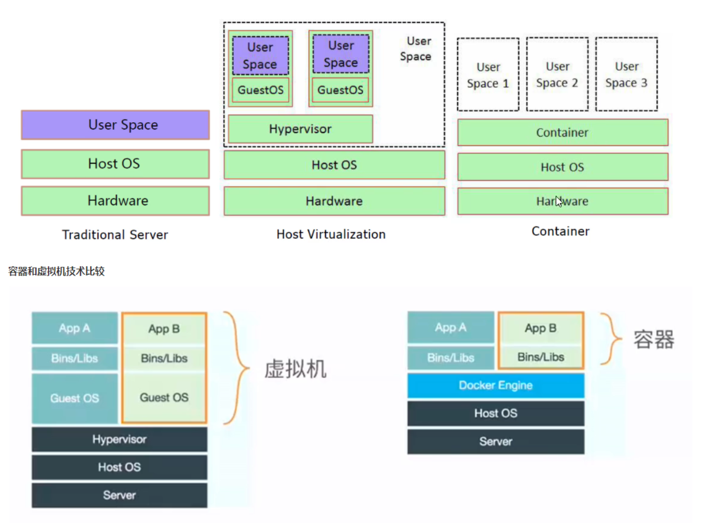
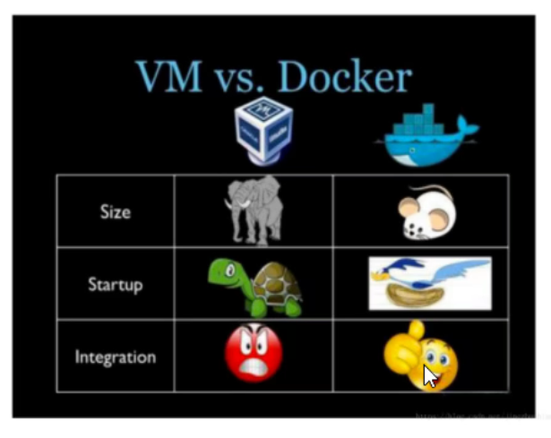

# 第1节 容器和虚拟机特性比较

# 虚拟化技术的对比

简单点，就是主机虚拟化有HYPERVISOR \ GUSET OS 2层OS层面的虚拟化层，

而容器只有一层容器层。少了一个完整的OS，节省了很多资源。

useSpace 1 2 3用的是HOST OS，而HOST OS就是内核的一些系统文件，共享的系统OS咯。

container层就可以理解为主流的docker

这里我想到一个点，“联合文件系统”，才是关键吧。画图毕竟是画个图，container层其实就涉及联合文件系统才能做到不同的容器之间共用基础文件系统层。当然container可能不仅仅是FS层咯。接着学，这里简单思考下，让上帝笑一笑，接着学，接着奏乐，接着舞。

关于user space 1 2 3 共用HOST OS的情况下，如果space1里的修改了内核参数，是否会影响space 2 3的内核参数。继续舞~~，存在space1黑掉了底层HOST OST的某些关键文件导致space2故障的可能性。

​        再一个，官方都说是anywhere运行，所以你linux的docker，在windows上一样运行的，如果HOST OS用的是宿主的，那么linux和windows OS肯定不一样的，那么是如何工作的呢？涉及底层工作逻辑，稍后继续研究...

所以有不少就是在虚拟机里跑容器，就是图二里跑图三👇，虽然这么套着用损耗更大(hypervisor+guestOS+container)哈哈，但是归在灵活啊，所以很多都确实在这么用的。

Bins/Libs：依赖库也是个运行环境，ldd /bin/ls这些也是库，一些依赖如果不全就有问题。

再举例：go语言编译的都是静态库，不是共享库，所以go开发的软件拷贝到其他机器上，比如从ubuntu考到centos就能直接运行的。

size，大小，容器肯定小很多，都少了一个相对庞大的OS层的

startup，启动方面，如果是go这种容器就很快，但是如果是java容器照样慢，OS的启动都可以忽略不计了。

intergration ，继承性方面，比如迁移 容器就很快

容器：好比集装箱

docker，n.搬运工人, 码头工人，搬运管理集装箱的，所以docker就是管理容器的技术，一揽子解决方案的技术。

k8s：来自希腊语 舵手，不是剁手。开船的人好像比码头搬运工有高级了一点。码头工人是在一个码头里工作，舵手是满世界跑，今天一码头，明天一码头。所以k8s听名字就知道更牛。

定位其实 docker和k8s之间是不冲突的，但是K8s好像在抛弃docker，哈哈~所以还是有冲突的，比如不是一家公司的利益冲突，哈哈~。

kvm和docker都是单机游戏：一台宿主机上管理其上创建的所有虚拟机或容器。都是只限于一台机器上的管理。

而k8s是所有宿主上的全管了。

kvm 单机vm管理工具          --- 配合---    openstack  多主机VM管理平台

docker 单机容器管理工具     --配合--     k8s 多主机容器管理平台

