# 第3节 Docker容器管理和端口映射


### docker 删除后的一些情况

docker 删除特定的容器两种方法

```shell
docker rm `docker ps -aq`    # 这个其实不加-f也可以，大不了UP的报错，就是不太安全感觉
docker rm `docker ps -f status=exited -q`  #  这种也ok
docker container prune  # 官方封装好的cli
docker container prune -f  # 同上，只不过是不用回答y/n
```

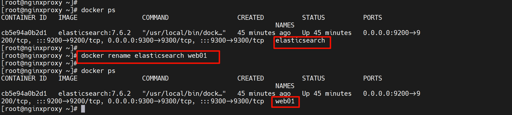

改名运行中的一样改


测一下

```
docker rm `docker ps -aq` 
```

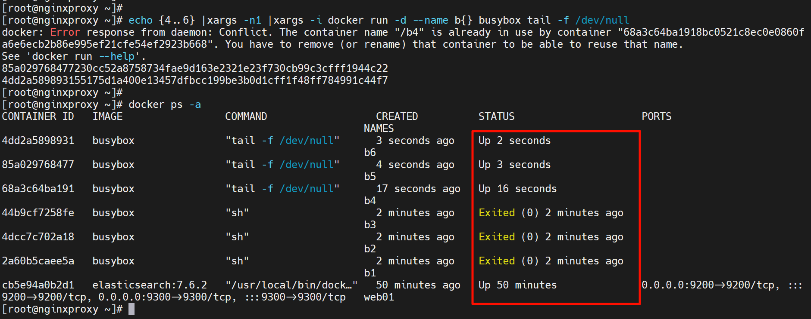

退出状态是夹在两组UP之间的，

没问题啊，还是那句话docker rm $(docker ps -aq)  就是不能删除UP的，自然就会把退出的删掉

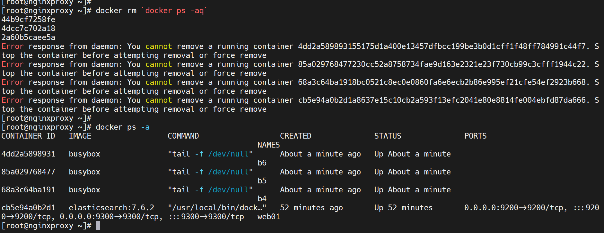


**container = image + data，container停止image层就删了，只留下data，简单来讲是这样，细究就是image不是复制而是共用过来的，meged就是image层的东西**

容器停止时不会造成数据丢失的，那么dockers stop后释放的空间是什么，肯定不是image对吧，image也不是说复制一份，可能是隔离的namespace这些隔离程序随着容器起来一个就要做一些隔离代码？  # 说法不对，stop后 落差空间大小在4220KB，[答案见下文](#1) 

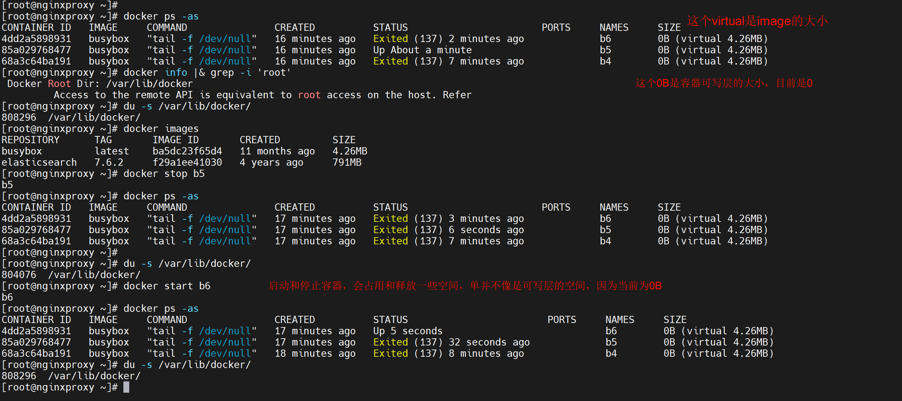


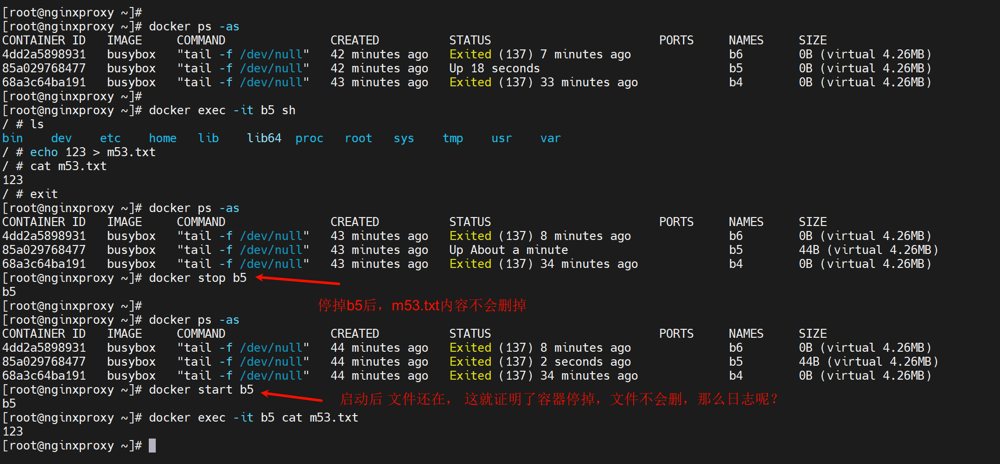

m53.tx在容器外面也是看得到的👇


diff就是新增加的文件。


<span id=1>下图就是容器stop后释放的空间</span>👇merged看着像image复制过来一份，但其实空间只有4228KB远远不是IMAGE的4.26MB

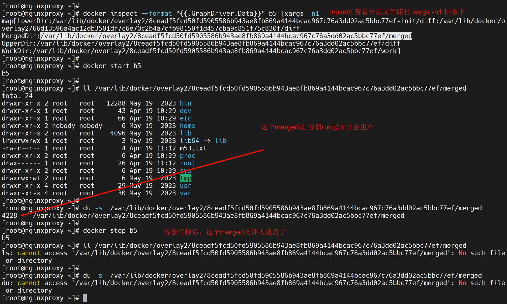


日志也是落在外面的，也不会删的

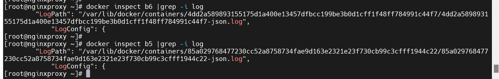

其实容器里的数据都是在/var/lib/docker/overlay2目录下的，所以也不会随着容器stop就没了。


有空看看这个，可以回过头来看，

https://zhuanlan.zhihu.com/p/374924046

链接里的截图👇

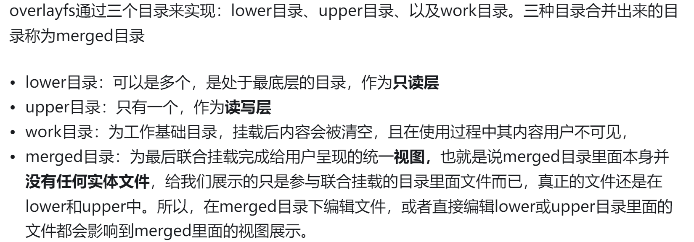


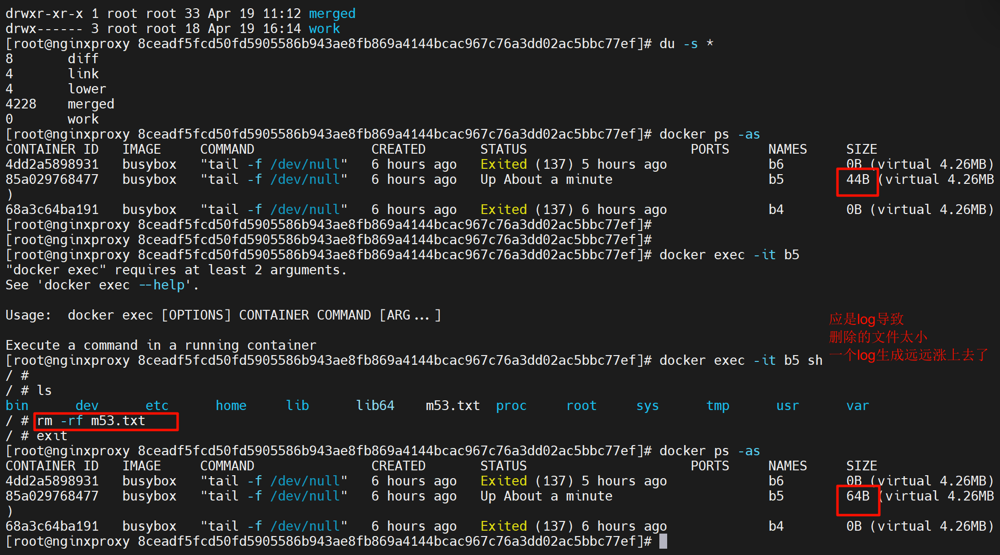

看分层overlay2里确实变小了啊，

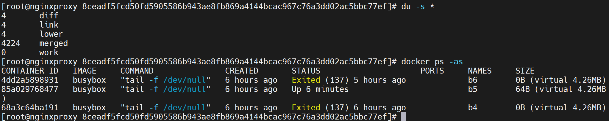

但是docker ps -s看到的变大了，可能原因如下👇

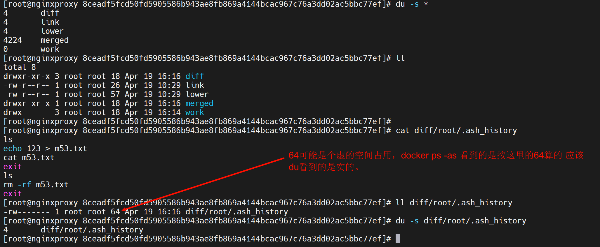

### 容器数据是否持久？

注意容器的数据会随着容器删除而删除的，上面是说容器的数据不会随着容器的stop而消失；说白就是overlay2目录里的东西，docker rm掉就没了，stop还在的。如果mysql 容器，肯定不能这样，就要做持久化。

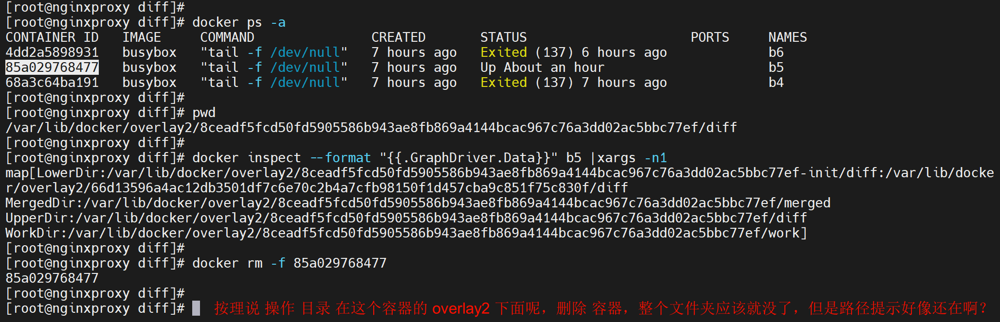

上图的目录只要退出来，这个目录就没了

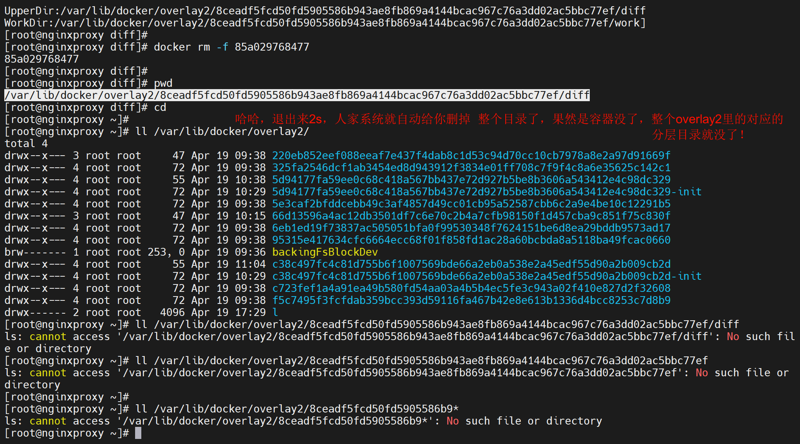


### 测的玩

所有images和容器都删掉，此时overlay2里是空的

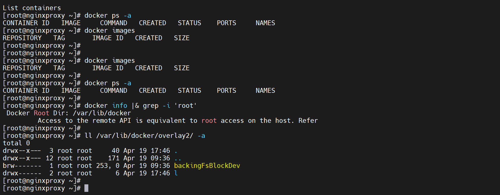


然后pull一个busybox看看

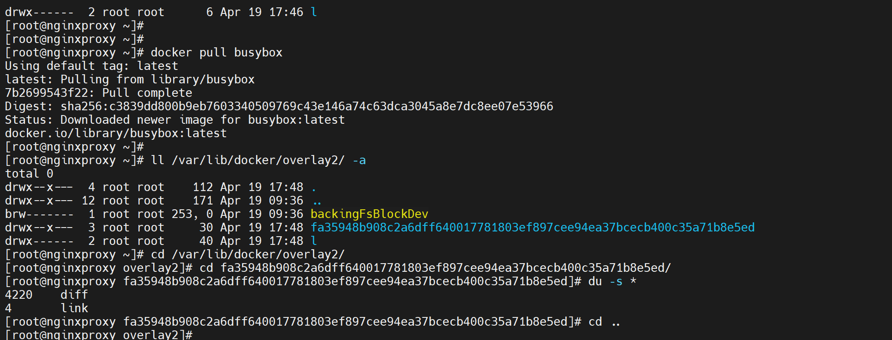

diff里的东西4220KB字节👆

run起来后，多了两个分层目录

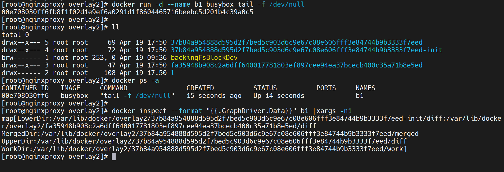

然后空间大小，run起来的空间占用主要在merged目录，看起来就是等于image里的diff目录大小；所以这个容器里的merged目录就是从image里的diff拿来的，所以就是复制了一份image的全量了基本上

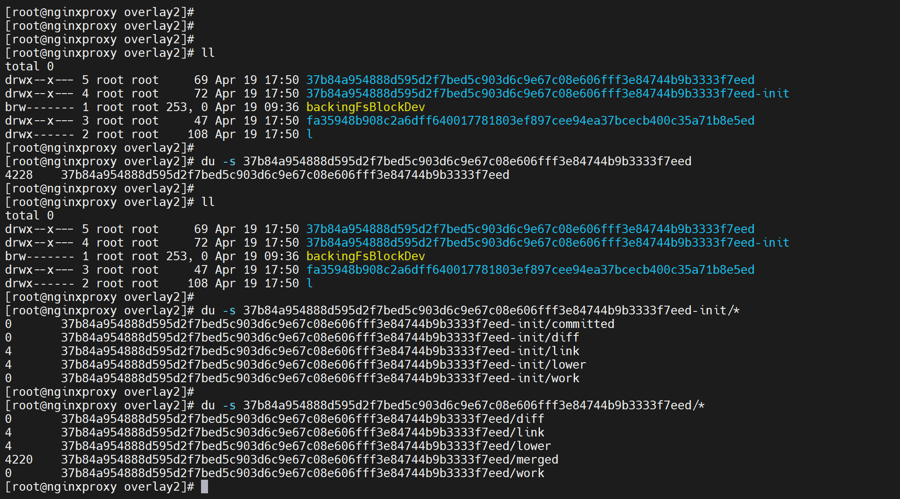

container = image + data ，容器起来就是复制了一份image这话没毛病，可能多个容器基于一个image存在共用，这个后面再测试，至少第一个容器看来就是多了merged4220KB，然后等于image的diff4220KB，也基本等于docker images 看到的image大小4.26MB=4260KB。

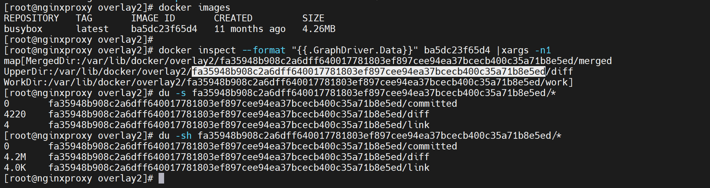

diff目录是和谁的diff不同，应该是容器起来后和image之间的不同。


然后再stop掉看看空间占用，stop掉merged目录就没了。

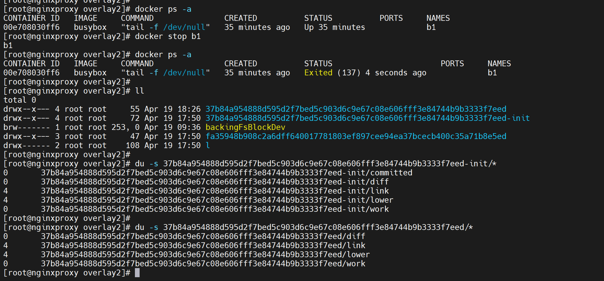


UnionFS到底是怎么个共用来着，给个效果看看啊，我自己看的也没看出来👇

container = image + data，就是复制一份image的。

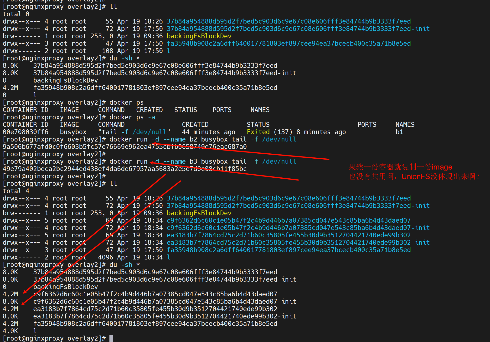

所谓UnionFS联合文件系统，这种复用的情况应该主要是image之间的联合复用，容器方面如图所见就是run一个就复制一份image了，在这个点上是不存在复用的。


### 容器的暂停vs停止


### kill 容器发送信号


**docker kill ID  # 停止容器**


**docker kill -s 1 ID   # 加载配置文件**

如何验证确实加载了配置文件呢--通过top查看比如nginx的work进程，因为加载配置文件master进程不会重启，但是worker进程会重启


类似nginx -s reload用法，nginx -s reload也等价于kill -1 $(pgrep nginx |head -1) 一般第一个就是nginx的master，kill -1就是等价于reload配置文件。httpd一样，这里的docker -s 1也是一样。


docker attach

exec进去再退出来，并不会导致容器退出


此时再复制一个窗口，一样可以exec -it进去，但是两个exec 进去的shell是独立的，

现在通过attach可以实现screen -x 的 两个人共享shell的效果


上图由于alpine是①没有退出-it进去的②且默认cli是/bin/sh，所以attach就成功挂上去了，然后窗口时一个tty，共享的试图。

四个窗口也是一样的，也就是复制4个窗口出来然后👇


attach用法
1、偷窥别人当前正在干什么，劝你耗子为汁

2、从安全考虑，怎么禁止别人进来，别run -it就行了，而是用start后，exec -it进去。


### 进入容器通过exec -it sh

一般是要跟一个cli的，exec 不一定都需要进去，直接执行一条cli就出来也行👇


bash一般可能没有，sh一般是有的

exec能够执行的cli都是容器里的有的，有什么用什么


这样就可以进入容器，进一步排查问题，没run是进不去的。所以docker run [-d] 能够up的都是容器里是前台cli挂着的，然后容器没有前台cli的都是run完就exited--也就是run不起来的，也就是没法exec -it sh进去的。  **# 简而言之，exec能进去的都是容器里有前台运行进程的**。


### 容器的端口问题

别人容器时一个nginx，80端口也是容器里的ip的80.


随便瞧瞧run的参数


容器里的IP出来都是走的SNAT，不是说172.17.0.2转成172.17.0.1的SNAT哦，而是容器里出来走的是物理网卡的IP的SNAT。


这个cli比较适合容器里查看本地IP👆

这个172.17.0.2，本地宿主机上是可以访问的，因为路由器是本地指向docker0的。


**暴露端口**

```shell 
docker run -P --name web01 -d nginx  # 将容器里所有的端口都暴露到宿主的随机端口
docker run -p 80 --name web03 -d nginx  # 仅将容器的80映射到宿主的随机端口
docker run -p 80:80 --name web02 -d nginx  # 仅将容器里的80映射到宿主的80
docker run -p 192.168.126.130:80:80 -d nginx # 宿主IP:宿主PORT:容器PORT
docker run -p 192.168.126.130::80 -d nginx # 宿主IP:随机端口:容器端口
docker run -p 192.168.126.130:8080:80/udp --name web03 -d nginx  # udp
docker run -p 8080:80/tcp -p 8443:443/tcp -p 53:53/udp -d --name nginx  #★多端口
```


---


小p指定，大P随机


测试就OK了


然后看日志


**docker port web01查看端口暴露**


**固定宿主的映射端口**，前提是外面的端口没有被占用，里面的端口你得知道

里面的端口inpsect可见

 

外面ss -tlnup 确认没被占用就行了


测试OK


```shell
docker run -p 3306:3306 -e MYSQL_ROOT_PASSWORD=123456 -e MYSQL_DATABASE=wordpress -e MYSQL_USER=wordpress -e MYSQL_PASSWORD=123456 --name mysql -d --restart=always mariadb:11.3.2
# -e 是传递变量进容器，前提也是容器里支持的变量可以传一些值才行。

docker run -d -p 8080:80 --name wordpress -v /data/wordpress:/var/www/html --restart=always wordpress:php8.2.apache

```

**启动db**


此时另一台机器就可以连了


账号也有了：


**启动wordpress的前端容器：**


所以此时页面走一波


关于数据库主机不能填默认的localhost，因为这是在容器里面，localhost指的是容器里面的本地，外面宿主也好，其他容器也好针对localhost看到的又是各自的本地。


可以写容器的ip，但是不好，因为该ip会变；所以要写宿主的IP和暴露出来的端口。

如果一不小心配成了容器里的ip


下图是配置了172.17.0.2后


返回重配未192.168.126.130发现不行，需要进入wordpress容器里删除对应的配置文件


这文件里的IP改改就行了，干脆直接删除这个文件，这个时候再重新去页面配置就可以了


这个细节：图中wordpress默认也是有一个灰色的，但是其实只是提示而已


这就OK了


### 容器如何修改监听暴露端口


直接进去改了


然后重启容器，尝试发送SIGHUP信号试图重载配置，但是未成功👇


restart -s 1也不行


进去刚才的配置文件发现端口没改过来，看来要先stop 容器再改了

再次尝试docker stop xxx，然后vim修改未90909，然后docker start xxx还是不行，需要停止docker引擎


尝试上图操作先停止docker，发现配置文件可以改过来了，但是由于容器时restart always了，还是不行，需要重启容器，下面cli可以实现不删除容器，修改暴露端口的需求

```shell
systemctl stop docker
systemctl stop docker.socket  # 这个不需要
docker stop xxx  # 这个不配：后面需要重启容器：配置的话：后面需要启动容器，哈哈哈~
vim /var/lib/docker/containers/xxx..xxxaad092/hostconfig.json  # 修改暴露端口
systemctl start docker  # 启动服务后，还得手动重启容器，否则容器之前没有停可能就保持了之前的状态信息然后
docker restart 9472a68122b9	  # 发现必须restart，容器跟随docker服务起来好像不行有点奇怪。不奇怪，因为之前没有停，直接被服务重启了
```


