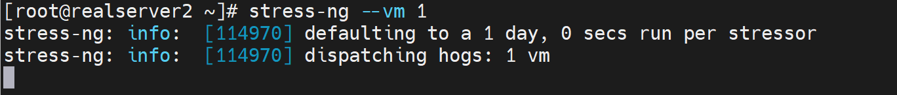
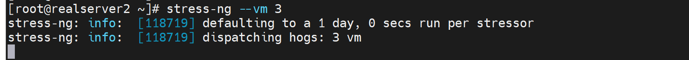
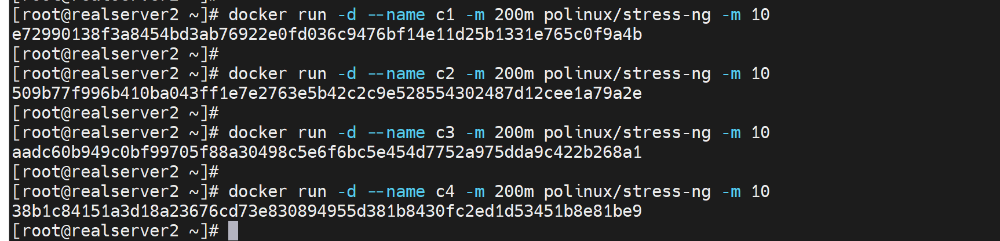

# 第1节 Docker基于Cgroup实现内存和CPU资源限制


# 传统限制手段PAM

PAM里的limit模块


可以控制某一个用户的资源使用

1、控制CPU运行时间  # cpu

2、控制使用的进程个数  # nproc

3、打开文件个数  # nofile

4、物理内存  # rss


# docker种的限制方式

java服务很可能会占用较大的资源

tomcat里梳理举例不做限制oom的情况

涉及堆内存


早期docker版本有一个swap开启的告警，现在没了

```shell
WARNING: No swap limit support  # 没有启用swap 限制功能会出现次提示报警，这是早期的docker才会
```


不过即使是老版本这个告警也没啥，不处理也没关系。仅仅是一个warning而已。


看一下oom_socre_adj的内容


虽然可以手动改，但是通过修改为-1000来实现进程保护--防止被杀掉，这种操作也是比较少见的。而且这个文件的存放路径是PID的，举例nginx的PID你每次启动的PID也是不同的，也就是说不是一个路径存放了的。实际操作也不是靠谱的。而且这只是防止这个PID被杀掉，并不是说限制资源的使用的角度出发的。

oom_adj就是oom_score_adj的老版本，并且自动兼容的一个文件，可以不用管


而oom_socre是系统给你算出来的值，不可调


# 压力测试Stress-ng

https://wiki.ubuntu.com/Kernel/Reference/stress-ng

安装也有docker版

https://hub.docker.com/r/polinux/stress-ng

可以用来判断docker是否限制住了某个容器应用的内存；或者看其是否会OOM。


yum 安装下 stress-ng -h查看


```shell
stress-ng --cpu 8 --iomix 4 --vm 2 --vm-bytes 128M --fork 4 --timeout 10s
# 开启进程，占8个cpu，占用4个io，开2个vm就是256*2=512MB内存，但是vm-bytes=128，所以还是256MB内存的占用，--fork就是开启子进程4个，timeout就是压力测试时间是10s。
```


测试下

### CPU

估计就是每个CPU做大量运算，比如加解密之类的计算


结果就是1颗CPU的占用


就是占用了4个CPU


#### 内存




内存就是看RSS物理内存就行，VIRT是进程跟OS申请的内存--虚拟内存，不是实际占用的RSS内存。


确实是256MB，但是CPU也是跟着占用了1颗了，差不多占用0.7的使用率


开3个vm就是256*3=768MB的内存占用，不过同样会消耗3个CPU



开3个vm就是256*3=768MB的内存占用，不过同样会消耗3个CPU


### 下面开始测试容器

测试是否能够做到docker限制资源的使用

思路：就是docker run 的时候 ①限制资源；②同时用stree-ng撑爆资源，③观察结果如果没有撑爆说明就限制住了。

```shell
docker pull polinux/stress-ng

# 一般关注的是CPU和内存的资源占用，以及磁盘IO

```


确实是512MB内存占用👆

也可以通过docker stats xxx来看，不过就是动态的


目前由于docker run 的时候没有限制内存的使用，所以上图👆LIMIT里显示的就是物理内存的最大值3.6GiB。


# docker 限制资源

**Docker可以强制执行硬性内存限制，即只允许容器使用给定的内存大小。**

**Docker也可以执行非硬性内存限制，即容器可以使用尽可能多的内存，除非内核检测主机上的内存不够用了。**

https://docs.docker.com/config/containers/resource_constraints/


-m 和 --oom-kill-disable 一起使用的场景就是：这个容器很重要不能被oom杀掉，所以自身限制内存使用的同时，也不要让别人杀掉自己。但是不能单独使用--oom-kill-disable这样会造成自己无节制的使用内存，然后把系统宿主的进程杀掉从而导致业务同样出问题。


swap就别研究了，k8s好像也不推荐使用swap的，swap这种就别用了。


​	


## 限制内存

```shell
docker rum --name c1 -m 100m polinux/stress-ng -m 2
# 限制内存100MB，但是容器里是开到了512MB
```


以前版本可能存在这么一个文件


这个值就是限制的内存的大小


## 限制CPU


--cpu period喝--cpu-quota都不用了。


### 测试1.分配CPU个数

```shell
docker run --rm --name c2 --cpus 1.5 polinux/stress-ng -c 2
# 压测开到2个cpu，但是限制--cpus指定为1.5
```


这样限制0.5个CPU，即使压测给到2个CPU，也不会涨上去。

而且这个0.5个CPU的占用不是说就盯着一个CPU干的，而是均摊到所有CPU上的


### 测试2-容器之间按比例分担CPU

```shell
docker run --rm --name c2 -c 1024 polinux/stress-ng -c 4
docker run --rm --name c3 -c 1024 polinux/stress-ng -c 4
# c2 c3两个容器都压测开到4个CPU，然后run的时候给到1024的值也就是1024/2048的占比使用
```


然后输入docker stats看所有的容器的占用情况


再开个容器同样也是1024的占比


此时差不多300%的占比就变成均分了


再开一个2048占比


此时2048就占了一般，其他两个1024就各占剩下一半的一半


比例是一目了然的，但是压测-c 4 明明是4个CPU，但是实际是3个CPU的使用情况--从第一张图上可见不超过300%其实。


### 测试3-CPU绑定


查看CPU绑定关系

```shell
ps axo pid,cmd,psr
```

开了三个压测，发现CPU没有固定在某一颗上，是会飘的


为什么明明开了3个压测容器，为什么这么多个，因为是父子进程


父进程确实就是3个，没错👆


```shell
docker run -d --name c1 --cpuset-cpus 3 -c 1024 polinux/stress-ng -c 4
# 绑定到第四块CPU上
```


下图选中的父子进程是多出来的，也就是c1压测容器的进程👇


这些就固定绑定到3号CPU了


一般限制也就是上面几个资源

内存、cpu的各种参数

```shell
docker run --cpuset-cpus 3 -c 1024 --cpus 1.5 -m 100m
# cpu绑定、cpu分配比例、cpu分配个数，内存
```


# 超分超卖

## cpu可以

然后CPU是可以多个容器绑一颗的，属于可压缩资源


## 内存不行

### 第一种oom-宿主卡爆

内存超分就会产生oom咯


docker stats 观察如果oom就会


此时宿主ssh操作就会卡顿


### 第二种oom-宿主没事

人工计算好了再分配，此时宿主不会卡，但是容器里受限，一样会有oom




这种分配没问题，但是也要知道stress-ng -m 10就是256\*10\*4=10G的内存压下去了，但是你有限制了 200m\*4=800m的内存才，所以stress-ng这个容器里会认为oom了

所以在console控制台里同样会看到oom-kill的


但是容器日志里是看不到的


还是人为限定就可以了


这样就stress-ng容器压测也不会有oom了


# 工作案例

## 1、自有机房入伏前一个月

最好准备好空调故障应急措施

①是否在保

②在保内的维修、投诉电话、上门点在哪、维修师傅电话、厂家调货流程周期--以为配件调货AUX是师傅直接联系厂家，总台都看不到的

③第三方上门30块起步，KFR-120W这一个压缩机主控板就要1000多，一天给你修好但是费用要1600大洋。


④基于维护等待配件的漫长时间里，机房温度过高如何处理

​		小机房，先上5 6 个电风扇(这招其实真不错，对着机柜吹就能降10度)，但是电风扇直吹的区域，周围会被吹出来的热气导致气温上去，大概上去个3度。(￣▽￣)"

​		然后L3的空调可以关掉了，开也行，就是开30分钟就必须关掉否则就开始吹热风了，温度比室内环境还高！

​		买些冰块放机房里吧

​		打开机房门，用空调导风管，将大厅里的空调风导进机房里。


## 2、抱脸模型下载

1、首先你的能够从浏览器直接下载


2、然后复制连接到迅雷，这样就可以利用迅雷从最佳的源下载了，速度噶快


3、对比哈希值，防止被种码


## 3、谷歌企业邮箱

workspace里的第二档收费才支持群发的功能，同样支持群发单显


1、首先你的有一个域名，推荐godaddy

2、然后就大致按如下走一遍就行了，结合下一步操作操作

https://gnfob.com/google-email/

3、邮件的跟踪，比如收件人的已读于否，是要插件来支持的。


