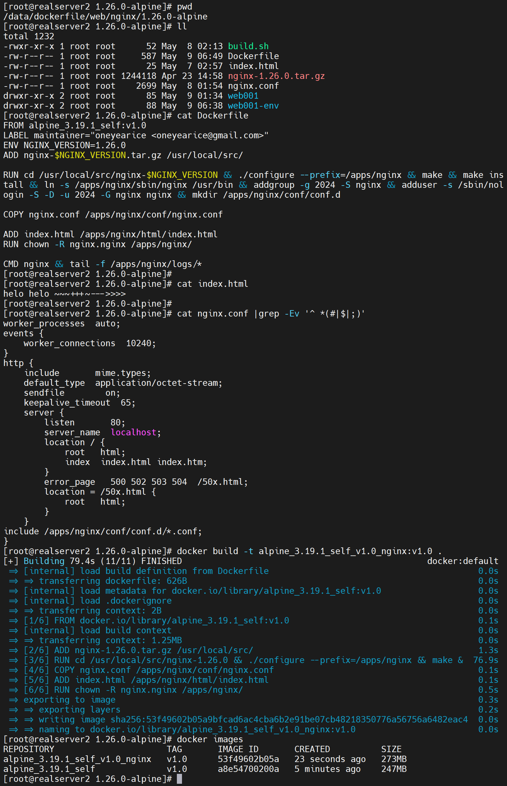
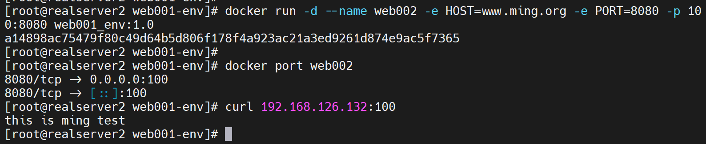
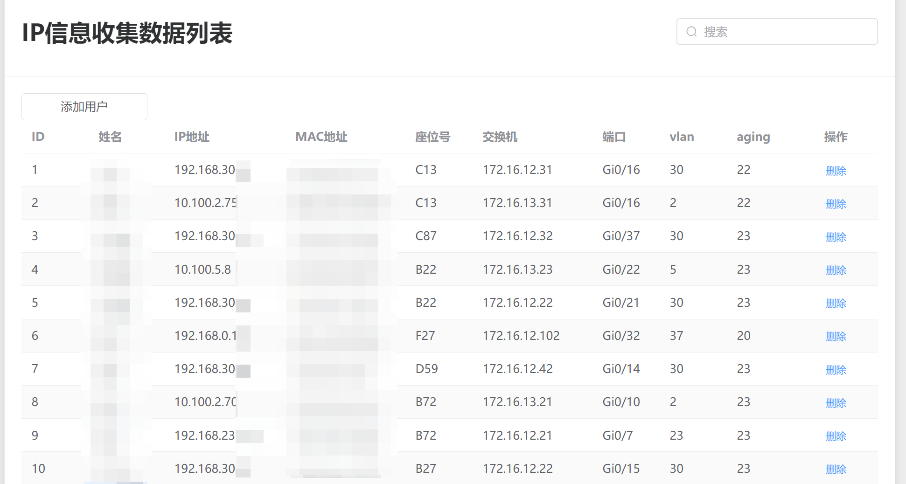

# 第2节 Dockerfile常见指令用法


# 动态化处理


但是安图配置后👆还是不行，换一个方法

①环境变量里预先定义

②使用envsubst来替换


然后再编写到Dockerfile里就行了


1、删除所有镜像和容器，重新构建

```shell
docker rm -f `docker ps -qa`
docker system prune -a
```


2、构建base os：构建alpine自定义镜像


3、构建app 镜像 




4、构建app 带传递环境变量的镜像


搞定


换个PORT端口传递进去



ok，nginx的端口和HOST自定义就搞定了👆。


注意事项：

1、使用-e传递参数进容器，不是在build阶段，而是在run阶段，所以想要用这个变量，Dockerfile里要是用CMD指令而不是RUN。

2、然后测试的时候不要 -it sh进去看效果，因为会替代CMD导致Dockerile的CMD不执行了。

3、因为父镜像里有CMD，你子镜像也要用CMD，用屁股想也是要最后一个CMD生效的，不可能多个CMD生效的，否则就不存在-it sh替代一说了，所以要写全，比如nginx -g 'daemon off;'

4、nginx 配置文件里可以写变量，但是nginx自身是不认环境变量的，即使主配文件的main块里写env也不会生效-实验结果就是不生效，虽然官方有这个指令说明。

5、使用第三方插件的gettext包里的envsubst命令来替换就行了。

6、上面的Dockerile里的apk 安装需要改成RUN apk add --no-cache gettext ，实现安装后删除安装包的效果。


进一步思考


上图理解：

首先一般来讲nginx.conf里是不配置server块的，所有子配置文件都放在一起，然后系会展开合并在一起去判断，先按ip和端口、再按server_name，如果两个一样，再按子文件的命名顺序，比如a.conf的www.mimng.org优于b.conf的www.ming.org。

1、nginx的转发优先级：ip+port优先，如果一样，就看server_name，server_name里再细分

2、curl的时候使用ip+port，就会从上往下查找配置文件

3、理解1和2参考👇


好了实现就行了，继续看视频吧。


# Dockerfile镜像制作和使用流程


# 工作案例分享-ip和座位号track


# 1、背景

员工IP动态获取，存在变动性，
员工座位也是经常换，存在变动的，
如何知道该员工当前准确的IP是什么，座位在哪里？


# 2、需求

需要实现ip以及座位的自动校准


# 3、思路

用户的电脑的MAC是固定的，基于该MAC每天动态的获取最新IP就行了
交换机接口和座位号的对应关系是固定的，基于该MAC在哪个接口下就知道了该员工的座位号了


# 4、落地

首先需要收集所有员工姓名和MAC的清单：如何实现很多人的信息一键收集呢？
其次有一个基于MAC快速获取IP的接口：如何编写基于mac信息获取ip及座位号的接口？

所以：

​	你需要有一个web前端，让用户填写姓名、座位号，并且适当的做一下限制防止有人乱写。
通过http的字段获取报文里的IP信息，根据IP找到此人的MAC、找到交换机的端口。
​	然后将user和mac入库形成user_mac表，将seat、sw port 入库形成seat_sw_port表。
​	然后每天或者每15分钟都行，根据mac找到当前的IP，根据mac找到所在的sw port，然后遍历seat_sw_port库，找到所在的seat，这样就得到了一个完整的记录user、ip、mac、seat、sw、port
​	当然这一条记录也要加上aging老化时间，这样当该员工离职后，就会有一个自动删除记录的机制。


# 5、具体的实现步骤


# 信息的收集

web前端的细节本文不涉及，我也不太会，请别人写的，这里说明下具体注意点
1、页面长这样


2、为了防止别人乱填，做以下限制

首先当用户填写姓名和座位号的时候，就会在服务器那头收集三个信息分别是：姓名、座位号、IP地址这三个，并入库**infocollection**


限制如下：

①座位号格式必须是你希望的格式，是你们公司规范化后的格式，比如'\[a-bA-B\]\[0-9\]{2}'这么一个规范。

②如果姓名和IP已存在，则覆盖原来的记录，给用户纠错的空间

③如果姓名和座位号已存在，则弹出窗口 "该座位号已绑定，请联系管理员"


3、以上就收集到了很多员工的三个信息

name \ seat \ ip


下面就是针对 这三个信息的处理


# 信息的处理

然后就根据当前的ip找到两个信息

①mac地址及其②所在的交换机的端口

**\>>** 此时就需要写一个脚本来实现基于mac、ip、交换机的端口的信息查询。

这里提供了我的三个脚本，按序执行

```shell
python3 /pycharm_project_418/switch/getData/getMAC/ssh_netmiko_get_mac.py
python3 /pycharm_project_418/switch/getData/getArp/ssh_netmiko_get_arp.py
python3 /pycharm_project_418/switch/pickInfo/ipMacPort/client_ip_cam.py
```

这里可能还涉及早期写的execl表格处理，不用管


## 下面是对三个脚本的解释说明


### ssh_netmiko_get_mac.py说明

​	该脚本是用来获取各个厂商的交换机的mac地址表

```python
#!/usr/bin/python3.6
# -*- coding=utf-8 -*-

import sys
sys.path.append("/pycharm_project_418/")

from netmiko import ConnectHandler
import time
import os
import yaml
from pprint import pprint
from multiprocessing.pool import ThreadPool
from multiprocessing import Pool as ProcessPool
from datetime import datetime


def ssh_singlecmd_netmiko(sw, cmd):
    # net_connect = ConnectHandler(device_type='cisco_ios',host='IP地址',username='用户名',password='密码')

    net_connect = ConnectHandler(**sw)
    # current_view = net_connect.find_prompt()

    net_connect.enable()  # 进入CISCO或H3C的特权模式，针对H3C可能不灵，但目前是好的。

    # 执行命令，返回结果为字符串，赋值给output
    result = net_connect.send_command(cmd)
    # if "confirm" in output:
    #     output += net_connect.send_command_timing(
    #         "\n", strip_prompt=False, strip_command=False
    #     )

    net_connect.disconnect()
    
    fileName = f'{sw["ip"]}'
    os.chdir("/switch/mac_port")
    save = open(fileName, 'w')
    save.write(result)


def get_mac():
    ######################
    # 将yaml文件转成字典 #
    ####################
    os.chdir("/pycharm_project_418/switch")
    currentpwd = os.getcwd()
    print(currentpwd)

    with open('swList.yml') as f:
        swInfoList = yaml.load(f, Loader=yaml.Loader)  # 将yaml文件转成数组，里面是字典，每个字典是一个sw

    # 去掉核心交换机172.16.13.254,不要在这里去了，第一步就是大而全，其中处理，后面在过滤吧。

    # pool = ThreadPool()
    pool = ProcessPool()
    ip_port_error_list = []  # 最终结果
    # 格式化为netmiko需要的几个字段
    for swInfo in swInfoList:
        # pprint(swInfo)
        swInfo.pop('community')
        swInfo.pop('location')
        pprint(swInfo['ip'])
        # pprint(swInfo)

        if 'cisco' in swInfo['device_type']:
            print(swInfo['device_type'])
            try:
                x = pool.apply_async(ssh_singlecmd_netmiko, args=(swInfo, 'show mac address', ))

            # 这里的pass仅仅是防止出错导致程序无法运行，在函数里面的try才是有实际意义的异常处理
            except BaseException as e:
                print(e)

        elif 'hp_comware' in swInfo['device_type']:
            print(swInfo['device_type'])
            try:
                x = pool.apply_async(ssh_singlecmd_netmiko, args=(swInfo, 'disp mac-address',))

            # 这里的pass仅仅是防止出错导致程序无法运行，在函数里面的try才是有实际意义的异常处理
            except BaseException as e:
                print(e)

        elif 'ruijie_os' in swInfo['device_type']:
            print(swInfo['device_type'])
            try:
                x = pool.apply_async(ssh_singlecmd_netmiko, args=(swInfo, 'show mac',))

            # 这里的pass仅仅是防止出错导致程序无法运行，在函数里面的try才是有实际意义的异常处理
            except BaseException as e:
                print(e)

    pool.close()
    pool.join()


if __name__ == '__main__':
    get_mac()
```

```python
###############################
## 外网核心交换机和外网楼层交换机  #
###############################
- ip:           '192.168.11.1'
  device_type : 'hp_comware'
  username:     'xxxx'
  password:     'xxxxx'
  secret:       ''
  community:    'snmp@xxx'
  location:     '-1F机房'

- ip:          '172.16.12.1'
  device_type:  'cisco_ios'
  username:    'xxx'
  password:    'xxx'
  secret:      'xxx'
  community:   'office@xxx'
  location:    '-1F机房'

- ip:          '172.16.13.1'
  device_type: 'ruijie_os'
  username:    'xxx'
  password:    'xx'
  secret:      'xxxx'
  community:   ''
  location:    '-1F机房'

```


### ssh_netmiko_get_arp.py说明

用来收集内外网GW上的信息

```python
#!/usr/bin/python3.6
# -*- coding=utf-8 -*-
import sys
sys.path.append("/pycharm_project_418/")

from netmiko import ConnectHandler
import time
import os
import yaml
from pprint import pprint
from multiprocessing.pool import ThreadPool
from multiprocessing import Pool as ProcessPool
from datetime import datetime


def ssh_singlecmd_netmiko(sw, cmd):
    # net_connect = ConnectHandler(device_type='cisco_ios',host='IP地址',username='用户名',password='密码')

    net_connect = ConnectHandler(**sw)
    # current_view = net_connect.find_prompt()
    # print(current_view)  # 显示当前所在试图一般为用户模式
    net_connect.enable()  # 进入CISCO或H3C的特权模式，针对H3C可能不灵，但目前是好的。
    # current_view = net_connect.find_prompt()
    # print(current_view)  # 显示当前所在试图一般为用户模式

    # 执行命令，返回结果为字符串，赋值给output
    result = net_connect.send_command(cmd)
    # if "confirm" in output:
    #     output += net_connect.send_command_timing(
    #         "\n", strip_prompt=False, strip_command=False
    #     )

    net_connect.disconnect()
    # print(result)

    timeNow = datetime.now().strftime("%Y-%m-%d")  # 不要时间了，直接IP命名
    fileName = f'{sw["ip"]}'
    os.chdir("/switch/arp")
    save = open(fileName, 'w')
    save.write(result)


def get_arp():
    ######################
    # 将yaml文件转成字典 #
    ####################
    os.chdir("/pycharm_project_418/switch")
    currentpwd = os.getcwd()
    print(currentpwd)
    #
    with open('gw.yml') as f:
        gwList = yaml.load(f, Loader=yaml.Loader)  # 将yaml文件转成数组，里面是字典，每个字典是一个sw
    # pprint(gwList)

    # pool = ThreadPool()
    pool = ProcessPool()
    ip_port_error_list = []  # 最终结果
    # 格式化为netmiko需要的几个字段
    for gwInfo in gwList:
        # pprint(swInfo)
        gwInfo.pop('community')
        gwInfo.pop('location')
        pprint(gwInfo['ip'])
        # pprint(gwInfo)

        if 'juniper' in gwInfo['device_type']:
            print(gwInfo['device_type'])
            try:
                x = pool.apply_async(ssh_singlecmd_netmiko, args=(gwInfo, 'get arp',))

            # 这里的pass仅仅是防止出错导致程序无法运行，在函数里面的try才是有实际意义的异常处理
            except BaseException as e:
                print(e)

        elif 'hp_comware' in gwInfo['device_type']:
            print(gwInfo['device_type'])
            try:
                x = pool.apply_async(ssh_singlecmd_netmiko, args=(gwInfo, 'disp arp',))

            # 这里的pass仅仅是防止出错导致程序无法运行，在函数里面的try才是有实际意义的异常处理
            except BaseException as e:
                print(e)

        elif 'cisco_ios' in gwInfo['device_type']:
            print(gwInfo['device_type'])
            try:
                x = pool.apply_async(ssh_singlecmd_netmiko, args=(gwInfo, 'show arp',))

            # 这里的pass仅仅是防止出错导致程序无法运行，在函数里面的try才是有实际意义的异常处理
            except BaseException as e:
                print(e)

        elif 'ruijie_os' in gwInfo['device_type']:
            print(gwInfo['device_type'])
            try:
                x = pool.apply_async(ssh_singlecmd_netmiko, args=(gwInfo, 'show arp',))

            # 这里的pass仅仅是防止出错导致程序无法运行，在函数里面的try才是有实际意义的异常处理
            except BaseException as e:
                print(e)

    pool.close()
    pool.join()

if __name__ == '__main__':
    # 做成函数是为了将来在页面做成按钮，实现动态实时获取，现在每天写到文件，后面再弄DB之类的。
    get_arp()
```

```python
############
## 外网GW #
#########
- ip:           '192.168.11.1'
  device_type : 'hp_comware'
  username:     'xxxx'
  password:     'xxxx'
  secret:       ''
  community:    'snmp@xxxx'
  location:     '-1F机房'

- ip:          '172.16.12.1'
  device_type:  'cisco_ios'
  username:    'xxxx'
  password:    'xxxx'
  secret:      'xxxx'
  community:   'xxx@xxxx'
  location:    '-1F机房'

############
## 内网gw #
#########
- ip:          '2.0.1.2'
  device_type: 'juniper'
  username:    'xxxx'
  password:    'xxxx'
  secret:      ''
  community:   ''
  location:    '-1F机房'

- ip:          '172.16.13.1'
  device_type: 'ruijie_os'
  username:    'xxxx'
  password:    'xxxx'
  secret:      'xxxx'
  community:   ''
  location:    '-1F机房'


```


### client_ip_cam.py说明


先说明一个前置脚本**swIp_mac_port.py**

```
#!/usr/bin/python3.6
# -*- coding=utf-8 -*-
import sys
sys.path.append("/pycharm_project_418/")

from netmiko import ConnectHandler
import time
import os
import yaml
from pprint import pprint
from multiprocessing.pool import ThreadPool
from multiprocessing import Pool as ProcessPool
from datetime import datetime
import re
import os


def sw_ip_mac_port():
    # 从pyConsole的/swith/提取arp和mac文件，该文件是每天一份18点15出
    os.chdir('/switch/mac_port')
    # 去掉外网核心、内网核心、楼栋互联的100和101不统计这些非接入PC的交换机
    with os.popen('ls  |grep -Ev "192.168.|172.16.13.254|172.16.12.100|172.16.12.101"', 'r') as p:
    # with os.popen('ls  |grep -Ev "172.16.13.254"', 'r') as p:
        info = p.read().strip()
    # print(info)

    # 格式化cam表，去掉无用的，做成字典
    swS_ip_cam = {}
    thisSw_vlan_mac_port = {}
    for i in info.split('\n'):  # 一个代表一个sw
        if i:  # 因为上面做了p.read().strip()，所以这里算是多余的吧。一般不会出现i是None了。
            sw_ip = i.split('_')[0]
            # print(sw_ip)
            # with os.popen(f'cat {i} |grep  -i DYNAMIC', 'r') as a:  # 端口开启了mac-security后client的mac就是static了，此处需要优化
            with os.popen(f'cat {i} |grep -Ei "dynamic|static|Learned" |grep -Evi "cpu"', 'r') as a:
                # cam = a.read().replace('DYNAMIC', '')
                cam = re.sub(r'(?i)dynamic', '', a.read()).strip()  # (?i)这是正则的写法忽略大小写的意思
                cam = re.sub(r'(?i)static', '', cam).strip()
                cam = re.sub(r'(?i)learned', '', cam).strip()
                cam = re.sub(r'(?i)aging', '', cam).strip()

            # cam表格去掉无用的
            # print(cam)

            thisSw_vlan_mac_port = {}
            unit_info = {
            }

            count = 1
            for m in cam.split("\n"):
                z = m.split()
                # print(z)
                try:

                    if len(z[2:]) > 1:
                        port = z[2] + z[3]
                    else:
                        port = z[2]

                    if sw_ip == '192.168.11.1':
                        unit_info = {
                            count: {
                                'vlan': z[1],
                                'mac': z[0],
                                'port': port,  # 这个可不能顶层赋值了啊，我的好习惯变成坏事了。或者顶层附一个else的值，再取消else，无语。
                            }
                        }

                    else:
                        unit_info = {
                            count: {
                                'vlan': z[0],
                                'mac': z[1],
                                'port': port,  # 这个可不能顶层赋值了啊，我的好习惯变成坏事了。或者顶层附一个else的值，再取消else，无语。
                            }
                        }


                    thisSw_vlan_mac_port.update(unit_info.copy())
                    count += 1
                except BaseException as e:
                    print(sw_ip, e, '十有八九是cam表没取到')


            # pprint(thisSw_vlan_mac_port)
            thisSw_vlan_mac_port = {
                sw_ip: thisSw_vlan_mac_port.copy()
            }
            # pprint(thisSw_vlan_mac_port)

        swS_ip_cam.update(thisSw_vlan_mac_port.copy())
    # print('===========================')
    # pprint(swS_ip_cam)
    return swS_ip_cam

# 到此就得到了每台sw的cam表，但是注意没有去掉上行口信息，下面就开始去掉上行口信息。

# 首先得获得每台得上行口,思路来了，每个字典里去掉上行信息，这个需要配合arp表，即去掉网关IP的mac对应的端口，这个端口出来后，所有从这个端口学到的mac都删掉，就得到干净的CAM表。
# 所有真就不应该在mac初始环境去处理，不好，原则是尽量少的登入SW。

# 下面转到clientIP_mac_port模块


if __name__ == '__main__':
    z = sw_ip_mac_port()
    pprint(z)
```

输入的样子如下👇


下面就是最后一个脚本**client_ip_cam.py**

```python
# -*- coding=utf-8 -*-

import sys
sys.path.append("/pycharm_project_418/")

import time
import os
import json
import yaml
from pprint import pprint
from multiprocessing.pool import ThreadPool
from multiprocessing import Pool as ProcessPool
from datetime import datetime
import re
from switch.pickInfo.ipMacPort.swIp_mac_port import sw_ip_mac_port
from openpyxl import load_workbook

os.chdir('/switch/arp')
with os.popen('ls', 'r') as p:
    file_name = p.read()

client_mac_ip = {}
for i in file_name.split("\n"):
    if i:
        gw_info = i.split("_")[0]

        grepFilter = 'grep -E "[0-9]{1,3}\." '
        with os.popen(f'cat {i} | {grepFilter}', 'r') as r:
            context = r.read()
        # print(context)
        for m in context.strip().split("\n"):
            # print(m)
            if m:
                client_ip = m.strip().split()[0]
                client_mac = m.strip().split()[1]
                client_vlan_actual = m.strip().split()[2]
                client_aging = m.strip().split()[4]  # 这里面要赛选出一个mac多个ip的条目，并取出aging大的那一条
                if 'eth' in client_vlan_actual:
                    client_vlan_actual = client_ip.split('.')[-2]
                    client_aging = m.strip().split()[5]
                if client_mac in client_mac_ip:
                    if int(client_aging) > int(client_mac_ip[client_mac][-1]):
                        # 如果aging最大，也就是最新就覆盖之前的mac ip vlan
                        # print(client_mac, client_ip,client_vlan_actual,client_aging)
                        # print(client_mac, client_mac_ip[client_mac])
                        client_mac_ip[client_mac] = [client_ip, client_vlan_actual, client_aging].copy()
                else:
                    client_mac_ip[client_mac] = [client_ip, client_vlan_actual, client_aging].copy()  # 这里补上arp里的vlan才是对的

# pprint(client_mac_ip)
'''
生成client_ip_mac[client_ip] = [client_mac, client_vlan_actual].copy()  # 这里补上arp里的vlan才是对的
'''
client_ip_mac = {}
for k, v in client_mac_ip.items():
    client_ip_mac[v[0]] = [k, v[1]]

# pprint(client_ip_mac)
# exit()
'''
得到用户ip和mac信息
'''
# pprint(client_ip_mac)

# 第一步找到client们的网关的MAC
dev_net_sw_mgmt_gw = '172.16.13.253'  # 内网交换机的管理段网关
official_net_sw_mgmt_gw = '172.16.12.254'  # 外网交换机的管理段网关

os.chdir('/switch/arp')

# 找了两个接入sw用来查看GW的MAC
access_sw_for_find_dev_net_sw_mgmt_gw = '172.16.13.1'
access_sw_for_find_official_net_sw_mgmt_gw = '172.16.12.1'

with os.popen(f'cat {access_sw_for_find_dev_net_sw_mgmt_gw} |grep {dev_net_sw_mgmt_gw}', 'r') as p:
    z = p.read()
    dev_net_sw_mgmt_gw_mac = re.findall('([0-9a-f]{4}\.[0-9a-f]{4}\.[0-9a-f]{4})', z)[0]
# print(z)
# print(dev_net_sw_mgmt_gw_mac)

with os.popen(f'cat {access_sw_for_find_official_net_sw_mgmt_gw} |grep {official_net_sw_mgmt_gw}', 'r') as p:
    z = p.read()
    official_net_sw_mgmt_gw_mac = re.findall('([0-9a-f]{4}\.[0-9a-f]{4}\.[0-9a-f]{4})', z)[0]
# print(z)
# print(official_net_sw_mgmt_gw_mac)

# 第二步根据网关MAC，找到各个sw的cam表的什么呢？找到该MAC对应的端口即为上行口，去掉所有该口学到的MAC，就得到了用户MAC。
sw_mgmt_gw_mac_list = [dev_net_sw_mgmt_gw_mac,official_net_sw_mgmt_gw_mac]

'''
这就得到交换机上行口的获取方法（交换机管理IP的网关的MAC，必然是从上行口学来的。）
'''
# print(sw_mgmt_gw_mac_list)


swS_ip_cam = sw_ip_mac_port()  # 这里调用了会改变PWD，要注意下
# pprint(swS_ip_cam)


sw_upLink_port = {}
for k, v in swS_ip_cam.items():
    # print(v)
    upLink_port_list = []
    for m, n in v.items():
        # print(n)
        if n['mac'] in sw_mgmt_gw_mac_list:
            # print(k, n)
            upLink_port_list.append(n['port'])
            # print(upLink_port_list)

    upLink_port_list.sort()
    upLink_port_list = list(set(upLink_port_list))

    sw_upLink_port[k] = upLink_port_list

'''
得到了交换机的上行口
'''
# pprint(sw_upLink_port)


# 将所有swS_ip_cam中涉及上行口的信息单元删除
swS_ip_cam_copy = swS_ip_cam.copy()
del_list = []
for k, v in swS_ip_cam.items():
    for m, n in v.items():
        if n['port'] in sw_upLink_port[k]:
            # print(n['port'])
            # print(k, m)
            del_list.append((k, m))
            # swS_ip_cam_copy[k].pop(m)  # 遍历字典不能删除自己或别人操作，就是遍历的时候不能有这种动作
            # pprint(swS_ip_cam[k])
# print(del_list)

for i in del_list:
    swS_ip_cam_copy[i[0]].pop(i[1])
# pprint(swS_ip_cam_copy)

'''
这个得到了所有下行口的mac，也就是用户mac
'''
swS_ip_downlink_cam_copy = swS_ip_cam_copy.copy()


# pprint(swS_ip_downlink_cam_copy)

client_ip_mac_sw_port_vlan_list = []
for client_ip, mac_vlan in client_ip_mac.items():
    # print(v['mac'],mac)
    # 在比较arp里的mac和cam里的mac之前，先做mac的格式化
    arp_mac = re.sub('[\.\-\:]', '', mac_vlan[0]).lower()
    actual_vlan = mac_vlan[1]
    # print(cam_mac, arp_mac)
    client_ip_mac_sw_port_vlan = {}  # 每次for循环都需要一个空的字典初始化一下。

    for sw, info in swS_ip_downlink_cam_copy.items():
        for seq, v in info.items():
            cam_mac = re.sub('[\.\-\:]', '', v['mac']).lower()
            # print(v)
            if cam_mac == arp_mac:
                cam_mac_format = cam_mac[0:4] + '.' + cam_mac[4:8] + '.' + cam_mac[8:12]
                # print(client_ip,mac,sw,v['port'],v['vlan'])
                client_ip_mac_sw_port_vlan["client"] = client_ip
                client_ip_mac_sw_port_vlan["mac"] = cam_mac_format
                client_ip_mac_sw_port_vlan["sw"] = sw
                client_ip_mac_sw_port_vlan["port"] = v['port']
                # client_ip_mac_sw_port_vlan["vlan"] = v['vlan']  # 存在一个mac 多个vlan 比如不同wifi等
                client_ip_mac_sw_port_vlan["vlan"] = actual_vlan

                client_ip_mac_sw_port_vlan_list.append(client_ip_mac_sw_port_vlan.copy())


# pprint(client_ip_mac_sw_port_vlan_list)
pprint(len(client_ip_mac_sw_port_vlan_list))


todayis = datetime.now().strftime("%F")
# 将client_ip_mac_sw_port_vlan_seat_list写道文件中，后期写道库中，前端调用
with open(f'/root/yuan_gong/log/yuangong_ip_zuowei_{todayis}.json', 'w', encoding='utf-8') as z:
    json.dump(client_ip_mac_sw_port_vlan_list, z, ensure_ascii=False)


if __name__ == '__main__':
    pass
```

综上所述：

python3 /pycharm_project_418/switch/getData/getMAC/ssh_netmiko_get_mac.py
python3 /pycharm_project_418/switch/getData/getArp/ssh_netmiko_get_arp.py
python3 /pycharm_project_418/switch/pickInfo/ipMacPort/client_ip_cam.py

三个脚本跑一遍就会得到当前的用户ip、mac、sw、port、vlan的信息

如下图👇


此时就有了   上文开头处提到的  "  **\>>** 此时就需要写一个脚本来实现基于mac、ip、交换机的端口的信息查询。"   这么一个脚本

那么基于web页面收集上来的username、seat、ip就可以利用上面的结果进行查询了


当前材料：infocollection表有了、查询ip mac 端口信息的json文件也有了。


还需要再写两个脚本：

1、将**infocollection**表的信息通过上面的json文件进行查找，得到这么一个信息，并落库👇


2、然后将user_mac拆出来落入user_mac表；也将seat sw port落入seat_sw_port表


3、从infocollection得到user_mac和seat_sw_port两个固定信息表 的这么一个动作一定不能持续执行，一般5天完成批量众人信息的收集后就要停止该动作了。

4、最后就是基于user_mac，去查ip，去查端口，然后利用端口去索引seat_sw_port得到seat座位号。于是就有了最终的一个结果👇


上图生成的脚本就是每天都要运行一次的了，来保证ip变了，座位变了都能及时发现。


最终呈现的效果如下👇




最后，再具体的详细讲解，我会放到我的课程里去细聊。

