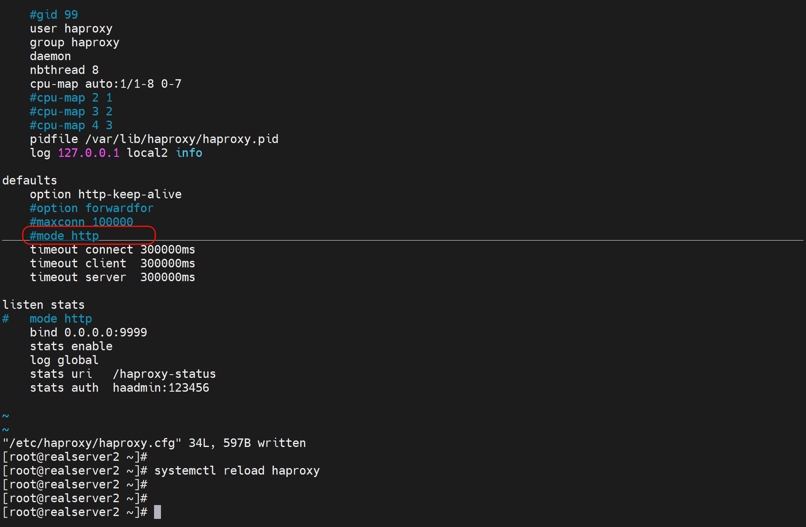
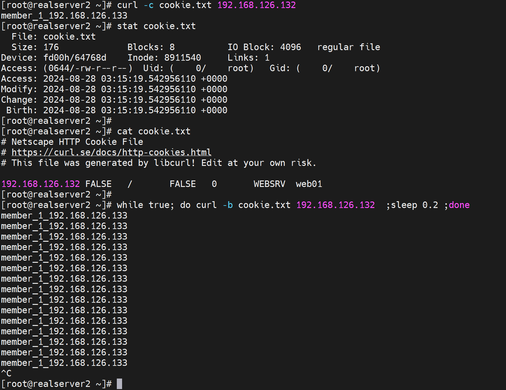

# 5.Haproxy动态其它调度算法和状态页


# 动态算法

### roundbin算法

默认的调度算法


### leastconn算法

类似LVS的WLC算法


### random算法


# 其他算法：


# source算法


### source : map-base取模法

这是source下的默认的算法(也就是配置了balance source，hash-type不配置也是map-based了)，反而不好


不能修改权重的，所以不能通过sockt修改👆，而下面的一致性哈希算法 是动态的，就可以修改weight值。


图中A就是源IP地址👆


​		但是随着后端服务器的增减，权重就会增减，会导致map-base取模的结果就不一样了，比如 上图 两台后端服务的权重是1和2，当前调度是hash(SRC_IP) 对3  取模，也就是0 1 2 三个结果，0就调度到后端服务器1，1 2 就调度到后端服务器2上去，如果新增一台服务器且权重是2，那么就是对5取模，结果就是 原来hash(SRC_IP) 对3 取模的结果比如是0，现在可能不再是0可能是3 那么对其调度就变了，而且此时整体调度都会发送变化，会话保持就保持不住了。 

​		这里可以联系nginx的一致性哈希算法调度，是一回事。不管是分布式站点的调度，还是缓存穿透的防止都是一回事，都是用$request_uri consistent来解决的。


### source :  一致性哈希


这是动态算法，就可以通过sockt修改权重了👇


### 测试source 一致性哈希算法调度

开始源ip不同，没有测出来还


再换别的IP来测


然后就出来了👇--不同的IP不一定调度到不同的服务器上，但是很多不同的IP一定可以得到效果，源IP 经过hash后再对 后端服务器的权重之后 取模，然后再调度，大概要了解成这样吧。


# uri算法

只支持HTTP协议，不支持TCP，想来也是uri就是http报文里的内容了。TCP协议通常就是TCP头部去掉看TCP的DATA自然是看不到uri也就是链接文件目录的。


同样对于uri一样有一致性哈希算法调度。

就是uri访问的固定，就会调度到那一台服务器，也就和source 一致性哈希算法调赴 一样实现了 会话保持，或者叫缓存利用，或者叫防止缓存穿透，或者叫分布式站点的会话保持。

### uri取模算法配置


### uri一致性hash算法配置


### 测试uri一致性哈希算法调度


然后换一个uri 去curl


这就实现了不同uri，调度的效果，当然同src调度一样，不同的uri不一定就调度到不同的后端节点，但是大量的不同的uri一定会调度开来的。底层逻辑就是个2^32的环👇


再测试下

两个后端节点做10个页面出来


调度就是基于uri的了，


大家都是一样，只有第一个uri调度到134上，因为都是基于uri了，不管什么源IP都一样了。


也奇怪的，不过随意了

<font color=red>不对，uri要改成mode http来着，我没改！</font>改之

没关系，我有default就是mode http，所以上面实验没有体现，但是实际也是http的，在主配置文件里设置了


正好去掉这个mode观察下

此时调度虽然写的是


但是由于uri必须是mode http，所以不会生效，就又变成了默认的roundbin算法了👇


# url_param算法


uri里一般是一个xxx.php后面跟一个问好?key=value就好比sql语句里的where key=value查询一样

同理uri的东西肯定是要mode http的

### url_param取模算法配置


这个userid就是uri里的key=value的那个key

如果key的值也就是value一样，那么调度到同一台机器，如果key的值不一样，那么调度到别的机器--当然可能还是同一台，但是key的量起来就能分开来了。底层还是hash(value)取模权重。

### url_param一致性hash算法配置


上图userid就是key，不过可以是其他的key咯，总之你页面里？问号 问的是谁就写谁了。

实验要写php去查DB，所以不弄了，大概意思就是


测一下


不对，mode http没加


再测


改变username=测试效果，多改几次就出效果了，无非是hash和权重的鬼👇可能不同的uri_param也调度到一台机器的。


不过要具体做出?username=xxx的sql查询效果，就要做php和db库了吧，这就不折腾了。


# hdr算法 


复习下head头里的东西，curl 和 F12都可以看到


### hdr取模算法配置实例


balance hdr(这里就写请求头 http head里的字段名)，比如user-agent(浏览器类型+版本信息)这些👇


**测试下**，实验都是配置了hash-type consistent哦，区别就是开启了一致性哈希算法调度，同时也支持调整weight值。其实如果后端服务器以及各自权重没有变化，开不开consistent没有区别，但是生产中肯定会有机器的增加的。所以是要开的。


发现测不出来


好说，改成循环测


出来了吧👆哈哈，发现其实是不均衡的👇


**这个就可以实现手机和pc用户分流。**


### hdr一致性哈希算法调度配置实例


# rdp-cookie算法


### rdp-cookie取模算法配置实例


### rdp-cookie一致性hash算法配置实例


# 算法总结


设置的时候10和10%的写法都可以，区别就是10是数值，10%是initial 100的10%


静态还是动态的意思就是 是否支持上面👆的方法：socat通过sock动态的设置weight值为非上下线的值。

静态：仅可以设置0%和100%。

动态：任何值，当然最大256咯。


然后支持tcp的可以尽可能配置成mode tcp，这样转发效率肯定高的

静态：

static-rr    # tcp/http

first  		 # tcp/http


动态：

roundrobin 	  # tcp/http

leastconn      	# tcp/http

random 			# tcp/http


以下动态还是静态取决于是否加上consistent关键字

source  		 # tcp/http

uri  				# http

url_param 	# http

hdr 				# http

rdp-cookie 	# tcp


**各种算法的使用场景**

first  			# 使用较少，典型的QoS流量队列的饿死机制


static-rr 	 # 做了session共享的集群

roundronbin

random


leastconn  # 数据库

source  	# 基于客户端公网IP的会话保持


uri     mode http 				# 缓存服务器，CDN服务商，腾讯云，阿里云

url_param  mode http  	# 可以实现session保持


hdr				# 基于客户端请求报文头部做下一步处理


rdp-cookie   # 基于windows主机，还不错，就是说3台堡垒机，供远程使用。


以上lvs不能实现http协议的调度算法，比如lvs不支持uri

nginx不支持url_param的算法，因为，nginx的hash key👇取不出来url里的?key=xxx；除非写代码把这个url里的?key=xxx转换成变量 这样nginx可能就能识别进行调度了。


然后还有nginx的ip_hash也是只取ip地址的前24位，和source不同，要实现source ip 要用nginx的hash或者haproxy的source。


# HAProxy的高级功能


## 基于cookie的会话保持


会话保持的方法：①session绑定；②集群之间session复制；③session服务器


这里是cookie还是用的sesson绑定思路，包括上文的source ip也是session绑定的思路，就是同样的会话都往同一个服务器转发，这个同样的会话的判定就是①source ip②cookie。


**配置选项**


cookie本质就是一个键值对key,value，所以cookie WEBSRV insert nocache indirect的 WEBSRV就是key，而这个key对应的value，每个后端服务器都不同 在每行server 语句里定义，比如👇的cookie we1 cookie web2 


**配置示例**


**cookie调度的逻辑👇**


1、client--->haproxy---->web1；与此同时haproxy打上cookie，然后通过set-cookie字段，返回给client，client收到set-cookie关键字，就会打上报文携带的cookie信息也就是key:value，也就是WEBSRV=web1。

2、下次client再次访问就会携带cookie，haproxy看到这个cookie就会转发对应的server。


前面的章节也有学过cookie，不过这个cookie是server自己给用户发的，显然不是这里的haproxy代理打的标签。使用场景不一样。


**nocache👇**


1和2就是用户，A和B是服务器 前面是haproxy

CDN会缓存页面，包括cookie；

于是cdn发过来的请求统统都是cookie(WEBSRV=web1)了，也就会导致1 和 2 已经该CDN其实就是该第地区比如一个城市下的所有对应站点请求都转发到后端A服务器去了。

所以需要nocache。


哦，道理是这么个道理，但是我的问题来了，haproxy打的cookie为啥不是发给1 和 2 ，等等，然后确实是发给1 和 2，只是CDN也能看到也会缓存，对吧？好像是。


**实验加深下理解**


此时curl -Iv  可见cookie值了


循环测一下，看看是不是session绑定住了，也就是这个client都发往同一个后端了。


测试手法问题，client要携带这个cookie才能命中的啊，不然client都不携带，自然haproxy就会不断地set-cookie了。 该选项要生效，你client得携带~


curl 模拟保持 和 携带 cookie的方法

```bash
curl -c cookie.txt 192.168.126.132

curl -b cookie.txt 192.168.126.132
```

这是👇直接curl -b 自定义个cookie的方法：


**携带cookie，haproxy就不会再发送set-cookie了**这是携带的cookie，而不是haproxy发送的set-cookie


测试携带不同的cookie，绑定到不同的server，这就完成了session绑定


同样测试手法还可以这样，不是-b指定，而是-c 保持haproxy下发下来的，然后-b利用保持的cookie文件来测试

这样测试过程更加完整




改一下cookie看看效果


先是haproxy通过set-cookie发送给client


然后client就会带上cookie

这个然后的时间，就是下次client请求这个url的时候

自然就是刷新页面的时候啦


# HAproxy状态页


状态页配置项


启用状态页示例


登录状态页说明


