# 2.Keepalived编译安装和Global全局配置.md


# keepalived

https://keepalived.org/doc/


IPVS就是LVS，KEEPALIVE内置了VRRP和LVS

keepalived通过IPVS 组件和内核里的IPVS(lvs)进行交互。以前用ipadmin去管理ipvs实现LVS的规则添加。现在keepalive软件就直接添加-有配置接口。

VRRP实现VIP漂移的IP的

netlink  reflector是作为 用户空间 和  内核空间 交互的组件，实现vip


keepalive由于内置了lvs，所以也涵盖了LB的功能，否则一般意义上keepalive只是一个HA不是LB。


checkers 实现健康性检测，四层 7层等检测

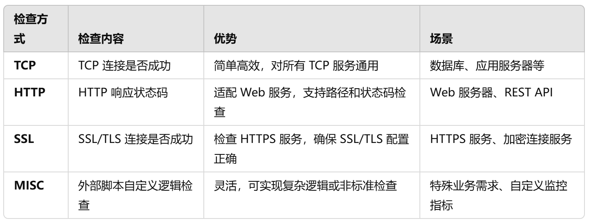


watchdog 检查组件是否OK


## keepalive编译安装


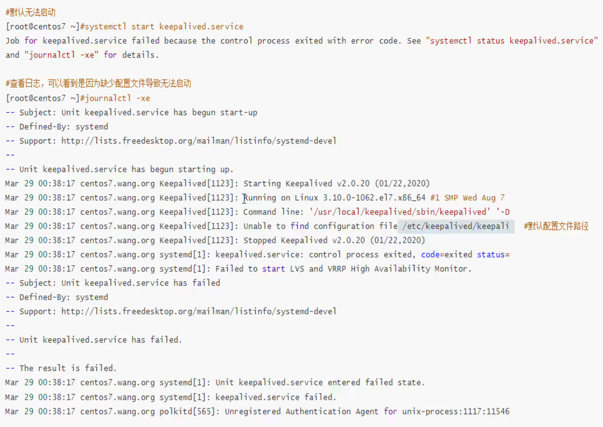


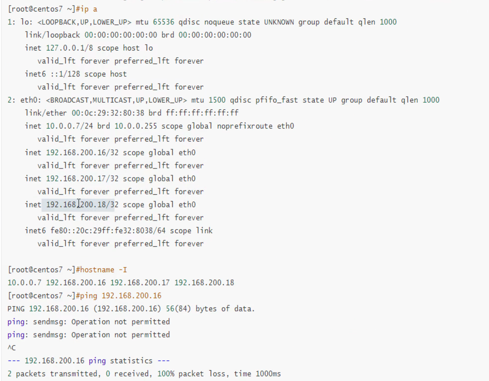


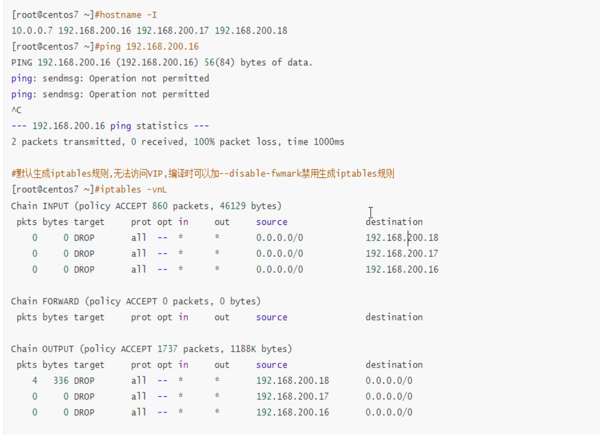


```bash
yum install -y gcc curl openssl-devel libnl3-devel net-snmp-devel

curl -LO https://keepalived.org/software/keepalived-2.3.2.tar.gz
tar xf keepalived-2.3.2.tar.gz  -C /usr/local/src
cd /usr/local/src/keepalived-2.3.2/

# 编译的时候要加上禁用防火墙规则，这里特意不加然后去配置文件里处理
./configure --prefix=/apps/keepalived
make -j 4 && make install

# 好像编译后service文件也是自动生成的，如果没有就手动cp过去一样的。
cp -a /usr/local/src/keepalived-2.3.2/keepalived/keepalived.service /lib/systemd/system/

# 报错缺少配置文件
cp /apps/keepalived/etc/keepalived/keepalived.conf.sample /apps/keepalived/etc/keepalived/keepalived.conf

systemctl enable --now keepalived
```


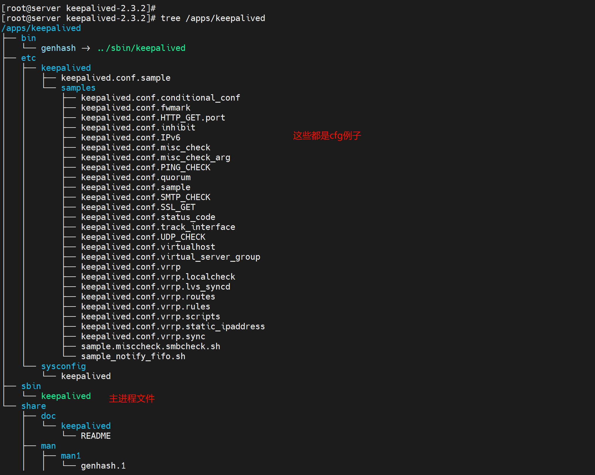

然后去源码里找找service文件

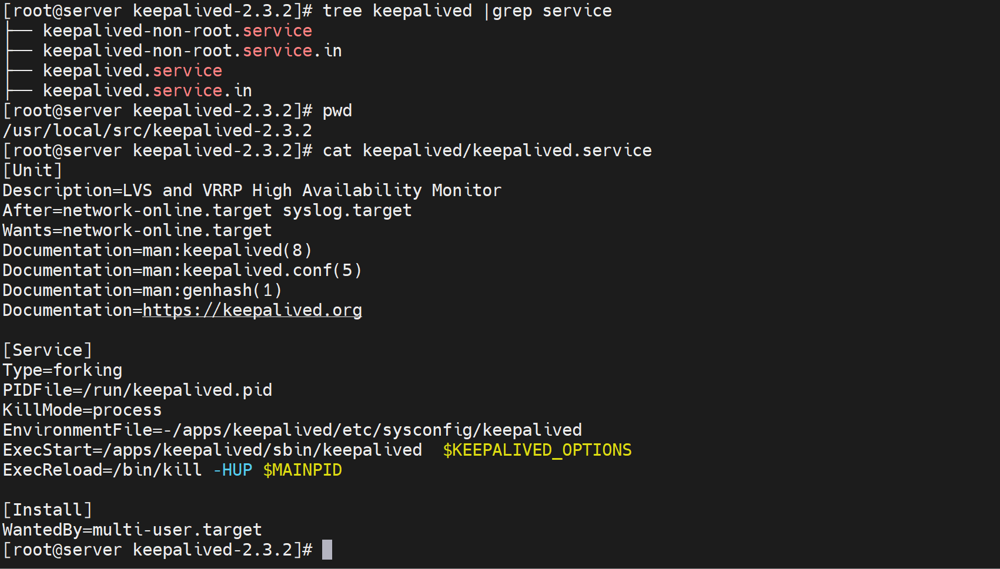

EnvironmentFile环境变量，里就是ExecStart启动的$KEEPALIVED_OPTIONS参数变量。

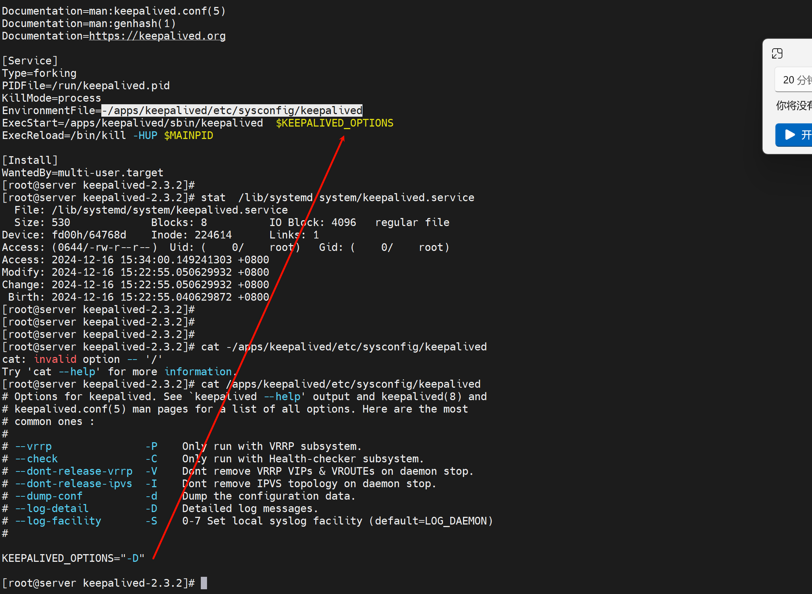

报错：

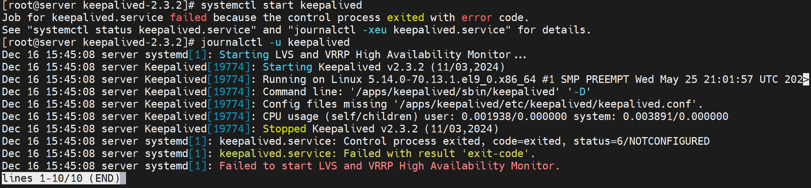


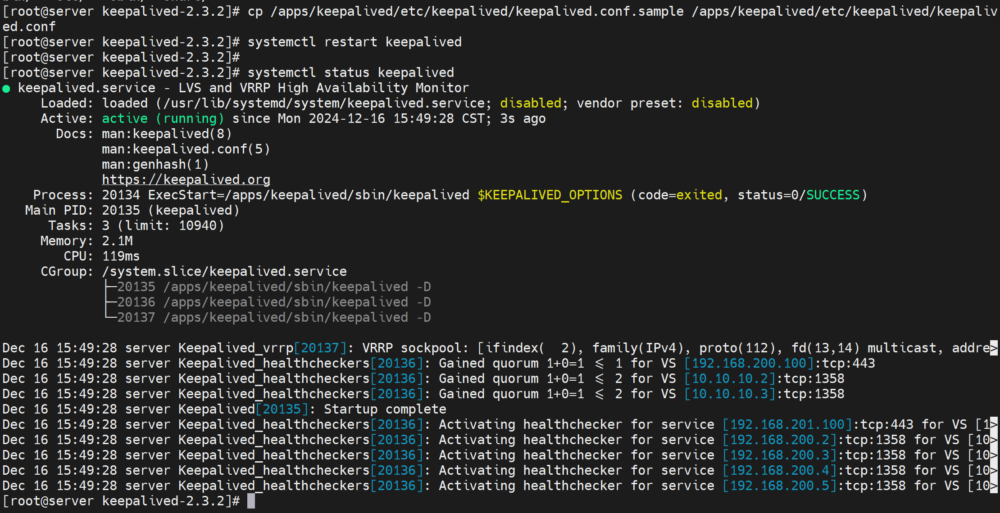

上图可见多了很多IP地址出来，就是VIP了

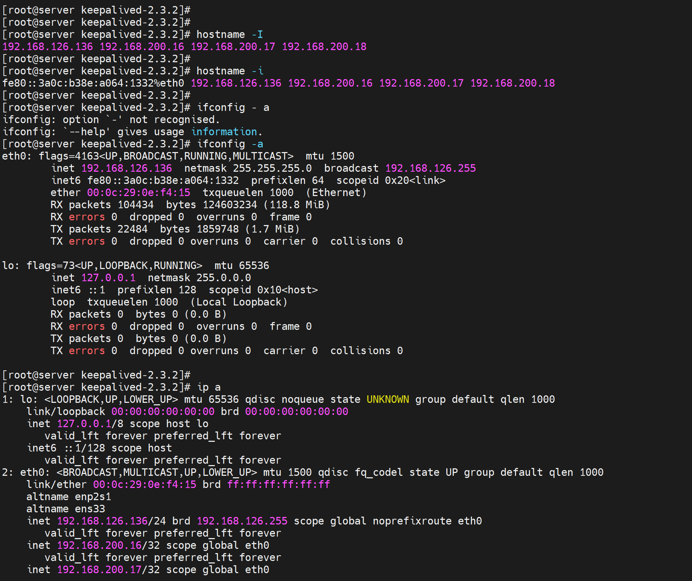

以前都说不通，现在就是通的，哈哈哈


也可能是我没有iptables导致的👆

如果不通就注释掉下图的vrrp_strict

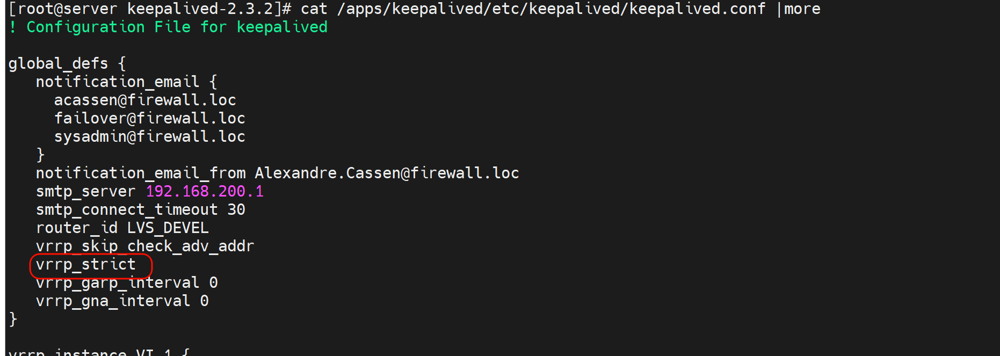


第二台keepalive的的服务也起来了，这个应该没啥大碍吧👇

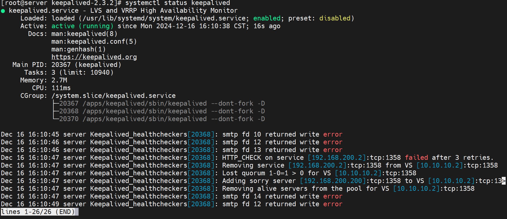

但是第二台上面怎么没见着多个VIP啊，难道自动发现MASTER了？

应该就是ping通了之前一台的VIP，所以它自己就作为SLAVE了


## 配置文件


```bash
[root@server keepalived-2.3.2]# cat /apps/keepalived/etc/keepalived/keepalived.conf
! Configuration File for keepalived  # 叹号就是此行不启作用，和#一样咯

global_defs {
   notification_email {
     acassen@firewall.loc
     failover@firewall.loc
     sysadmin@firewall.loc
   }
   notification_email_from Alexandre.Cassen@firewall.loc
   smtp_server 192.168.200.1
   smtp_connect_timeout 30
   router_id LVS_DEVEL
   vrrp_skip_check_adv_addr
   vrrp_strict
   vrrp_garp_interval 0
   vrrp_gna_interval 0
}

vrrp_instance VI_1 {
    state MASTER
    interface eth0
    virtual_router_id 51
    priority 100
    advert_int 1
    authentication {
        auth_type PASS
        auth_pass 1111
    }
    virtual_ipaddress {
        192.168.200.16
        192.168.200.17
        192.168.200.18
    }

    # Allow packets addressed to the VIPs above to be received
    accept
}

virtual_server 192.168.200.100 443 {
    delay_loop 6
    lb_algo rr
    lb_kind NAT
    persistence_timeout 50
    protocol TCP

    real_server 192.168.201.100 443 {
        weight 1
        SSL_GET {
            url {
              path /
              digest ff20ad2481f97b1754ef3e12ecd3a9cc
            }
            url {
              path /mrtg/
              digest 9b3a0c85a887a256d6939da88aabd8cd
            }
            connect_timeout 3
            retry 3
            delay_before_retry 3
        }
    }
}

virtual_server 10.10.10.2 1358 {
    delay_loop 6
    lb_algo rr
    lb_kind NAT
    persistence_timeout 50
    protocol TCP

    sorry_server 192.168.200.200 1358

    real_server 192.168.200.2 1358 {
        weight 1
        HTTP_GET {
            url {
              path /testurl/test.jsp
              digest 640205b7b0fc66c1ea91c463fac6334d
            }
            url {
              path /testurl2/test.jsp
              digest 640205b7b0fc66c1ea91c463fac6334d
            }
            url {
              path /testurl3/test.jsp
              digest 640205b7b0fc66c1ea91c463fac6334d
            }
            connect_timeout 3
            retry 3
            delay_before_retry 3
        }
    }

    real_server 192.168.200.3 1358 {
        weight 1
        HTTP_GET {
            url {
              path /testurl/test.jsp
              digest 640205b7b0fc66c1ea91c463fac6334c
            }
            url {
              path /testurl2/test.jsp
              digest 640205b7b0fc66c1ea91c463fac6334c
            }
            connect_timeout 3
            retry 3
            delay_before_retry 3
        }
    }
}

virtual_server 10.10.10.3 1358 {
    delay_loop 3
    lb_algo rr
    lb_kind NAT
    persistence_timeout 50
    protocol TCP

    real_server 192.168.200.4 1358 {
        weight 1
        HTTP_GET {
            url {
              path /testurl/test.jsp
              digest 640205b7b0fc66c1ea91c463fac6334d
            }
            url {
              path /testurl2/test.jsp
              digest 640205b7b0fc66c1ea91c463fac6334d
            }
            url {
              path /testurl3/test.jsp
              digest 640205b7b0fc66c1ea91c463fac6334d
            }
            connect_timeout 3
            retry 3
            delay_before_retry 3
        }
    }

    real_server 192.168.200.5 1358 {
        weight 1
        HTTP_GET {
            url {
              path /testurl/test.jsp
              digest 640205b7b0fc66c1ea91c463fac6334d
            }
            url {
              path /testurl2/test.jsp
              digest 640205b7b0fc66c1ea91c463fac6334d
            }
            url {
              path /testurl3/test.jsp
              digest 640205b7b0fc66c1ea91c463fac6334d
            }
            connect_timeout 3
            retry 3
            delay_before_retry 3
        }
    }
}

```

上面三大块

其中virtual_server只是LVS的配置，如果keepalive不是给LVS做HA的，就没有必要配置virtual_server的配置了。

最核心的就是上面两块：全局和vrrp配置


先删掉lvs的得到精简的cfg

```bash
[root@server keepalived-2.3.2]# cat /apps/keepalived/etc/keepalived/keepalived.conf
! Configuration File for keepalived

global_defs {
   notification_email {
     acassen@firewall.loc  # 写了也白写，发不出去，因为：没有输入授权认证的配置地方。
     failover@firewall.loc
     sysadmin@firewall.loc
   }
   notification_email_from Alexandre.Cassen@firewall.loc  # 发件人，上面是收件人
   smtp_server 192.168.200.1
   smtp_connect_timeout 30
   
   router_id LVS_DEVEL
   vrrp_skip_check_adv_addr
   vrrp_strict
   vrrp_garp_interval 0
   vrrp_gna_interval 0
}

vrrp_instance VI_1 {
    state MASTER
    interface eth0
    virtual_router_id 51
    priority 100
    advert_int 1
    authentication {
        auth_type PASS
        auth_pass 1111
    }
    virtual_ipaddress {
        192.168.200.16
        192.168.200.17
        192.168.200.18
    }

    # Allow packets addressed to the VIPs above to be received
    accept
}

[root@server keepalived-2.3.2]#

```


邮箱的没必要配置了，删掉

```bash
[root@server keepalived-2.3.2]# cat /apps/keepalived/etc/keepalived/keepalived.conf
! Configuration File for keepalived

global_defs {
   router_id ka001  # routeid咯,可以拿主机名来标识
   vrrp_skip_check_adv_addr  # 跳过默认的通告检查，提高性能。
   vrrp_strict  # 严格的配置，加了会导致业务起不来，好比selinux。
   vrrp_garp_interval 0  # arp协议，发送不延迟？
   vrrp_gna_interval 0  # na IPV6的地址arp咯，不延迟？
   vrrp_mcast_grop4 224.0.0.18  # 组播地址，改单播此处失效，可以考虑修改组播地址安全起见或加认证
   vrrp_iptables  # 此项和vrrp_strict同时开启，则不会添加iptables规则。关键还得看版本，具体测试下。
}

vrrp_instance VI_1 {
    state MASTER
    interface eth0
    virtual_router_id 51
    priority 100
    advert_int 1
    authentication {
        auth_type PASS
        auth_pass 1111
    }
    virtual_ipaddress {
        192.168.200.16
        192.168.200.17
        192.168.200.18
    }

    # Allow packets addressed to the VIPs above to be received
    accept
}


```

进一步简化配置

```
[root@server keepalived-2.3.2]# cat /apps/keepalived/etc/keepalived/keepalived.conf
! Configuration File for keepalived

global_defs {
   router_id ka001  # routeid咯,可以拿主机名来标识
}

vrrp_instance VI_1 {
    state MASTER
    interface eth0
    virtual_router_id 51
    priority 100
    advert_int 1
    authentication {
        auth_type PASS
        auth_pass 1111
    }
    virtual_ipaddress {
        192.168.200.16
        192.168.200.17
        192.168.200.18
    }

    # Allow packets addressed to the VIPs above to be received
    accept
}


```

