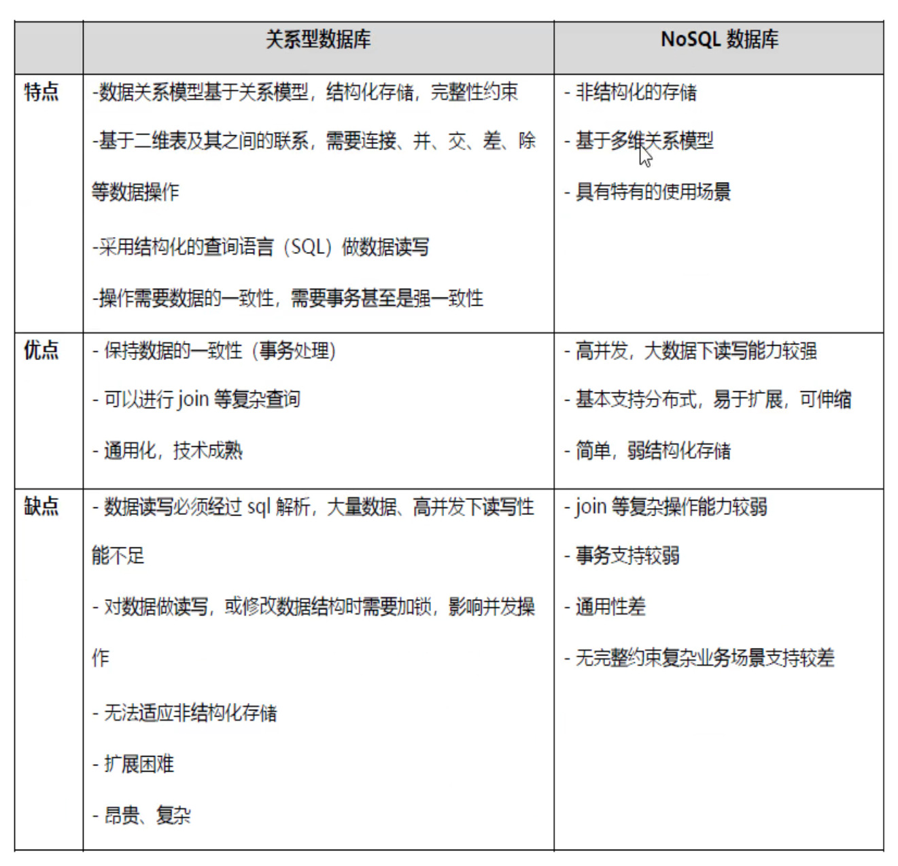
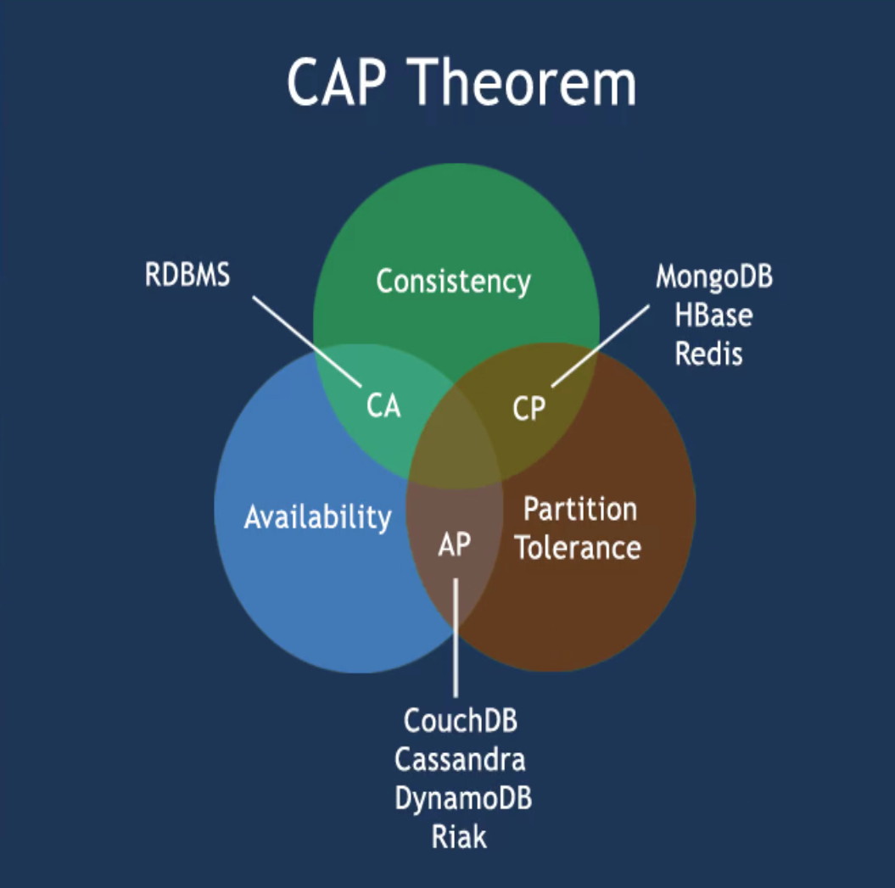
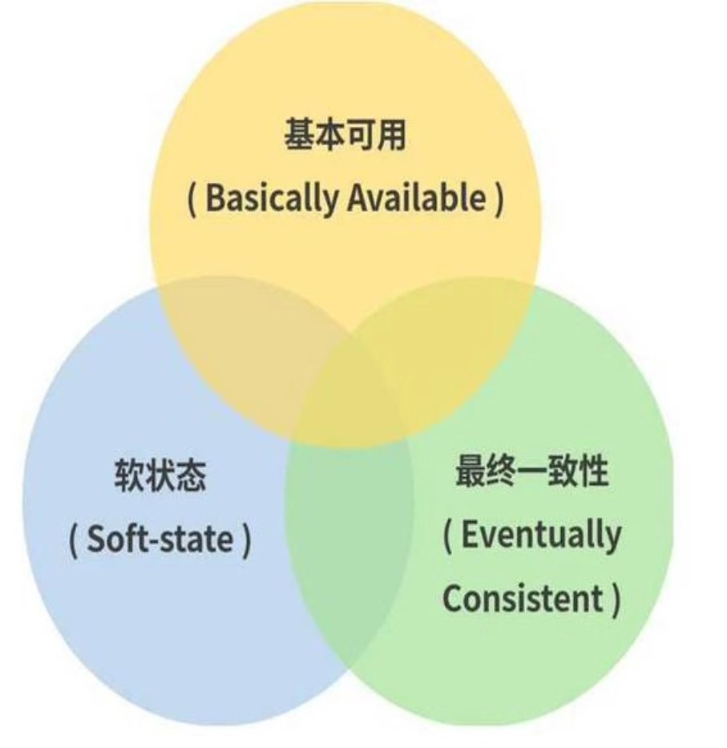
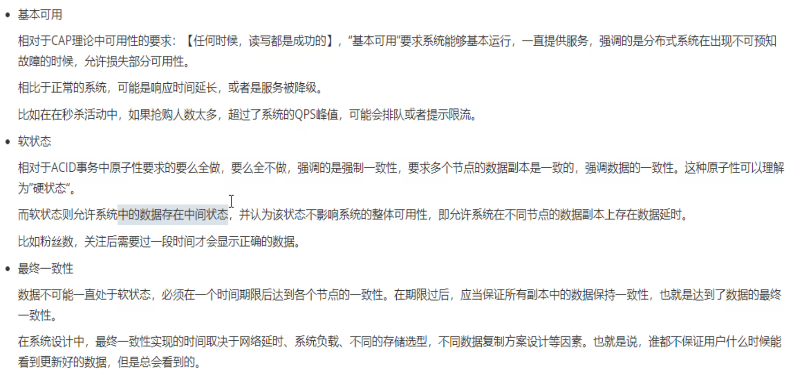
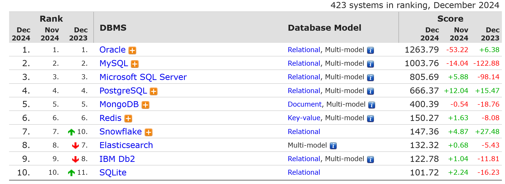
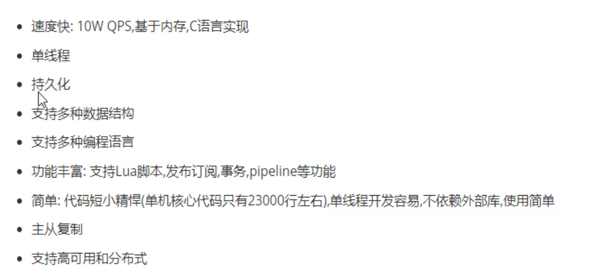

# 1.NoSQL和Redis特性.md

什么是NoSQL

SQL：结构规范，字段定义好，主流DB。

NoSQL：No Only SQL，应对巨大的数据量和多样性非结构化数据。

### CAP定理：

C：强一致性：mysql为例，A/S  A/A，   不同节点的访问得到的数据一致。主从复制时有延迟的，所以不是强一致性的。mysql的同步机制--用户写入主节点的时候不会立即返回写入成功的信息--知道主从同步才会返回，这就保证了强一致性。但是mysql一般不会用这种同步机制，因为写入后等待时间可能会太久。

A：可用性，多节点，可用性不一定保证最新的，但是一定能立即返回一个结果。

P：分区容忍性，多节点下，一般指网络断开、延迟(特别时分布式下本来就有延迟)，带来的节点之间的分裂，然后此时要求业务正常的

CAP，最多满足2个，不可能同时满足！上图CAP交际里时空的就是这个意思。

CA组合：比如单点集群。

CP组合：强一致性+分区(多节点)。A如果没有同步完成给B节点，你往A里写数据，A会不会立即给你响应的。好比：跨行转账业务。

AP组合：可用性+分区，牺牲了C。

CP和AP用的较多，CA由于时单点基本不用。

AP有不一致的问题，所以有一个Base理论：不求强一致，只求基本一致。不求立刻多节点之间的数据同步，只求过一会同步就行了。通常AP组合都会保证最终一致性。

完整的Base理论

Base是缩写：**B**asicall **A**vailable  **S**oft-stale  **E**ventually Consistent

https://db-engines.com/en/ranking

k-v db 除了redis就是memecached了，而memacached整体排名低到二里沟去了

# redis特点

https://redis.io/

redis适合较小的数据量，也能持久化--临时存放到磁盘上--定义一些规则-定期存放--起到备份的效果。

MyCAT是纯内存的了。

蒹葭苍苍，白露为霜，所谓伊人，婉拒红包，

红包被拒，其心凉凉，道阻且长，道阻且长。

