# 第1节. 标准输入输出和重定向


1. 三种I/O设备
2. 把I/O重定向到文件
3. 使用管道


## 标准输入


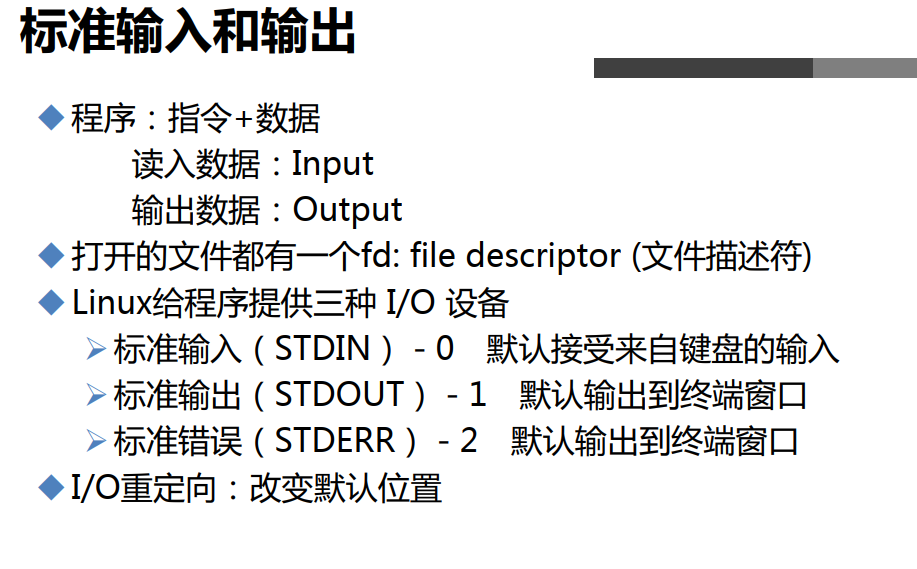 

每打开一个文件，系统都会分配一个数字编号对应该文件，

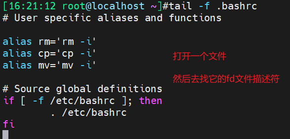 

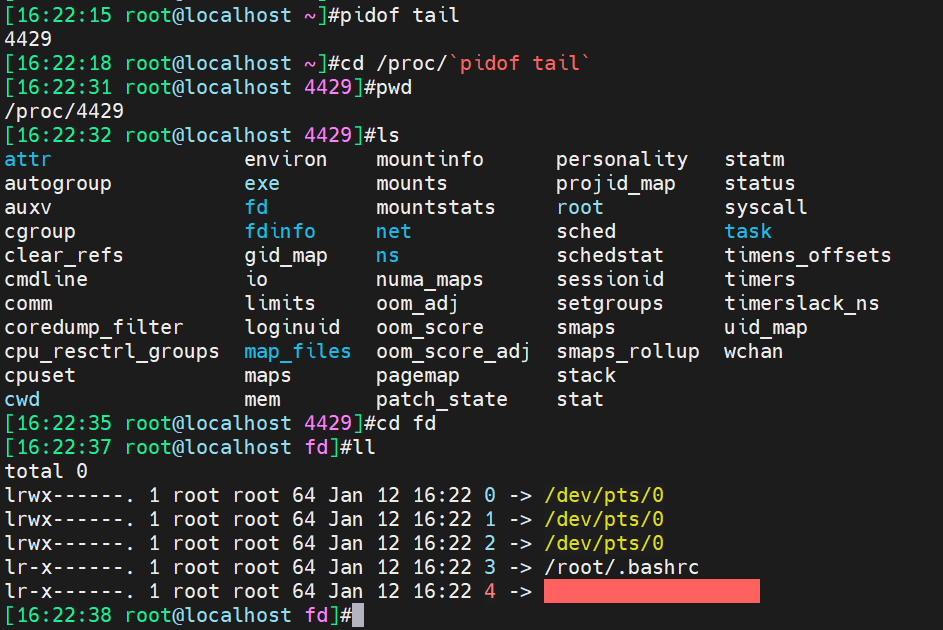

可见一个文件会有4个描述符与之对应，退出tail后，这里的对应关系就没了。

可以看到tail -f .bashrc，系统分配了一个3的文件描述符-软连接指向。

而0 1 2是输入输出信息对应的设备文件描述符，什么意思，就是你对.bashrc文件进行操作，会存在各种交互信息，正常的，错误的，等等从键盘输入的，打印到屏幕的。

 关于输出重定向的小例子

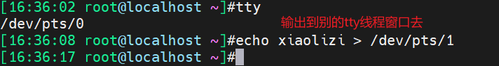 

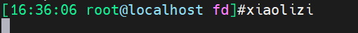 

```
>  # 这是标准输出的重定向
```

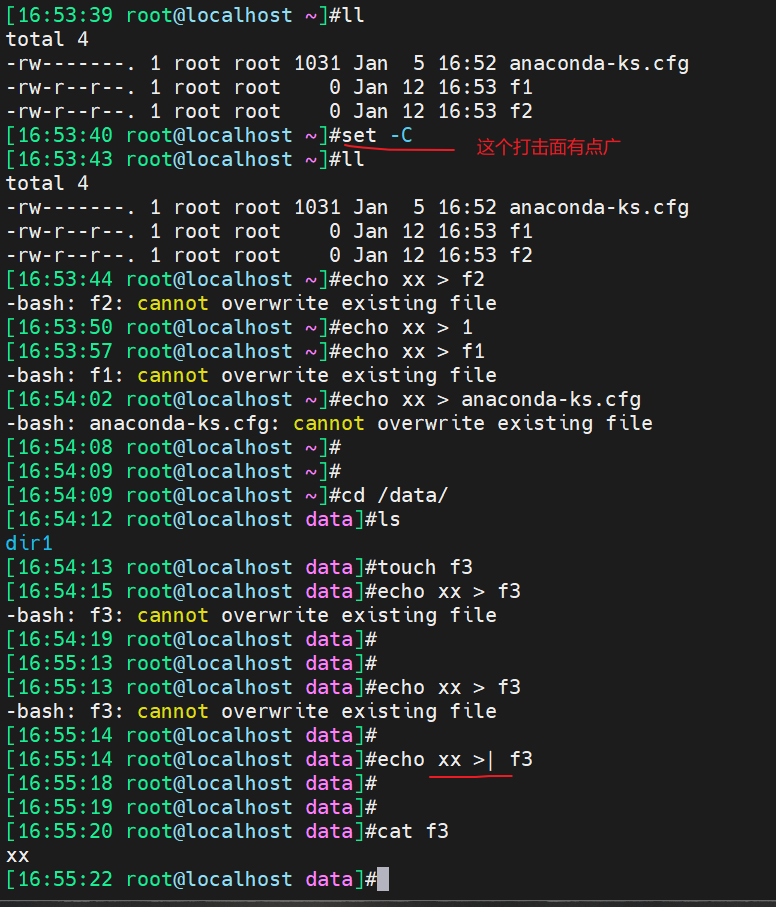 


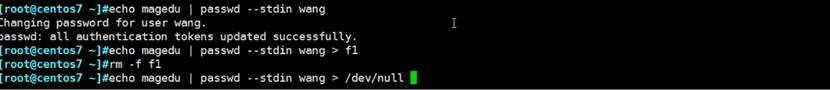


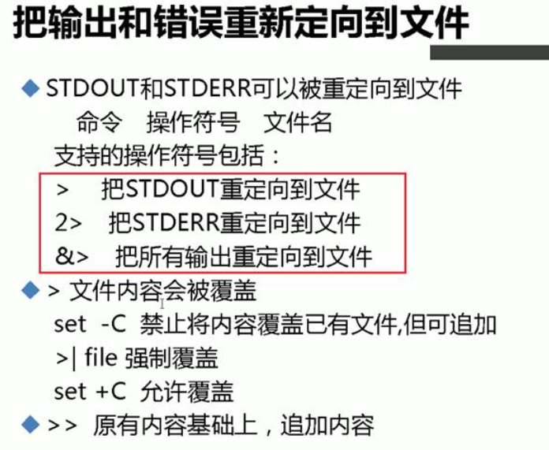 

```
以下命令特别的一个：C
ls /data /xxx 2> all.log 1>&2
ls /data /xxx &> all.log
ls /data /xxx 2>&1 all.log   # 打印到屏幕上去了
ls /data /xxx > all.log 2>&1
```

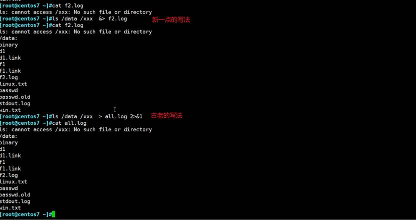

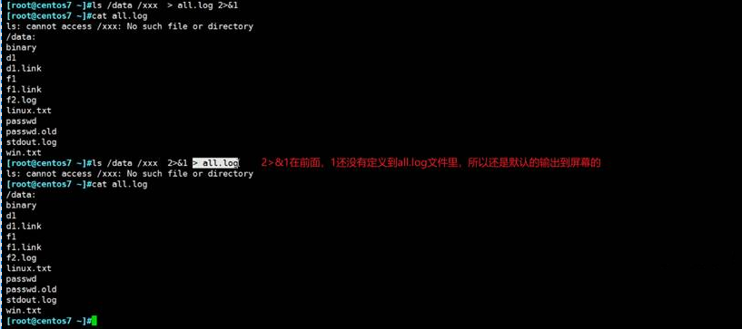 

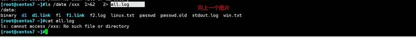

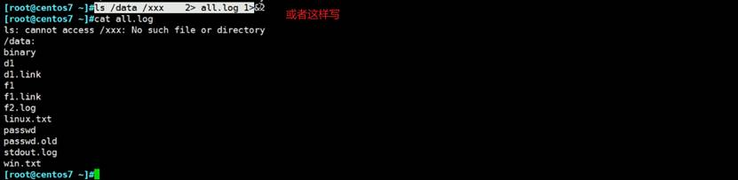

 

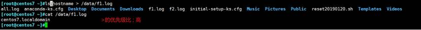

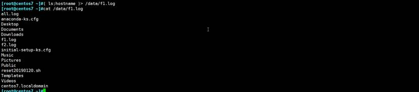

 

以上是标准输出

----

## 标准输入

 

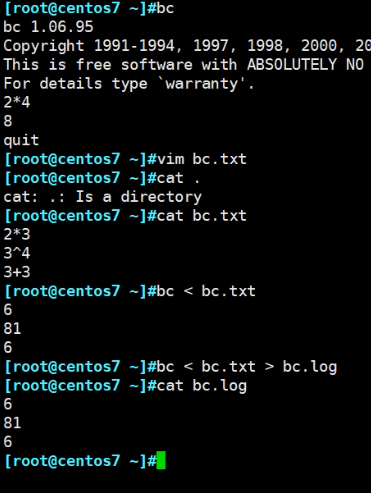 


## tr的一些用法

```
tr abcde 123
tr -t abcde 123
tr [:lower:] [:upper:]
tr -d '135'
tr -s 'ace'
```

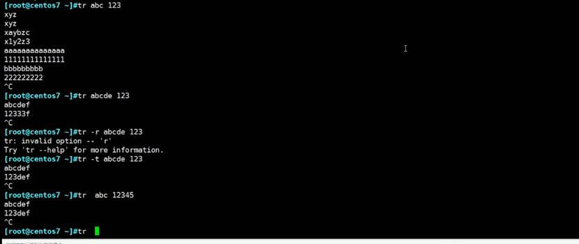

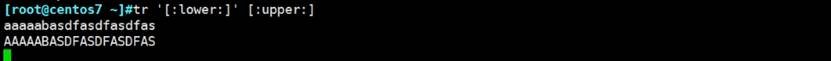

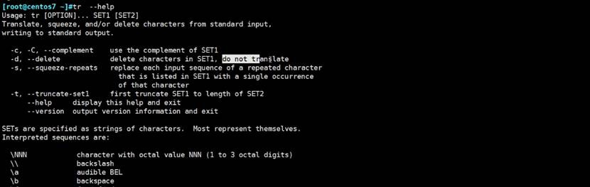

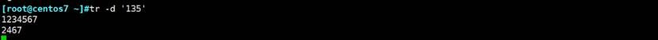

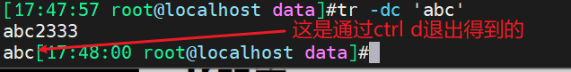 


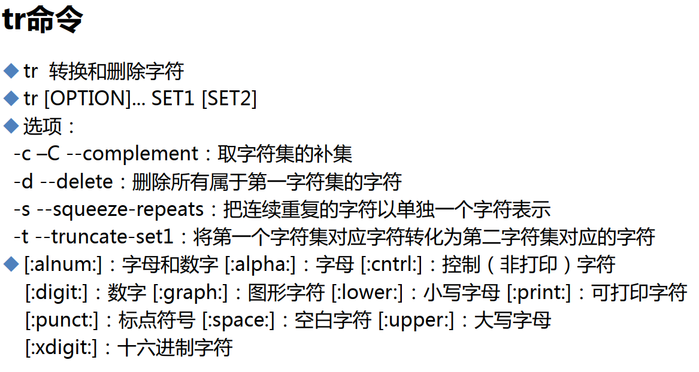 


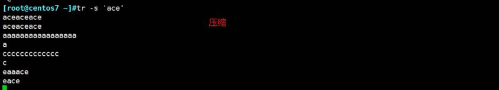

tr就可以和标准输入结合

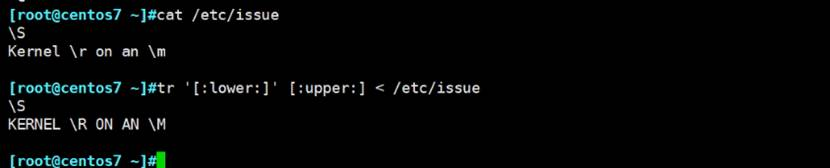

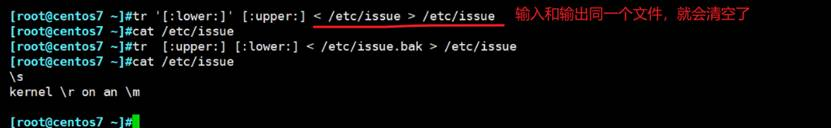

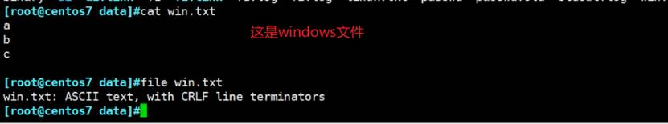

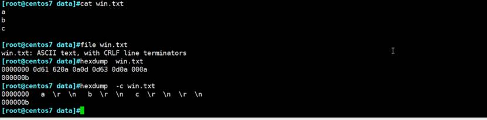

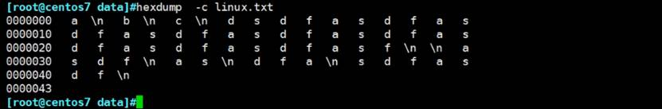

所以转换的话，也可以用tr来做

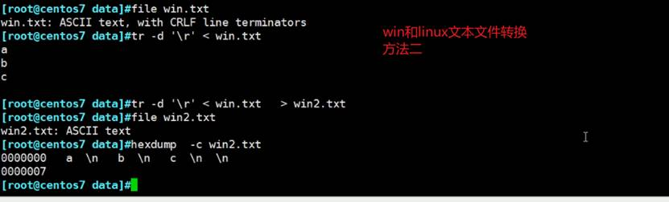

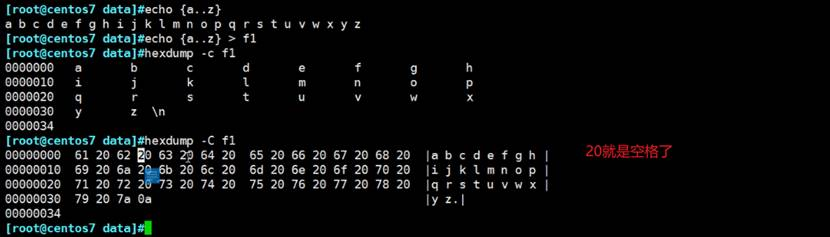

 

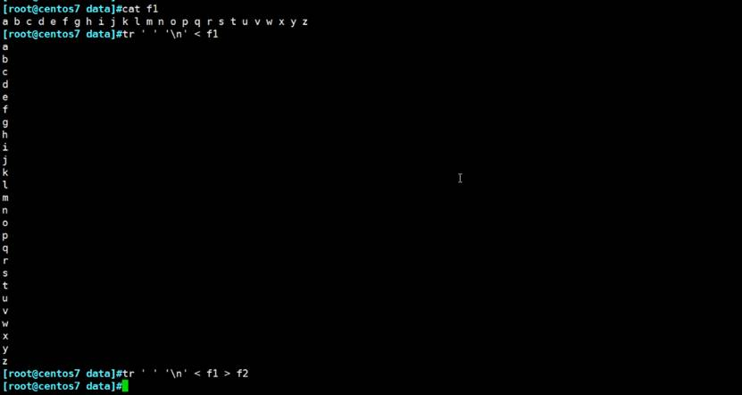

tr可以转换、压缩、删除，也方便了。

 

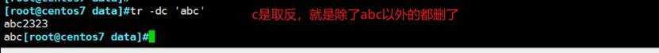

上图是CTRL+D结束才会看到结果。是除了a、b、c以外的都删了。

 

## 单行重定向举例

 

此时多开一个窗口可见aaa已近写进去了

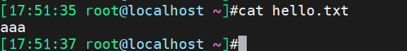 


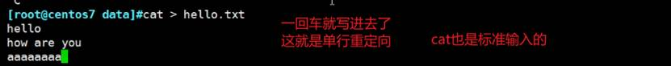


## 多行重定向

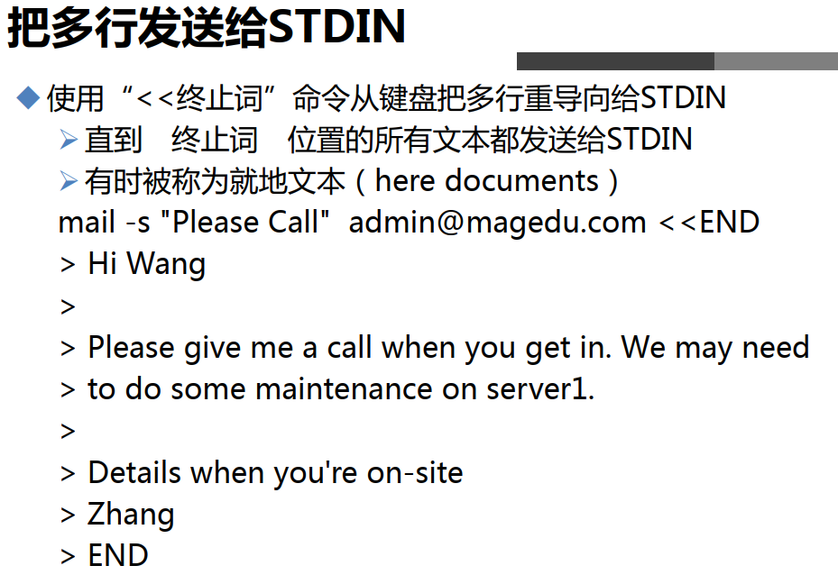 


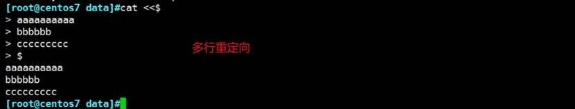

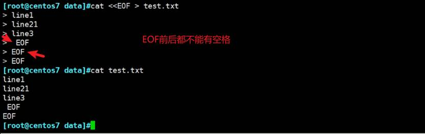

