# 01Python基础2021052401.md

再写了3W行py后，开始学习py基础，你说好玩不好玩

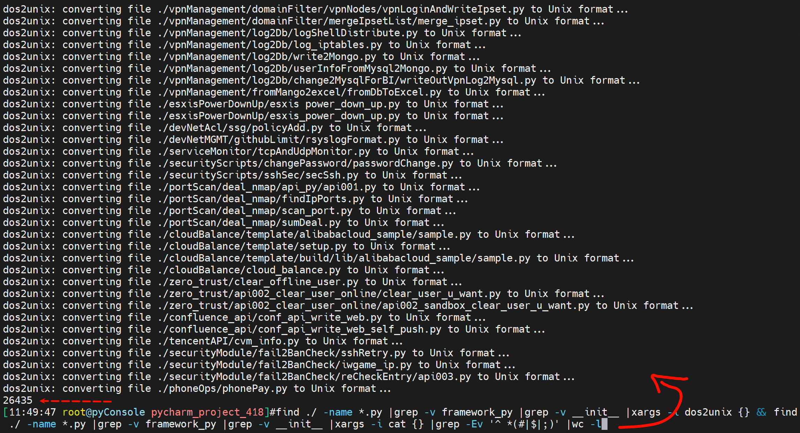

再去掉print

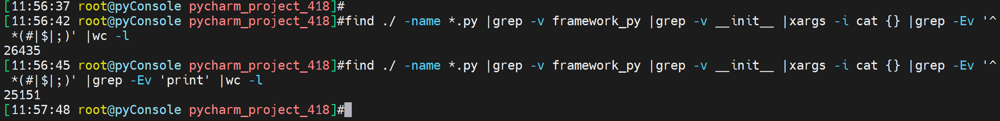

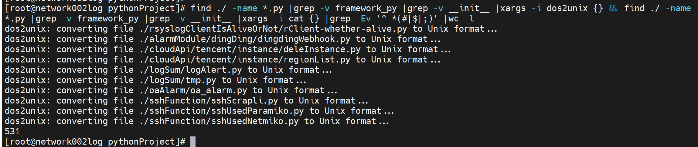

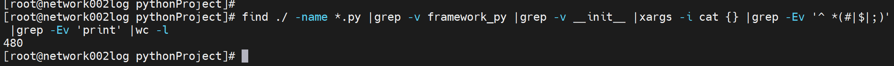

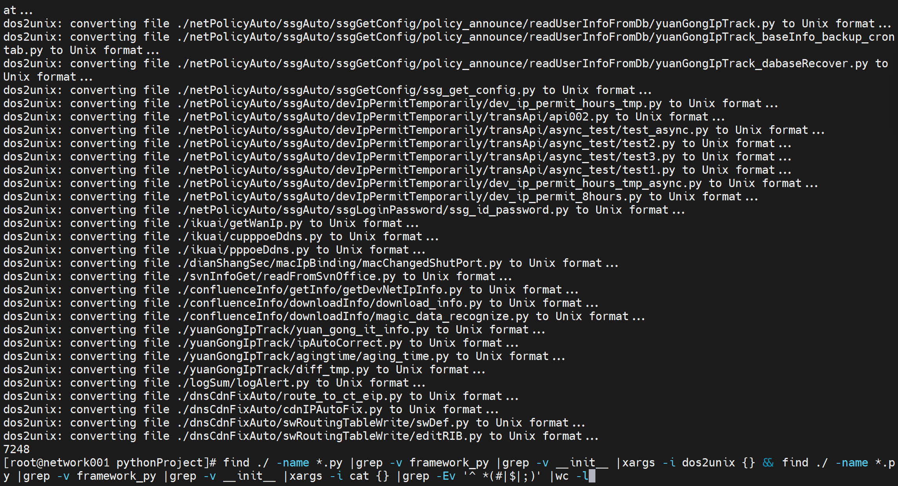

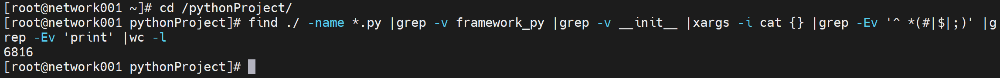

200.17是almalinx，find需要带上引号

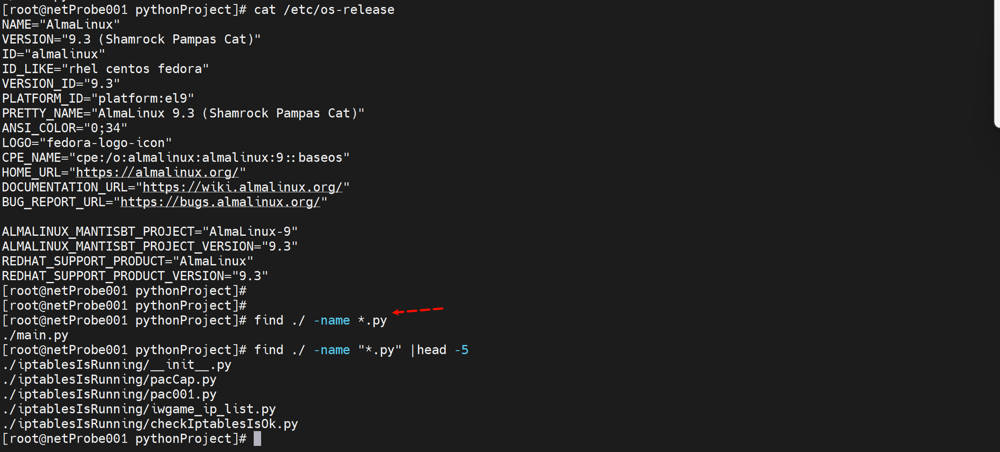

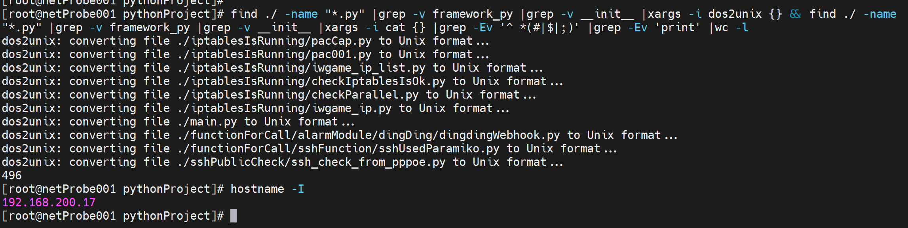

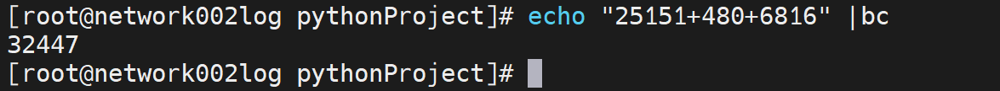

再除以2，有点狠啊，男人嘛~

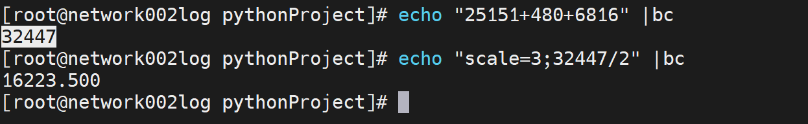 

所以我的本质代码量在16223行。

对了在vpn节点上还有代码，在11.36带GUI的沙箱API也有一点点，在la之前还有一点点，然后windows的也有一些但是都是sw的，看自己可怜，就定在1W行吧~哈哈哈哈

自动化就是py，py小学就学了？好像是这么回事

运维的细分，py

go像c，

什么生态里适合的语言是什么

instal 36 38

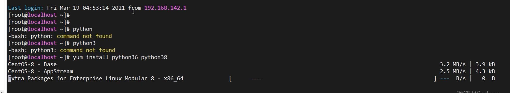

切版本的cli

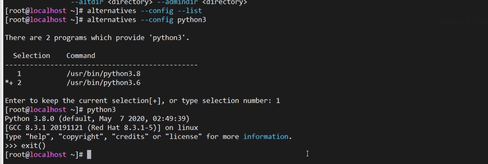

虚拟环境才是解决多版本的问题，或者docker

windows是优先搜索当前路径，linux是搜证PATH变量的

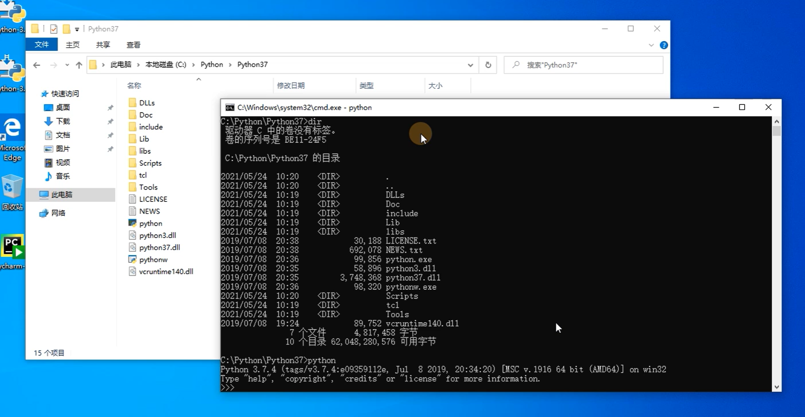

pip  python install packages

## 虚拟环境之virtualenv

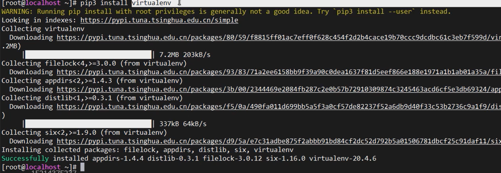

一般来讲换普通用户开发

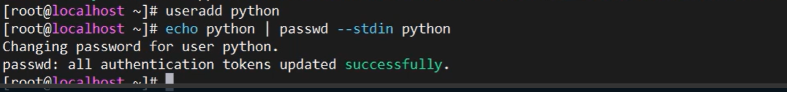

切换普通用户，创建虚拟环境

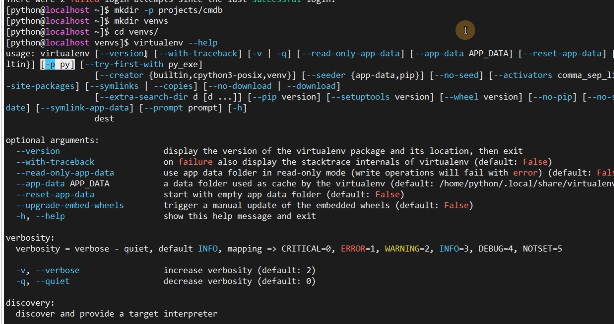

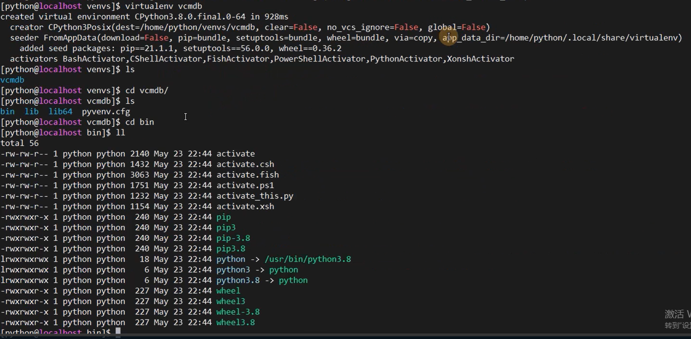

第二个虚拟环境用3.6

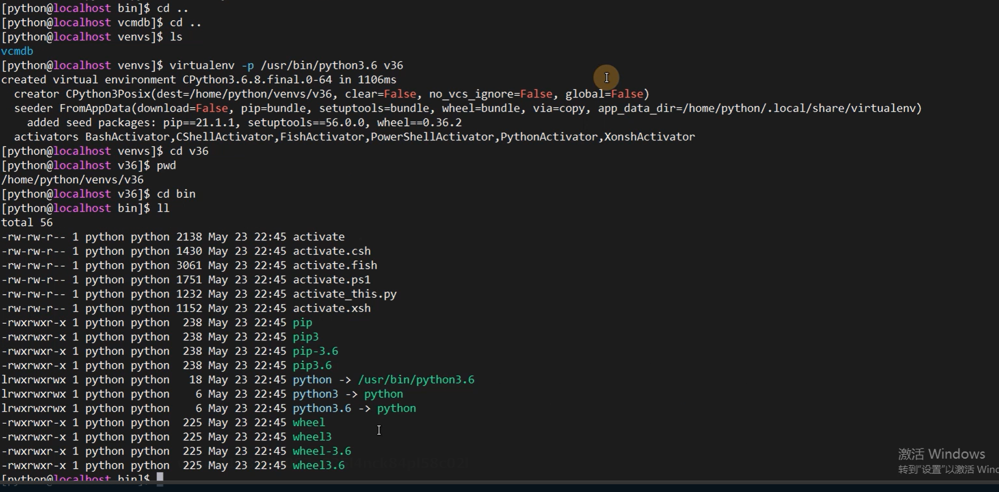

注意上面的虚拟环境和工程目录是分开的

最后再使用虚拟环境

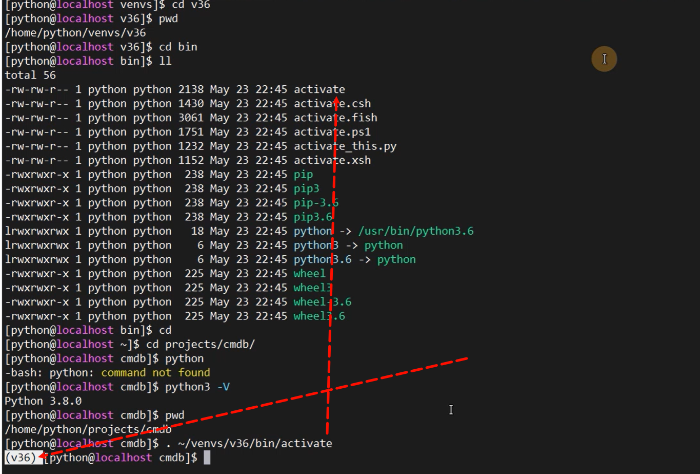

退出虚拟环境

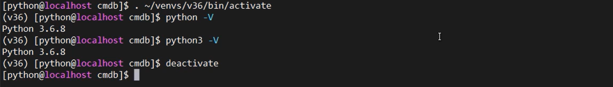

## √虚拟环境之pyenv

https://github.com/pyenv/pyenv

有个cahce的配置和利用方式

不记录了，快速看到实际项目落地章节去。

# 养生篇

https://www.dongfangyy.com.cn/Html/News/Articles/11437.html

