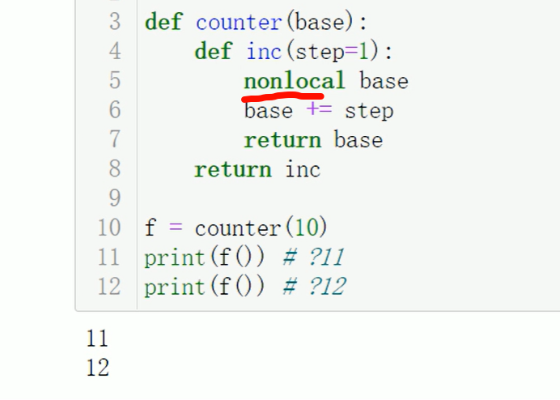
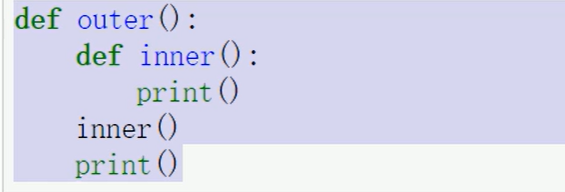
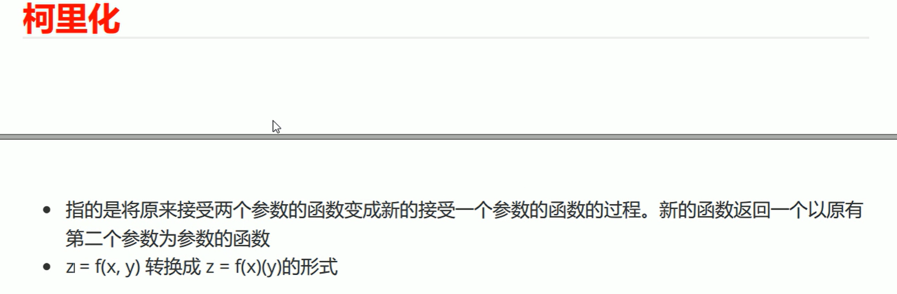
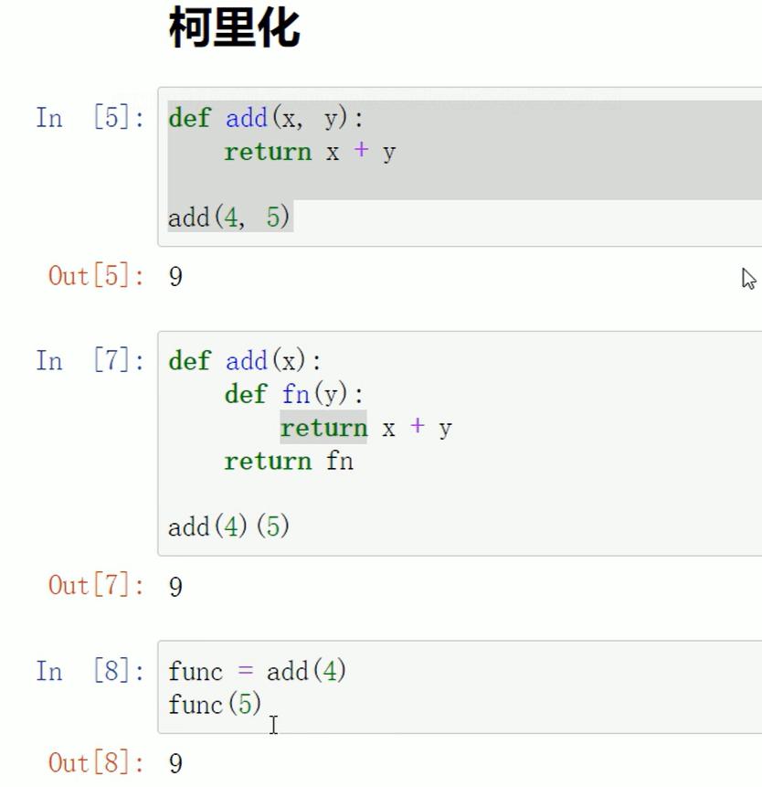

# 05装饰器202106140高阶函数柯里化.md


嵌套函数




base是local，函数里的函数inc调用不了local变量，所以要nonlocal一下。


高阶函数的定义：传参和返回值 有一个是函数就是高阶函数


这个不是高阶函数👇




好痛苦，这玩意看的，大致能跟上，但是不开心，因为闭包、函数消亡、压栈、指针、堆栈、f.\__closure\__这些东西我之前写那么多都不知道也用不到这玩意。不喜欢


理解：

```python
def counter(base):
	def inc(step=1):
		nonlocal base
		base += step
		return base
	return inc

f = counter(10)
print(f()) # 11
print(f()) # 12 f.__closure__
```


理解：

```python
def counter(base):
	def inc(step=1):
		nonlocal base
		base += step
		return base
	return inc

f1 = counter(5)
f2 = counter(5)
print(f1 == f2)  # False
print(f1 is f2)  # False
```





 


```python
def add(x, y, z):
	retrun x + y + z
	
希望柯里化为
add(4)(5, 6)
add(4, 5)(6)
add(4)(5)(6)
```

```python

def add(x):
    def fn(y,z):
        return x + y + z
    return fn
z = add(4)(5, 6)
print(z)

def add(x, y):
    def fn(z):
        return x + y + z
    return fn
z = add(4, 5)(6)
print(z)

def add(x):
    def cn(y):
        def fn(z):
            return x + y + z
        return fn
    return cn
z = add(4)(5)(6)
print(z)

```


