# 第1节. 用户和组的增删改查

## AAA

authentication、authorization、accouting|audition


UID

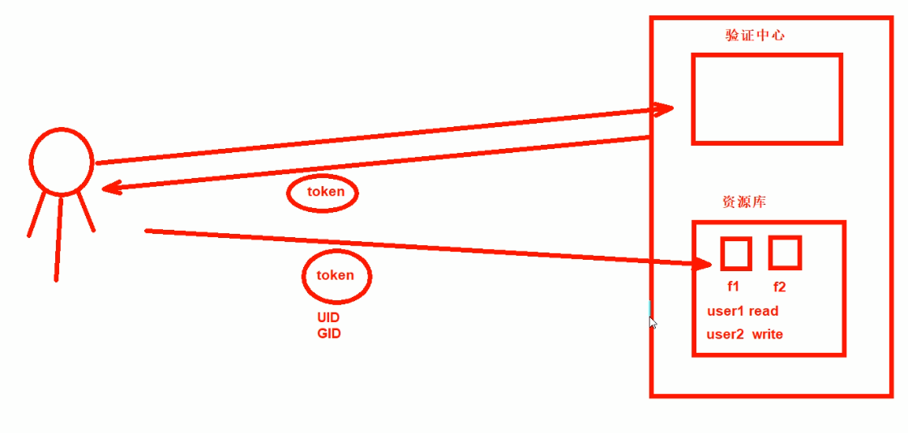 

windows看用户和组

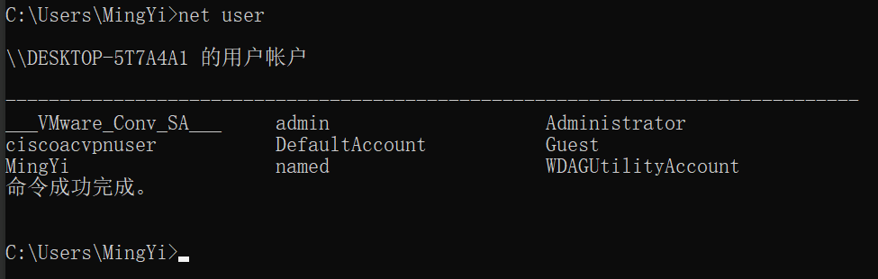


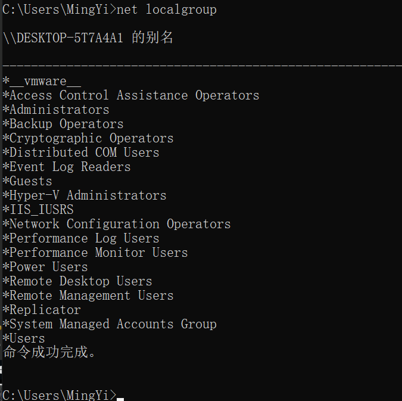 


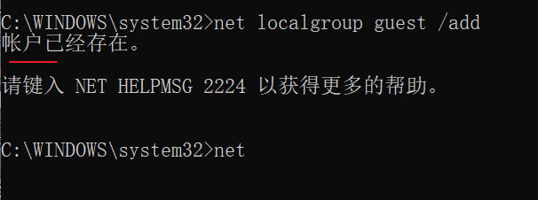 

windows里user和group 不能同名，但是在linux里是正常情况。

 


 


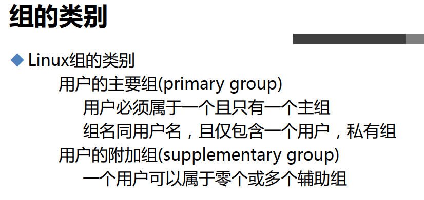 


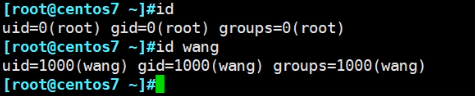 


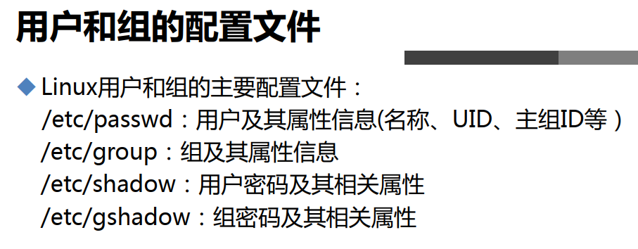 

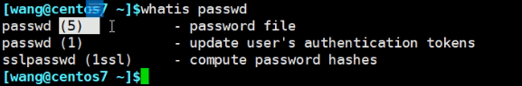 


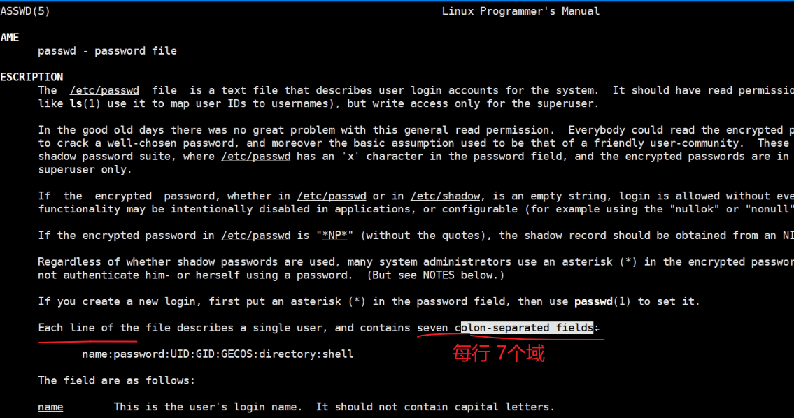 


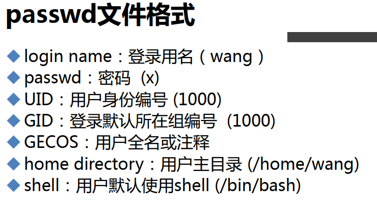 


早期密码是放在/etc/passwd里的，后买放到shaow里，可以回归早期的情况

```
pwunconv  # 密码放到/etc/passwd里
pwconv  # 密码放到/etc/shadow里
```

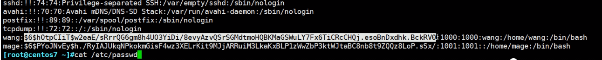

UID才是关键，将root的UID改成1000，它就不是管理员了。

如果没有一个user的UID=0，重启就起不来了。


