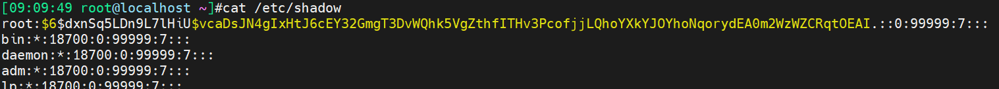
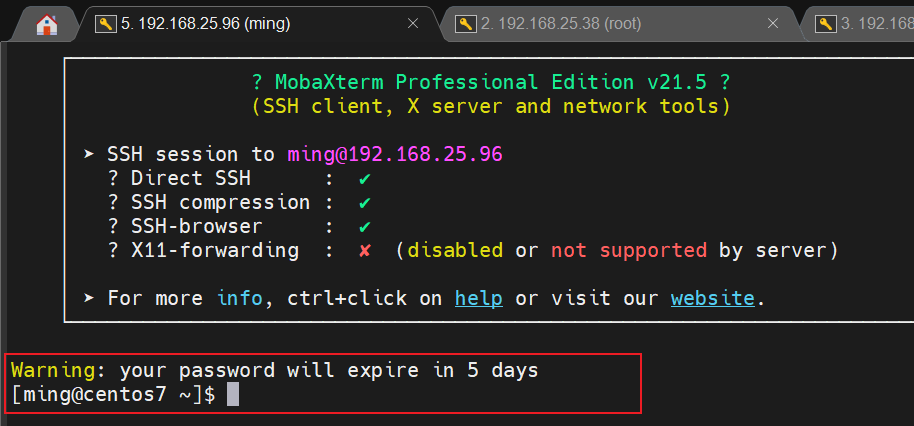
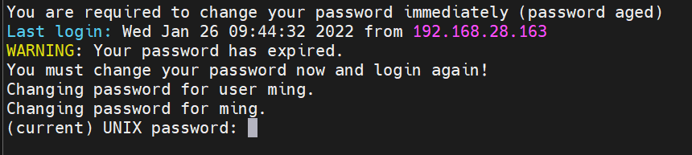
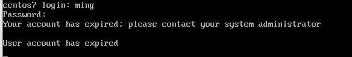
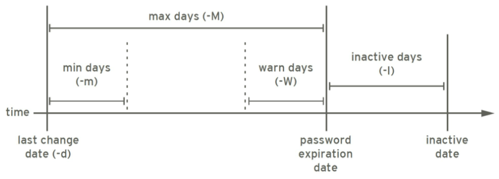
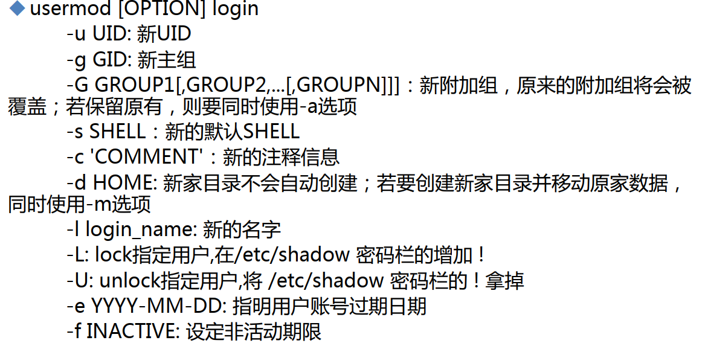

# 第2节. 用户和组的权限管理

## /etc/shaow字段说明

```shell
useradd -r ming
[09:19:15 root@localhost ~]#echo cisco | passwd --stdin ming
Changing password for user ming.
passwd: all authentication tokens updated successfully.
```

```
ming:$6$AUsIFTgTuY/hWn8Y$0PgiuhWLxBGeGRtbd/Niz5R1EsMRvV3gdSRT45jnXMyZisgBzcCybETswhJzuuUQeIPkO/gMzo3rKyXvRAE6h.:19008::::::

---上面是rocke-linux复制过来的---下面是centos-----

ming:$6$nfkcZ5x7$Le5WQnLSUiJbw2tdXiilhvVZFGy69iuzKQq2XoA84jrHtrOp8fwQgMyunGIt1wQimPf37xdUL7B6rCOvpSaDE0:19008:0:99999:7:::
[root@centos7 ~]#

```




这些字段的帮助信息可通过man 5 shadow获得


```
$6	：表示sha512
$1	：表示md5
```

```
你改口令的时间距离1970-1-1号的时间

date of last password change
           The date of the last password change, expressed as the number of days since Jan 1, 1970 00:00 UTC.

[09:25:26 root@localhost ~]#echo `date +%s`/86400 |bc
19008
这就是上图ming用户的19008的由来
```

```
 minimum password age
 用户必须等多久才能修改口令，0就是可以立即修改密码，以天为单位，centos7里默认是0，rocke-linux默认为空
 
 maximum password age
 用户不改密码，密码多久到期，以天为单位，centos7默认99999，rocke-linux默认为空
 
 password warning period
 上面的最大密码时间意味着过期，而过期前提前7天会提醒你修改密码
 
 
```

[root@centos7 ~]# date -s "+5 day"
Fri Jan 21 09:40:55 CST 2022
[root@centos7 ~]# date

 

然后再将本地时间延后10天，此时在用ming登入看看

[root@centos7 ~]# date -s "+5 day"
Wed Jan 26 09:44:25 CST 2022
[root@centos7 ~]# date -s "+5 day"
Mon Jan 31 09:45:03 CST 2022
[root@centos7 ~]#

  

```
password inactivity period
围绕着密码过期时间--maximum password age，如果超过这个时间X天就禁用该账号，这个X就是password inactivity period的意思。
```

ming:$6$nfkcZ5x7$Le5WQnLSUiJbw2tdXiilhvVZFGy69iuzKQq2XoA84jrHtrOp8fwQgMyunGIt1wQimPf37xdUL7B6rCOvpSaDE0:19008:0:10:7:<font color=red>5</font>::

 

```
account expiration date
账户有效期，前面都是针对密码过期的，这个参数是针对账号的
```

 

注意这里和前一张图的区别，已经不再说authentication的事了，直接说的事账号挂了。


## /etc/group和/etc/gshadow

```
dbus:x:81:
polkitd:x:998:
ssh_keys:x:997:
sshd:x:74:
postdrop:x:90:
postfix:x:89:
user1:x:1000:
ming:x:1001:
[root@centos7 ~]# cat /etc/group

```

```
systemd-journal:!::
systemd-network:!::
dbus:!::
polkitd:!::
ssh_keys:!::
sshd:!::
postdrop:!::
postfix:!::
user1:!::
ming:!::
[root@centos7 ~]# cat /etc/gshadow

```

组设置口令是给普通用户加组的权限，

附加组显示在/etc/group里的行最后一个字段

```
ming:x:1001:user1

user1用户就加入进了ming这个组，ming就是user1的附加组
```

```
/etc/gshadow  存放组口令的文件
ming:!!::user1,user2,user3

!!组密码禁用的，不能通过组口令来往里加成员，只能是root管理了
::里放的是管理员账号，每个组可以设置管理员,用来添加删除组成员，默认为空就只有root管理
user1,user2,user3就是和/etc/group一样，加入该组的成员就罗列在这里
```

## 随机口令的产生

```shell
[root@centos7 ~]# openssl rand -base64 9
rvgumQ+4U67t
[root@centos7 ~]# openssl rand -base64 9
328culZ3wpV1


```

```shell
[root@centos7 ~]# yum -y install expect
查看man手册：
FLAGS
       The -l flag defines the length of the password.  The default is 9.  The following example  creates  a  20  character
       password.

            mkpasswd -l 20

       The  -d  flag  defines  the minimum number of digits that must be in the password.  The default is 2.  The following
       example creates a password with at least 3 digits.

            mkpasswd -d 3

       The -c flag defines the minimum number of lowercase alphabetic characters that must be in the password.  The default
       is 2.

       The -C flag defines the minimum number of uppercase alphabetic characters that must be in the password.  The default
       is 2.

EXAMPLE
       The following example creates a 15-character password that contains at least 3 digits and 5 uppercase characters.

            mkpasswd -l 15 -d 3 -C 5
```

```
[root@centos7 ~]# mkpasswd -l 15 -d 3 -C 5
\Dpbel2VZa8Dv9W
[root@centos7 ~]# mkpasswd -l 15 -d 3 -C 5
m0hsZaXZ*O1Dap9
[root@centos7 ~]# mkpasswd -l 15 -d 3 -C 5
zBfuS0evQP6x1H/

```

```
C:\Users\MingYi>net accounts
强制用户在时间到期之后多久必须注销?:     从不
密码最短使用期限(天):                   0
密码最长使用期限(天):                  42
密码长度最小值:                        0
保持的密码历史记录长度:               None
锁定阈值:                            从不
锁定持续时间(分):                      30
锁定观测窗口(分):                      30
计算机角色:                    WORKSTATION
命令成功完成。
```

 

```
正要改这个时间，不推荐上文的直接修改/etc/shadow，而是用命令去改
[12:33:30 root@localhost ~]#chage ming
Changing the aging information for ming
Enter the new value, or press ENTER for the default

        Minimum Password Age [-1]: 2
        Maximum Password Age [-1]: 33
        Last Password Change (YYYY-MM-DD) [2022-01-16]:
        Password Expiration Warning [-1]: 7
        Password Inactive [-1]:
        Account Expiration Date (YYYY-MM-DD) [-1]: 2023-01-16
[12:34:26 root@localhost ~]#

这里rockety-linux还弄出个-1出来，呵呵，反正估计也是不限制的意思
[12:36:06 root@localhost ~]#getent shadow ming
ming:$6$AUsIFTgTuY/hWn8Y$0PgiuhWLxBGeGRtbd/Niz5R1EsMRvV3gdSRT45jnXMyZisgBzcCybETswhJzuuUQeIPkO/gMzo3rKyXvRAE6h.:19008:2:33:7::19373:
[12:36:13 root@localhost ~]#
[12:36:26 root@localhost ~]#getent passwd ming
ming:x:992:988::/home/ming:/bin/bash
[12:36:34 root@localhost ~]#
[12:36:36 root@localhost ~]#getent group ming
ming:x:988:
[12:36:48 root@localhost ~]#getent gshadow ming
ming:!::
[12:36:53 root@localhost ~]#
[12:36:54 root@localhost ~]#getent passwd ming root
ming:x:992:988::/home/ming:/bin/bash
root:x:0:0:root:/root:/bin/bash
[12:37:02 root@localhost ~]#

```

```
vipw和vigr 编辑passwd和group的推荐命令
pwck和grpck  检查passwd和group的命令


[12:38:19 root@localhost ~]#pwck
[user 'cockpit-ws': directory '/nonexisting' does not exist
user 'cockpit-wsinstance': directory '/nonexisting' does not exist
user 'ming': directory '/home/ming' does not exist
pwck: no changes
[12:39:02 root@localhost ~]#grpck
[12:39:11 root@localhost ~]#ll /home/
total 0

```

## groupadd 创建组

```
创建组
[13:39:41 root@localhost ~]#groupadd admins

[13:39:50 root@localhost ~]#getent  group admins
admins:x:1000:
[13:40:00 root@localhost ~]#

创建系统组
[13:40:46 root@localhost ~]#groupadd -r mysql
[13:40:50 root@localhost ~]#
[13:40:52 root@localhost ~]#getent group mysql
mysql:x:987:
[13:40:55 root@localhost ~]#

修改组名
[13:42:45 root@localhost ~]#getent group admins
admins:x:1000:
[13:42:50 root@localhost ~]#groupmod -n mgmt admins
[13:42:56 root@localhost ~]#getent group mgmt
mgmt:x:1000:

删除组
[13:44:06 root@localhost ~]#getent group mgmt
mgmt:x:1000:
[13:44:08 root@localhost ~]#getent group mysql
mysql:x:987:
[13:44:10 root@localhost ~]#groupdel mgmt
[13:44:18 root@localhost ~]#groupdel mysql
[13:44:20 root@localhost ~]#getent group mysql
[13:44:23 root@localhost ~]#getent group mgmt

删不掉组的原因
[13:49:33 root@localhost ~]#groupdel ming
groupdel: cannot remove the primary group of user 'ming'
是因为有用户将ming作为主组，这个用户就是ming自己。是useradd创建ming的时候自动生成的主组。
[13:49:43 root@localhost ~]#useradd ming2
[13:51:05 root@localhost ~]#getent group ming2
ming2:x:1000:
[13:51:23 root@localhost ~]#groupdel ming2
groupdel: cannot remove the primary group of user 'ming2'
[13:51:32 root@localhost ~]#userdel ming2
[13:51:39 root@localhost ~]#getent group ming2
[13:51:45 root@localhost ~]#ll /home/
total 0
drwx------. 2 1000 1000 62 Jan 16 13:51 ming2
userdel 删除用户连带组，但不会连带家目录，所以关于创建用户和删除用户的时候要注意家目录是否连带生成和删除

man useradd

-r, --system
           Create a system account.

           System users will be created with no aging information in /etc/shadow, and their numeric identifiers are chosen
           in the SYS_UID_MIN-SYS_UID_MAX range, defined in /etc/login.defs, instead of UID_MIN-UID_MAX (and their GID
           counterparts for the creation of groups).

           Note that useradd will not create a home directory for such a user, regardless of the default setting in
           /etc/login.defs (CREATE_HOME). You have to specify the -m options if you want a home directory for a system
           account to be created.


```

**man userdel**

```


       -f, --force
           This option forces the removal of the user account, even if the user is still logged in. It also forces userdel
           to remove the user's home directory and mail spool, even if another user uses the same home directory or if the
           mail spool is not owned by the specified user. If USERGROUPS_ENAB is defined to yes in /etc/login.defs and if a
           group exists with the same name as the deleted user, then this group will be removed, even if it is still the
           primary group of another user.

           Note: This option is dangerous and may leave your system in an inconsistent state.

       -h, --help
           Display help message and exit.

       -r, --remove
           Files in the user's home directory will be removed along with the home directory itself and the user's mail
           spool. Files located in other file systems will have to be searched for and deleted manually.

           The mail spool is defined by the MAIL_DIR variable in the login.defs file.

```

```
[14:01:12 root@localhost ~]#useradd ming2
useradd: warning: the home directory already exists.
Not copying any file from skel directory into it.
Creating mailbox file: File exists
[14:01:18 root@localhost ~]#
[14:01:18 root@localhost ~]#
[14:01:18 root@localhost ~]#getent passwd ming2
ming2:x:1000:1000::/home/ming2:/bin/bash
[14:01:22 root@localhost ~]#
[14:01:23 root@localhost ~]#ll /home/
total 0
drwx------. 2 ming2 ming2 62 Jan 16 13:51 ming2
[14:01:25 root@localhost ~]#
[14:01:26 root@localhost ~]#userdel -r ming2
[14:01:30 root@localhost ~]#ll /home/
total 0
[14:01:32 root@localhost ~]#getent passwd ming2
[14:01:39 root@localhost ~]#getent group ming2
[14:01:43 root@localhost ~]#

```

## 用户创建管理

```
[14:03:53 root@localhost ~]#rpm -q --scripts postfix
preinstall scriptlet (using /bin/sh):
# Add user and groups if necessary
/usr/sbin/groupadd -g 90 -r postdrop 2>/dev/null
/usr/sbin/groupadd -g 89 -r postfix 2>/dev/null
/usr/sbin/groupadd -g 12 -r mail 2>/dev/null
/usr/sbin/useradd -d /var/spool/postfix -s /sbin/nologin -g postfix -G mail -M -r -u 89 postfix 2>/dev/null

-------------------------
-g 90  gid
-r 指定为系统组

```

**useradd的选项学习**

```
/usr/sbin/useradd -d /var/spool/postfix -s /sbin/nologin -g postfix -G mail -M -r -u 89 postfix 2>/dev/null
```

-u 89  ： 指定用户UID为89

-s  : 指定shell类型

-o ： 忽略uid唯一性的检查

```
[14:12:58 root@localhost ~]#getent passwd root
root:x:0:0:root:/root:/bin/bash
[14:13:09 root@localhost ~]#useradd -u 0 ming3
useradd: UID 0 is not unique
[14:13:20 root@localhost ~]#getent passwd ming3
[14:13:36 root@localhost ~]#useradd -u 0 -o ming3
[14:13:42 root@localhost ~]#getent passwd ming3
ming3:x:0:1000::/home/ming3:/bin/bash
[14:13:43 root@localhost ~]#getent passwd root
root:x:0:0:root:/root:/bin/bash
[14:14:47 root@localhost ~]#id root
uid=0(root) gid=0(root) groups=0(root)
[14:14:49 root@localhost ~]#id ming3
uid=0(root) gid=0(root) groups=0(root)
[14:14:51 root@localhost ~]#
```

创建系统服务，

```
[14:18:18 root@localhost ~]#useradd -r -s /sbin/nologin mysql
[14:18:26 root@localhost ~]#getent passwd mysql
mysql:x:991:987::/home/mysql:/sbin/nologin
```

默认行为是useradd不指定主组，就会自动创建和用户名同名的主组

```
[14:21:35 root@localhost ~]#useradd alice
[14:21:48 root@localhost ~]#id alice
uid=1000(alice) gid=1000(alice) groups=1000(alice)

```

通过-g指定主组，就不会自动创建主组了，指定的主要事先存在

[14:22:33 root@localhost ~]#useradd tom -g alice
[14:22:58 root@localhost ~]#id tom
uid=1001(tom) gid=1000(alice) groups=1000(alice)

-G 是附加组

```
[14:24:10 root@localhost ~]#groupadd g1
[14:24:13 root@localhost ~]#groupadd g2
[14:24:21 root@localhost ~]#groupadd g3
[14:24:23 root@localhost ~]#
[14:24:24 root@localhost ~]#useradd jack -g alice -G g1,g2
[14:24:44 root@localhost ~]#id jack
uid=1002(jack) gid=1000(alice) groups=1000(alice),1001(g1),1002(g2)
[14:26:44 root@localhost ~]#getent group | grep jack
g1:x:1001:jack
g2:x:1002:jack
[14:26:49 root@localhost ~]#getent gshadow | grep jack
g1:!::jack
g2:!::jack
[14:26:55 root@localhost ~]#
```

-N 不创建同名的主组，也不指定，就默认创建一个users

```shell
[14:28:06 root@localhost ~]#useradd rose -N
[14:28:15 root@localhost ~]#id rose
uid=1003(rose) gid=100(users) groups=100(users)
[14:28:18 root@localhost ~]#
```

看下windows的创建用户的默认行为，默认就是和linux的useradd -N一样的，都是将新建用户放到users组下面。

```cmd
C:\WINDOWS\system32>net user test001 passwd001 /add
命令成功完成。


C:\WINDOWS\system32>net user

\\DESKTOP-5T7A4A1 的用户帐户

-------------------------------------------------------------------------------
___VMware_Conv_SA___     admin                    Administrator
ciscoacvpnuser           DefaultAccount           Guest
MingYi                   named                    test001
WDAGUtilityAccount
命令成功完成。

C:\WINDOWS\system32>net localgroup users
别名     users
注释     防止用户进行有意或无意的系统范围的更改，但是可以运行大部分应用程序

成员

-------------------------------------------------------------------------------
NT AUTHORITY\Authenticated Users
NT AUTHORITY\INTERACTIVE
test001
命令成功完成。

C:\WINDOWS\system32>net user

\\DESKTOP-5T7A4A1 的用户帐户

-------------------------------------------------------------------------------
___VMware_Conv_SA___     admin                    Administrator
ciscoacvpnuser           DefaultAccount           Guest
MingYi                   named                    test001
WDAGUtilityAccount
命令成功完成。


C:\WINDOWS\system32>net user test001 /del
命令成功完成。


C:\WINDOWS\system32>net user

\\DESKTOP-5T7A4A1 的用户帐户

-------------------------------------------------------------------------------
___VMware_Conv_SA___     admin                    Administrator
ciscoacvpnuser           DefaultAccount           Guest
MingYi                   named                    WDAGUtilityAccount
命令成功完成。

```

## 关于家目录

### 不带家目录的方式，useradd -r -s /sbin/nologin mysql

```
[14:35:33 root@localhost ~]#getent passwd | tail -5
mysql:x:991:987::/home/mysql:/sbin/nologin
alice:x:1000:1000::/home/alice:/bin/bash
tom:x:1001:1000::/home/tom:/bin/bash
jack:x:1002:1000::/home/jack:/bin/bash
rose:x:1003:100::/home/rose:/bin/bash
[14:35:38 root@localhost ~]#ll /home/
total 0
drwx------. 2 alice alice 62 Jan 16 14:21 alice
drwx------. 2 jack  alice 62 Jan 16 14:24 jack
drwx------. 2 rose  users 62 Jan 16 14:28 rose
drwx------. 2 tom   alice 62 Jan 16 14:22 tom
[14:35:43 root@localhost ~]#

```

### 指定创建家目录

```
[14:43:13 root@localhost ~]#useradd -d /data/jerryhome jerry
[14:43:18 root@localhost ~]#ll /data/jerryhome/ -d
drwx------. 2 jerry jerry 62 Jan 16 14:43 /data/jerryhome/
[14:43:29 root@localhost ~]#id jerry
uid=1004(jerry) gid=1004(jerry) groups=1004(jerry)
[14:43:32 root@localhost ~]#

```

### 有个奇怪的行为，就是创建用户的时候指定家目录，但是并不创建

```
[14:46:22 root@localhost ~]#useradd -d /data/xiaohong -M xiaohong
[14:46:36 root@localhost ~]#id xiaohong
uid=1005(xiaohong) gid=1005(xiaohong) groups=1005(xiaohong)
[14:46:38 root@localhost ~]#ll /data/xiao*
ls: cannot access '/data/xiao*': No such file or directory
```

### 还有与之相反的思路，useradd -r是系统用户不会创建家目录，-m就是会创建了

```
[14:47:50 root@localhost ~]#useradd -r zhangsan
[14:48:09 root@localhost ~]#id zhangsan
uid=990(zhangsan) gid=986(zhangsan) groups=986(zhangsan)
[14:48:10 root@localhost ~]#ll /home/
total 0
drwx------. 2 alice alice 62 Jan 16 14:21 alice
drwx------. 2 jack  alice 62 Jan 16 14:24 jack
drwx------. 2 rose  users 62 Jan 16 14:28 rose
drwx------. 2 tom   alice 62 Jan 16 14:22 tom
[14:48:14 root@localhost ~]#
[14:48:14 root@localhost ~]#useradd -r lisi -m
[14:48:33 root@localhost ~]#ll /home/lisi/ -d
drwx------. 2 lisi lisi 62 Jan 16 14:48 /home/lisi/
[14:48:38 root@localhost ~]#
[14:49:16 root@localhost ~]#useradd -r -m -d /data/ada ada
[14:49:20 root@localhost ~]#ll /data/ada -d
drwx------. 2 ada ada 62 Jan 16 14:49 /data/ada
[14:49:24 root@localhost ~]#id ada
uid=988(ada) gid=988(ada) groups=988(ada)
[14:49:26 root@localhost ~]#

```

### -c   : 描述信息，有点用的，讲究人士的专用

```
[14:51:48 root@localhost ~]#useradd -c "sbZhuanYong" sb001
[14:52:21 root@localhost ~]#getent passwd sb001
sb001:x:1006:1006:sbZhuanYong:/home/sb001:/bin/bash
[14:52:26 root@localhost ~]#

```

如果是centos可以yum -y install finger然后查看用户描述信息，rokey-linux好像yum不了finger，yum源rocky的里面貌似没有finger 的rpm包。

```shell
[root@centos7 ~]# useradd -c 'dalaozhuanyong' dalao001
[root@centos7 ~]# getent passwd dalao001
dalao001:x:1002:1002:dalaozhuanyong:/home/dalao001:/bin/bash
[root@centos7 ~]#
[root@centos7 ~]# finger dalao001
Login: dalao001                         Name: dalaozhuanyong
Directory: /home/dalao001               Shell: /bin/bash
Never logged in.
No mail.
No Plan.
[root@centos7 ~]#

[root@centos7 ~]# chfn dalao001
Changing finger information for dalao001.
Name [dalaozhuanyong]:
Office []: !wgame
Office Phone []: 110
Home Phone []: 110

Finger information changed.
[root@centos7 ~]# finger dalao001
Login: dalao001                         Name: dalaozhuanyong
Directory: /home/dalao001               Shell: /bin/bash
Office: !wgame, 110                     Home Phone: 110
Never logged in.
No mail.
No Plan.
[root@centos7 ~]# getent passwd dalao001
dalao001:x:1002:1002:dalaozhuanyong,!wgame,110,110:/home/dalao001:/bin/bash
[root@centos7 ~]#

```

所以人家postfix的安装后或者前，跑的脚本里的useradd就能理解了

```
[root@centos7 ~]# rpm -q --scripts postfix
preinstall scriptlet (using /bin/sh):
# Add user and groups if necessary
/usr/sbin/groupadd -g 90 -r postdrop 2>/dev/null
/usr/sbin/groupadd -g 89 -r postfix 2>/dev/null
/usr/sbin/groupadd -g 12 -r mail 2>/dev/null
/usr/sbin/useradd -d /var/spool/postfix -s /sbin/nologin -g postfix -G mail -M -r -u 89 postfix 2>/dev/null

```

```
[15:08:55 root@localhost yum.repos.d]#yum -y remove postfix

[15:10:09 root@localhost yum.repos.d]#groupadd -r postfix
[15:11:58 root@localhost yum.repos.d]#groupadd postfix-1
[15:12:02 root@localhost yum.repos.d]#
[15:12:03 root@localhost yum.repos.d]#getent group postfix
postfix:x:984:
[15:12:09 root@localhost yum.repos.d]#getent group postfix-1
postfix-1:x:1007:
[15:12:12 root@localhost yum.repos.d]#
[15:12:16 root@localhost yum.repos.d]#id postfix
id: ‘postfix’: no such user
[15:12:19 root@localhost yum.repos.d]#/usr/sbin/useradd -d /var/spool/postfix -s /sbin/nologin -g postfix -G mail -M -r -u 89 postfix
[15:12:23 root@localhost yum.repos.d]#id postfix
uid=89(postfix) gid=984(postfix) groups=984(postfix),12(mail)
[15:12:28 root@localhost yum.repos.d]#ll /home/pos*
ls: cannot access '/home/pos*': No such file or directory
[15:12:33 root@localhost yum.repos.d]#ll /var/spool/pos*
ls: cannot access '/var/spool/pos*': No such file or directory
[15:12:43 root@localhost yum.repos.d]#

```

其实-M没有意义，就是保险，-r本身就不会创建家目录。

注意下，不管是不是需要userdel -r 加不加r都要去确认下家目录是否真的删除，因为我操作时候发现有时候不加-r，好像也是把家目录删了。这个是在rockey-linux上操作的。

## 默认useradd的行为有文件定义的

```
[15:25:22 root@localhost ~]#cat /etc/default/useradd
# useradd defaults file
GROUP=100
HOME=/home
INACTIVE=-1
EXPIRE=
SHELL=/bin/bash
SKEL=/etc/skel
CREATE_MAIL_SPOOL=yes

[15:25:27 root@localhost ~]#getent group users
users:x:100:
[15:26:08 root@localhost ~]#

```

GROUP = 100 默认useradd -N 不创建主组的时候，自动加到users主组里，这个行为就是GROUP=100设置的。

INACTIVE=-1 默认用**密码**过期后 是否给宽限期，默认是永远宽限。

HOME=/home 默认家目录在哪

CREATE_MAIL_SPOOL=yes  默认用户创建的时候创建它的邮箱，

```
[15:26:08 root@localhost ~]#ll /var/spool/mail/
total 0
-rw-rw----. 1 alice    mail 0 Jan 16 14:21 alice
-rw-rw----. 1 jack     mail 0 Jan 16 14:24 jack
-rw-rw----. 1 jerry    mail 0 Jan 16 14:43 jerry
-rw-rw----. 1 rose     mail 0 Jan 16 14:28 rose
-rw-rw----. 1 sb001    mail 0 Jan 16 14:52 sb001
-rw-rw----. 1 tom      mail 0 Jan 16 14:22 tom
-rw-rw----. 1 xiaohong mail 0 Jan 16 14:46 xiaohong

```

SKEL=/etc/skel   默认创建家目录里的隐藏文件的由来

```
[15:33:50 root@localhost ~]#ls -a /etc/skel/
.  ..  .bash_logout  .bash_profile  .bashrc
[15:33:53 root@localhost ~]#

```

所以如果需要创建用户，生成的家目录里自动带上什么文件，就有办法了

```shell
[15:36:42 root@localhost ~]#ls -a /etc/skel
.  ..  .bash_logout  .bash_profile  .bashrc
[15:36:51 root@localhost ~]#
[15:37:01 root@localhost ~]#ls -a /home/
alice/ jack/  lisi/  rose/  sb001/ tom/
[15:37:01 root@localhost ~]#ls -a /home/alice/
.  ..  .bash_logout  .bash_profile  .bashrc
[15:37:13 root@localhost ~]#touch /etc/skel/.vimrc
[15:37:22 root@localhost ~]#ls -a /etc/skel/
.  ..  .bash_logout  .bash_profile  .bashrc  .vimrc
[15:37:32 root@localhost ~]#useradd test-1
[15:37:43 root@localhost ~]#ls -a /home/test-1/
.  ..  .bash_logout  .bash_profile  .bashrc  .vimrc
[15:37:49 root@localhost ~]#

```

## 还有个默认行为文件

```shell
[15:43:09 root@localhost ~]#cat /etc/login.defs  | grep -Ev "^#|^$"
MAIL_DIR        /var/spool/mail
UMASK           022
HOME_MODE       0700
PASS_MAX_DAYS   99999	# 口令最大有效期
PASS_MIN_DAYS   0	# 口令修改无需等待直接改
PASS_MIN_LEN    5	# 口令最短5个
PASS_WARN_AGE   7
UID_MIN                  1000	# 默认普通用户UID从1000开始，就是这里设置的
UID_MAX                 60000	# 这里的1000和60000都是自动的范围，手动除外
SYS_UID_MIN               201	# 系统UID自动范围
SYS_UID_MAX               999	# 系统UID自动范围
GID_MIN                  1000
GID_MAX                 60000
SYS_GID_MIN               201
SYS_GID_MAX               999
CREATE_HOME     yes
USERGROUPS_ENAB yes
ENCRYPT_METHOD SHA512	# 默认的哈希算法，/etc/passwd里的$6
[15:43:16 root@localhost ~]#
```

root 不受上述配置的限制

## 所以默认新建用户的相关文件如下

```shell
[15:51:36 root@localhost ~]#ll /etc/default/useradd -d
-rw-r--r--. 1 root root 119 Aug 19 03:04 /etc/default/useradd
[15:51:40 root@localhost ~]#ll /etc/skel -d
drwxr-xr-x. 2 root root 76 Jan 16 15:37 /etc/skel
[15:51:44 root@localhost ~]#ll /etc/login.defs -d
-rw-r--r--. 1 root root 2512 Aug 19 03:04 /etc/login.defs
```

**/etc/default/useradd也可以用useradd -D查看**

```
[15:53:09 root@localhost ~]#useradd -D
GROUP=100
HOME=/home
INACTIVE=-1
EXPIRE=
SHELL=/bin/bash
SKEL=/etc/skel
CREATE_MAIL_SPOOL=yes
[15:54:10 root@localhost ~]#cat /etc/default/useradd
# useradd defaults file
GROUP=100
HOME=/home
INACTIVE=-1
EXPIRE=
SHELL=/bin/bash
SKEL=/etc/skel
CREATE_MAIL_SPOOL=yes

1、直接修改文件
2、通过useradd修改
	useradd -D -s SHELL类型
	useradd -D -b BASE_DIR/home
	useradd -D -g GROUP默认useradd -N所带的组
	
[15:54:10 root@localhost ~]#cat /etc/default/useradd
# useradd defaults file
GROUP=100
HOME=/home
INACTIVE=-1
EXPIRE=
SHELL=/bin/bash
SKEL=/etc/skel
CREATE_MAIL_SPOOL=yes

[15:54:22 root@localhost ~]#useradd -D -g 1000
[16:01:36 root@localhost ~]#cat /etc/default/useradd
# useradd defaults file
GROUP=1000
HOME=/home
INACTIVE=-1
EXPIRE=
SHELL=/bin/bash
SKEL=/etc/skel
CREATE_MAIL_SPOOL=yes

[16:01:37 root@localhost ~]#

```


```
newusers  # passwd格式文件 批量创建用户
chpasswd  # 批量修改用户口令
```


## usermod修改用户

 

```shell
[16:04:46 root@localhost ~]#id jack
uid=1002(jack) gid=1000(alice) groups=1000(alice),1001(g1),1002(g2)
[16:04:48 root@localhost ~]#usermod -g sb001 jack
[16:04:56 root@localhost ~]#id jack
uid=1002(jack) gid=1006(sb001) groups=1006(sb001),1001(g1),1002(g2)
[16:04:58 root@localhost ~]#usermod -G root jack  # -G附加组要注意是覆盖性操作
[16:05:11 root@localhost ~]#id jack
uid=1002(jack) gid=1006(sb001) groups=1006(sb001),0(root)
[16:05:13 root@localhost ~]#

需要用到-aG,-a只能配合G用，因为其他属性不存在多个值。
[16:05:11 root@localhost ~]#id jack
uid=1002(jack) gid=1006(sb001) groups=1006(sb001),0(root)

[16:06:01 root@localhost ~]#usermod -aG g1,g2,g3 jack
[16:06:12 root@localhost ~]#id jack
uid=1002(jack) gid=1006(sb001) 
groups=1006(sb001),1001(g1),1002(g2),1003(g3),0(root)

```

