# 第2节. shell编程特殊位置变量


## 初识变量生效范围

1、tty再开一个终端就没了

2、退出后就没了

3、再次运行/bin/bash后就没了👇

```
[23:15:39 root@host1 ~]#NAME=ming
[23:15:43 root@host1 ~]#echo $NAME
ming
[23:16:21 root@host1 ~]#pstree |grep -A 2 bash
        |-sshd---sshd---bash-+-grep
        |                    `-pstree
        |-systemd-journal
[23:16:34 root@host1 ~]#pstree -p |grep -A 2 bash
           |-sshd(1191)---sshd(2132)---bash(2140)-+-grep(2207)
           |                                      `-pstree(2206)
           |-systemd-journal(502)
[23:17:10 root@host1 ~]#/bin/bash
[23:17:17 root@host1 ~]#pstree -p |grep -A 2 bash
           |-sshd(1191)---sshd(2132)---bash(2140)---bash(2208)-+-grep(2239)
           |                                                   `-pstree(2238)
           |-systemd-journal(502)
[23:17:29 root@host1 ~]#echo $NAME

[23:17:36 root@host1 ~]#echo $BASHPID
2208
[23:17:49 root@host1 ~]#exit
exit
[23:17:52 root@host1 ~]#echo $BASHPID
2140
[23:17:56 root@host1 ~]#echo $NAME
ming
[23:17:58 root@host1 ~]#

```

父进程的NAME变量并没有传给子进程。

 每个账号都有个shell类型，比如👇，表示root账号一登入就会自动去运行/bin/bash

```
[23:23:25 root@host1 ~]#getent passwd root
root:x:0:0:root:/root:/bin/bash
```

父进程的NAME变量并没有传给子进程，如果需要传进去，就要使用环境变量。

其上👆这句话也不完全对，换个方式就能将局部变量传进去了，比如小括号

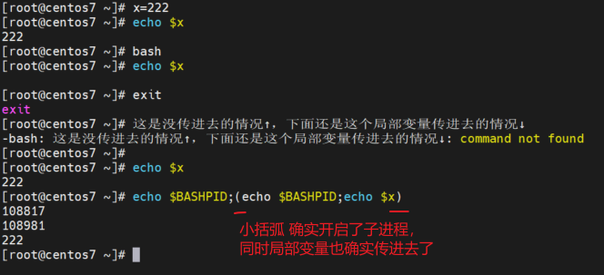


## 环境变量

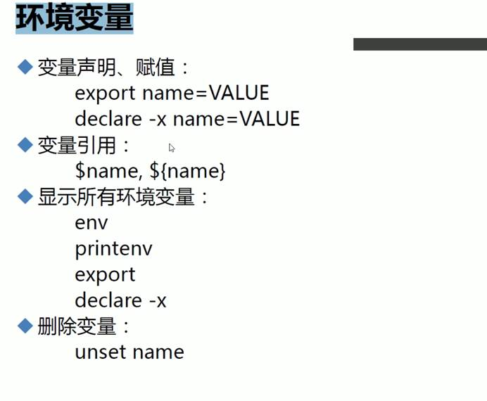

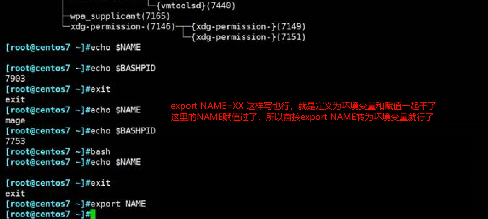

###  

### 查看上级父进程编号

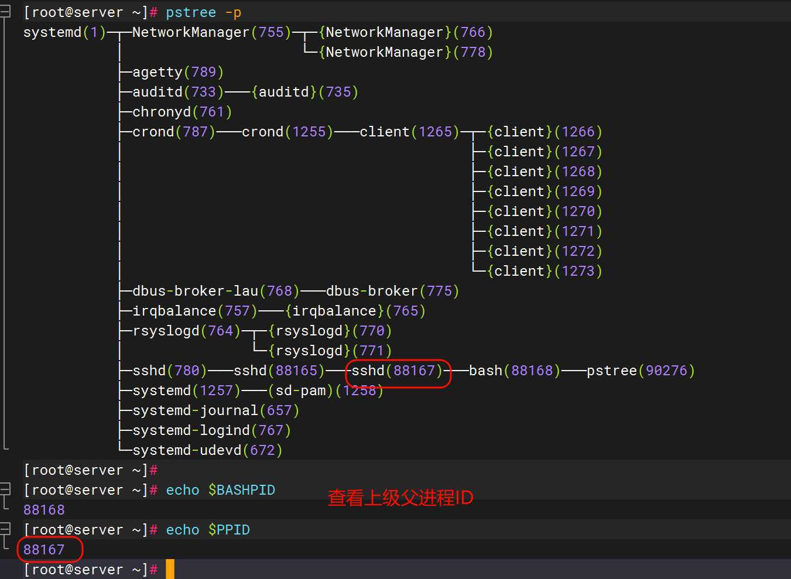


### 

### 查看环境变量

env都是环境变量

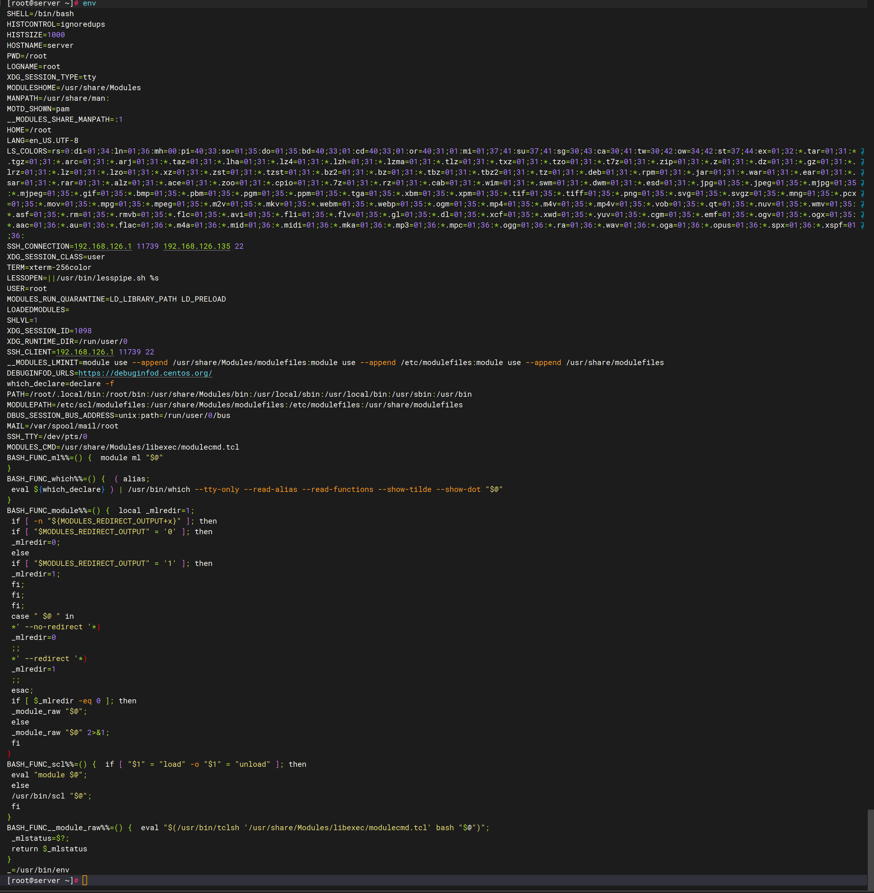

举例EDITOR=vim

默认编辑器是

vipw是调用的EDITOR编辑器这个变量，而EDITOR默认复制应该就是vi，如下：

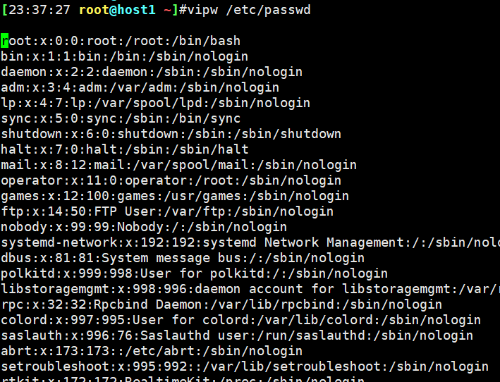 

现在将EDITOR改成vim，再看，发现还是黑底白字，只有将EDITOR提升为环境变量，才会出彩，也就是vipw调用的是环境变量EDITOR里的值，和普通变量没有关系(因为当EDITOR为局部变量的时候，vipw就调不出来它的vim值)。

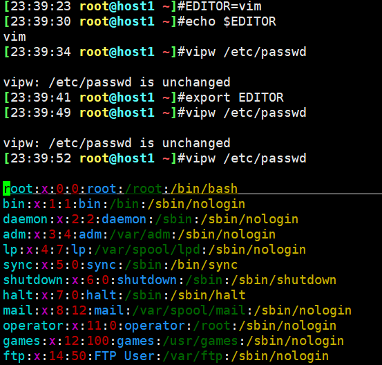 

## unset name普通变量和环境变量都适用

**环境变量可以由父进程传给子进程**，**但是不能从子进程传给父进程**，也就是说子进程里修改的环境变量只在子进程里有效，退出子进程后，在父进程中还是原来的值；**但是子进程再次赋值可以影响身后的子进程**


环境变量--export等命令申明过的才是，就会传递给子进程

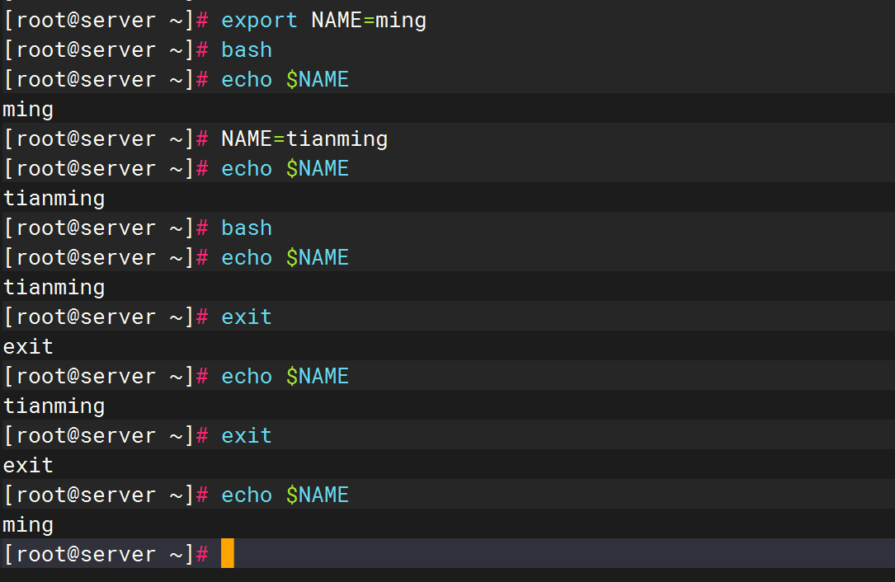


```
[23:49:22 root@host1 ~]#export name=ming
[23:49:42 root@host1 ~]#echo $name
ming
[23:49:46 root@host1 ~]#bash
[23:49:51 root@host1 ~]#echo $name
ming
[23:49:55 root@host1 ~]#name=yi
[23:50:11 root@host1 ~]#echo $name
yi
[23:50:13 root@host1 ~]#export name=yi   👈多余动作，name早就是环境变量了，所以无需再次申明
[23:50:24 root@host1 ~]#echo $name
yi
[23:50:28 root@host1 ~]#exit
exit
[23:50:29 root@host1 ~]#echo $name
ming
[23:50:31 root@host1 ~]#

```

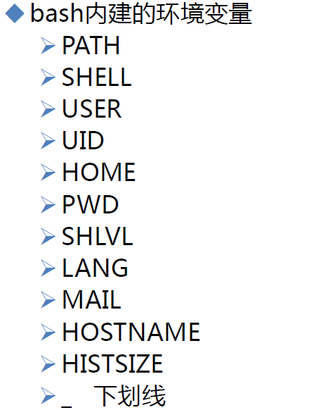 


### **shell的嵌套深度**

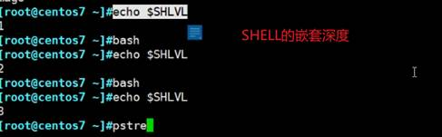 

### 上一次执行的命令

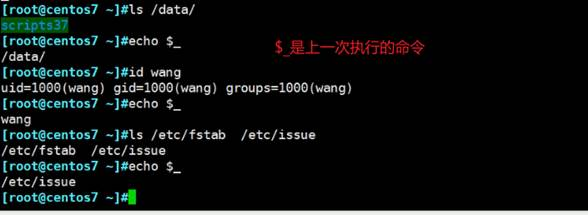 

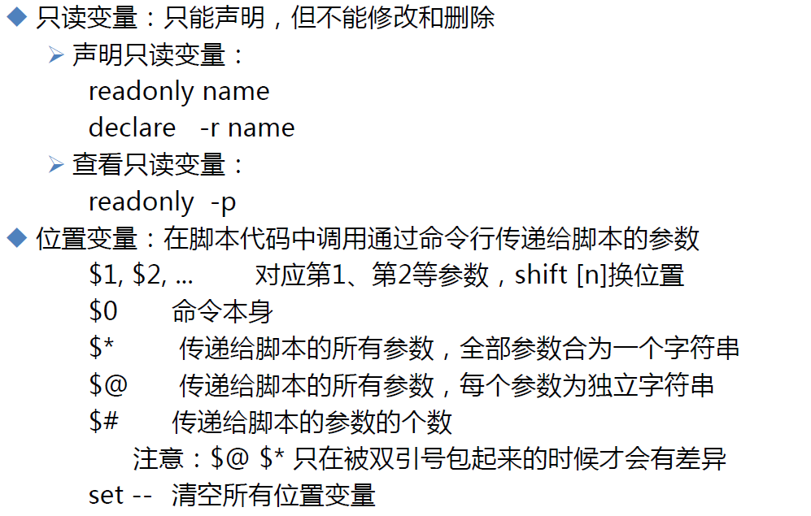 

### 常量就是只读变量

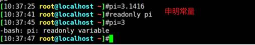

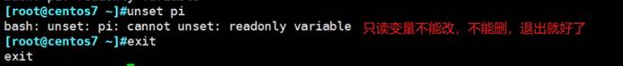

### 可能父进程和子进程配合使用是有用的，

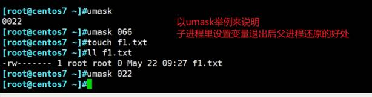


### 小括号就是开启子shell，一运行完，子shell就退出了

注意只针对内部命令和变量赋值

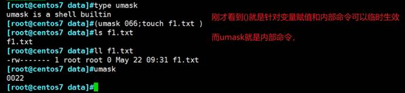 

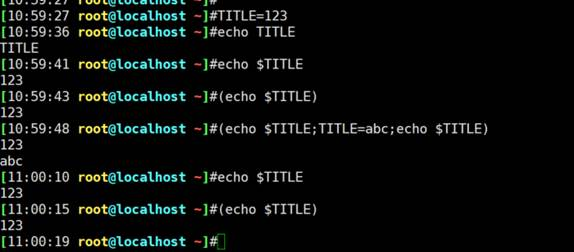 

##  证明小括号就是开启了子shell

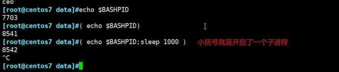 

上图👆此时可以再开一个窗口pstree -p看到确实8542就是7703的子进程

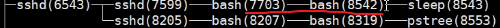 

## 大括号和小括号是不同的

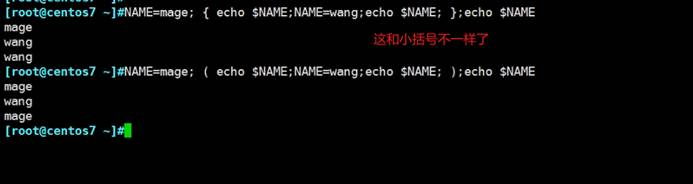 

上图说明，小括号开启子进程，大括号不开启子进程。

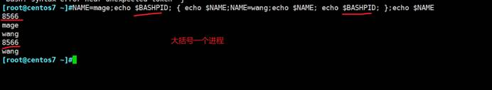

 

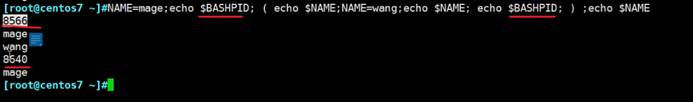

##  位置变量


 

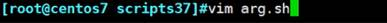

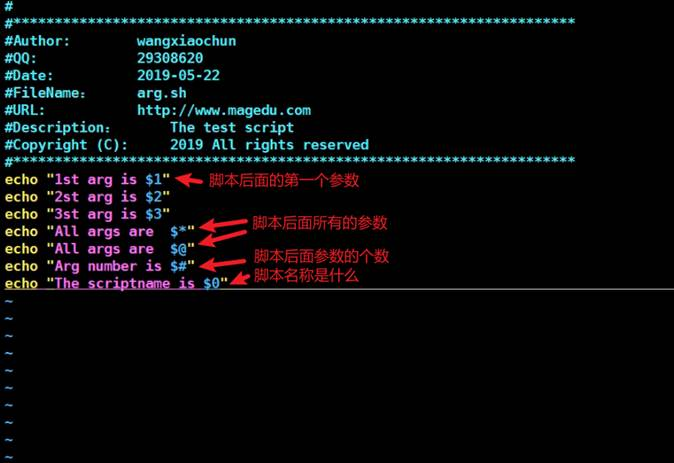

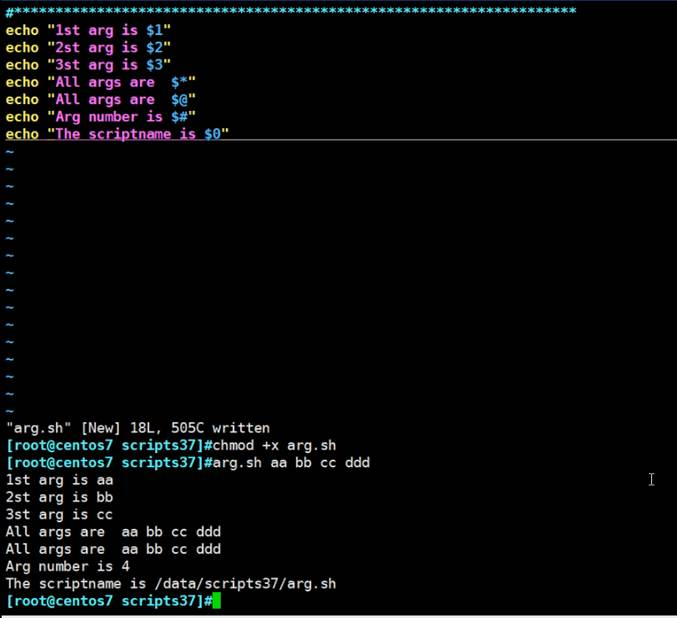

这样的话，就可以将输入的固定位置的参数变量传到脚本里面。

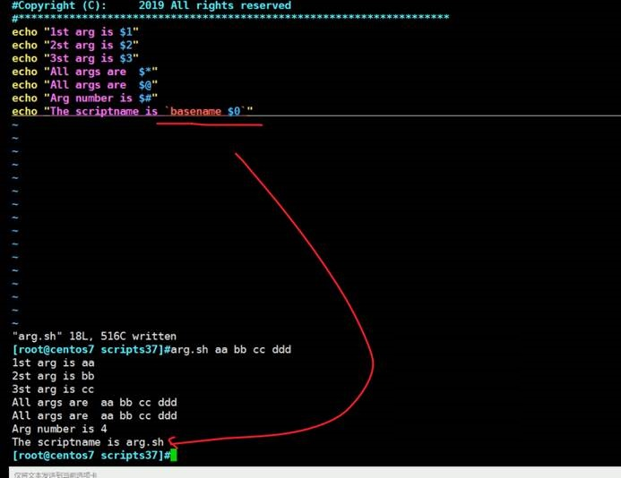

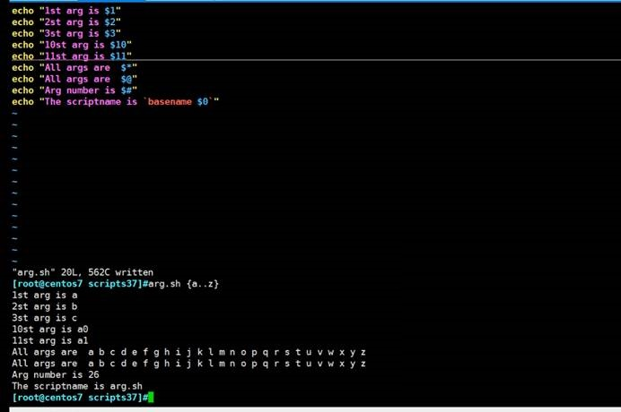

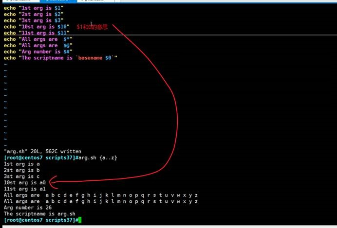

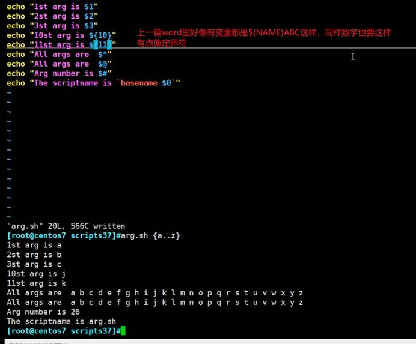

##  对比下$*和$@

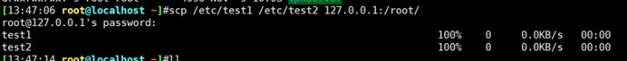


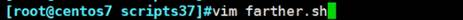

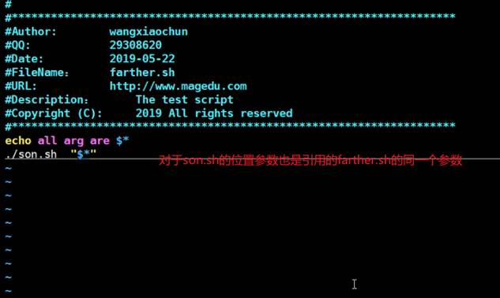

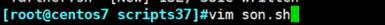

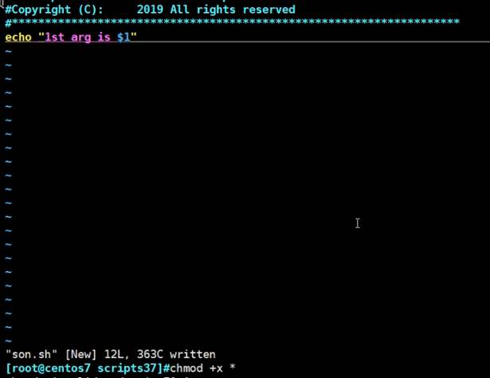

 

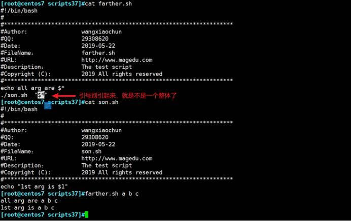

引号引起来才是一个整体，不能去掉。

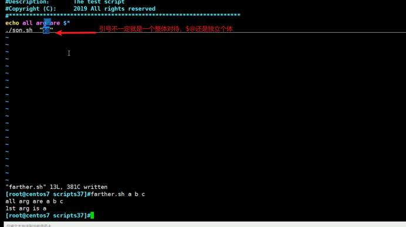

## 练习，rm=rm.sh，rm.sh里写mv f1.txt /tmp/当前日期精确到秒，开局设置里可以用

用mv替代rm

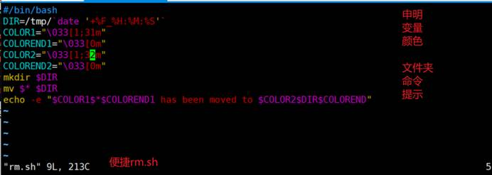

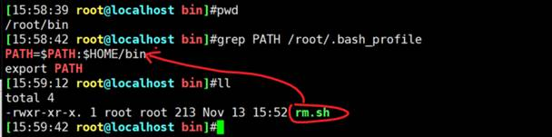

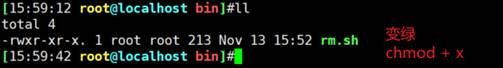

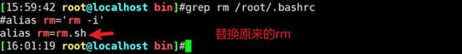

如果要使用原来的rm，则\rm就行了，不过要自带-i了

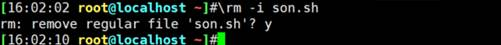

 

其他注意事项

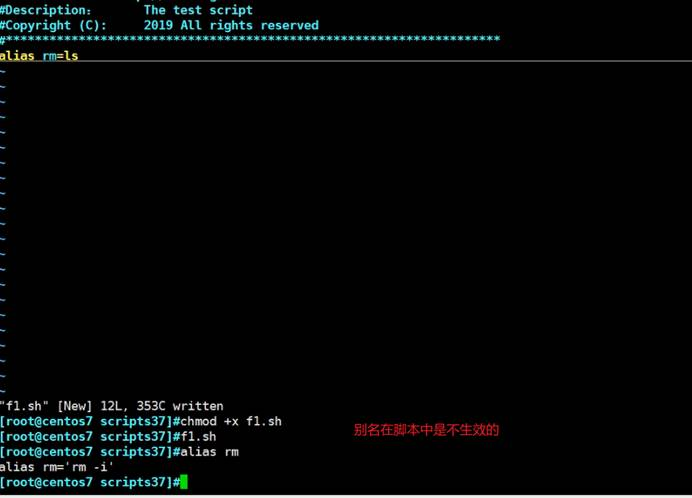

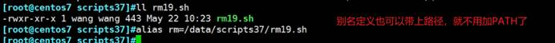

 
